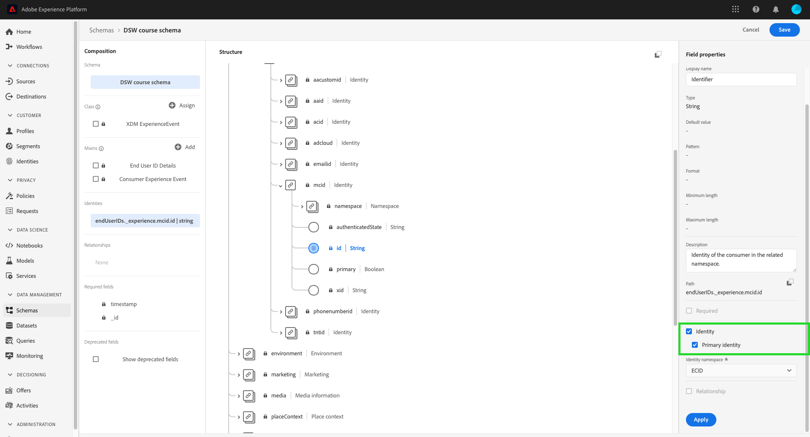

# で使用するデータを準備 [!DNL Intelligent Services]

次のために [!DNL Intelligent Services] マーケティングイベントデータからインサイトを見つけるには、データが意味的にエンリッチメントされ、標準構造で維持されている必要があります。 [!DNL Intelligent Services] 活用する [!DNL Experience Data Model] (XDM) スキーマを使用して、これを実現します。 特に、 [!DNL Intelligent Services] は、Consumer ExperienceEvent(CEE)XDM スキーマに準拠しているか、Adobe Analytics Connector を使用する必要があります。 また、顧客 AI はAdobe Audience Managerコネクタをサポートしています。

このドキュメントでは、マーケティングイベントデータを複数のチャネルから CEE スキーマにマッピングし、スキーマ内の重要なフィールドの情報を概要として、データを構造に効果的にマッピングする方法を決定する際の一般的なガイダンスを提供します。 Adobe Analyticsデータを使用する予定がある場合は、 [Adobe Analyticsデータの準備](#analytics-data). Adobe Audience Managerデータ（顧客 AI のみ）を使用する予定がある場合は、 [AdobeAudience Manager のデータの準備](#AAM-data).

## データ要件

[!DNL Intelligent Services] には、作成する目標に応じて、様々な量の履歴データが必要です。 何にかかわらず、準備するデータ **すべて** [!DNL Intelligent Services] は、正と負の両方のカスタマージャーニー/イベントを含む必要があります。 負のイベントと正のイベントの両方を持つことで、モデルの精度と精度が向上します。

例えば、顧客 AI を使用して製品の購入傾向を予測する場合、顧客 AI のモデルには、成功した購入パスの例と失敗したパスの例の両方が必要です。 これは、モデルトレーニングの間、顧客 AI は、どのイベントやジャーニーが購入につながったかを把握しようとするからです。 これには、買い物かごへの項目の追加でジャーニーを停止した個人など、購入しなかった顧客が実行するアクションも含まれます。 ただし、これらの顧客が同様の行動を示す場合もあります。顧客 AI は、インサイトを提供し、傾向スコアの向上につながる主な違いと要因を掘り下げることができます。 同様に、Attribution AIは、タッチポイントの有効性、上位コンバージョンパス、タッチポイントの位置による分類などの指標を表示するために、両方のタイプのイベントとジャーニーが必要です。

過去のデータ要件のその他の例と情報については、 [顧客 AI](./customer-ai/input-output.md#data-requirements) または [Attribution AI](./attribution-ai/input-output.md#data-requirements) 入力/出力ドキュメントの「履歴データ要件」の節を参照してください。

### データの結合に関するガイドライン

可能な場合は、共通の ID をまたいでユーザーのイベントを結び付けることをお勧めします。 例えば、10 件のイベントにわたる「id1」を持つユーザーデータがあるとします。 その後、同じユーザーが cookie id を削除し、次の 20 件のイベントで「id2」として記録されます。 id1 と id2 が同じユーザーに対応していることがわかっている場合は、30 件のイベントすべてを共通の id でステッチすることをお勧めします。

これが不可能な場合は、モデル入力データを作成する際に、各イベントセットを別のユーザーとして扱う必要があります。 これにより、モデルのトレーニングとスコアリングの際に、最適な結果が得られます。

## ワークフローの概要

準備プロセスは、データがAdobe Experience Platformに格納されているか外部に格納されているかによって異なります。 この節では、いずれかのシナリオで実行する必要がある手順の概要を説明します。

### 外部データの準備

データをExperience Platform外に保存する場合は、データを [消費者の ExperienceEvent スキーマ](#cee-schema). このスキーマをカスタムフィールドグループで拡張して、顧客データをより適切に取り込むことができます。 マッピングが完了すると、Consumer ExperienceEvent スキーマを使用してデータセットを作成し、 [Platform へのデータの取り込み](../ingestion/home.md). その後、CEE データセットを選択して、 [!DNL Intelligent Service].

に応じて [!DNL Intelligent Service] を使用したい場合は、異なるフィールドが必要になる場合があります。 利用可能なデータがある場合は、フィールドにデータを追加することをお勧めします。 必須フィールドの詳細については、 [Attribution AI](./attribution-ai/input-output.md) または [顧客 AI](./customer-ai/input-output.md) 入力/出力ガイド。

### Adobe Analyticsデータの準備 {#analytics-data}

顧客 AI とAttribution AIは、Adobe Analyticsデータをネイティブでサポートします。 Adobe Analyticsデータを使用するには、ドキュメントに記載されている手順に従って、 [Analytics ソースコネクタ](../sources/tutorials/ui/create/adobe-applications/analytics.md).

ソースコネクタがデータをExperience Platformにストリーミングすると、インスタンスの設定時に、データソースとしてAdobe Analyticsを選択し、次にデータセットを選択できます。 すべての必須スキーマフィールドグループと個々のフィールドは、接続設定時に自動的に作成されます。 データセットを CEE 形式に ETL（抽出、変換、読み込み）する必要はありません。

Adobe Analyticsソースコネクタを介してAdobe Experience PlatformにフローされたデータをAdobe Analyticsデータと比較すると、いくつかの相違が生じる場合があります。 Analytics ソースコネクタは、エクスペリエンスデータモデル (XDM) スキーマへの変換中に行を削除する可能性があります。 行全体が変換に適さない理由は、タイムスタンプが見つからない、personID が見つからない、個人 ID が見つからない、個人 ID が無効または大きい、分析値が無効ななど、複数あります。

詳細と例については、 [Adobe AnalyticsとCustomer Journey Analyticsデータの比較](https://www.adobe.com/go/compare-aa-data-to-cja-data). この記事は、データの整合性に関する懸念事項によって妨げられることのない、Adobe Experience Platformのデータを Intelligent Services に対してユーザーとチームが使用できるように、これらの違いを診断および解決するのに役立つように設計されています。

Adobe Experience Platform Query Services で、channel.typeAtSource クエリによる開始と終了のタイムスタンプの間に次の合計レコードを実行し、マーケティングチャネルによるカウントを見つけます。

```SELECT channel.typeAtSource as typeAtSource,
       Count(_id) AS Records 
FROM  df_hotel
WHERE timestamp>=from_utc_timestamp('2021-05-15','UTC')
        AND timestamp<from_utc_timestamp('2022-01-10','UTC')
        AND timestamp IS NOT NULL
        AND enduserids._experience.aaid.id IS NOT NULL
GROUP BY channel.typeAtSource
```

>[!IMPORTANT]
>
>Adobe Analyticsコネクタでデータをバックフィルするのに最大 4 週間かかります。 接続を最近設定した場合は、顧客またはAttribution AIに必要な最小長のデータがデータセットに含まれていることを確認する必要があります。 履歴データの節を確認してください： [顧客 AI](./customer-ai/input-output.md#data-requirements) または [Attribution AI](./attribution-ai/input-output.md#data-requirements)を確認し、予測目標に十分なデータがあることを確認します。

### Adobe Audience Managerデータの準備（顧客 AI のみ） {#AAM-data}

顧客 AI はAdobe Audience Managerデータをネイティブにサポートします。 Audience Managerデータを使用するには、ドキュメントに記載されている手順に従って、 [Audience Managerソースコネクタ](../sources/tutorials/ui/create/adobe-applications/audience-manager.md).

ソースコネクタがデータをExperience Platformにストリーミングすると、Adobe Audience Managerをデータソースとして選択し、顧客 AI 設定時にデータセットを選択できます。 接続設定時に、すべてのスキーマフィールドグループと個々のフィールドが自動的に作成されます。 データセットを CEE 形式に ETL（抽出、変換、読み込み）する必要はありません。

>[!IMPORTANT]
>
>最近コネクタを設定した場合は、データセットに必要最小限の長さのデータが含まれていることを確認する必要があります。 履歴データの節を確認してください ( [input/output ドキュメント](./customer-ai/input-output.md) 顧客 AI の場合はと入力し、予測目標に十分なデータがあることを確認します。

### [!DNL Experience Platform] データの準備

データが既にに格納されている場合は、 [!DNL Platform] Adobe AnalyticsまたはAdobe Audience Manager（Customer AI のみ）ソースコネクタを介したストリーミングではなく、次の手順に従います。 CEE スキーマを理解することをお勧めします。

1. の構造を確認する [消費者の ExperienceEvent スキーマ](#cee-schema) およびは、データをそのフィールドにマッピングできるかどうかを決定します。
2. Adobeコンサルティングサービスに連絡して、データをスキーマにマッピングし、次に取り込むのに役立ちます。 [!DNL Intelligent Services]または [このガイドの手順に従います。](#mapping) データを自分でマッピングする場合。

## CEE スキーマについて {#cee-schema}

「消費者エクスペリエンスイベント」スキーマは、デジタルマーケティングイベント（Web またはモバイル）、オンラインまたはオフラインのコマースアクティビティに関連する個人の行動を記述します。 このスキーマの使用は、 [!DNL Intelligent Services] なぜなら、意味的に適切に定義されたフィールド（列）があるので、そうしないとデータをより明確にしないようにする不明な名前を避ける必要があるからです。

CEE スキーマは、すべての XDM ExperienceEvent スキーマと同様、イベント（または一連のイベント）が発生した際の時系列ベースのシステム状態（ポイントインタイムや関係する主体の ID など）を取り込みます。 エクスペリエンスイベントは、何が発生したかの事実の記録なので、不変で、何が発生したかを集計や解釈なしで表します。

[!DNL Intelligent Services] このスキーマ内の複数のキーフィールドを利用して、マーケティングイベントデータからインサイトを生成します。すべてのデータはルートレベルで見つかり、展開して必要なサブフィールドを表示できます。


すべての XDM スキーマと同様に、CEE スキーマフィールドグループは拡張可能です。 つまり、CEE フィールドグループにフィールドを追加し、必要に応じて複数のスキーマに異なるバリエーションを含めることができます。

フィールドグループの完全な例は、 [パブリック XDM リポジトリ](https://github.com/adobe/xdm/blob/797cf4930d5a80799a095256302675b1362c9a15/docs/reference/context/experienceevent-consumer.schema.md). さらに、次の項目を表示およびコピーできます [JSON ファイル](https://github.com/AdobeDocs/experience-platform.en/blob/master/help/intelligent-services/assets/CEE_XDM_sample_rows.json) CEE スキーマに準拠するためのデータ構造化の例を参照してください。 独自のデータをスキーマにマッピングする方法を決定するには、次の節で説明する主要フィールドについて学習する際に、これらの両方の例を参照してください。

## キーフィールド

CEE フィールドグループ内には、次の目的で使用する必要のあるキーフィールドが複数あります [!DNL Intelligent Services] 有益なインサイトを生成する この節では、これらのフィールドの使用例と期待されるデータについて説明し、その他の例に関する参照ドキュメントへのリンクを提供します。

### 必須フィールド

すべてのキーフィールドを使用することを強くお勧めしますが、次の 2 つのフィールドがあります **必須** ～のために [!DNL Intelligent Services] 動作する

* [プライマリ ID フィールド](#identity)
* [xdm:timestamp](#timestamp)
* [xdm:channel](#channel) (Attribution AIのみ必須 )

#### プライマリID {#identity}

スキーマ内のフィールドの 1 つをプライマリ ID フィールドとして設定する必要があります。これにより、 [!DNL Intelligent Services] 時系列データの各インスタンスを個人にリンクする

データのソースと特性に基づいて、プライマリ ID として使用する最適なフィールドを決定する必要があります。 ID フィールドには、 **id 名前空間** これは、フィールドが値として想定する id データのタイプを示します。 有効な名前空間の値には次のものが含まれます。

* &quot;電子メール&quot;
* &quot;phone&quot;
* 「mcid」(Adobe Audience Manager ID の場合 )
* 「aaid」(Adobe Analytics ID の場合 )

プライマリ ID として使用する必要があるフィールドが不明な場合は、Adobeコンサルティングサービスに問い合わせて、最適なソリューションを決定してください。 プライマリ ID が設定されていない場合、インテリジェントサービスアプリケーションは次のデフォルトの動作を使用します。

| デフォルト | アトリビューション AI | 顧客 AI |
| --- | --- | --- |
| ID 列 | `endUserIDs._experience.aaid.id` | `endUserIDs._experience.mcid.id` |
| 名前空間 | AAID | ECID |

プライマリ ID を設定するには、 **[!UICONTROL スキーマ]** タブに移動し、スキーマ名のハイパーリンクを選択して、 **[!DNL Schema Editor]**.


次に、プライマリ ID として設定するフィールドに移動し、それを選択します。 この **[!UICONTROL フィールドプロパティ]** そのフィールドのメニューが開きます。


内 **[!UICONTROL フィールドプロパティ]** メニューが表示されるまで下にスクロールします。 **[!UICONTROL ID]** チェックボックス。 チェックボックスをオンにした後、選択した ID を **[!UICONTROL プライマリID]** が表示されます。 このボックスも選択します。



次に、 **[!UICONTROL ID 名前空間]** 」をドロップダウンの定義済み名前空間のリストから選択します。 この例では、ECID 名前空間がAdobe Audience Manager ID 以降に選択されています `mcid.id` が使用されている。 選択 **[!UICONTROL 適用]** 更新を確定するには、「 」を選択します。 **[!UICONTROL 保存]** をクリックして、スキーマに対する変更を保存します。


#### xdm:timestamp {#timestamp}

このフィールドは、イベントが発生した日時を表します。 この値は、ISO 8601 標準に従って、文字列として指定する必要があります。

#### xdm:channel {#channel}

>[!NOTE]
>
>このフィールドは、Attribution AIを使用する場合にのみ必須です。

このフィールドは、ExperienceEvent に関連するマーケティングチャネルを表します。 「 」フィールドには、チャネルタイプ、メディアタイプおよび場所タイプに関する情報が含まれます。


**スキーマの例**

```json
{
  "@id": "https://ns.adobe.com/xdm/channels/facebook-feed",
  "@type": "https://ns.adobe.com/xdm/channel-types/social",
  "xdm:mediaType": "earned",
  "xdm:mediaAction": "clicks"
}
```

各必須サブフィールドの詳細 `xdm:channel`を参照してください。 [エクスペリエンスチャネルスキーマ](https://github.com/adobe/xdm/blob/797cf4930d5a80799a095256302675b1362c9a15/docs/reference/channels/channel.schema.md) 仕様 マッピングの例については、 [下の表](#example-channels).

#### チャネルマッピングの例 {#example-channels}

次の表に、 `xdm:channel` schema:

| チャネル | `@type` | `mediaType` | `mediaAction` |
| --- | --- | --- | --- |
| 有料検索 | https:/<span>/ns.adobe.com/xdm/channel-types/search | 有料 | clicks |
| ソーシャル — マーケティング | https:/<span>/ns.adobe.com/xdm/channel-types/social | 獲得 | クリック数 |
| 表示 | https:/<span>/ns.adobe.com/xdm/channel-types/display | 有料 | クリック数 |
| メール | https:/<span>/ns.adobe.com/xdm/channel-types/email | 有料 | クリック数 |
| 内部リファラー | https:/<span>/ns.adobe.com/xdm/channel-types/direct | 所有 | クリック数 |
| ViewThrough を表示 | https:/<span>/ns.adobe.com/xdm/channel-types/display | 有料 | impressions |
| QR コードのリダイレクト | https:/<span>/ns.adobe.com/xdm/channel-types/direct | 所有 | クリック数 |
| Mobile | https:/<span>/ns.adobe.com/xdm/channel-types/mobile | 所有 | クリック数 |

### 推奨フィールド

残りの主要フィールドについては、この節で概要を説明します。 これらのフィールドは必ずしも [!DNL Intelligent Services] より豊富なインサイトを得るには、できるだけ多くの特性を使用することを強くお勧めします。

#### xdm:productListItems

このフィールドは、製品の SKU、名前、価格、数量など、顧客が選択した製品を表す品目の配列です。


**スキーマの例**

```json
[
  {
    "xdm:SKU": "1002352692",
    "xdm:name": "24-Watt 8-Light Chrome Integrated LED Bath Light",
    "xdm:currencyCode": "USD",
    "xdm:quantity": 1,
    "xdm:priceTotal": 159.45
  },
  {
    "xdm:SKU": "3398033623",
    "xdm:name": "16ft RGB LED Strips",
    "xdm:currencyCode": "USD",
    "xdm:quantity": 1,
    "xdm:priceTotal": 79.99
  }
]
```

各必須サブフィールドの詳細 `xdm:productListItems`を参照してください。 [コマース詳細スキーマ](https://github.com/adobe/xdm/blob/797cf4930d5a80799a095256302675b1362c9a15/docs/reference/context/experienceevent-commerce.schema.md) 仕様

#### xdm:commerce

このフィールドには、発注書番号や支払い情報など、ExperienceEvent に関するコマース固有の情報が含まれます。


**スキーマの例**

```json
{
    "xdm:order": {
      "xdm:purchaseID": "a8g784hjq1mnp3",
      "xdm:purchaseOrderNumber": "123456",
      "xdm:payments": [
        {
          "xdm:transactionID": "transactid-a111",
          "xdm:paymentAmount": 59,
          "xdm:paymentType": "credit_card",
          "xdm:currencyCode": "USD"
        },
        {
          "xdm:transactionId": "transactid-a222",
          "xdm:paymentAmount": 100,
          "xdm:paymentType": "gift_card",
          "xdm:currencyCode": "USD"
        }
      ],
      "xdm:currencyCode": "USD",
      "xdm:priceTotal": 159
    },
    "xdm:purchases": {
      "xdm:value": 1
    }
  }
```

各必須サブフィールドの詳細 `xdm:commerce`を参照してください。 [コマース詳細スキーマ](https://github.com/adobe/xdm/blob/797cf4930d5a80799a095256302675b1362c9a15/docs/reference/context/experienceevent-commerce.schema.md) 仕様

#### xdm:web

このフィールドは、インタラクション、ページの詳細、リファラーなど、ExperienceEvent に関する Web の詳細を表します。


**スキーマの例**

```json
{
  "xdm:webPageDetails": {
    "xdm:siteSection": "Shopping Cart",
    "xdm:server": "example.com",
    "xdm:name": "Purchase Confirmation",
    "xdm:URL": "https://www.example.com/orderConf",
    "xdm:errorPage": false,
    "xdm:homePage": false,
    "xdm:pageViews": {
      "xdm:value": 1
    }
  },
  "xdm:webReferrer": {
    "xdm:URL": "https://www.example.com/checkout",
    "xdm:referrerType": "internal"
  }
}
```

各必須サブフィールドの詳細 `xdm:productListItems`を参照してください。 [ExperienceEvent Web 詳細スキーマ](https://github.com/adobe/xdm/blob/797cf4930d5a80799a095256302675b1362c9a15/docs/reference/context/experienceevent-web.schema.md) 仕様

#### xdm:marketing

このフィールドには、タッチポイントでアクティブなマーケティングアクティビティに関する情報が含まれています。


**スキーマの例**

```json
{
  "xdm:trackingCode": "marketingcampaign111",
  "xdm:campaignGroup": "50%_DISCOUNT",
  "xdm:campaignName": "50%_DISCOUNT_USA"
}
```

各必須サブフィールドの詳細 `xdm:productListItems`を参照してください。 [マーケティング部門](https://github.com/adobe/xdm/blob/797cf4930d5a80799a095256302675b1362c9a15/docs/reference/context/marketing.schema.md) 仕様

## データのマッピングと取り込み {#mapping}

マーケティングイベントデータを CEE スキーマにマッピングできるかどうかを判断したら、次の手順で、に取り込むデータを決定します [!DNL Intelligent Services]. で使用されるすべての履歴データ [!DNL Intelligent Services] は、4 ヶ月分のデータの最小期間に加えて、ルックバック期間として意図された日数に該当する必要があります。

送信するデータの範囲を決定したら、Adobeコンサルティングサービスに連絡して、データをスキーマにマッピングし、サービスに取り込むのに役立ちます。

次の場合、 [!DNL Adobe Experience Platform] 購読を作成し、データを自分でマッピングおよび取り込む場合は、次の節で説明されている手順に従います。

### Adobe Experience Platformの使用

>[!NOTE]
>
>以下の手順では、Experience Platformの購読が必要です。 Platform へのアクセス権がない場合は、「 [次の手順](#next-steps) 」セクションに入力します。

この節では、で使用するデータをマッピングし、Experience Platformに取り込むワークフローについて説明します。 [!DNL Intelligent Services]（詳細な手順に関するチュートリアルへのリンクを含む）

#### CEE スキーマとデータセットの作成

取り込むデータの準備を開始する準備が整ったら、最初の手順は CEE フィールドグループを使用する新しい XDM スキーマを作成することです。 以下のチュートリアルでは、UI または API で新しいスキーマを作成するプロセスを順を追って説明します。

* [UI でのスキーマの作成](../xdm/tutorials/create-schema-ui.md)
* [API でのスキーマの作成](../xdm/tutorials/create-schema-api.md)

>[!IMPORTANT]
>
>上記のチュートリアルは、スキーマを作成するための一般的なワークフローに従っています。 スキーマのクラスを選択する場合、 **XDM ExperienceEvent クラス**. このクラスを選択したら、CEE フィールドグループをスキーマに追加できます。

CEE フィールドグループをスキーマに追加した後、必要に応じて、データ内の追加フィールドに他のフィールドグループを追加できます。

スキーマを作成して保存したら、そのスキーマに基づいて新しいデータセットを作成できます。 以下のチュートリアルでは、UI または API で新しいデータセットを作成するプロセスを順を追って説明します。

* [UI でのデータセットの作成](../catalog/datasets/user-guide.md#create) （既存のスキーマを使用する際のワークフローに従います）
* [API でのデータセットの作成](../catalog/datasets/create.md)

データセットが作成されると、Platform UI の **[!UICONTROL データセット]** ワークスペース。


#### データセットへの ID フィールドの追加

データを [!DNL Adobe Audience Manager], [!DNL Adobe Analytics]または別の外部ソースの場合は、スキーマフィールドを ID フィールドとして設定するオプションがあります。 スキーマフィールドを ID フィールドとして設定するには、 [UI チュートリアル](../xdm/tutorials/create-schema-ui.md#identity-field) または [API チュートリアル](../xdm/tutorials/create-schema-api.md#define-an-identity-descriptor) スキーマを作成するために使用します。

ローカルの CSV ファイルからデータを取り込む場合は、次の [データのマッピングと取得](#ingest).

#### データのマッピングと取り込み {#ingest}

CEE スキーマとデータセットを作成したら、データテーブルのスキーマへのマッピングを開始し、そのデータを Platform に取り込むことができます。 に関するチュートリアルを参照してください。 [CSV ファイルの XDM スキーマへのマッピング](../ingestion/tutorials/map-a-csv-file.md) を参照してください。 以下を使用できます [サンプル JSON ファイル](https://github.com/AdobeDocs/experience-platform.en/blob/master/help/intelligent-services/assets/CEE_XDM_sample_rows.json) を使用して、独自のデータを使用する前に取り込みプロセスをテストします。

データセットを入力した後は、同じデータセットを使用して追加のデータファイルを取り込むことができます。

サポートされるサードパーティアプリケーションにデータが格納されている場合は、 [ソースコネクタ](../sources/home.md) マーケティングイベントデータを [!DNL Platform] リアルタイムで。

## 次の手順 {#next-steps}

このドキュメントでは、で使用するデータの準備に関する一般的なガイダンスを提供しました。 [!DNL Intelligent Services]. ユースケースに基づく追加のコンサルティングが必要な場合は、Adobeコンサルティングサポートにお問い合わせください。

データセットに顧客体験データを正常に入力したら、 [!DNL Intelligent Services] インサイトを生成するには 使用を開始するには、次のドキュメントを参照してください。

* [Attribution AI の概要](./attribution-ai/overview.md)
* [顧客 AI の概要](./customer-ai/overview.md)
