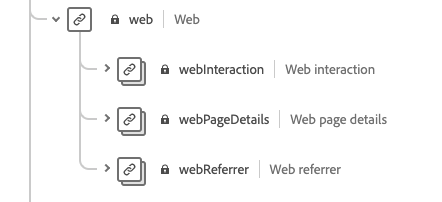

# [!DNL Intelligent Services]

[!DNL Intelligent Services][!DNL Intelligent Services][!DNL Experience Data Model][!DNL Intelligent Services]Additionally, Customer AI supports the Adobe Audience Manager connector.

This document provides general guidance on mapping your marketing events data from multiple channels to the CEE schema, outlining information on important fields within the schema to help you determine how to effectively map your data to its structure. [](#analytics-data)[](#AAM-data)

## Data Requirements

[!DNL Intelligent Services]****[!DNL Intelligent Services]Having both negative and positive events improves model precision and accuracy.

For example, if you are using Customer AI to predict the propensity to buy a product, the model for Customer AI needs both examples of successful purchase paths and examples of unsuccessful paths. This is because during model training, Customer AI looks to understand what events and journeys lead to a purchase. This also includes the actions taken by customers who did not purchase, such as an individual who stopped their journey at adding an item to the cart. These customers may exhibit similar behaviors however, Customer AI can provide insights and drilldown the major differences and factors that lead to a higher propensity score. Similarly, Attribution AI requires both types of events and journeys in order to display metrics such as touchpoint effectiveness, top conversion paths, and breakdowns by touchpoint position.

[](./customer-ai/input-output.md#data-requirements)[](./attribution-ai/input-output.md#data-requirements)

### Guidelines for stitching data

It is recommend that you stitch the events of a user across a common id when possible. For example, you may have user data with &quot;id1&quot; across 10 events. Later, the same user deleted the cookie id and is recorded as &quot;id2&quot; across next 20 events. If you know that id1 and id2 correspond to same user, the best practice is to stitch all 30 events with a common id.

If this is not possible, you should treat each set of events as a different user when creating your model input data. This ensures the best results during model training and scoring.

## Workflow summary

The preparation process varies depending on whether your data is stored in Adobe Experience Platform or externally. This section summarizes the necessary steps you need to take, given either scenario.

### External data preparation

[](#cee-schema)This schema can be augmented with custom field groups to better capture your customer data. [](../ingestion/home.md)[!DNL Intelligent Service]

[!DNL Intelligent Service]Note that it is a best practice to add data to a field if you have the data available. [](./attribution-ai/input-output.md)[](./customer-ai/input-output.md)

### Adobe Analytics data preparation {#analytics-data}

Customer AI and Attribution AI natively support Adobe Analytics data. [](../sources/tutorials/ui/create/adobe-applications/analytics.md)

Once the source connector is streaming your data into Experience Platform, you are able to select Adobe Analytics as a data source followed by a dataset during your instance configuration. All of the required schema field groups and individual fields are automatically created during the connection set up. You do not need to ETL (Extract, Transform, Load) the datasets into the CEE format.

If you compare the data flown through the Adobe Analytics source connector onto Adobe Experience Platform with Adobe Analytics data, you may notice some discrepancies. The Analytics Source connector might drop rows during the transformation to an Experience Data Model (XDM) schema. There can be multiple reasons for the whole row to be unfit for transformation which include missing timestamps, missing personIDs, invalid or large person IDs, invalid analytic values, and more.

[](https://www.adobe.com/go/compare-aa-data-to-cja-data)This article is designed to help you diagnose and solve for those differences so that you and your team can use Adobe Experience Platform data for Intelligent Services unimpeded by concerns about data integrity.

In Adobe Experience Platform Query Services, run the following Total Records between start and end timestamp by channel.typeAtSource query to find the count by marketing channels.

```SELECT channel.typeAtSource as typeAtSource,
       Count(_id) AS Records 
FROM  df_hotel
WHERE timestamp>=from_utc_timestamp('2021-05-15','UTC')
        AND timestamp<from_utc_timestamp('2022-01-10','UTC')
        AND timestamp IS NOT NULL
        AND enduserids._experience.aaid.id IS NOT NULL
GROUP BY channel.typeAtSource
```

>[!IMPORTANT]
>
>The Adobe Analytics connector takes up to four weeks to backfill data. If you recently set up a connection you should verify that the dataset has the minimum length of data required for Customer or Attribution AI. [](./customer-ai/input-output.md#data-requirements)[](./attribution-ai/input-output.md#data-requirements)

### Adobe Audience Manager data preparation (Customer AI only) {#AAM-data}

Customer AI natively supports Adobe Audience Manager data. [](../sources/tutorials/ui/create/adobe-applications/audience-manager.md)

Once the source connector is streaming your data into Experience Platform, you are able to select Adobe Audience Manager as a data source followed by a dataset during your Customer AI configuration. All of the schema field groups and individual fields are automatically created during the connection set up. You do not need to ETL (Extract, Transform, Load) the datasets into the CEE format.

>[!IMPORTANT]
>
>If you recently set up a connector you should verify that the dataset has the minimum length of data required. [](./customer-ai/input-output.md)

### [!DNL Experience Platform]

[!DNL Platform]It is still recommended you understand the CEE schema.

1. [](#cee-schema)
2. [!DNL Intelligent Services][](#mapping)

## Understanding the CEE schema {#cee-schema}

The Consumer ExperienceEvent schema describes the behavior of an individual as it relates to digital marketing events (web or mobile) as well as online or offline commerce activity. [!DNL Intelligent Services]

The CEE schema, like all XDM ExperienceEvent schemas, captures the time-series-based state of the system when an event (or set of events) occurred, including the point in time and the identity of the subject involved. Experience Events are fact records of what occurred, and thus they are immutable and represent what happened without aggregation or interpretation.

[!DNL Intelligent Services]


Like all XDM schemas, the CEE schema field group is extensible. In other words, additional fields can be added to the CEE field group, and different variations can be included in multiple schemas if necessary.

[](https://github.com/adobe/xdm/blob/797cf4930d5a80799a095256302675b1362c9a15/docs/reference/context/experienceevent-consumer.schema.md)[](https://github.com/AdobeDocs/experience-platform.en/blob/master/help/intelligent-services/assets/CEE_XDM_sample_rows.json)Refer to both of these examples as you learn about the key fields outlined in the section below, in order to determine how you can map your own data to the schema.

## Key fields

[!DNL Intelligent Services]This section describes the use case and expected data for these fields, and provides links to reference documentation for further examples.

### Mandatory fields

****[!DNL Intelligent Services]

* [A primary identity field](#identity)
* [xdm:timestamp](#timestamp)
* [](#channel)

#### Primary identity {#identity}

[!DNL Intelligent Services]

You must determine the best field to use as a primary identity based on the source and nature of your data. **** Some valid namespace values include:

* &quot;電子メール&quot;
* &quot;phone&quot;
* &quot;mcid&quot; (for Adobe Audience Manager IDs)
* &quot;aaid&quot; (for Adobe Analytics IDs)

If you are unsure which field you should use as a primary identity, contact Adobe Consulting Services to determine the best solution. If a primary identity is not set, the Intelligent Service application uses the following default behavior:

| デフォルト | アトリビューション AI | 顧客 AI |
| --- | --- | --- |
| Identity column | `endUserIDs._experience.aaid.id` | `endUserIDs._experience.mcid.id` |
| 名前空間 | AAID | ECID |

******[!DNL Schema Editor]**


Next, navigate to the field you wish to as a primary identity and select it. ****


************ Select this box as well.


****`mcid.id`********


#### xdm:timestamp {#timestamp}

This field represents the datetime at which the event occurred. This value must be provided as a string, as per the ISO 8601 standard.

#### xdm:channel {#channel}

>[!NOTE]
>
>This field is only mandatory when using Attribution AI.

This field represents the marketing channel related to the ExperienceEvent. The field includes information about the channel type, media type, and location type.


****

```json
{
  "@id": "https://ns.adobe.com/xdm/channels/facebook-feed",
  "@type": "https://ns.adobe.com/xdm/channel-types/social",
  "xdm:mediaType": "earned",
  "xdm:mediaAction": "clicks"
}
```

`xdm:channel`[](https://github.com/adobe/xdm/blob/797cf4930d5a80799a095256302675b1362c9a15/docs/reference/channels/channel.schema.md)[](#example-channels)

#### Example channel mappings {#example-channels}

`xdm:channel`

| チャネル | `@type` | `mediaType` | `mediaAction` |
| --- | --- | --- | --- |
| 有料検索 | <span> | paid | clicks |
| Social - Marketing | <span> | earned | clicks |
| 表示 | <span> | paid | clicks |
| メール | <span> | paid | clicks |
| Internal Referrer | <span> | owned | clicks |
| Display ViewThrough | <span> | paid | impressions |
| QR Code Redirect | <span> | owned | clicks |
| Mobile | <span> | owned | clicks |

### Recommended fields

The remainder of the key fields are outlined in this section. [!DNL Intelligent Services]

#### xdm:productListItems

This field is an array of items which represent products selected by a customer, including the product SKU, name, price, and quantity.


****

```json
[
  {
    "xdm:SKU": "1002352692",
    "xdm:name": "24-Watt 8-Light Chrome Integrated LED Bath Light",
    "xdm:currencyCode": "USD",
    "xdm:quantity": 1,
    "xdm:priceTotal": 159.45
  },
  {
    "xdm:SKU": "3398033623",
    "xdm:name": "16ft RGB LED Strips",
    "xdm:currencyCode": "USD",
    "xdm:quantity": 1,
    "xdm:priceTotal": 79.99
  }
]
```

`xdm:productListItems`[](https://github.com/adobe/xdm/blob/797cf4930d5a80799a095256302675b1362c9a15/docs/reference/context/experienceevent-commerce.schema.md)

#### xdm:commerce

This field contains commerce-specific information about the ExperienceEvent, including the purchase order number and payment information.


****

```json
{
    "xdm:order": {
      "xdm:purchaseID": "a8g784hjq1mnp3",
      "xdm:purchaseOrderNumber": "123456",
      "xdm:payments": [
        {
          "xdm:transactionID": "transactid-a111",
          "xdm:paymentAmount": 59,
          "xdm:paymentType": "credit_card",
          "xdm:currencyCode": "USD"
        },
        {
          "xdm:transactionId": "transactid-a222",
          "xdm:paymentAmount": 100,
          "xdm:paymentType": "gift_card",
          "xdm:currencyCode": "USD"
        }
      ],
      "xdm:currencyCode": "USD",
      "xdm:priceTotal": 159
    },
    "xdm:purchases": {
      "xdm:value": 1
    }
  }
```

`xdm:commerce`[](https://github.com/adobe/xdm/blob/797cf4930d5a80799a095256302675b1362c9a15/docs/reference/context/experienceevent-commerce.schema.md)

#### xdm:web

This field represents web details relating to the ExperienceEvent, such as the interaction, page details, and referrer.



****

```json
{
  "xdm:webPageDetails": {
    "xdm:siteSection": "Shopping Cart",
    "xdm:server": "example.com",
    "xdm:name": "Purchase Confirmation",
    "xdm:URL": "https://www.example.com/orderConf",
    "xdm:errorPage": false,
    "xdm:homePage": false,
    "xdm:pageViews": {
      "xdm:value": 1
    }
  },
  "xdm:webReferrer": {
    "xdm:URL": "https://www.example.com/checkout",
    "xdm:referrerType": "internal"
  }
}
```

`xdm:productListItems`[](https://github.com/adobe/xdm/blob/797cf4930d5a80799a095256302675b1362c9a15/docs/reference/context/experienceevent-web.schema.md)

#### xdm:marketing

This field contains information related to marketing activities that are active with the touchpoint.


****

```json
{
  "xdm:trackingCode": "marketingcampaign111",
  "xdm:campaignGroup": "50%_DISCOUNT",
  "xdm:campaignName": "50%_DISCOUNT_USA"
}
```

`xdm:productListItems`[](https://github.com/adobe/xdm/blob/797cf4930d5a80799a095256302675b1362c9a15/docs/reference/context/marketing.schema.md)

## Mapping and ingesting data {#mapping}

[!DNL Intelligent Services][!DNL Intelligent Services]

After deciding the range of data you want to send, contact Adobe Consulting Services to help map your data to the schema and ingest it into the service.

[!DNL Adobe Experience Platform]

### Using Adobe Experience Platform

>[!NOTE]
>
>The steps below require a subscription to Experience Platform. [](#next-steps)

[!DNL Intelligent Services]

#### Create a CEE schema and dataset

When you are ready to start preparing your data for ingestion, the first step is to create a new XDM schema that employs the CEE field group. The following tutorials walk through the process of creating a new schema in the UI or API:

* [Create a schema in the UI](../xdm/tutorials/create-schema-ui.md)
* [Create a schema in the API](../xdm/tutorials/create-schema-api.md)

>[!IMPORTANT]
>
>The tutorials above follow a generic workflow for creating a schema. **** Once this class has been chosen, you can then add the CEE field group to the schema.

After adding the CEE field group to the schema, you can add other field groups as required for additional fields within your data.

Once you have created and saved the schema, you can create a new dataset based on that schema. The following tutorials walk through the process of creating a new dataset in the UI or API:

* [](../catalog/datasets/user-guide.md#create)
* [Create a dataset in the API](../catalog/datasets/create.md)

****


#### Add identity fields to the dataset

[!DNL Adobe Audience Manager][!DNL Adobe Analytics][](../xdm/tutorials/create-schema-ui.md#identity-field)[](../xdm/tutorials/create-schema-api.md#define-an-identity-descriptor)

[](#ingest)

#### Map and ingest data {#ingest}

After creating a CEE schema and dataset, you can start mapping your data tables to the schema and ingest that data into Platform. [](../ingestion/tutorials/map-a-csv-file.md)[](https://github.com/AdobeDocs/experience-platform.en/blob/master/help/intelligent-services/assets/CEE_XDM_sample_rows.json)

Once a dataset has been populated, the same dataset can be used to ingest additional data files.

[](../sources/home.md)[!DNL Platform]

## 次の手順 {#next-steps}

[!DNL Intelligent Services]If you require additional consulting based on your use case, please contact Adobe Consulting Support.

[!DNL Intelligent Services]Refer to the following documents to get started:

* [Attribution AI の概要](./attribution-ai/overview.md)
* [顧客 AI の概要](./customer-ai/overview.md)
