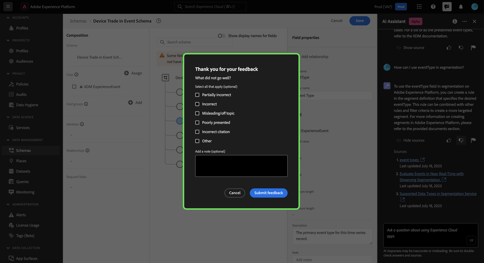

# Adobe Experience Platformの AI アシスタント

>[!NOTE]
>
>Adobe Experience Platformの AI アシスタントは現在アルファです。 機能とドキュメントは変更される場合があります。

Adobe Experience Platform用 AI Assistant は、Experience PlatformとReal-time Customer Data Platformの概念、およびオブジェクトに関する使用情報をナビゲートおよび理解するために使用できる UI 機能です。

AI Assistant に次のような情報を問い合わせることができます。

* データとオーディエンスに関するタスクの実行方法に関するガイダンス。
* 組織内の既存のデータオブジェクトのステータスと指標。
* 使用例とニュアンスを参照して、属性、データセット、宛先、スキーマ、セグメント、ソースなどのデータオブジェクトをより深く理解してください。

このドキュメントでは、AI Assistant にアクセスして使用し、Experience PlatformとReal-Time CDPの概念に関する質問や回答を受け取る方法に関する情報を提供します。

>[!BEGINSHADEBOX]

**AI アシスタントの仕組み**

AI Assistant は、データベースに問い合わせ、その後、データベースのデータを人間が読み取れる回答に変換することで、送信された質問に応答します。

基礎となるデータのこの内部表現は、ナレッジグラフとも呼ばれます。ナレッジグラフは、特定の回答に関する概念、データ、メタデータの包括的な Web です。

ナレッジ・グラフは、クエリが送信されるたびに参照されるサブグラフで構成されます。

* 顧客使用状況データ。
* 様々なメタストアにわたる顧客使用状況データ。
* Experience Leagueドキュメント。

AI Assistant に問い合わせる前に考慮すべき質問は 2 つあります。

* **概念に関する質問**：概念に関する質問は、データやオーディエンスに関するAdobeの概念に関する質問です。 概念に関する質問の例を次に示します。
   * バッチとストリーミングのセグメント化の違いは何ですか？
   * 業界のデータモデルはありますか？また、それらをどのように使用すればよいですか？
   * Real-Time CDPは何に最も適していますか？
* **使用に関する質問**：使用に関する質問は、組織内のデータオブジェクトに関する質問です。 使用に関する質問の例を次に示します。
   * データセットはいくつありますか？
   * これまでに使用されたことのないスキーマ属性の数
   * アクティブ化されたセグメントはどれですか？

>[!ENDSHADEBOX]

## UI でのExperience Platform用 AI Assistant へのアクセス

AI アシスタントには、Experience PlatformUI のヘッダーナビゲーションからアクセスできます。

を選択します。 **[!UICONTROL AI アシスタントアイコン]** ヘッダーから AI アシスタントパネルを起動します。

ここから、質問をテキストボックスに入力し、AI Assistant に問い合わせて、データやオーディエンスに関する概念を調べることができます。 また、データオブジェクトに関する質問をして、それぞれの使用例での使用方法をより深く理解することもできます。

### 使用例：AI Assistant を使用して、スキーマの作成プロセスを迅速に進めます

>[!NOTE]
>
>次のワークフローの例では、 ExperienceEvent スキーマの作成プロセスを使用して、Experience PlatformUI を使用する際の AI Assistant の使用方法を示しています。

例えば、 **イベントスキーマでのデバイスの取引**. ExperienceEvent スキーマの作成プロセスで、 `eventType` フィールドに入力します。 この時点で、ワークフローを終了し、 [スキーマ構成の基本](../xdm/schema/composition.md)または、AI Assistant を使用して、質問に対する直接の回答を取得できます。

まず、表示されるテキストボックスに質問を入力します。 次の例では、AI アシスタントは次の質問を提供します。**エクスペリエンスイベントスキーマの eventType フィールドとは何ですか。**&quot;

次に、AI アシスタントはナレッジベースに問い合わせ、回答を計算します。 しばらくすると、AI アシスタントは回答と関連する提案を返し、フォローアッププロンプトとして使用できます。

フォローアップの質問をして、特定のトピックに関する詳細を確認できます。 次の例では、AI アシスタントが、eventType をセグメント化でどのように使用できるかを尋ねられます。

また、AI Assistant にデータの使用に関する質問をすることもできます。 データの使用に関して質問する場合、AI Assistant がクエリに回答するには、アクティブなサンドボックスにいる必要があります。

AI アシスタントは、すべての回答に対して、そのソースを表示して回答を検証する方法を提供します。 概念に関する質問にはドキュメントへのリンクが提供されていますが、データ使用に関する質問は、回答の計算方法を示す SQL クエリを使用して検証できます。

>[!BEGINSHADEBOX]

**フィードバックがリクエストされました**

このアルファステージでは、AI アシスタントから受け取った応答に関するフィードバックを提供するように招待されます。 AI Assistant のエクスペリエンスを向上させ続けるために、すべての回答と送信済みのフィードバックがレビューされます。

フィードバックを提供するには、AI Assistant からの応答を受け取った後で上親指または下親指を選択し、表示されるテキストボックスにフィードバックを入力します。 次に、「 **[!UICONTROL フィードバックを送信]** を送信します。

>[!ENDSHADEBOX]

>[!BEGINTABS]

>[!TAB Show source]

選択 **[!UICONTROL ソースを表示]** :AI アシスタントが応答を計算するために参照するドキュメントへのリンクのリストです。

>[!TAB 親指を上に]

上サムネールアイコンを選択して、AI アシスタントでのエクスペリエンスの効果に関するフィードバックを提供します。

>[!TAB 親指を下に]

下のサムネールアイコンを選択し、AI Assistant の使用経験に基づいて改善できる点に関するフィードバックを提供します。 この手順の間に、エクスペリエンスに関する特定のコメントを入力することもできます。 コメントで提供されたフィードバックは毎日レビューされます。

>[!TAB フラグ]

フラグアイコンを選択すると、AI Assistant を使用したエクスペリエンスに関するさらなるレポートが表示されます。

>[!ENDTABS]

### 開始するアイデア

また、AI Assistant が提供する事前設定プロンプトを使用して開始することもできます。

## 追加情報

Experience Platformの AI アシスタントの詳細については、この節を参照してください。

### 範囲

AI Assistant は、ドキュメントとデータの使用状況に基づいて、クエリに回答できます。

#### ドキュメント

Real-time Customer Data Platformと Audiences に基づいて、ドキュメントに関する質問をすることができます。 現在、ドキュメントインデックスはAdobe Experience Platform(Real-Time CDPおよび Audiences) を対象としています。 インデックスは定期的に更新されます。

ドキュメント取得モデルは、Experience Platform(Real-Time CDPおよびオーディエンス ) に基づいてトレーニングされます。 Adobe Experience Platform以外のAdobe(Adobe TargetやCreative Cloudスイートなどの他の製品に関する質問には回答できません )。

#### データ使用状況

また、次のドメインでは、データの使用に関して AI Assistant に質問することもできます。

* 属性
* データセット
* 宛先（アカウントに関する質問と、現時点ではデータフローに関する質問には回答できません）。
* スキーマ（現時点では、フィールドグループに関する質問には回答できません）
* セグメント
* ソース（現時点ではアカウントに関する質問に回答できません）

使用状況データクエリの場合、回答に UI の現在の状態が反映されていない可能性があります。 これらの質問を裏付けるデータは、24 時間に 1 度更新されます。 例えば、昼間にReal-Time CDPでユーザーが行った変更は、夜間のデータストアと同期され、朝にユーザーからの質問に利用できるようになります。 質問の形式を「いつセグメントがタイトルを持つか」に設定する必要が生じる場合があります。 {TITLE} 作成済み」 その代わりに、「いつが {TITLE} セグメントが作成されました。」

スキーマ、データセット、属性、宛先、セグメントなどのオブジェクトに関連する特定のデータについて問い合わせるには、サンドボックスにログインする必要があります。

### サポートされるデータ使用に関する質問

+++「 」を選択して、サポートされているデータ使用に関する質問のリストを表示します

以下は、ドメインごとにグループ化された、現在サポートされているデータ使用に関する質問のリストです。

* このセグメントに使用する属性をリストしますか？
* 合計セグメント数はいくつですか。
* 過去 1 か月間に最後に変更されたセグメントのリストを表示する
* 先週変更されたセグメントは何ですか。
* プロファイル数： {SEGMENT_NAME} セグメント？
* すべての重複セグメントをリストします。
* 過去 7 日間に作成または更新されたセグメントを表示する
* セグメント全体でのプロファイル数の分布はどれくらいですか？
* セグメント化で使用されるフィールドの数
* アクティブ化されたセグメントの合計数はどれくらいですか？
* どのセグメントがアクティブ化されていますか。
* アクティブ化されている重複セグメントの数は？
* 過去 1 年間に作成されたセグメントのリストを表示します。
* 以前に最後に変更されたセグメントを表示する {DATE}.
* に関連付けられている一意のセグメント名の数 {SCHEMA_NAME} スキーマ？
* セグメントで最も一般的に使用されるスキーマはどれですか？
* スキーマはいくつありますか？
* 使用するデータセット {SCHEMA_NAME} スキーマ？
* 先週変更されたすべてのスキーマをリストします。
* プロファイルが有効になっているスキーマの数は？
* すべてのエクスペリエンスイベントクラススキーマをリストする
* に取り込まれるデータセット {SCHEMA_NAME} スキーマ？
* 同じスキーマを使用して取り込まれたデータセットの数
* データセットはいくつありますか？
* 各セグメントで使用されるデータセットはどれですか？
* 使用するセグメント {ATTRIBUTE_NAME} 属性？
* どのスキーマに {ATTRIBUTE_NAME} 属性？
* どのセグメントでも使用されていない XDM スキーマ属性はいくつですか？
* データセットが次の場合 {ATTRIBUTE_NAME} XDM フィールドに値が入力されていますか？
* データを持つデータセット {ATTRIBUTE_NAME} 属性？
* 各宛先でアクティブ化されるセグメントの数は？
* どのセグメントが最も多くの宛先に対してアクティブ化されていますか？
* 0 個のプロファイルを持つセグメントはありますか？
* 使用しているデータフローの数は？

+++

### 対話型の経験

AI Assistant に問い合わせる際の対話型エクスペリエンスに関して、いくつかのニュアンスを考慮する必要があります。

>[!NOTE]
>
>これらの制限は一時的で、アルファの過程を通して改善されています。

>[!BEGINTABS]

>[!TAB 前のディスカッションからコンテキストを推論できません]

現在、AI アシスタントは、指定された質問のコンテキストとして、以前のディスカッションを参照できません。 以下の表に例を示します。

| 曖昧な質問 | 質問をクリア | 注釈 |
| --- | --- | --- |
| <ul><li>最初の質問：「セグメントとは何ですか？」</li><li>「異なるタイプがあるのか？」という質問に従ってください。</li></ul> | <ul><li>最初の質問：「セグメントとは何ですか？」</li><li>次の質問に従います： 「異なるタイプの **セグメント**?」</li></ul> | AI アシスタントは、「彼ら」が何を意味するのかを推測できません。 |
| <ul><li>最初の質問：「セグメントとは何ですか？」</li><li>「もっと詳しく話せるか？」という質問に従ってください。</li></ul> | <ul><li>最初の質問：「セグメントとは何ですか？」</li><li>「セグメントの詳細を説明する」という質問に従います。</li></ul> | AI Assistant は、「詳細」に基づいてドキュメントをインテリジェントに参照できません。 |
| <ul><li>最初の質問：「セグメントとは何ですか？」</li><li>次の質問に従います：「例を挙げていただけますか？」</li></ul> | <ul><li>最初の質問：「セグメントとは何ですか？」</li><li>「セグメントの例を教えてください」という質問に従います。</li></ul> | AI アシスタントは、例を何にしたいのかを推測できません。 |
| <ul><li>最初の質問：「バッチセグメントとは何ですか？」</li><li>「ストリーミングセグメントと比較して、どのように異なるのですか？」という質問に従います。</li></ul> | <ul><li>最初の質問：「バッチセグメントとは何ですか？」</li><li>「ストリーミングセグメントとバッチセグメントを比較できますか？」という質問に従います。</li></ul> | AI アシスタントは、「it」が何を参照しているかを推測できず、したがってストリーミングセグメントを比較できません。 |
| <ul><li>最初の質問：「現在のセグメント数はいくつですか？」</li><li>「Facebookを宛先として使用しているのは何人ですか？」という質問に従います。</li></ul> | <ul><li>最初の質問：「現在のセグメント数はいくつですか？」</li><li>「宛先としてFacebookを使用しているセグメントの数はいくつですか？」という質問に従います。</li></ul> | AI アシスタントは、「彼ら」が何を参照しているかを推測できません。 |

{style="table-layout:auto"}

>[!TAB ページからコンテキストを推論できません]

現在表示しているExperience PlatformUI ページの特定の要素について AI Assistant に尋ねる場合は、質問内で特定の要素を明確に定義する必要があります。

| 曖昧な質問 | 質問をクリア | 注釈 |
| --- | --- | --- |
| 「これは何の役に立つの？」 | 「何が起こるの？ {PAGE_NAME} やる？ | AI アシスタントは、「これ」が何を参照しているかを推測できません。 クエリを実行する特定のページ要素を指定する必要があります。 |
| 「なぜ救われないの？」 | 「という名前の新しいサンドボックスを保存できないのはなぜですか？ {NAME}?」 | AI アシスタントは、「it」が何を参照しているかを推測できず、エンティティに問題があることを知ることはできません。 |

{style="table-layout:auto"}

さらに、AI アシスタントは、エラーが「Experience League」に記載されている場合にのみ、エラーメッセージに関する質問に回答できます。

>[!TAB 曖昧さ]

現在、AI アシスタントは質問を明確にしないので、質問を明確にフレーズ化し、製品、アプリケーション、ドメイン内の範囲を絞る必要があります。

| 曖昧な質問 | 質問をクリア | 注釈 |
| --- | --- | --- |
| 「フィルターを作成するにはどうすればよいですか？ | プロファイルクエリ言語でフィルターを作成する方法を教えてください。 | フィルタリングをサポートするExperience Platform機能は多岐にわたるので、フィルタリングする機能を指定する必要があります。 |
| 「どうやって始めればいいの？ | 宛先の使用を開始する方法を教えてください。 | 概念が過度に広いと、汎用的な、または不必要に具体的な回答が得られる可能性があるので、目標と使用例を明確に示す必要があります。 |

{style="table-layout:auto"}

>[!ENDTABS]

### 限られた小さな話

AI アシスタントとの小さな話し合いは可能ですが、現在、この処理能力は制限されています。

### 機能に関する質問

AI アシスタントは、何ができるかを不正確な印象を与える可能性があります。 次のタイプの質問に対して、間違って回答する場合があります。

| 質問の例 | 注釈 |
| --- | --- |
| 「～に関する質問に答えていただけますか？ {ENTITY}?」 | AI アシスタントがインデックス内の特定のエンティティを参照する単一のページを見つけられる限り、はいと応答します。 |
| 「知ってる？ **x** 言語？」 | AI アシスタントは現在、英語のみをサポートしていますが、基盤となるモデルが英語をサポートできるので、「はい」と答える場合があります。 |
| 「できるか…?」 | AI アシスタントは、できない場合でも「はい」と答える場合があります。 |

### ヒント

#### 間違った情報源を使って質問に答えることができます

使用状況データに関する質問が、ドキュメントに基づく回答になる場合があります。 これは、AI アシスタントが誤って質問を誤った情報ソースにルーティングする可能性があるためです。 これを防ぐには、次の方法があります。

* より多くの SQL に似た言語を使用するために質問を書き換える
* 使用する情報ソースを明示的に呼び出す。

以下の表に例を示します。

| 悪い質問 | 良い質問 | メモ |
| --- | --- | --- |
| 最大のセグメントは何ですか？ | 最大のセグメントは何ですか？ データを使用しています。 | データに基づいて回答を行うことを AI アシスタントに明示的に伝えます。 |
| 最大のセグメントは何ですか？ | 最大のセグメントをリストします。 | 「なに…」という質問がドキュメントベースの質問と間違える場合があります。 「list」のようなコマンドを使用すると、コンテキスト内のデータを使用して質問していることを示す強力なインジケーターが表示されます。 |
| データセットはいくつありますか？ | データセットをカウントします。 | 元の質問はセグメントで機能しますが、データセットでは機能しない場合があります。 |