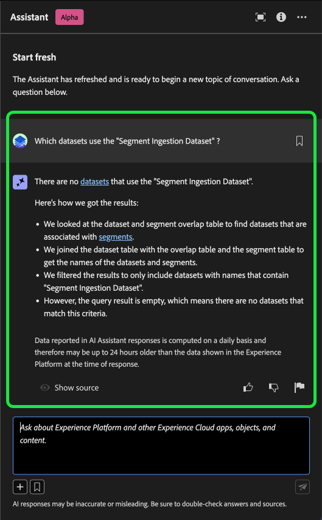
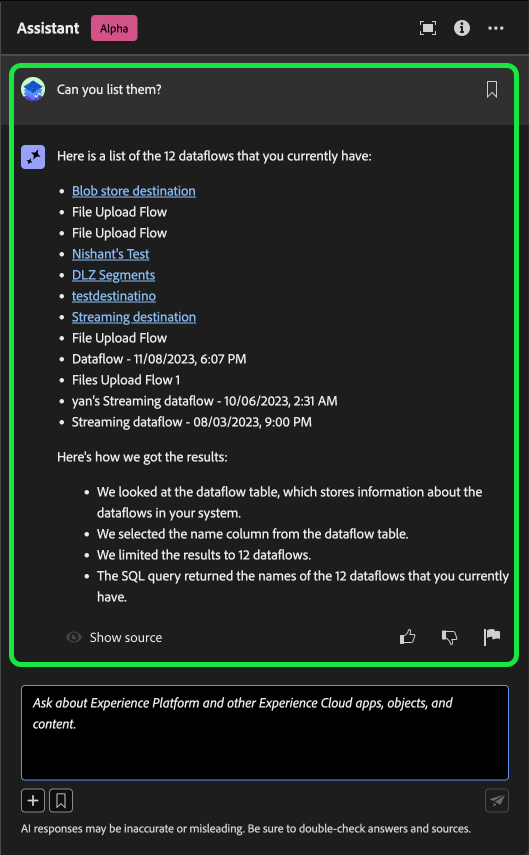

# Adobe Experience Platformのアシスタント

>[!NOTE]
>
>Adobe Experience Platformのアシスタントは現在Alpha中です。 機能とドキュメントは変更される場合があります。

アシスタントは、Adobe Experience PlatformとReal-time Customer Data Platformの概念、およびオブジェクトに関する使用情報をナビゲートおよび理解するために使用できる UI 機能です。

次のような情報を Assistant に問い合わせることができます。

* データとオーディエンスに関するタスクの実行方法に関するガイダンス。
* 組織内の既存のデータオブジェクトのステータスと指標。
* 使用例とニュアンスを参照して、属性、データセット、宛先、スキーマ、セグメント、ソースなどのデータオブジェクトをより深く理解してください。

以下のガイドを読んで、アシスタントを使用してExperience PlatformとReal-Time CDPのワークフローをナビゲートし理解する方法を学びます。

>[!BEGINSHADEBOX]

**アシスタントの仕組み**

アシスタントは、データベースに問い合わせ、データベースのデータを人間が読み取れる回答に変換することで、送信された質問に対して応答します。

基礎となるデータのこの内部表現は、ナレッジグラフとも呼ばれます。ナレッジグラフは、特定の回答に関する概念、データ、メタデータの包括的な Web です。

ナレッジ・グラフは、クエリが送信されるたびに参照されるサブグラフで構成されます。

* 顧客使用状況データ。
* 様々なメタストアにわたる顧客使用状況データ。
* Experience Leagueドキュメント。

Assistant に問い合わせる前に考慮すべき質問は 2 つあります。

* **概念に関する質問**：概念に関する質問は、データやオーディエンスに関するAdobeの概念に関する質問です。 概念に関する質問の例を次に示します。
   * バッチとストリーミングのセグメント化の違いは何ですか？
   * 業界のデータモデルはありますか？また、それらをどのように使用すればよいですか？
   * Real-Time CDPは何に最も適していますか？
* **使用に関する質問**：使用に関する質問は、組織内のデータオブジェクトに関する質問です。 使用に関する質問の例を次に示します。
   * データセットはいくつありますか？
   * これまでに使用されたことのないスキーマ属性の数
   * アクティブ化されたセグメントはどれですか？

>[!ENDSHADEBOX]

## Experience PlatformUI のアシスタントにアクセス

アシスタントを起動するには、 **[!UICONTROL アシスタントアイコン]** をExperience PlatformUI の上部のヘッダーから。

Assistant のインターフェイスが表示され、すぐに使い始めるための情報が提供されます。 以下に示すオプションを使用できます。 [!UICONTROL 開始するアイデア] 次のような質問やコマンドに答えるには：

* [!UICONTROL アクティブ化されているセグメントはどれですか？]
* [!UICONTROL スキーマとは]
* [!UICONTROL Real-Time CDPの一般的な使用例]

アシスタントを操作するには、入力ボックスを使用してクエリやコマンドを入力します。 また、(**`+`**) 記号を使用してオートコンプリート機能とブックマークアイコンを使用し、ブックマークされたクエリやコマンドにアクセスできます。

## 使用例：アシスタントを使用して、スキーマ作成プロセスを迅速に進めます

>[!NOTE]
>
>次に示すワークフローの例では、エクスペリエンスイベントスキーマの作成プロセスを使用して、Experience PlatformUI を使用する際にアシスタントを使用する方法を示しています。

例えば、 **イベントスキーマでのデバイスの取引**. エクスペリエンスイベントスキーマの作成プロセスで、 `eventType` フィールドに入力します。 「この時点で、ワークフローを終了し、 [スキーマ構成の基本](../xdm/schema/composition.md) ドキュメントを参照するか、Assistant を使用して質問への回答を取得し、Assistant が推奨するドキュメントリンクを通じて追加のリソースを見つけることができます。」

まず、表示されるテキストボックスに質問を入力します。 以下の例では、Assistant が次の質問を提供しています。**ExperienceEvent スキーマの eventType フィールドとは何ですか。**&quot;

次に、アシスタントがナレッジベースに問い合わせて回答を計算します。 しばらくすると、Assistant は回答と関連する提案を返します。この情報は、フォローアッププロンプトとして使用できます。

アシスタントからの応答を受け取ったら、様々なオプションから選択して、続行する方法を決定できます。

### クエリを保存 {#save-your-query}

+++クエリの保存方法の例を表示するには、「 」を選択します

クエリを保存するには、質問の横にあるブックマークアイコンを選択します。

保存したクエリにアクセスするには、入力ボックスの下のブックマークアイコンを選択し、実行するクエリを選択します。

+++

### サンドボックスでのデータの表示 {#view-data-in-your-sandbox}

+++選択して例を表示

クエリに応じて、Assistant はサンドボックス内のデータに関する追加情報を提供します。 クエリへの応答がサンドボックスにどのように適用されるかを表示するには、「 」を選択します。 **[!UICONTROL サンドボックス内].**

この手順の間、Assistant は、該当する特定のオブジェクトの UI ページへの直接リンクを提供できます。 以下の例では、Assistant は、 [!UICONTROL スキーマ] および [!UICONTROL セグメント] UI ページ。

+++

### 応答を検証 {#verify-the-response}

+++選択すると、ソースの表示方法の例が表示されます

引用を表示し、アシスタントの応答を検証するには、 **[!UICONTROL ソースを表示]**. Assistant は、応答を裏付けるドキュメントへのリンクを提供します。 Assistant が提供するクエリを使用することもできます。 [!UICONTROL 関連する提案] を参照して、元のクエリに関連するトピックをさらに詳しく調べます。

+++

### データの使用とビジュアライゼーション {#data-usage-and-visualization}

+++「 」を選択すると、データ使用に関する質問とデータの視覚化の例が表示されます

データの使用状況については、アシスタントに問い合わせることができます。 組織内のデータに関するデータ使用に関する質問に回答するには、アシスタントがアクティブなサンドボックスにいる必要があります。

データ使用に関する質問が表示されると、Assistant では、その回答の計算方法に関する説明も表示されます。 以下の例では、1,000 を超えるプロファイルとそれぞれのアクティベーションステータスを持つセグメントを表示するために実行した手順の概要をアシスタントが説明します。

さらに、Assistant はグラフをレンダリングしてデータを視覚化します。 また、クエリにフィルターを指定したり、変更を加えたりできます。また、含めるフィルターに基づいて結果をレンダリングするように Assistant に指示できます。 例えば、Assistant に対し、作成日の順にカウントセグメントのトレンドを表示するように依頼したり、合計プロファイル数がゼロのセグメントを削除したり、データを表示する際には整数ではなく月の名前を使用したりできます。

+++

### オートコンプリートを使用 {#use-auto-complete}

+++オートコンプリートの例を表示するには、「 」を選択します

オートコンプリート関数を使用して、サンドボックスに存在するデータオブジェクトのリストを受け取ることができます。 オートコンプリートの推奨事項は、セグメント、スキーマ、データセット、ソース、宛先の各ドメインで使用できます。

オートコンプリートを使用するには、プラス記号 (**`+`**) をクエリ内でクリックします。 別の方法として、プラス記号 (**`+`**) をクリックします。 ウィンドウが開き、サンドボックス内の推奨データオブジェクトのリストが表示されます。

次に、クエリを実行して質問を完了し、質問を送信するデータオブジェクトを選択します。

+++

### マルチターンを使用 {#use-multi-turn}

+++選択すると、マルチターンの例が表示されます

Assistant の複数回転機能を使用して、体験中により自然な会話をすることができます。 アシスタントは、与えられたフォローアップの質問に答えることができます。 このコンテキストは、以前のインタラクションから推論できます。

次の例では、現在の組織内のデータフローの合計数に関してアシスタントが要求されます。

次に、アシスタントが別のフォローアップリクエストを受け取ります。 今回は、Assistant が、組織に現在存在するデータフローをリストして応答します。

+++

## 範囲 {#scope}

アシスタントは、Real-Time CDPとExperience Platformの概念に関する質問に回答したり、ユーザーアカウントに固有のデータ使用状況に関する質問に回答したりできます。 アシスタントは、現在の UI ページに基づいてコンテキストを推論することもできます。 次の情報を識別できます。

* 使用しているユーザーアカウント。
* 所属する組織。
* 画面に表示されているページ。
* 画面に表示するリソース（タイプと ID を含む）。
* 特定のExperience PlatformまたはReal-Time CDPワークフローの処理中である場合、Assistant は目的を推測できます。

### ドキュメント {#documentation}

現在、ドキュメントインデックスはAdobe Experience Platform(Real-Time CDPおよび Audiences) を対象としています。 インデックスは定期的に更新されます。

ドキュメント取得モデルは、Experience Platform(Real-Time CDPおよびオーディエンス ) に基づいてトレーニングされます。 Adobe Experience Platform以外のAdobe(Adobe TargetやCreative Cloudスイートなどの他の製品に関する質問には回答できません )。

### データ使用状況 {#data-usage}

また、次のドメインでは、データの使用に関して Assistant に質問することもできます。

* 属性
* データセット
* 宛先 _（現時点では、アカウントに関する質問と、データフローに関する質問には回答できません）。_
* スキーマ _（現時点では、フィールドグループに関する質問には回答できません。）_
* セグメント
* ソース _（現時点ではアカウントに関する質問に回答できません。）_

使用状況データクエリの場合、回答に UI の現在の状態が反映されていない可能性があります。 これらの質問を裏付けるデータは、24 時間に 1 度更新されます。 例えば、昼間にReal-Time CDPでユーザーが行った変更は、夜間のデータストアと同期され、朝にユーザーからの質問に利用できるようになります。 質問の形式を「いつセグメントがタイトルを持つか」に設定する必要が生じる場合があります。 {TITLE} 作成済み」 その代わりに、「いつが {TITLE} セグメントが作成されました。」

スキーマ、データセット、属性、宛先、セグメントなどのオブジェクトに関連する特定のデータについて問い合わせるには、サンドボックスにログインする必要があります。

### データ使用に関する質問の例 {#example-data-usage-questions}

+++「 」を選択すると、データ使用に関する質問の例のリストが表示されます

| 質問タイプ | 説明 | 例 |
| --- | --- | --- | 
| データ系列 | 1 つまたは複数のオブジェクトの使用状況を他のExperience Platform・オブジェクト間で追跡 | <ul><li>使用するデータセット {SCHEMA_NAME} スキーマ？</li><li>同じスキーマを使用して取り込まれたデータセットの数</li><li>アクティブ化されたセグメントで使用されたデータセットはどれですか？</li><li>アクティブ化されたセグメントで使用される属性を持つスキーマをリストします。</li><li>アクティブ化されたセグメントを表示する {DESTINATION_ACCOUNT_NAME} およびには 1000 を超えるプロファイルがあります。</li><li>2023 年 1 月以降に変更された、アクティブ化されたセグメントで使用されている属性を表示します。</li><li>を介して取り込まれるデータセット {SOURCE_NAME}?</li><li>関連付けられているデータフロー {DATAFLOW_NAME}</li><li>アクティブ化されたセグメントに関連し、過去 1 年間に作成されたスキーマをリストします。</li></ul> |
| 配分と集計 | Experience Platformオブジェクトの使用に関する概要ベースの質問 | <ul><li>アクティブ化されたセグメントの割合はどれくらいですか？</li><li>セグメント化で使用されるフィールドの数</li><li>どのセグメントが最も多くの宛先に対してアクティブ化されていますか？</li><li>重複したセグメントをリストします。</li><li>アクティブ化されたセグメントを表示する {DESTINATION_ACCOUNT_NAME} プロファイルサイズでランク付けします。</li><li>アクティブ化されていないが 100 を超えるプロファイルを持つセグメントの割合。 名前を見せて。</li><li>データセットにデータを取り込む 3 つのソースコネクタをリストします。</li><li>アクティブ化されたセグメントで使用される、発生した項目に基づく上位 5 つの属性を示します。</li></ul> |
| オブジェクト参照 | Experience Platformオブジェクトまたはそのプロパティを取得またはアクセスします。 | <ul><li>関連付けられたスキーマを持たないデータセット</li><li>使用する属性のリスト {SEGMENT_NAME}?</li><li>プロファイルが有効で、作成後に変更されていないスキーマのリストを教えてください。</li><li>先週変更されたセグメントは何ですか。</li><li>同じセグメント定義を持つセグメントと作成日をリストします。</li><li>どのデータセットが有効か、および各データセットから作成されたセグメント数も含まれます。</li><li>データセット XYZ に関連付けられているソースアカウントは何ですか。</li><li>セグメント定義と変更日を表示する {SEGMENT_NAME}.</li></ul> |

+++

## フィードバックの提供 {#feedback}

>[!BEGINSHADEBOX]

**フィードバックがリクエストされました**

このAlpha段階では、アシスタントから受け取った応答に関するフィードバックを提供するよう招待されます。 アシスタントの操作性を向上させるために、すべての回答と送信済みのフィードバックを確認します。

フィードバックを提供するには、アシスタントからの応答を受け取った後で親指を上または親指を下に選択し、表示されるテキストボックスにフィードバックを入力します。 次に、「 **[!UICONTROL フィードバックを送信]** を送信します。

>[!ENDSHADEBOX]

+++フィードバックの提供

>[!BEGINTABS]

>[!TAB 親指を上に]

上サムネールアイコンを選択して、アシスタントでのエクスペリエンスの効果に関するフィードバックを提供します。

>[!TAB 親指を下に]

下へサムネールアイコンを選択し、アシスタントの操作内容に基づいて改善される可能性のあるフィードバックを提供します。 この手順の間に、エクスペリエンスに関する特定のコメントを入力することもできます。 コメントで提供されたフィードバックは毎日レビューされます。

>[!TAB フラグ]

フラグアイコンを選択すると、アシスタントを使用したエクスペリエンスに関するさらなるレポートが表示されます。

>[!ENDTABS]

+++

## 追加情報 {#additional-information}

Experience Platformのアシスタントの詳細については、この節を参照してください。

### 注意事項と制限事項 {#caveats-and-limitations}

次の節では、Assistant を使用する際に考慮すべき現在の注意事項と制限事項について説明します。
<!-- 
#### Conversational experience

You must consider several nuances regarding the conversational experience when querying the Assistant.

>[!NOTE]
>
>These limitations are temporary and are being improved upon throughout the course of the alpha.

>[!BEGINTABS]

>[!TAB Unable to infer context from prior discussion]

The Assistant currently cannot reference prior discussions as context for a given question. See the table below for examples:

| Ambiguous question | Clear question | Note |
| --- | --- | --- |
| <ul><li>First question: "What is a segment?"</li><li>Follow up question: "Are there different types of them?"</li></ul>| <ul><li>First question: "What is a segment?"</li><li>Follow up question: "Are there different types of **segments**?"</li></ul> | The Assistant cannot infer what "them" means. |
| <ul><li>First question: "What is a segment?"</li><li>Follow up question: "Can you elaborate more?"</li></ul> | <ul><li>First question: "What is a segment?"</li><li>Follow up question: "Explain what a segment is in depth"</li></ul> | The Assistant cannot intelligently reference documentation based on "more". |
| <ul><li>First question: "What is a segment?"</li><li>Follow up question: "Can you give me an example of one?"</li></ul> | <ul><li>First question: "What is a segment?"</li><li>Follow up question: "Can you give me an example of a segment?"</li></ul> | The Assistant cannot infer what you want an example of.|
| <ul><li>First question: "What is a batch segment?"</li><li>Follow up question: "How does it compare to a streaming segment?"</li></ul> | <ul><li>First question: "What is a batch segment?"</li><li>Follow up question: "Can you compare a streaming segment to a batch segment?"</li></ul> | The Assistant cannot infer what "it" is referring to and thus cannot compare the streaming segment. |
| <ul><li>First question: "How many segments do I have?"</li><li>Follow up question: "How many of them use Facebook as a destination?"</li></ul> | <ul><li>First question: "How many segments do I have?"</li><li>Follow up question: "How many of the segments that I have are using Facebook as a destination?"</li></ul> | The Assistant is cannot infer what "them" is referring to. |

{style="table-layout:auto"}

>[!TAB Unable to infer context from a page]

When asking the Assistant about a particular element of the Experience Platform UI page that you are on, you must clearly define the specific element within your question. 

| Ambiguous question | Clear question | Note |
| --- | --- | --- |
| "What does this do?" | "What does {PAGE_NAME} do? | The Assistant cannot infer what "this" is referring to. You must provide the specific page element that you are querying about. |
| "Why won't it save?" | "Why can't I save a new sandbox called {NAME}?" | The Assistant cannot infer what "it" is referring to and cannot know that you are having issues with an entity. |

{style="table-layout:auto"}

Furthermore, the Assistant can only answer questions regarding error messages, given that the error is documented in Experience League.

>[!TAB Ambiguity]

You must phrase your questions clearly and scope them within a product, application, or domain, as the Assistant currently cannot disambiguate questions.

| Ambiguous question | Clear question | Note |
| --- | --- | --- |
| "How do I create a filter? | How do I create a filter in Profile Query Language? | You must specify the feature that which you are filtering for because a variety of Experience Platform features support filtering. |
| "How do I get started? | How do I get started using destinations? | You must provide clarity on your goals and use case because overly broad concepts may result in generic or unnecessarily specific answers. |

{style="table-layout:auto"}

>[!ENDTABS] -->

#### 限られた小さな話

アシスタントとの小さな話し合いは可能ですが、現在、この処理能力は制限されています。

#### 機能に関する質問

アシスタントは、何ができるかを不正確なインプレッションを与える場合があります。 次のタイプの質問に対して、間違って回答する場合があります。

| 質問の例 | 注意 |
| --- | --- |
| 「～に関する質問に答えていただけますか？ {ENTITY}?」 | アシスタントがインデックス内の特定のエンティティを参照する単一のページを見つけられる限り、はいに応答します。 |
| 「知ってる？ **x** 言語？」 | アシスタントは現在、英語のみをサポートしていますが、基になるモデルで英語をサポートできるので、「はい」と答える場合があります。 |
| 「できるか…?」 | アシスタントは、できなくても「はい」と答える場合があります。 |

### ヒント {#tips}

次の節では、Assistant を使用する際に考慮すべきヒントと回避策について説明します。

#### 間違った情報源を使って質問に答えることができます

使用状況データに関する質問が、ドキュメントに基づく回答になる場合があります。 これは、アシスタントが誤って質問を誤った情報ソースにルーティングする可能性があるためです。 これを防ぐには、次の方法があります。

* より多くの SQL に似た言語を使用するために質問を書き換える
* 使用する情報ソースを明示的に呼び出す。

以下の表に例を示します。

| 悪い質問 | 良い質問 | メモ |
| --- | --- | --- |
| 最大のセグメントは何ですか？ | 最大のセグメントは何ですか？ データを使用しています。 | データに基づいて回答を行うことをアシスタントに明示的に伝えます。 |
| 最大のセグメントは何ですか？ | 最大のセグメントをリストします。 | 「なに…」という質問がドキュメントベースの質問と間違える場合があります。 「list」のようなコマンドを使用すると、コンテキスト内のデータを使用して質問していることを示す強力なインジケーターが表示されます。 |
| データセットはいくつありますか？ | データセットをカウントします。 | 元の質問はセグメントで機能しますが、データセットでは機能しない場合があります。 |
