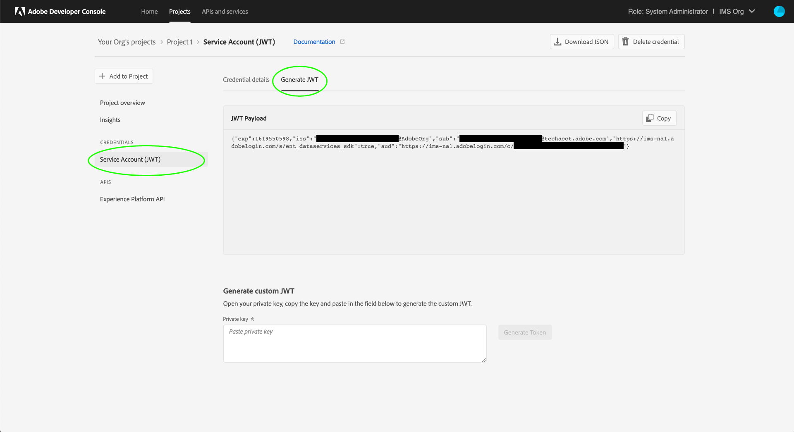

# Experience Platform API の認証とアクセス

このドキュメントでは、Experience Platform API を呼び出すために Adobe Experience Platform 開発者アカウントにアクセスするための順を追ったチュートリアルを提供します。このチュートリアルの最後には、すべてのプラットフォーム API 呼び出しに必要な次の資格情報が生成されます。

* `{ACCESS_TOKEN}`
* `{API_KEY}`
* `{IMS_ORG}`

アプリケーションとユーザーのセキュリティを維持するには、Adobe I/O API へのすべてのリクエストが、OAuth や JSON Web Tokens（JWT）などの標準を使用して認証され、承認される必要があります。JWT は、personal access トークンを生成するために、クライアント固有の情報と共に使用されます。

このチュートリアルでは、以下のフローチャートで説明しているように、プラットフォームの認証のために必要な資格情報を収集する方法について説明します。


## 前提条件

プラットフォーム Api を呼び出すには、次の手順を実行する必要があります。

* Adobe Experience Platform へのアクセス権を持つ IMS 組織.
* 開発者として、および製品プロファイルにユーザーを追加できる管理コンソール管理者。

このチュートリアルを実行するには、Adobe ID も必要です。 Adobe ID をお持ちでない場合は、次の手順で作成できます。

1. [Adobe Developer Console に移動 ](https://console.adobe.io) します。
2. 「 **[!UICONTROL 新規アカウントを作成」を選択し]** ます。
3. サインアップ処理を完了します。

## エクスペリエンスプラットフォーム用の開発者およびユーザーアクセスの取得

Adobe Developer Console にインテグレーションを作成する前に、Adobe Admin Console で、ご利用のアカウントに、経験 Platform 製品プロファイルの開発者およびユーザー権限があることを確認してください。

### 開発者アクセスの獲得

を [!DNL Admin Console] 使用して、社内の管理者に連絡して、開発者がエクスペリエンスプラットフォーム製品プロファイルに追加されるように [[!DNL Admin Console] ](https://adminconsole.adobe.com/) します。[!DNL Admin Console] [ 製品プロフィールの開発者のアクセスを管理する方法について詳しくは、マニュアルを参照してください ](https://helpx.adobe.com/jp/enterprise/admin-guide.html/enterprise/using/manage-developers.ug.html) 。

開発者に割り当てたら、Adobe Developer Console でインテグレーションの作成を開始でき [ ](https://www.adobe.com/go/devs_console_ui) ます。 この統合により、外部のアプリケーションとサービスから Adobe Api へのパイプラインができます。

### ユーザーアクセスの取得

[!DNL Admin Console]管理者は、同じ製品プロファイルにユーザーを追加することもできます。詳細については、 [ のユーザーグループの管理に関するガイドを参照してください  [!DNL Admin Console] ](https://helpx.adobe.com/enterprise/admin-guide.html/enterprise/using/user-groups.ug.html) 。

## API キー、IMS 組織 ID、クライアントシークレットを生成します。 {#api-ims-secret}

>[!NOTE]
>
>このドキュメントに記載されているプライバシーに関する情報については、以下の説明を参照して [ ](../privacy-service/api/getting-started.md) [!DNL Privacy Service] ください。

プラットフォームから開発者およびユーザーにアクセスするに [!DNL Admin Console] は、次の手順に従って、 `{IMS_ORG}` `{API_KEY}` Adobe developer Console でおよび証明書を生成します。 これらの資格情報は一度だけ生成される必要があり、将来のプラットフォーム API 呼び出しで再利用できます。

### エクスペリエンスプラットフォームをプロジェクトに追加する

[Adobe Developer Console](https://www.adobe.com/go/devs_console_ui) に移動し 、Adobe ID を使用してログインします。次に、Adobe Developer Console のドキュメントの[空のプロジェクトの作成](https://www.adobe.io/apis/experienceplatform/console/docs.html#!AdobeDocs/adobeio-console/master/projects-empty.md)チュートリアルで概説されている手順に従います。

新しいプロジェクトを作成したら、 **** 「プロジェクト概要」画面で「API を追加」を選択し **** ます。


**[!UICONTROL API の追加]**&#x200B;画面が表示されます。 Adobe エクスペリエンスプラットフォーム用の製品アイコンを選択してから、「次へ」を選択する前に、「Platform API を体験」を選択し **** **** ます。


このチュートリアルでは、 [ サービスアカウント (JWT) を使用してプロジェクトに api を追加する方法について説明している手順に従って ](https://www.adobe.io/apis/experienceplatform/console/docs.html#!AdobeDocs/adobeio-console/master/services-add-api-jwt.md) ください (「Api の設定」を参照してください)。

>[!IMPORTANT]
>
>前述の手順では、ブラウザーによって、非公開鍵と関連する公開証明書が自動的にダウンロードされます。 この秘密キーは、このチュートリアルの後の手順で必要となるため、コンピューターに格納されている場所に注意してください。

### 資格情報の収集

API がプロジェクトに追加されると、 **[!UICONTROL プロジェクトの「エクスペリエンスプラットフォーム api]** 」ページに、プラットフォーム api のすべての呼び出しに必要な次の資格情報が表示されます。

* `{API_KEY}` ([!UICONTROL クライアント ID])
* `{IMS_ORG}` ([!UICONTROL Organization ID])


上記の資格情報に加えて、生成された **[!UICONTROL クライアントシークレットも]** 今後の手順に必要です。 「 **[!UICONTROL クライアントシークレットを取得して値を公開」を選択]** し、後で使用するためにコピーします。


## JSON Web Token (JWT) を生成します。 {#jwt}

次の手順では、アカウントの資格情報に基づいて、JSON Web Token (JWT) を生成します。 この値を使用して `{ACCESS_TOKEN}` 、プラットフォーム API 呼び出しで使用するための資格情報が生成されます。これは、24時間ごとに再生成する必要があります。

**[!UICONTROL 左側のナビゲーションで「サービスアカウント (jwt)」を選択]** し、「jwt の生成」を選択し **** ます。



「カスタム JWT の生成」の下のテキストボックスに **** 、プラットフォーム API をサービスアカウントに追加するときに生成された秘密キーの内容を貼り付けます。 次に、「トークンを生成」を選択し **** ます。


ページには、生成された JWT が表示されるように更新されます。さらに、access トークンを生成するためのサンプル cURL コマンドもあります。 このチュートリアルでは、「生成された JWT」の横にある「コピー」を選択して、 **** トークンを **** クリップボードにコピーします。


## アクセストークンの生成

生成された JWT は、API 呼び出しで使用して、を生成でき `{ACCESS_TOKEN}` ます。 And の値とは異なり、 `{API_KEY}` `{IMS_ORG}` プラットフォーム api を継続して使用するには、24時間ごとに新しいトークンを生成する必要があります。

**リクエスト**

次の要求は、 `{ACCESS_TOKEN}` ペイロードで指定された資格情報に基づいて、新規に作成されます。 このエンドポイントは、フォームデータをペイロードとしてのみ受け入れます。そのため、のヘッダーが付いている必要があり `Content-Type` `multipart/form-data` ます。

```shell
curl -X POST https://ims-na1.adobelogin.com/ims/exchange/jwt \
  -H 'Content-Type: multipart/form-data' \
  -F 'client_id={API_KEY}' \
  -F 'client_secret={SECRET}' \
  -F 'jwt_token={JWT}'
```

| プロパティ | 説明 |
| --- | --- |
| `{API_KEY}` | `{API_KEY}`前の [!UICONTROL  手順で取得した (クライアント ID ] ) [ ](#api-ims-secret) 。 |
| `{SECRET}` | 前の手順で取得したクライアントシークレット [ ](#api-ims-secret) |
| `{JWT}` | 前の手順で生成した JWT [ ](#jwt) 。 |

>[!NOTE]
>
>同じ API キー、クライアントシークレット、および JWT を使用して、各セッションに対して新しいアクセストークンを生成できます。 これにより、アプリケーション内のアクセストークンの生成を自動化することができます。

**応答** 

```json
{
  "token_type": "bearer",
  "access_token": "{ACCESS_TOKEN}",
  "expires_in": 86399992
}
```

| プロパティ | 説明 |
| --- | --- |
| `token_type` | 返されるトークンのタイプ。 アクセストークンの場合、この値は常に設定されて `bearer` います。 |
| `access_token` | 生成された `{ACCESS_TOKEN}` . この値は、プリフィックス「」という単語が付い `Bearer` ており、 `Authentication` すべてのプラットフォーム API 呼び出しのヘッダーとして指定する必要があります。 |
| `expires_in` | アクセストークンの有効期限が切れるまでの残り時間 (ミリ秒) です。 この値を0に設定した場合は、新しいアクセストークンを生成して、プラットフォーム Api を継続して使用する必要があります。 |

## アクセス資格情報のテスト

必要なすべての資格情報を収集したら、次の API 呼び出しを試みることができます。 この通話 [!DNL Experience Data Model] には、組織で使用可能なすべての標準 (XDM) クラスが一覧表示されます。

**リクエスト**

```SHELL
curl -X GET https://platform.adobe.io/data/foundation/schemaregistry/global/classes \
  -H 'Accept: application/vnd.adobe.xed-id+json' \
  -H 'Authorization: Bearer {ACCESS_TOKEN}' \
  -H 'x-api-key: {API_KEY}' \
  -H 'x-gw-ims-org-id: {IMS_ORG}'
```

**応答**

次に示すような応答がある場合は、資格情報が有効で動作していることを示します。 （スペース節約のために応答は部分的に表示されています。）

```JSON
{
  "results": [
    {
        "title": "XDM ExperienceEvent",
        "$id": "https://ns.adobe.com/xdm/context/experienceevent",
        "meta:altId": "_xdm.context.experienceevent",
        "version": "1"
    },
    {
        "title": "XDM Individual Profile",
        "$id": "https://ns.adobe.com/xdm/context/profile",
        "meta:altId": "_xdm.context.profile",
        "version": "1"
    }
  ]
}
```

## Postman を使用した API 呼び出しの認証とテスト

[Postman ](https://www.postman.com/) は、開発者が RESTful api を調べてテストできるようにするための一般的なツールです。 この中には、Postman を設定して、 [ ](https://medium.com/adobetech/using-postman-for-jwt-authentication-on-adobe-i-o-7573428ffe7f) JWT 認証を自動的に実行する方法と、プラットフォーム api を使用するために使用する方法が説明されています。

## 次の手順

このドキュメントを読むことによって、プラットフォーム Api のアクセス資格情報が収集され、正常にテストされました。 ここでは、マニュアル全体に記載されている API 呼び出しを使用して説明を行うことができ [ ](../landing/documentation/overview.md) ます。

このチュートリアルで収集した認証値の他にも、多くのプラットフォーム Api には、 `{SANDBOX_NAME}` ヘッダーとして提供されるのに有効なものが必要です。 詳しくは、「[サンドボックスの概要](../sandboxes/home.md)」を参照してください。