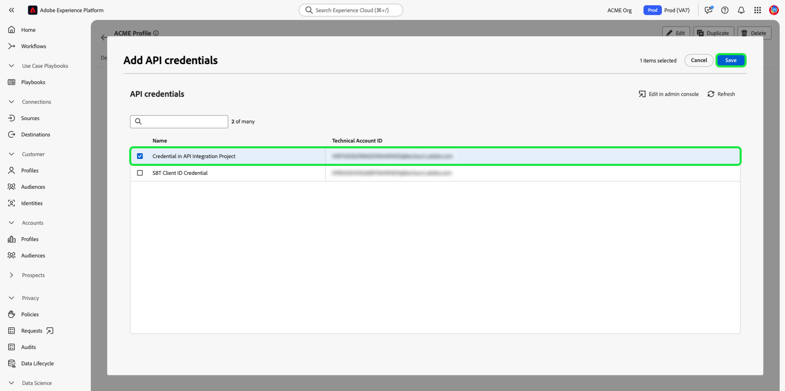

# Experience Platform API の認証とアクセス

このドキュメントでは、Experience Platform API を呼び出すために Adobe Experience Platform 開発者アカウントにアクセスするための順を追ったチュートリアルを提供します。このチュートリアルの最後に、すべての Platform API 呼び出しでヘッダーとして必要な次の資格情報を生成または収集します。

* `{ACCESS_TOKEN}`
* `{API_KEY}`
* `{ORG_ID}`

>[!TIP]
>
>上記の 3 つの資格情報に加えて、多くの Platform API では有効な `{SANDBOX_NAME}` ヘッダーとして提供される。 詳しくは、 [サンドボックスの概要](../sandboxes/home.md) サンドボックスおよび [サンドボックス管理エンドポイント](/help/sandboxes/api/sandboxes.md#list) ドキュメントを参照してください。

Experience Platformおよびユーザーのセキュリティを維持するには、アプリケーション API へのすべてのリクエストが、OAuth などの標準を使用して認証され、承認される必要があります。

このチュートリアルでは、次のフローチャートに概要が示されているように、Platform API 呼び出しを認証するために必要な資格情報を収集する方法について説明します。 必要な資格情報のほとんどは、初期の 1 回限りの設定で収集できます。 ただし、アクセストークンは、24 時間ごとに更新する必要があります。


## 前提条件 {#prerequisites}

Experience PlatformAPI を正しく呼び出すには、次が必要です。

* Adobe Experience Platformへのアクセス権を持つ組織。
* Admin Consoleプロファイルの開発者およびユーザーとして追加できる製品管理者。

また、このチュートリアルを完了するには、Adobe IDが必要です。 Adobe ID をお持ちでない場合は、次の手順で作成できます。

1. に移動します。 [Adobe Developer Console](https://console.adobe.io).
2. 選択 **[!UICONTROL 新しいアカウントを作成]**.
3. サインアッププロセスを完了します。

## Experience Platform用の開発者とユーザーアクセスの獲得 {#gain-developer-user-access}

Adobe Developer Console で統合を作成する前に、Adobe Admin ConsoleのExperience Platform製品プロファイルに対する開発者権限とユーザー権限を持つアカウントが必要です。

### 開発者アクセスの獲得 {#gain-developer-access}

連絡先： [!DNL Admin Console] 組織の管理者に問い合わせて、 [[!DNL Admin Console]](https://adminconsole.adobe.com/). 詳しくは、 [!DNL Admin Console] 方法に関する具体的な手順に関するドキュメント [製品プロファイルの開発者アクセスの管理](https://helpx.adobe.com/jp/enterprise/admin-guide.html/enterprise/using/manage-developers.ug.html).

開発者として割り当てられたら、で統合の作成を開始できます。 [Adobe Developer Console](https://www.adobe.com/go/devs_console_ui). これらの統合は、外部のアプリやサービスからAdobeAPI へのパイプラインです。

### ユーザーアクセスの取得 {#gain-user-access}

お使いの [!DNL Admin Console] また、管理者はユーザーを同じ製品プロファイルに追加する必要があります。 詳しくは、 [ユーザーグループの管理 [!DNL Admin Console]](https://helpx.adobe.com/enterprise/admin-guide.html/enterprise/using/user-groups.ug.html) を参照してください。

## API キー（クライアント ID）と組織 ID の生成 {#generate-credentials}

>[!NOTE]
>
>このドキュメントを [Privacy ServiceAPI ガイド](../privacy-service/api/getting-started.md)に戻り、固有のアクセス資格情報を生成できるようになりました。 [!DNL Privacy Service].

を通じて Platform への開発者およびユーザーアクセス権を付与されたら、 [!DNL Admin Console]次の手順は、 `{ORG_ID}` および `{API_KEY}` Adobe Developer Console の資格情報 これらの資格情報は 1 回だけ生成する必要があり、今後の Platform API 呼び出しで再利用できます。

### プロジェクトにExperience Platformを追加する {#add-platform-to-project}

[Adobe Developer Console](https://www.adobe.com/go/devs_console_ui) に移動し 、Adobe ID を使用してログインします。次に、Adobe Developer Console のドキュメントの[空のプロジェクトの作成](https://developer.adobe.com/developer-console/docs/guides/projects/projects-empty/)チュートリアルで概説されている手順に従います。

新しいプロジェクトを作成したら、「 **[!UICONTROL API を追加]** の **[!UICONTROL プロジェクトの概要]** 画面


**[!UICONTROL API の追加]**&#x200B;画面が表示されます。 Adobe Experience Platformの製品アイコンを選択し、「 **[!UICONTROL Experience PlatformAPI]** 選択する前に **[!UICONTROL 次へ]**.


>[!TIP]
>
>を選択します。 **[!UICONTROL ドキュメントを表示]** 別のブラウザーウィンドウで [Experience PlatformAPI リファレンスドキュメント](https://developer.adobe.com/experience-platform-apis/).

### OAuth サーバー間認証タイプを選択します。 {#select-oauth-server-to-server}

次に、アクセストークンを生成する認証タイプを選択し、Experience PlatformAPI にアクセスします。

>[!IMPORTANT]
>
>を選択します。 **[!UICONTROL OAuth サーバー間]** メソッドを使用する方法は、今後もサポートされる唯一の方法となります。 この **[!UICONTROL サービスアカウント (JWT)]** メソッドは非推奨です。 JWT 認証方式を使用した統合は 2025 年 1 月 1 日まで引き続き機能しますが、Adobeでは、その日以前に既存の統合を新しい OAuth サーバー間方式に移行することを強くお勧めします。 詳しくは、の節を参照してください。 [!BADGE 非推奨]{type=negative}[JSON Web トークン (JWT) の生成](#jwt).


### 統合する製品プロファイルを選択します。 {#select-product-profiles}

次に、統合に適用する製品プロファイルを選択します。
統合のサービスアカウントは、ここで選択した製品プロファイルを通じて詳細な機能にアクセスできます。

Platform の特定の機能にアクセスするには、システム管理者が必要な属性ベースのアクセス制御権限をユーザーに付与する必要があります。 詳しくは、の節を参照してください。 [必要な属性ベースのアクセス制御権限の取得](#get-abac-permissions).

>[!TIP]
>
ここで特定の製品プロファイルを表示する予定がある場合は、システム管理者にお問い合わせください。 システム管理者は、Permissions ビューで API 資格情報を表示および管理できます。 詳しくは、 [製品プロファイルへの開発者の追加](#add-developers-to-product-profile).


選択 **[!UICONTROL 設定済み API を保存]** 準備が整ったら

Experience PlatformAPI との統合を設定するための上記の手順に関するチュートリアルは、次のビデオチュートリアルでも参照できます。

>[!VIDEO](https://video.tv.adobe.com/v/28832/?learn=on)

###  資格情報の収集 {#gather-credentials}

API がプロジェクトに追加されると、 **[!UICONTROL Experience PlatformAPI]** プロジェクトのページには、Experience PlatformAPI へのすべての呼び出しで必要な次の資格情報が表示されます。


* `{API_KEY}` ([!UICONTROL クライアント ID])
* `{ORG_ID}` ([!UICONTROL 組織 ID])

<!--


<!--

In addition to the above credentials, you also need the generated **[!UICONTROL Client Secret]** for a future step. Select **[!UICONTROL Retrieve client secret]** to reveal the value, and then copy it for later use.


-->

## アクセストークンの生成 {#generate-access-token}

次の手順では、 `{ACCESS_TOKEN}` Platform API 呼び出しで使用する資格情報。 の値とは異なる `{API_KEY}` および `{ORG_ID}`に設定する場合、Platform API を使用し続けるには、24 時間ごとに新しいトークンを生成する必要があります。 選択 **[!UICONTROL アクセストークンを生成]**、以下に示すように。


>[!TIP]
>
また、Postman環境とコレクションを使用してアクセストークンを生成することもできます。 詳しくは、 [Postmanを使用した API 呼び出しの認証とテスト](#use-postman).

## [!BADGE 非推奨]{type=negative} JSON Web トークン (JWT) を生成 {#jwt}

>[!WARNING]
>
アクセストークンを生成する JWT メソッドは非推奨（廃止予定）となりました。 すべての新しい統合は、 [OAuth サーバー間認証方法](#select-oauth-server-to-server). Adobeでは、既存の統合を OAuth メソッドに移行することもお勧めします。 次の重要なドキュメントをお読みください。
> 
* [JWT から OAuth へのアプリケーションの移行ガイド](https://developer.adobe.com/developer-console/docs/guides/authentication/ServerToServerAuthentication/migration/)
* [OAuth を使用した新旧のアプリケーションの実装ガイド](https://developer.adobe.com/developer-console/docs/guides/authentication/ServerToServerAuthentication/implementation/)
* [OAuth サーバー間資格情報メソッドを使用する利点](https://developer.adobe.com/developer-console/docs/guides/authentication/ServerToServerAuthentication/migration/#why-oauth-server-to-server-credentials)

+++ 廃止された情報の表示

次の手順では、アカウントの資格情報に基づいて JSON Web トークン (JWT) を生成します。 この値は、 `{ACCESS_TOKEN}` Platform API 呼び出しで使用する資格情報。24 時間ごとに再生成する必要があります。

>[!IMPORTANT]
>
このチュートリアルの目的上、以下の手順では、開発者コンソール内で JWT を生成する方法の概要を説明します。 ただし、この生成方法は、テストおよび評価の目的でのみ使用する必要があります。
>
通常の使用では、JWT を自動的に生成する必要があります。 プログラムによる JWT の生成方法について詳しくは、 [サービスアカウント認証ガイド](https://www.adobe.io/developer-console/docs/guides/authentication/JWT/) Adobe Developer

選択 **[!UICONTROL サービスアカウント (JWT)]** 左側のナビゲーションで、「 **[!UICONTROL JWT を生成]**.


の下に表示されるテキストボックス内 **[!UICONTROL カスタム JWT を生成]**、Platform API をサービスアカウントに追加する際に以前生成した秘密鍵の内容を貼り付けます。 次に、 **[!UICONTROL トークンを生成]**.


ページが更新され、生成された JWT が表示されます。また、アクセストークンを生成できるサンプルの cURL コマンドも表示されます。 このチュートリアルの目的で、 **[!UICONTROL コピー]** 次の **[!UICONTROL 生成された JWT]** をクリックして、トークンをクリップボードにコピーします。


**アクセストークンの生成**

JWT を生成したら、API 呼び出しで使用して、 `{ACCESS_TOKEN}`. の値とは異なる `{API_KEY}` および `{ORG_ID}`に設定する場合、Platform API を使用し続けるには、24 時間ごとに新しいトークンを生成する必要があります。

**リクエスト**

次のリクエストでは、新しい `{ACCESS_TOKEN}` ペイロードで指定された資格情報に基づきます。 このエンドポイントは、フォームデータをペイロードとしてのみ受け入れるので、 `Content-Type` ヘッダー `multipart/form-data`.

```shell
curl -X POST https://ims-na1.adobelogin.com/ims/exchange/jwt \
  -H 'Content-Type: multipart/form-data' \
  -F 'client_id={API_KEY}' \
  -F 'client_secret={SECRET}' \
  -F 'jwt_token={JWT}'
```

| プロパティ | 説明 |
| --- | --- |
| `{API_KEY}` | この `{API_KEY}` ([!UICONTROL クライアント ID]) [前の手順](#api-ims-secret). |
| `{SECRET}` | で取得したクライアント秘密鍵 [前の手順](#api-ims-secret). |
| `{JWT}` | で生成した JWT [前の手順](#jwt). |

>[!NOTE]
>
同じ API キー、クライアントの秘密鍵、JWT を使用して、各セッションに対して新しいアクセストークンを生成できます。 これにより、アプリケーションでのアクセストークンの生成を自動化できます。

**応答**

```json
{
  "token_type": "bearer",
  "access_token": "{ACCESS_TOKEN}",
  "expires_in": 86399992
}
```

| プロパティ | 説明 |
| --- | --- |
| `token_type` | 返されるトークンのタイプ。 アクセストークンの場合、この値は常に `bearer`. |
| `access_token` | 生成された `{ACCESS_TOKEN}`. この値の先頭には、「 `Bearer`は、 `Authentication` すべての Platform API 呼び出し用のヘッダー。 |
| `expires_in` | アクセストークンの有効期限が切れるまでの残り時間（ミリ秒）。 この値が 0 に達したら、Platform API を使用し続けるには、新しいアクセストークンを生成する必要があります。 |

+++

## アクセス資格情報のテスト {#test-credentials}

3 つの必須資格情報（アクセストークン、API キー、組織 ID）をすべて収集したら、次の API 呼び出しをおこないます。 この呼び出しでは、すべての標準 [!DNL Experience Data Model] (XDM) 組織で使用可能なクラス。 で呼び出しを読み込んで実行します。 [Postman](#use-postman).

>[!BEGINSHADEBOX]

**リクエスト**

```SHELL
curl -X GET https://platform.adobe.io/data/foundation/schemaregistry/global/classes \
  -H 'Accept: application/vnd.adobe.xed-id+json' \
  -H 'Authorization: Bearer {{ACCESS_TOKEN}}' \
  -H 'x-api-key: {{API_KEY}}' \
  -H 'x-gw-ims-org-id: {{ORG_ID}}'
```

**応答**

応答が次に示すような場合は、資格情報が有効で機能しています。 （スペース節約のために応答は部分的に表示されています。）

```JSON
{
  "results": [
    {
        "title": "XDM ExperienceEvent",
        "$id": "https://ns.adobe.com/xdm/context/experienceevent",
        "meta:altId": "_xdm.context.experienceevent",
        "version": "1"
    },
    {
        "title": "XDM Individual Profile",
        "$id": "https://ns.adobe.com/xdm/context/profile",
        "meta:altId": "_xdm.context.profile",
        "version": "1"
    }
  ]
}
```

>[!ENDSHADEBOX]

>[!IMPORTANT]
>
上記の呼び出しは、アクセス資格情報をテストするのに十分ですが、適切な属性ベースのアクセス制御権限を持たないと、複数のリソースにアクセスしたり変更したりできないことに注意してください。 詳しくは、 [必要な属性ベースのアクセス制御権限の取得](#get-abac-permissions) 」セクションに入力します。

## 必要な属性ベースのアクセス制御権限の取得 {#get-abac-permissions}

Experience Platform内の複数のリソースにアクセスしたり変更したりするには、適切なアクセス制御権限が必要です。 システム管理者から [必要な権限](/help/access-control/ui/permissions.md). 詳しくは、 [ロールの API 資格情報の管理](/help/access-control/abac/ui/permissions.md#manage-api-credentials-for-role).

システム管理者が API を使用して Platform リソースにアクセスするために必要な権限を付与する方法に関する詳細は、次のビデオチュートリアルでも参照できます。

>[!VIDEO](https://video.tv.adobe.com/v/28832/?learn=on&t=159)

## Postmanを使用した API 呼び出しの認証とテスト {#use-postman}

[Postman](https://www.postman.com/) は、開発者が RESTful API を調べてテストできる一般的なツールです。 Experience PlatformPostmanのコレクションおよび環境を使用して、Experience PlatformAPI の操作をスピードアップできます。 詳細を表示 [PostmanのExperience Platform](/help/landing/postman.md) コレクションと環境の概要を参照してください。

PostmanをExperience Platformコレクションおよび環境と共に使用する方法について詳しくは、以下のビデオチュートリアルでも参照できます。

**Experience PlatformAPI で使用するPostman環境をダウンロードしてインポートします**

>[!VIDEO](https://video.tv.adobe.com/v/28832/?learn=on&t=106)

**Postmanコレクションを使用したアクセストークンの生成**

をダウンロードします。 [Identity Management Service Postmanコレクション](https://github.com/adobe/experience-platform-postman-samples/tree/master/apis/ims) アクセストークンの生成方法については、以下のビデオをご覧ください。

>[!VIDEO](https://video.tv.adobe.com/v/29698/?learn=on)

**Experience PlatformAPI Postmanコレクションのダウンロードと API の操作**

>[!VIDEO](https://video.tv.adobe.com/v/29704/?learn=on)

<!--
This [Medium post](https://medium.com/adobetech/using-postman-for-jwt-authentication-on-adobe-i-o-7573428ffe7f) describes how you can set up Postman to automatically perform JWT authentication and use it to consume Platform APIs.
-->

## システム管理者：開発者権限と API アクセス制御をExperience Platform権限で付与 {#grant-developer-and-api-access-control}

>[!NOTE]
>
権限で API 資格情報を表示および管理できるのは、システム管理者のみです。

Adobe Developer Console で統合を作成する前に、Adobe Admin ConsoleのExperience Platform製品プロファイルに対する開発者権限とユーザー権限を持つアカウントが必要です。

### 製品プロファイルへの開発者の追加 {#add-developers-to-product-profile}

[[!DNL Admin Console]](https://adminconsole.adobe.com/) に移動し、Adobe ID でログインします。

選択 **[!UICONTROL 製品]**&#x200B;を選択し、「 **[!UICONTROL Adobe Experience Platform]** を製品のリストから削除します。


次の **[!UICONTROL 製品プロファイル]** タブ、選択 **[!UICONTROL AEP-Default-All-Users]**. または、検索バーを使用して名前を入力し、製品プロファイルを検索します。


を選択します。 **[!UICONTROL 開発者]** 「 」タブで、「 **[!UICONTROL 開発者を追加]**.


開発者の **[!UICONTROL 電子メールまたはユーザー名]**. 有効な [!UICONTROL 電子メールまたはユーザー名] 開発者の詳細が表示されます。 「**[!UICONTROL 保存]**」を選択します。


開発者が正常に追加され、 [!UICONTROL 開発者] タブをクリックします。


### API の設定

開発者は、Adobe Developer Console で、プロジェクト内に API を追加して設定できます。

プロジェクトを選択し、「 」を選択します。 **[!UICONTROL API を追加]**.


内 **[!UICONTROL API を追加]** ダイアログボックスの選択 **[!UICONTROL Adobe Experience Platform]**&#x200B;を選択し、「 **[!UICONTROL Experience PlatformAPI]**.


内 **[!UICONTROL API の設定]** 画面、選択 **[!UICONTROL AEP-Default-All-Users]**.

### API をロールに割り当て

システム管理者は、システム UI で API をロールに割り当てることができますExperience Platform。

選択 **[!UICONTROL 権限]** と、API を追加するロールを定義します。 を選択します。 **[!UICONTROL API 資格情報]** 「 」タブで、「 **[!UICONTROL API 資格情報の追加]**.


ロールに追加する API を選択し、「 」を選択します。 **[!UICONTROL 保存]**.



次の場所に戻ります： [!UICONTROL API 資格情報] タブに追加します。新しく追加された API が表示されます。


## その他のリソース {#additional-resources}

Experience PlatformAPI の使用の手引きについては、以下にリンクされている追加のリソースを参照してください

* [Experience PlatformAPI の認証とアクセス](https://experienceleague.adobe.com/docs/platform-learn/tutorials/platform-api-authentication.html?lang=ja) ビデオチュートリアルページ
* [Identity Management Service Postman Collection](https://github.com/adobe/experience-platform-postman-samples/tree/master/apis/ims) アクセストークンの生成
* [Experience PlatformAPI Postmanコレクション](https://github.com/adobe/experience-platform-postman-samples/tree/master/apis/experience-platform)

## 次の手順 {#next-steps}

このドキュメントでは、Platform API のアクセス資格情報を収集し、正常にテストしました。 これで、 [ドキュメント](../landing/documentation/overview.md).

このチュートリアルで収集した認証値に加えて、多くの Platform API では有効な `{SANDBOX_NAME}` ヘッダーとして提供される。 詳しくは、[サンドボックスの概要](../sandboxes/home.md)を参照してください。