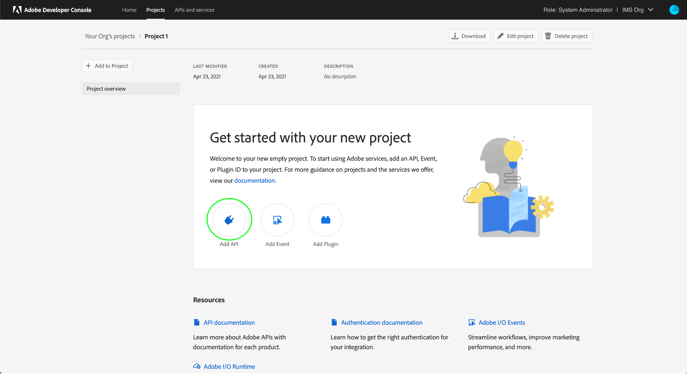

# Experience Platform API の認証とアクセス

このドキュメントでは、Experience PlatformAPI を呼び出すためにAdobe Experience Platform開発者アカウントにアクセスする、順を追ったチュートリアルを提供します。 このチュートリアルの最後では、すべての Platform API 呼び出しのヘッダーとして必要な、次の資格情報を生成または収集します。

* `{ACCESS_TOKEN}`
* `{API_KEY}`
* `{ORG_ID}`

>[!TIP]
>
>上記の 3 つの資格情報に加えて、多くの Platform API には有効なも必要です `{SANDBOX_NAME}` をヘッダーとして指定する必要があります。 を参照してください。 [サンドボックスの概要](../sandboxes/home.md) サンドボックスとについての詳細情報 [サンドボックス管理エンドポイント](/help/sandboxes/api/sandboxes.md#list) 組織で使用可能なサンドボックスのリストに関する情報のドキュメント。

アプリケーションとユーザーのセキュリティを維持するには、Experience PlatformAPI へのすべてのリクエストが、OAuth などの標準を使用して認証および承認される必要があります。

このチュートリアルでは、以下のフローチャートに示すように、Platform API 呼び出しの認証に必要な資格情報の収集方法を説明します。 必要な資格情報のほとんどは、1 回限りの初期設定で収集できます。 ただし、アクセストークンは 24 時間ごとに更新する必要があります。


## 前提条件 {#prerequisites}

Experience PlatformAPI を正常に呼び出すには、次の条件を満たす必要があります。

* Adobe Experience Platformへのアクセス権を持つ組織。
* Admin Consoleおよび製品プロファイルのユーザーとして追加できる開発管理者。
* Experience Platformシステム管理者。API を使用してExperience Platformの様々な部分で読み取りまたは書き込み操作を実行するために必要な、属性ベースのアクセス制御をユーザーに付与できます。

このチュートリアルを完了するには、Adobe IDも必要です。 Adobe ID をお持ちでない場合は、次の手順で作成できます。

1. に移動 [Adobe Developer コンソール](https://console.adobe.io).
2. を選択 **[!UICONTROL 新しいアカウントを作成]**.
3. 新規登録プロセスを完了します。

## Experience Platformのための開発者およびユーザーのアクセス権の取得 {#gain-developer-user-access}

Adobe Developer コンソールで統合を作成する前に、Adobe Admin ConsoleでExperience Platform製品プロファイルの開発者権限とユーザー権限がアカウントにある必要があります。

### 開発者アクセス権の取得 {#gain-developer-access}

に連絡 [!DNL Admin Console] を使用してExperience Platform製品プロファイルに開発者として追加する組織内の管理者 [[!DNL Admin Console]](https://adminconsole.adobe.com/). を参照してください。 [!DNL Admin Console] 方法の具体的な手順に関するドキュメント [製品プロファイルの開発者アクセスの管理](https://helpx.adobe.com/jp/enterprise/admin-guide.html/enterprise/using/manage-developers.ug.html).

開発者として割り当てられたら、で統合の作成を開始できます [Adobe Developer コンソール](https://www.adobe.com/go/devs_console_ui). これらの統合は、外部のアプリやサービスからAdobeAPI へのパイプラインです。

### ユーザーアクセスの取得 {#gain-user-access}

あなたの [!DNL Admin Console] 管理者は、ユーザーとしても同じ製品プロファイルに追加できる必要があります。 ユーザーアクセスを使用すると、実行する API 操作の結果を UI で確認できます。

のガイドを参照してください [でのユーザーグループの管理 [!DNL Admin Console]](https://helpx.adobe.com/enterprise/admin-guide.html/enterprise/using/user-groups.ug.html) を参照してください。

## API キー（クライアント ID）と組織 ID の生成 {#generate-credentials}

>[!NOTE]
>
>から、このドキュメントをフォローしている場合 [Privacy ServiceAPI ガイド](../privacy-service/api/getting-started.md)ガイドに戻って、に固有のアクセス認証情報を生成できるようになりました [!DNL Privacy Service].

以下を通じて開発者およびユーザーに Platform へのアクセス権を付与した後 [!DNL Admin Console]次の手順では、を生成します。 `{ORG_ID}` および `{API_KEY}` Adobe Developer コンソールの資格情報。 これらの資格情報は 1 回だけ生成する必要があり、今後の Platform API 呼び出しで再利用できます。

### プロジェクトにExperience Platformを追加する {#add-platform-to-project}

[Adobe Developer Console](https://www.adobe.com/go/devs_console_ui) に移動し 、Adobe ID を使用してログインします。次に、Adobe Developer Console のドキュメントの[空のプロジェクトの作成](https://developer.adobe.com/developer-console/docs/guides/projects/projects-empty/)チュートリアルで概説されている手順に従います。

新しいプロジェクトを作成したら、次を選択します。 **[!UICONTROL API を追加]** 日 **[!UICONTROL プロジェクトの概要]** 画面。

>[!TIP]
>
>複数の組織用にプロビジョニングされている場合は、インターフェイスの右上隅にある組織セレクターを使用して、必要な組織に属していることを確認します。


**[!UICONTROL API の追加]**&#x200B;画面が表示されます。 Adobe Experience Platformの製品アイコンを選択してから、 **[!UICONTROL EXPERIENCE PLATFORMAPI]** 選択する前に **[!UICONTROL 次]**.


>[!TIP]
>
>「」を選択します **[!UICONTROL ドキュメントを表示]** 別のブラウザーウィンドウで移動して全体を表示するオプション [Experience PlatformAPI リファレンスドキュメント](https://developer.adobe.com/experience-platform-apis/).

### 「」を選択します [!UICONTROL OAuth サーバー間] 認証タイプ {#select-oauth-server-to-server}

次に、 [!UICONTROL OAuth サーバー間] アクセストークンを生成して認証 API にアクセスするためのExperience Platformタイプ。

>[!IMPORTANT]
>
>この **[!UICONTROL OAuth サーバー間]** 今後サポートされるトークン生成メソッドはメソッドのみです。 以前にサポートされていた **[!UICONTROL サービスアカウント（JWT）]** メソッドは非推奨のため、新しい統合用に選択できません。 JWT 認証方法を使用した既存の統合は 2025 年 1 月 1 日（PT）まで引き続き機能しますが、Adobeでは、既存の統合を新しい統合に移行することを強くお勧めします [!UICONTROL OAuth サーバー間] その日付より前のメソッド。 詳しくは、セクションを参照してください。 [!BADGE 非推奨]{type=negative}[JSON web トークン（JWT）を生成](#jwt).


### 統合用の製品プロファイルの選択 {#select-product-profiles}

が含まれる **[!UICONTROL API の設定]** 画面、選択 **[!UICONTROL AEP-Default-All-Users]**.

<!--
Your integration's service account will gain access to granular features through the product profiles selected here.

-->

>[!IMPORTANT]
>
Platform の特定の機能にアクセスするには、必要な属性ベースのアクセス制御権限を付与するシステム管理者も必要です。 詳しくは、この節を参照してください。 [必要な属性ベースのアクセス制御権限の取得](#get-abac-permissions).


を選択 **[!UICONTROL 設定済み API を保存]** 準備ができたら。

Experience PlatformAPI との統合を設定するための上記の手順は、次のビデオチュートリアルでも参照できます。

>[!VIDEO](https://video.tv.adobe.com/v/28832/?learn=on)

### 資格情報の収集 {#gather-credentials}

API をプロジェクトに追加すると、 **[!UICONTROL EXPERIENCE PLATFORMAPI]** プロジェクトのページには、Experience Platform API へのすべての呼び出しで必要な次の資格情報が表示されます。


* `{API_KEY}` （[!UICONTROL クライアント ID]）
* `{ORG_ID}` （[!UICONTROL 組織 ID]）

<!--


<!--

In addition to the above credentials, you also need the generated **[!UICONTROL Client Secret]** for a future step. Select **[!UICONTROL Retrieve client secret]** to reveal the value, and then copy it for later use.


-->

## アクセストークンの生成 {#generate-access-token}

次の手順では、を生成します。 `{ACCESS_TOKEN}` platform API 呼び出しで使用する資格情報。 の値とは異なります `{API_KEY}` および `{ORG_ID}`を参照します。Platform API を引き続き使用するには、24 時間ごとに新しいトークンを生成する必要があります。 を選択 **[!UICONTROL アクセストークンの生成]**&#x200B;を参照してください。


>[!TIP]
>
また、Postman環境とコレクションを使用してアクセストークンを生成することもできます。 詳しくは、次の節を参照してください [Postmanを使用した API 呼び出しの認証とテスト](#use-postman).

## [!BADGE 非推奨]{type=negative} JSON web トークン（JWT）を生成 {#jwt}

>[!WARNING]
>
アクセストークンを生成する JWT メソッドは非推奨（廃止予定）になりました。 すべての新しい統合は、 [OAuth サーバー間認証方法](#select-oauth-server-to-server). また、Adobeを引き続き機能させるには、2025 年 1 月 1 日（PT）までに既存の統合環境を OAuth 方式に移行する必要があります。 以下の重要なドキュメントをお読みください。
> 
* [JWT から OAuth へのアプリケーションの移行ガイド](https://developer.adobe.com/developer-console/docs/guides/authentication/ServerToServerAuthentication/migration/)
* [OAuth を使用した新規および古いアプリケーションの実装ガイド](https://developer.adobe.com/developer-console/docs/guides/authentication/ServerToServerAuthentication/implementation/)
* [OAuth サーバー間資格情報方式を使用する場合の利点](https://developer.adobe.com/developer-console/docs/guides/authentication/ServerToServerAuthentication/migration/#why-oauth-server-to-server-credentials)

+++ 非推奨（廃止予定）の情報の表示

次の手順では、アカウントの資格情報に基づいて JSON web トークン（JWT）を生成します。 この値は、 `{ACCESS_TOKEN}` platform API 呼び出しで使用する認証情報です。24 時間ごとに再生成する必要があります。

>[!IMPORTANT]
>
このチュートリアルのために、次の手順では Developer Console 内で JWT を生成する方法の概要を説明します。 ただし、この生成方法は、テストおよび評価の目的でのみ使用してください。
>
通常の使用では、JWT を自動的に生成する必要があります。 プログラムによる JWT の生成方法について詳しくは、 [サービスアカウント認証ガイド](https://www.adobe.io/developer-console/docs/guides/authentication/JWT/) Adobe Developerの

を選択 **[!UICONTROL サービスアカウント（JWT）]** 左側のナビゲーションで、を選択します。 **[!UICONTROL JWT を生成]**.


の下に提供されるテキストボックスで **[!UICONTROL カスタム JWT の生成]**&#x200B;で、Platform API を追加する際に以前に生成した秘密鍵の内容をサービスアカウントに貼り付けます。 次に、を選択します **[!UICONTROL トークンを生成]**.


ページが更新され、生成された JWT と、アクセストークンを生成できるサンプル cURL コマンドが表示されます。 このチュートリアルでは、を選択します。 **[!UICONTROL コピー]** 次の **[!UICONTROL 生成された JWT]** トークンをクリップボードにコピーします。


**アクセストークンの生成**

JWT を生成したら、API 呼び出しで使用して、 `{ACCESS_TOKEN}`. の値とは異なります `{API_KEY}` および `{ORG_ID}`を参照します。Platform API を引き続き使用するには、24 時間ごとに新しいトークンを生成する必要があります。

**リクエスト**

次のリクエストは、新しいを生成します `{ACCESS_TOKEN}` ペイロードで指定された資格情報に基づきます。 このエンドポイントは、フォームデータのみをペイロードとして受け入れるので、以下を指定する必要があります `Content-Type` ヘッダー `multipart/form-data`.

```shell
curl -X POST https://ims-na1.adobelogin.com/ims/exchange/jwt \
  -H 'Content-Type: multipart/form-data' \
  -F 'client_id={API_KEY}' \
  -F 'client_secret={SECRET}' \
  -F 'jwt_token={JWT}'
```

| プロパティ | 説明 |
| --- | --- |
| `{API_KEY}` | この `{API_KEY}` （[!UICONTROL クライアント ID]）を取得しました [前の手順](#api-ims-secret). |
| `{SECRET}` | で取得したクライアント秘密鍵 [前の手順](#api-ims-secret). |
| `{JWT}` | で生成した JWT [前の手順](#jwt). |

>[!NOTE]
>
同じ API キー、クライアントの秘密鍵、JWT を使用して、セッションごとに新しいアクセストークンを生成できます。 これにより、アプリケーションでのアクセストークンの生成を自動化できます。

**応答**

```json
{
  "token_type": "bearer",
  "access_token": "{ACCESS_TOKEN}",
  "expires_in": 86399992
}
```

| プロパティ | 説明 |
| --- | --- |
| `token_type` | タイプ of 返されるトークン。 アクセストークンの場合、この値は常に `bearer`. |
| `access_token` | 生成された `{ACCESS_TOKEN}`. この値（先頭にという単語が付きます） `Bearer`は、として必須です `Authentication` すべての Platform API 呼び出しのヘッダー。 |
| `expires_in` | アクセストークンの有効期限が切れるまでの残り時間（ミリ秒）。 この値が 0 に達したら、Platform API の使用を続行するために、新しいアクセストークンを生成する必要があります。 |

+++

## アクセス資格情報のテスト {#test-credentials}

アクセストークン、API キー、組織 ID の 3 つの必要な資格情報をすべて収集したら、次の API 呼び出しを行うことができます。 この呼び出しでは、すべての標準が一覧表示されます [!DNL Experience Data Model] 組織で使用できる（XDM）クラス。 での呼び出しの読み込みと実行 [Postman](#use-postman).

>[!BEGINSHADEBOX]

**リクエスト**

```SHELL
curl -X GET https://platform.adobe.io/data/foundation/schemaregistry/global/classes \
  -H 'Accept: application/vnd.adobe.xed-id+json' \
  -H 'Authorization: Bearer {{ACCESS_TOKEN}}' \
  -H 'x-api-key: {{API_KEY}}' \
  -H 'x-gw-ims-org-id: {{ORG_ID}}'
```

**応答**

応答が以下に示すものに類似している場合、資格情報は有効であり、機能します。 （スペース節約のために応答は部分的に表示されています。）

```JSON
{
  "results": [
    {
        "title": "XDM ExperienceEvent",
        "$id": "https://ns.adobe.com/xdm/context/experienceevent",
        "meta:altId": "_xdm.context.experienceevent",
        "version": "1"
    },
    {
        "title": "XDM Individual Profile",
        "$id": "https://ns.adobe.com/xdm/context/profile",
        "meta:altId": "_xdm.context.profile",
        "version": "1"
    }
  ]
}
```

>[!ENDSHADEBOX]

>[!IMPORTANT]
>
上記の呼び出しはアクセス資格情報をテストするには十分ですが、属性ベースの適切なアクセス制御権限がないと、複数のリソースにアクセスして変更することができません。 詳しくは、を参照してください。 **必要な属性ベースのアクセス制御権限の取得** セクションを下にします。

## 必要な属性ベースのアクセス制御権限の取得 {#get-abac-permissions}

Experience Platform内の複数のリソースにアクセスしたり、変更したりするには、適切なアクセス制御権限が必要です。 システム管理者から付与される権限 [必要な権限](/help/access-control/ui/permissions.md). 詳しくは、次の節を参照してください [役割の API 資格情報の管理](/help/access-control/abac/ui/permissions.md#manage-api-credentials-for-role).

システム管理者が API を使用して Platform リソースへのアクセスに必要な権限を付与する方法について詳しくは、以下のビデオチュートリアルも参照してください。

>[!VIDEO](https://video.tv.adobe.com/v/28832/?learn=on&t=159)

## Postmanを使用した API 呼び出しの認証とテスト {#use-postman}

[Postman](https://www.postman.com/) は、開発者が RESTful API を調査およびテストできる一般的なツールです。 Experience PlatformのPostman コレクションおよび環境を使用して、Experience PlatformAPI の作業を高速化できます。 詳細を読む： [Experience PlatformでのPostmanの使用](/help/landing/postman.md) コレクションと環境の基本を学ぶ

Experience Platformコレクションおよび環境でのPostmanの使用について詳しくは、以下のビデオチュートリアルも参照してください。

**Experience PlatformAPI で使用するPostman環境をダウンロードして読み込む**

>[!VIDEO](https://video.tv.adobe.com/v/28832/?learn=on&t=106)

**Postman コレクションを使用してアクセストークンを生成します**

をダウンロード [Identity Management サービス Postman コレクション](https://github.com/adobe/experience-platform-postman-samples/tree/master/apis/ims) アクセストークンの生成方法については、以下のビデオをご覧ください。

>[!VIDEO](https://video.tv.adobe.com/v/29698/?learn=on)

**Experience PlatformAPI Postman コレクションをダウンロードし、API とやり取りする**

>[!VIDEO](https://video.tv.adobe.com/v/29704/?learn=on)

<!--
This [Medium post](https://medium.com/adobetech/using-postman-for-jwt-authentication-on-adobe-i-o-7573428ffe7f) describes how you can set up Postman to automatically perform JWT authentication and use it to consume Platform APIs.
-->

## システム管理者：Experience Platform権限を使用して開発者と API のアクセス制御を付与します {#grant-developer-and-api-access-control}

>[!NOTE]
>
システム管理者のみが、権限の API 資格情報を表示および管理できます。

Adobe Developer コンソールで統合を作成する前に、Adobe Admin ConsoleでExperience Platform製品プロファイルの開発者権限とユーザー権限がアカウントにある必要があります。

### 製品プロファイルへの開発者の追加 {#add-developers-to-product-profile}

に移動 [[!DNL Admin Console]](https://adminconsole.adobe.com/) Adobe IDでログインします。

を選択 **[!UICONTROL 製品]**&#x200B;を選択してから、 **[!UICONTROL Adobe Experience Platform]** 製品のリストから。


から **[!UICONTROL 製品プロファイル]** タブ、選択 **[!UICONTROL AEP-Default-All-Users]**. または、検索バーを使用して名前を入力して製品プロファイルを検索します。


「」を選択します **[!UICONTROL 開発者]** tab キーを押してから、 **[!UICONTROL 開発者を追加]**.


開発者のを入力 **[!UICONTROL メールまたはユーザー名]**. 有効な [!UICONTROL メールまたはユーザー名] 開発者の詳細が表示されます。 「**[!UICONTROL 保存]**」を選択します。


開発者が正常に追加され、に表示されます [!UICONTROL 開発者] タブ。


<!--

Commenting out this part since it duplicates information from the section Add Experience Platform to a project

### Set up an API

A developer can add and configure an API within a project in the Adobe Developer Console.

Select your project, then select **[!UICONTROL Add API]**.



In the **[!UICONTROL Add an API]** dialog box select **[!UICONTROL Adobe Experience Platform]**, then select **[!UICONTROL Experience Platform API]**.


In the **[!UICONTROL Configure API]** screen, select **[!UICONTROL AEP-Default-All-Users]**.

-->

### API を役割に割り当てる

システム管理者は、Experience PlatformUI で API をロールに割り当てることができます。

を選択 **[!UICONTROL 権限]** および API を追加する役割。 「」を選択します **[!UICONTROL API 資格情報]** tab キーを押してから、 **[!UICONTROL API 資格情報の追加]**.


役割に追加する API を選択して、を選択します。 **[!UICONTROL 保存]**.


「」に戻ります [!UICONTROL API 資格情報] タブに新しく追加された API が表示されます。


## その他のリソース {#additional-resources}

Experience PlatformAPI の概要の詳細については、以下にリンクされているその他のリソースを参照してください

* [Experience PlatformAPI の認証とアクセス](https://experienceleague.adobe.com/docs/platform-learn/tutorials/platform-api-authentication.html?lang=ja) ビデオチュートリアルページ
* [Identity Management サービス Postman コレクション](https://github.com/adobe/experience-platform-postman-samples/tree/master/apis/ims) アクセストークンの生成用
* [Experience PlatformAPI Postman コレクション](https://github.com/adobe/experience-platform-postman-samples/tree/master/apis/experience-platform)

## 次の手順 {#next-steps}

このドキュメントでは、Platform API のアクセス資格情報を収集し、正常にテストしました。 全体で提供される API 呼び出しの例に従うことができるようになりました [詳細を見る](../landing/documentation/overview.md).

このチュートリアルで収集した認証値に加えて、多くの Platform API には有効なも必要です `{SANDBOX_NAME}` をヘッダーとして指定する必要があります。 詳しくは、[サンドボックスの概要](../sandboxes/home.md)を参照してください。