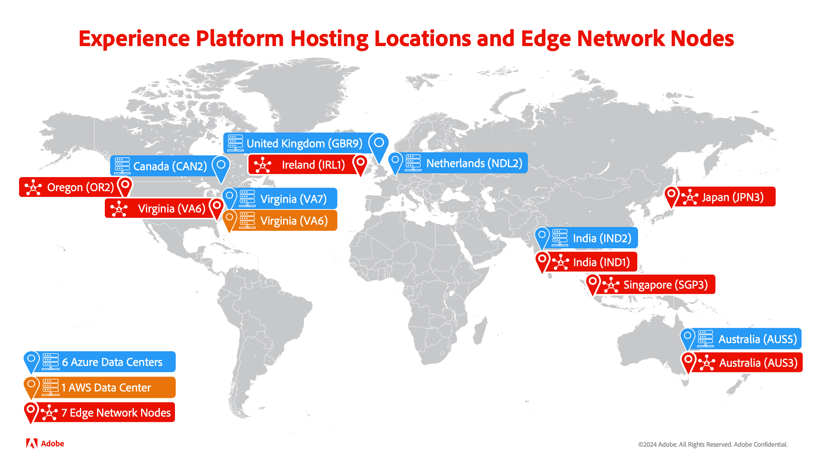

# Edge Networkとハブの比較

Adobe Experience Platform は、顧客体験を促進する完全なソリューションを構築し、管理するための、市場で最も強力で柔軟性の高いオープンシステムです。Experience Platformを使用すると、あらゆるシステムから顧客データおよびコンテンツを一元化および標準化して、データサイエンスと機械学習を適用し、パーソナライズされた豊富なエクスペリエンスのデザインおよび配信を大幅に強化できます。 その結果、Experience Platformではデータを処理する方法が複数用意されているので、可能な限り最適な方法でデータを評価できます。

## サーバータイプ

Experience Platformでは、データは、バッチワークフローとストリーミングワークフロー用のAdobe Experience Platform hub とリアルタイムエクスペリエンス用のEdge Networkの 2 つの異なるパスで処理できます。

### Adobe Experience Platform ハブ

Hub は、Adobe Experience Platformで収集されたすべての履歴データとリッチプロファイルコンテキストを含む、一元化されたメインデータセンターです。 これにより、より堅牢で完全なデータをダウンストリームサービスに送信して受け取ることができます。 その結果、データの **完全性** がより重要なシナリオでは hub を使用する必要があります。

ハブで使用可能なサービスは次のとおりです。

- バッチセグメント化
- ストリーミングセグメント化
- プロファイル
- 宛先
- ID グラフ
- Data Distiller - クエリサービス
- ソースコネクタ

### Experience PlatformEdge Network

Edge Networkは、物理的に異なる地理的な場所に近いサーバーです。 これらのデータセンターは、SDK Extensions およびEdge Network API を通じて収集されたすべてのデータを処理します。 Edge Networkに存在する唯一のデータは、パーソナライゼーションに必要なオーディエンスメンバーシップ、プロファイル ID および属性です。

Edge Networkを使用すると、エンドユーザーに近いため、顧客とのデータのやりとりをより迅速に行うことができます。 さらに、Edge Networkを使用して、イベント転送リクエストとタグ管理リクエストを処理できます。 ただし、Edge Networkが処理するのは **行動** データのみです。 その結果、Edge Networkは、データの **速度** がより重要なシナリオで使用する必要があります。

Edge Networkで使用可能なサービスは次のとおりです。

- エッジセグメント化
- Edge プロファイル
- Edgeの宛先
- データ収集
- SDK拡張機能

## 場所

次の節では、hub とEdge Networkの両方の場所を示します。

**ハブ**

- VA7 （バージニア州、米国）
- NLD2 （オランダ）
- AUS5 （オーストラリア）
- CAN2 （カナダ）
- GBR9 （英国）
- IND1 （インド）

**Edge Network**

- OR2 （オレゴン、米国）
- VA6 （バージニア州、米国）
- IRL1 （アイルランド）
- IND1 （インド）
- SGP3 （シンガポール）
- AUS3 （オーストラリア）
- JPN3 （日本）

使用可能なサーバーの場所について詳しくは、[&#x200B; マルチクラウドの概要 &#x200B;](./multi-cloud.md#available-cloud-regions) を参照してください。

## 次の手順

この概要では、Adobe Experience Platform hub とAdobe Experience Platform Edge Networkでのデータ処理の違いを理解しました。

## 付録

次の節では、Adobe Experience Platformでのデータ処理に関する補足情報を示します。

### よくある質問

次の節では、hub とEdge Networkに関するよくある質問を一覧表示します。

#### ハブに最も適したシナリオは何ですか？

Hub は、データの **完全性** がより重要なシナリオに最適です。 例えば、買い物かごを放棄したすべての顧客をターゲットにするマーケティングキャンペーンを作成するとします。 そのユースケースでは、バッチセグメント化を使用して、放棄された買い物かごユーザーに一致するオーディエンスを作成し、バッチ宛先に書き出すことができます。

#### Edge Networkに最も適したシナリオは何ですか？

Edge Networkは、データの **速度** がより重要なシナリオに最適です。 例えば、買い物かごに製品が入っている状態でサイトを閲覧している顧客をターゲットにするために、限定的なフラッシュセールを作成する必要があるとします。 そのユースケースでは、エッジのセグメント化を使用して、「フラッシュセール」を使用して、買い物かごに製品があるユーザーを直ちにターゲットに設定し、パーソナライズされた通知を送信できます。

#### ハブからEdge Networkには、どのようなデータが送られますか？

エッジでリアルタイムのエクスペリエンスを提供するために必要なデータのみが、hub からEdge Networkに読み込まれます。 このデータは、最終的に一貫性を保つためにハブからEdge Networkに自動的に送信され、最大 14 日間保持されます。 ただし、これは **データが hub のデータと完全に同期され続けることを** 意味しません。 その結果、hub とEdge Networkの間で利用可能なデータに違いが生じる場合があります。
