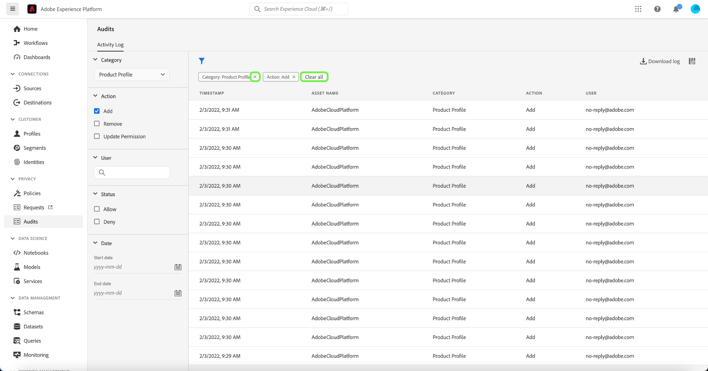

# 監査ログ（ベータ版） 

>[!IMPORTANT]
>
>Adobe Experience Platformの監査ログ機能は現在ベータ版です。 このドキュメントで説明する機能は変更される場合があります。

Adobe Experience Platformでは、システムで実行されるアクティビティの透明性と可視性を高めるために、様々なサービスや機能のユーザーアクティビティを「監査ログ」の形式で監査できます。 これらのログは、Platform 上の問題のトラブルシューティングに役立つ監査記録を形成し、企業のデータ管理ポリシーおよび規制要件に効果的に準拠するのに役立ちます。

基本的には、監査ログは、誰が **** 何 **アクションを実行したか、および** いつ **を実行したかを** に伝えます。 ログに記録される各アクションには、アクションの種類、日時、アクションを実行したユーザーの電子メール ID、アクションの種類に関連する追加の属性を示すメタデータが含まれます。

このドキュメントでは、UI や API での表示および管理方法など、Platform の監査ログについて説明します。

## 監査ログによってキャプチャされるイベントタイプ {#category}

次の表に、監査ログで記録されるリソースに対するアクションの概要を示します。

| リソース | アクション |
| --- | --- |
| [データセット](../../../catalog/datasets/overview.md) | <ul><li>選択からの    </li><li>更新</li><li>Delete</li><li>[ リアルタイム顧客プロファイル ](../../../profile/home.md) を有効にする</li></ul> |
| [スキーマ](../../../xdm/schema/composition.md) | <ul><li>選択からの    </li><li>更新</li><li>削除</li></ul> |
| [クラス](../../../xdm/schema/composition.md#class) | <ul><li>選択からの    </li><li>更新</li><li>削除</li></ul> |
| [フィールドグループ](../../../xdm/schema/composition.md#field-group) | <ul><li>選択からの    </li><li>更新</li><li>削除</li></ul> |
| [データタイプ](../../../xdm/schema/composition.md#data-type) | <ul><li>選択からの    </li><li>更新</li><li>削除</li></ul> |
| [サンドボックス](../../../sandboxes/home.md) | <ul><li>選択からの    </li><li>更新</li><li>リセット</li><li>削除</li></ul> |
| [宛先](../../../destinations/home.md) | <ul><li>アクティブ化</li></ul> |

## 監査ログへのアクセス

組織でこの機能を有効にすると、アクティビティの発生に応じて監査ログが自動的に収集されます。 手動でログ収集を有効にする必要はありません。

監査ログを表示および書き出すには、「監査ログの表示」アクセス制御権限が付与されている必要があります（「データガバナンス」カテゴリにあります）。 Platform 機能の個々の権限を管理する方法については、[ アクセス制御に関するドキュメント ](../../../access-control/home.md) を参照してください。

## UI での監査ログの管理

**[!UICONTROL 監査]** ワークスペース内の様々なExperience Platform機能の監査ログを Platform UI に表示できます。 ワークスペースには、記録されたログのリストがデフォルトで最新のログから最新のログに並べ替えて表示されます。

システムには、昨年の監査ログのみが表示されます。 この制限を超えるログは、自動的にシステムから削除されます。

リストからイベントを選択すると、右側のパネルに詳細が表示されます。

ファネルアイコン（）を選択して、結果を絞り込むのに役立つフィルターコントロールのリストを表示します。

UI の監査イベントには、次のフィルターを使用できます。

| Filter | 説明 |
| --- | --- |
| [!UICONTROL カテゴリ] | ドロップダウンメニューを使用して、表示される結果を [ カテゴリ ](#category) でフィルタリングします。 |
| [!UICONTROL アクション] | アクションでフィルター。 現在、フィルタリングできるのは [!UICONTROL  作成 ] および [!UICONTROL  削除 ] アクションのみです。 |
| [!UICONTROL アクセス制御ステータス] | [ アクセス制御 ](../../../access-control/home.md) 権限がないためにアクションが許可（完了）されたか拒否されたかをフィルターします。 |
| [!UICONTROL 日付] | 結果をフィルターする日付範囲を定義する開始日または終了日を選択します。 |

フィルターを削除するには、対象のフィルターのピルアイコンで「X」を選択するか、「**[!UICONTROL すべてクリア]**」を選択してすべてのフィルターを削除します。

<!-- (Planned for post-beta release)
### Export an audit log

Select **[!UICONTROL Download log]** to export an audit log.
-->

## API での監査ログの管理

UI で実行できるすべてのアクションは、API 呼び出しを使用して実行することもできます。 詳しくは、[API リファレンスドキュメント ](https://www.adobe.io/experience-platform-apis/references/audit-query/) を参照してください。

## Adobe Admin Consoleの監査ログの管理

Adobe Admin Consoleでアクティビティの監査ログを管理する方法については、次の [ ドキュメント ](https://helpx.adobe.com/enterprise/using/audit-logs.html) を参照してください。

## 次の手順

このガイドでは、監査ログをExperience Platformで管理する方法を説明します。 Platform アクティビティの監視方法の詳細については、[ 観察性インサイト ](../../../observability/home.md) および [ データ取得の監視 ](../../../ingestion/quality/monitor-data-ingestion.md) に関するドキュメントを参照してください。
