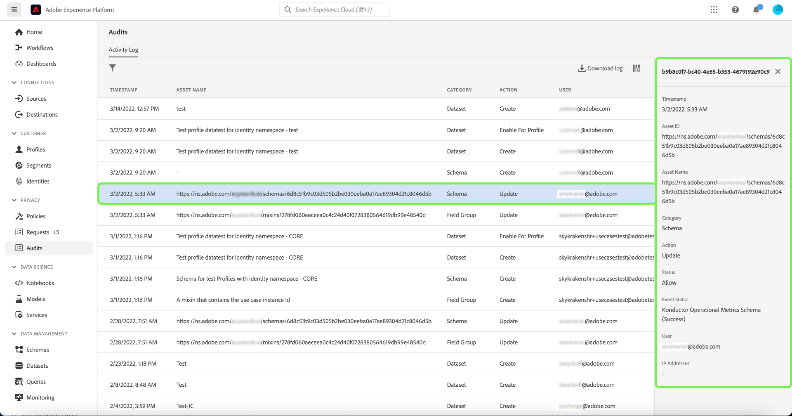

# 監査ログ（ベータ版） 

>[!IMPORTANT]
>
>Adobe Experience Platformの監査ログ機能は現在ベータ版で、お客様の組織がまだアクセスできない可能性があります。 このドキュメントで説明する機能は、変更される場合があります。

Adobe Experience Platformでは、システムで実行されるアクティビティの透明性と可視性を高めるために、様々なサービスや機能のユーザーアクティビティを「監査ログ」の形式で監査できます。 これらのログは、Platform 上の問題のトラブルシューティングに役立つ監査証跡を形成し、企業のデータ管理ポリシーおよび規制要件に効果的に準拠するのに役立ちます。

基本的な意味では、監査ログは、 **who** 実行済み **what** アクションおよび **when**. ログに記録される各アクションには、アクションのタイプ、日時、アクションを実行したユーザーの E メール ID、アクションのタイプに関連する追加の属性を示すメタデータが含まれます。

このドキュメントでは、UI や API での表示および管理方法など、Platform の監査ログについて説明します。

## 監査ログによってキャプチャされるイベントタイプ {#category}

次の表に、監査ログによって記録されるリソースに対するアクションの概要を示します。

| リソース | アクション |
| --- | --- |
| [データセット](../../../catalog/datasets/overview.md) | <ul><li>選択からの    </li><li>更新</li><li>Delete</li><li>有効にする対象 [リアルタイム顧客プロファイル](../../../profile/home.md)</li></ul> |
| [スキーマ](../../../xdm/schema/composition.md) | <ul><li>選択からの    </li><li>更新</li><li>削除</li></ul> |
| [クラス](../../../xdm/schema/composition.md#class) | <ul><li>選択からの    </li><li>更新</li><li>削除</li></ul> |
| [フィールドグループ](../../../xdm/schema/composition.md#field-group) | <ul><li>選択からの    </li><li>更新</li><li>削除</li></ul> |
| [データタイプ](../../../xdm/schema/composition.md#data-type) | <ul><li>選択からの    </li><li>更新</li><li>削除</li></ul> |
| [サンドボックス](../../../sandboxes/home.md) | <ul><li>選択からの    </li><li>更新</li><li>リセット</li><li>削除</li></ul> |
| [宛先](../../../destinations/home.md) | <ul><li>アクティブ化</li></ul> |

## 監査ログへのアクセス

組織でこの機能を有効にすると、アクティビティの発生に応じて監査ログが自動的に収集されます。 手動でログの収集を有効にする必要はありません。

監査ログを表示および書き出すには、 **[!UICONTROL ユーザーアクティビティログを表示]** アクセス制御権限が付与されている ( [!UICONTROL データガバナンス] カテゴリ ) です。 Platform 機能の個々の権限を管理する方法については、 [アクセス制御ドキュメント](../../../access-control/home.md).

## UI での監査ログの管理

監査ログは、 **[!UICONTROL 監査]** ワークスペース（Platform UI 内） ワークスペースには、デフォルトで、記録されたログのリストが最新のログから最新のログへと並べ替えて表示されます。

システムは、昨年の監査ログのみを表示します。 この制限を超えるログは自動的にシステムから削除されます。

リストからイベントを選択すると、その詳細が右側のパネルに表示されます。

### 監査ログのフィルタリング

ファネルアイコン () をクリックして、結果を絞り込むのに役立つフィルターコントロールのリストを表示します。

UI の監査イベントには、次のフィルターを使用できます。

| Filter | 説明 |
| --- | --- |
| [!UICONTROL カテゴリ] | ドロップダウンメニューを使用して、表示される結果を次の項目でフィルタリングします。 [カテゴリ](#category). |
| [!UICONTROL アクション] | アクションでフィルターします。 現在のみ [!UICONTROL 作成] および [!UICONTROL 削除] アクションはフィルタリングできます。 |
| [!UICONTROL アクセス制御ステータス] | アクションが許可（完了）されたか、または不足により拒否されたかによってフィルターします [アクセス制御](../../../access-control/home.md) 権限。 |
| [!UICONTROL 日付] | 結果をフィルターする日付範囲を定義する開始日または終了日を選択します。 |

フィルターを削除するには、該当するフィルターのピルアイコンの「X」を選択するか、「 **[!UICONTROL すべてクリア]** をクリックして、すべてのフィルターを削除します。

### 監査ログの書き出し

監査ログの現在のリストを書き出すには、 **[!UICONTROL ログをダウンロード]**.

表示されるダイアログで、目的の形式 ( **[!UICONTROL CSV]** または **[!UICONTROL JSON]**) を選択し、「 **[!UICONTROL ダウンロード]**. ブラウザーは、生成されたファイルをダウンロードし、コンピューターに保存します。

## API での監査ログの管理

UI で実行できるすべてのアクションは、API 呼び出しを使用して実行することもできます。 詳しくは、 [API リファレンスドキュメント](https://www.adobe.io/experience-platform-apis/references/audit-query/) を参照してください。

## Adobe Admin Consoleの監査ログの管理

Adobe Admin Consoleでアクティビティの監査ログを管理する方法については、次を参照してください。 [文書](https://helpx.adobe.com/enterprise/using/audit-logs.html).

## 次の手順

このガイドでは、監査ログをExperience Platformで管理する方法を説明します。 Platform アクティビティの監視方法について詳しくは、 [Observability Insights](../../../observability/home.md) および [データ取得の監視](../../../ingestion/quality/monitor-data-ingestion.md).
