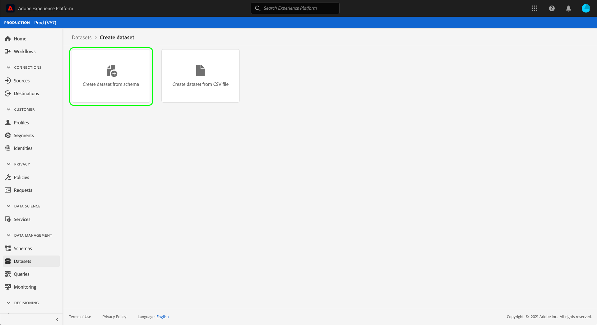
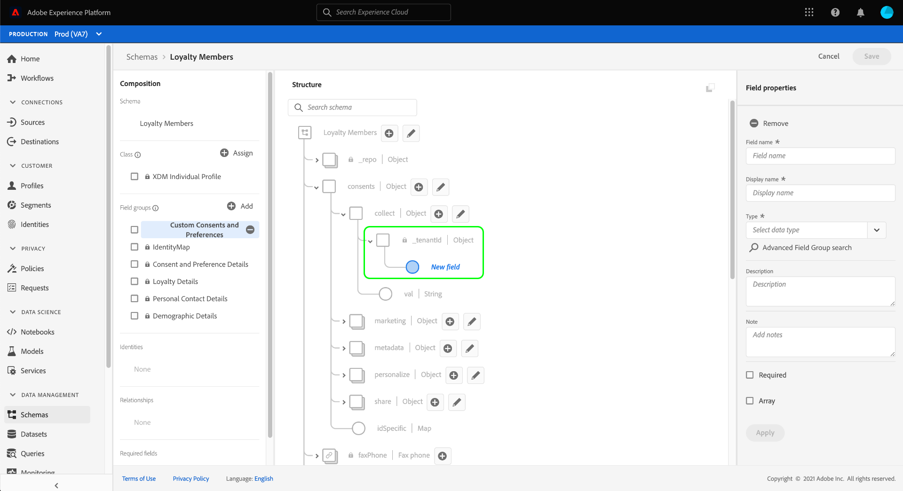

# 同意データと基本設定データを取り込むためのデータセットの設定

Adobe Experience Platformが顧客の同意/環境設定データを処理するには、そのデータを、同意および他の権限に関連するフィールドを含むスキーマのデータセットに送信する必要があります。 特に、このデータセットは、 [!DNL XDM Individual Profile] クラスに含まれ、での使用が有効になっています。 [!DNL Real-Time Customer Profile].

このドキュメントでは、Experience Platformで同意データを処理するようにデータセットを設定する手順を説明します。 Platform で同意/環境設定データを処理するための完全なワークフローの概要については、 [同意処理の概要](./overview.md).

>[!IMPORTANT]
>
>このガイドの例では、標準化されたフィールドセットを使用して、 [[!UICONTROL 同意および環境設定の詳細] スキーマフィールドグループ](../../../../xdm/field-groups/profile/consents.md). これらのフィールドの構造は、多くの一般的な同意収集の使用例に対応するための効率的なデータモデルを提供することを目的としています。
>
>ただし、独自のデータモデルに従って同意を表すために、独自のフィールドグループを定義することもできます。 次のオプションに基づき、ビジネスニーズに合った同意データモデルの承認を得るには、法務チームに相談してください。
>
>* 標準化された同意フィールドグループ
>* 組織で作成されたカスタム同意フィールドグループ
>* 標準化された同意フィールドグループと、カスタム同意フィールドグループによって提供される追加フィールドの組み合わせ


## 前提条件

このチュートリアルは、Adobe Experience Platform の次のコンポーネントを実際に利用および理解しているユーザーを対象としています。

* [エクスペリエンスデータモデル（XDM）](../../../../xdm/home.md)：[!DNL Experience Platform] が顧客エクスペリエンスデータを整理する際に使用する標準化されたフレームワーク。
   * [スキーマ構成の基本](../../../../xdm/schema/composition.md)：XDM スキーマの基本的な構成要素について説明します。
* [リアルタイム顧客プロファイル](../../../../profile/home.md):異なるソースの顧客データを完全な統合ビューに統合し、顧客インタラクションごとに実用的なタイムスタンプ付きの説明を提供します。

>[!IMPORTANT]
>
>このチュートリアルは、 [!DNL Profile] 顧客属性情報の取得に使用する Platform のスキーマ。 同意データの収集方法に関係なく、このスキーマは [リアルタイム顧客プロファイルに対して有効](../../../../xdm/ui/resources/schemas.md#profile). また、スキーマのプライマリ ID を、電子メールアドレスなどの興味に基づく広告での使用を禁止する、直接識別可能なフィールドにすることはできません。 どのフィールドが制限されているかが不明な場合は、弁護士に相談してください。

## [!UICONTROL 同意および環境設定の詳細] フィールドグループ構造 {#structure}

この [!UICONTROL 同意および環境設定の詳細] フィールドグループは、スキーマに標準化された同意フィールドを提供します。 現在、このフィールドグループは、 [!DNL XDM Individual Profile] クラス。

フィールドグループには、単一のオブジェクトタイプのフィールドが用意されています。 `consents`のサブプロパティは、一連の標準化された同意フィールドをキャプチャします。 次の JSON は、データの種類の例です `consents` は、データ取り込み時に予想されます。

```json
{
  "consents": {
    "collect": {
      "val": "y",
    },
    "share": {
      "val": "y",
    },
    "personalize": {
      "content": {
        "val": "y"
      }
    },
    "marketing": {
      "preferred": "email",
      "any": {
        "val": "y"
      },
      "push": {
        "val": "n",
        "reason": "Too Frequent",
        "time": "2019-01-01T15:52:25+00:00"
      }
    },
    "idSpecific": {
      "email": {
        "jdoe@example.com": {
          "marketing": {
            "email": {
              "val": "n"
            }
          }
        }
      }
    }
  },
  "metadata": {
    "time": "2019-01-01T15:52:25+00:00"
  }
}
```

>[!NOTE]
>
>のサブプロパティの構造と意味について詳しくは、 `consents`詳しくは、 [[!UICONTROL 同意および環境設定の詳細] フィールドグループ](../../../../xdm/field-groups/profile/consents.md).

## 必須フィールドグループを [!DNL Profile] スキーマ {#add-field-group}

Adobe標準を使用して同意データを収集するには、次の 2 つのフィールドグループを含むプロファイル対応のスキーマが必要です。

* [!UICONTROL 同意および環境設定の詳細]
* [!UICONTROL IdentityMap] （Platform Web または Mobile SDK を使用して同意シグナルを送信する場合に必要）

Platform UI で、「 **[!UICONTROL スキーマ]** 左側のナビゲーションで、 **[!UICONTROL 参照]** タブをクリックして、既存のスキーマのリストを表示します。 ここから、 [!DNL Profile]同意フィールドを追加する有効なスキーマです。 この節のスクリーンショットは、 [スキーマ作成チュートリアル](../../../../xdm/tutorials/create-schema-ui.md) を例として示します。


>[!TIP]
>
>ワークスペースの検索およびフィルタリング機能を使用すると、スキーマを見つけやすくなります。 詳しくは、 [XDM リソースの調査](../../../../xdm/ui/explore.md) を参照してください。

この [!DNL Schema Editor] が表示され、キャンバスにスキーマの構造が表示されます。 キャンバスの左側で、を選択します。 **[!UICONTROL 追加]** の下に **[!UICONTROL フィールドグループ]** 」セクションに入力します。


この **[!UICONTROL フィールドグループを追加]** ダイアログが表示されます。 ここからを選択します。 **[!UICONTROL 同意および環境設定の詳細]** を選択します。 オプションで、検索バーを使用して結果を絞り込み、フィールドグループを見つけやすくすることができます。


次に、 **[!UICONTROL IdentityMap]** フィールドグループを選択し、同様に選択します。 両方のフィールドグループが右側のパネルに表示されたら、 **[!UICONTROL フィールドグループを追加]**.


キャンバスが再び表示され、 `consents` および `identityMap` フィールドがスキーマ構造に追加されました。 標準フィールドグループで取り込まれない追加の同意および環境設定フィールドが必要な場合は、「付録」の「 [スキーマへのカスタム同意フィールドと環境設定フィールドの追加](#custom-consent). それ以外の場合は、「 **[!UICONTROL 保存]** を使用して、スキーマの変更を完了します。


>[!IMPORTANT]
>
>新しいスキーマを作成する場合、またはプロファイルに対して有効になっていない既存のスキーマを編集する場合は、 [プロファイルのスキーマの有効化](../../../../xdm/ui/resources/schemas.md#profile) 保存する前に

編集したスキーマが [!UICONTROL プロファイルデータセット] Platform Web SDK データストリームで指定した場合、そのデータセットに新しい同意フィールドが含まれるようになります。 これで、 [同意処理ガイド](./overview.md#merge-policies) ：同意データを処理するExperience Platformの設定プロセスを続行します。 このスキーマのデータセットをまだ作成していない場合は、次の節の手順に従います。

## 同意スキーマに基づくデータセットの作成 {#dataset}

同意フィールドを含むスキーマを作成したら、顧客の同意データを最終的に取り込むデータセットを作成する必要があります。 このデータセットを有効にする必要があります [!DNL Real-Time Customer Profile].

最初に、 **[!UICONTROL データセット]** 左側のナビゲーションで、「 **[!UICONTROL データセットを作成]** をクリックします。


次のページで、 **[!UICONTROL スキーマからデータセットを作成]**.



この **[!UICONTROL スキーマからデータセットを作成]** ワークフローが表示され、 **[!UICONTROL スキーマを選択]** 手順 提供されたリストで、以前に作成した同意スキーマの 1 つを探します。 オプションで、検索バーを使用して結果を絞り込み、スキーマを見つけやすくすることができます。 目的のスキーマの横にあるラジオボタンを選択し、「 」を選択します。 **[!UICONTROL 次へ]** をクリックして続行します。


**[!UICONTROL データセットの設定]**&#x200B;手順が表示されます。選択する前に、データセットの一意で、簡単に識別できる名前と説明を指定します **[!UICONTROL 完了]**.


新しく作成されたデータセットの詳細ページが表示されます。 データセットが時系列スキーマに基づいている場合、プロセスは完了です。 データセットがレコードスキーマに基づいている場合、プロセスの最後の手順は、で使用するデータセットを有効にすることです [!DNL Real-Time Customer Profile].

右側のレールで、 **[!UICONTROL プロファイル]** 切り替え


最後に、 **[!UICONTROL 有効にする]** 確認ポップオーバーで、次のスキーマを有効にします。 [!DNL Profile].


これでデータセットが保存され、での使用が有効になりました。 [!DNL Profile]. Platform Web SDK を使用して同意データをプロファイルに送信する場合は、このデータセットを [!UICONTROL プロファイルデータセット] ( [datastream](../../../../edge/datastreams/overview.md).

## 次の手順

このチュートリアルに従うことで、に同意フィールドを追加しました。 [!DNL Profile] — 有効なスキーマ。このスキーマのデータセットは、Platform Web SDK または直接 XDM 取り込みを使用して同意データを取り込むために使用されます。

これで、 [同意処理の概要](./overview.md#merge-policies) ：同意データを処理するExperience Platformの設定を続行します。

## 付録

次の節では、顧客の同意と環境設定データを取り込むデータセットの作成に関する追加情報を示します。

### スキーマへのカスタムの同意フィールドと環境設定フィールドの追加 {#custom-consent}

標準で表される以外の同意シグナルを追加で取得する必要がある場合 [!UICONTROL 同意および環境設定の詳細] フィールドグループ内で、カスタム XDM コンポーネントを使用して、特定のビジネスニーズに合わせて同意スキーマを拡張できます。 この節では、これらのシグナルをプロファイルに取り込むための同意スキーマのカスタマイズ方法の基本原則について説明します。

>[!IMPORTANT]
>
>Platform Web および Mobile SDK は、consent-change コマンドのカスタムフィールドをサポートしていません。 現在、カスタム同意フィールドをプロファイルに取り込む方法は、 [バッチ取得](../../../../ingestion/batch-ingestion/overview.md) または [ソース接続](../../../../sources/home.md).

次を使用することを強くお勧めします： [!UICONTROL 同意および環境設定の詳細] フィールドグループを同意データの構造のベースラインとして追加することで、構造全体を一から作成するのではなく、必要に応じてフィールドを追加することができます。

標準フィールドグループの構造にカスタムフィールドを追加するには、まずカスタムフィールドグループを作成する必要があります。 追加後 [!UICONTROL 同意および環境設定の詳細] スキーマに対するフィールドグループで、 **プラス (+)** アイコン **[!UICONTROL フィールドグループ]** セクションで、 **[!UICONTROL 新しいフィールドグループを作成]**. フィールドグループの名前と説明（オプション）を入力し、「 」を選択します。 **[!UICONTROL フィールドグループを追加]**.


この [!DNL Schema Editor] 左側のパネルで新しいカスタムフィールドグループを選択して再び表示されます。 キャンバスに、カスタムフィールドをスキーマ構造に追加できるコントロールが表示されます。 新しい同意または環境設定フィールドを追加するには、 **プラス (+)** 横のアイコン `consents` オブジェクト。


新しいフィールドが `consents` オブジェクト。 標準の XDM オブジェクトにカスタムフィールドを追加するので、新しいフィールドはテナント ID に名前空間化されたオブジェクトの下に作成されます。



の下の右側のレールで **[!UICONTROL フィールドプロパティ]**」で、フィールドの名前と説明を入力します。 フィールドの **[!UICONTROL タイプ]**&#x200B;の場合は、カスタムの同意または環境設定フィールドに適した標準データタイプを使用する必要があります。

* [[!UICONTROL 汎用同意フィールド]](../../../../xdm/data-types/consent-field.md)
* [[!UICONTROL 汎用マーケティング環境設定フィールド]](../../../../xdm/data-types/marketing-field.md)
* [[!UICONTROL サブスクリプション付きの汎用マーケティング環境設定フィールド]](../../../../xdm/data-types/marketing-field-subscriptions.md)
* [[!UICONTROL 汎用パーソナライゼーション環境設定フィールド]](../../../../xdm/data-types/personalization-field.md)

終了したら、「 」を選択します。 **[!UICONTROL 適用]**.


同意または環境設定フィールドがスキーマ構造に追加されます。 なお、 [!UICONTROL パス] 右側のレールに表示される `_tenantId` 名前空間。 データ操作でこのフィールドへのパスを参照する際には必ず、この名前空間を含める必要があります。


必要な同意フィールドと環境設定フィールドの追加を続行するには、上記の手順に従います。 終了したら、「 」を選択します。 **[!UICONTROL 保存]** 変更を確定します。

このスキーマのデータセットを作成していない場合は、 [データセットの作成](#dataset).
