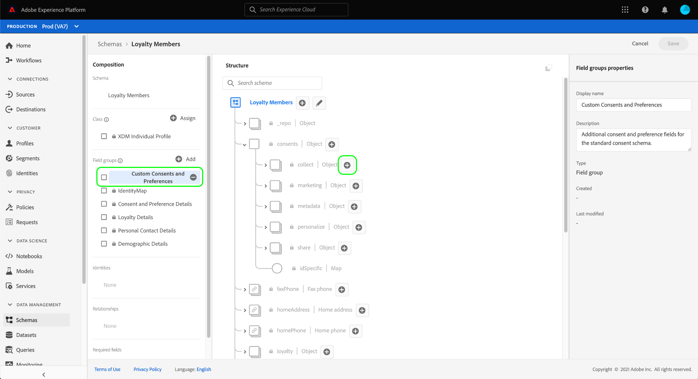

# 同意データと基本設定データを取り込むためのデータセットの設定

Adobe Experience Platformで顧客の同意/環境設定データを処理するには、同意や他の権限に関連するフィールドがスキーマに含まれているデータセットに、そのデータを送信する必要があります。 特に、このデータセットは、[!DNL XDM Individual Profile] クラスに基づいており、[!DNL Real-Time Customer Profile] で使用できるようになっている必要があります。

このドキュメントでは、Experience Platformで同意データを処理するようにデータセットを設定する手順を説明します。 Experience Platformで同意/環境設定データを処理する完全なワークフローの概要については、[ 同意処理の概要 ](./overview.md) を参照してください。

>[!IMPORTANT]
>
>このガイドの例では、標準化されたフィールドセットを使用して、[[!UICONTROL  同意および環境設定の詳細 ] スキーマフィールドグループ ](../../../../xdm/field-groups/profile/consents.md) で定義されている顧客の同意値を表します。 これらのフィールドの構造は、多くの一般的な同意収集のユースケースに対応する効率的なデータモデルを提供することを目的としています。
>
>ただし、独自のフィールドグループを定義して、独自のデータモデルに従って同意を表すこともできます。 次のオプションに基づいて、ビジネスニーズに適合する同意データモデルの承認を得るには、法務チームにお問い合わせください。
>
>* 標準化された同意フィールドグループ
>* 組織が作成したカスタム同意フィールドグループ
>* 標準化された同意フィールドグループと、カスタム同意フィールドグループによって提供される追加フィールドの組み合わせ

## 前提条件

このチュートリアルは、Adobe Experience Platform の次のコンポーネントを実際に利用および理解しているユーザーを対象としています。

* [エクスペリエンスデータモデル（XDM）](../../../../xdm/home.md)：[!DNL Experience Platform] が顧客エクスペリエンスデータを整理する際に使用する標準化されたフレームワーク。
   * [スキーマ構成の基本](../../../../xdm/schema/composition.md)：XDM スキーマの基本的な構成要素について説明します。
* [ リアルタイム顧客プロファイル ](../../../../profile/home.md)：異なるソースの顧客データを完全な統合ビューに統合すると同時に、顧客インタラクションごとにアクションにつながる、タイムスタンプ付きのアカウントを提供します。

>[!IMPORTANT]
>
>このチュートリアルでは、顧客属性情報の取り込みに使用するExperience Platformの [!DNL Profile] スキーマを理解していることを前提としています。 同意データの収集に使用する方法に関係なく、このスキーマは [ リアルタイム顧客プロファイルに対して有効にする ](../../../../xdm/ui/resources/schemas.md#profile) 必要があります。 さらに、スキーマのプライマリ ID を、メールアドレスなどの興味/関心に基づく広告に使用することが禁止されている、直接識別可能なフィールドにすることはできません。 どのフィールドが制限されているかわからない場合は、法務担当者に問い合わせてください。

## [!UICONTROL  同意と環境設定の詳細 ] フィールドグループの構造 {#structure}

[!UICONTROL  同意および環境設定の詳細 ] フィールドグループは、標準化された同意フィールドをスキーマに提供します。 現在、このフィールドグループは、[!DNL XDM Individual Profile] クラスに基づくスキーマにのみ適合します。

フィールドグループは、単一のオブジェクトタイプフィールド `consents` を提供し、そのサブプロパティは、標準化された一連の同意フィールドをキャプチャします。 次の JSON は、データ取り込み時に期待され `consents` データの種類の例です。

```json
{
  "consents": {
    "collect": {
      "val": "y",
    },
    "share": {
      "val": "y",
    },
    "personalize": {
      "content": {
        "val": "y"
      }
    },
    "marketing": {
      "preferred": "email",
      "any": {
        "val": "y"
      },
      "push": {
        "val": "n",
        "reason": "Too Frequent",
        "time": "2019-01-01T15:52:25+00:00"
      }
    },
    "idSpecific": {
      "email": {
        "jdoe@example.com": {
          "marketing": {
            "email": {
              "val": "n"
            }
          }
        }
      }
    }
  },
  "metadata": {
    "time": "2019-01-01T15:52:25+00:00"
  }
}
```

>[!NOTE]
>
>`consents` のサブプロパティの構造と意味について詳しくは、[[!UICONTROL  同意および環境設定の詳細 ] フィールドグループ ](../../../../xdm/field-groups/profile/consents.md) の概要を参照してください。

## [!DNL Profile] スキーマへの必須フィールドグループの追加 {#add-field-group}

Adobe標準を使用して同意データを収集するには、次の 2 つのフィールドグループを含むプロファイル対応のスキーマが必要です。

* [[!UICONTROL  同意と環境設定の詳細 ]](../../../../xdm/field-groups/profile/consents.md)
* [[!UICONTROL IdentityMap]](../../../../xdm/field-groups/profile/identitymap.md) （Experience Platform Web または Mobile SDKを使用して同意信号を送信する場合に必要）

Experience Platform UI で、左側のナビゲーションで「**[!UICONTROL スキーマ]**」を選択し、「**[!UICONTROL 参照]**」タブを選択して、既存のスキーマのリストを表示します。 ここから、同意フィールドを追加する [!DNL Profile] 対応スキーマの名前を選択します。 この節のスクリーンショットでは、[ スキーマ作成チュートリアル ](../../../../xdm/tutorials/create-schema-ui.md) で作成した「ロイヤルティメンバー」スキーマを例として使用します。


>[!TIP]
>
>ワークスペースの検索機能とフィルター機能を使用すると、スキーマを見つけやすくなります。 詳しくは、[XDM リソースの調査 ](../../../../xdm/ui/explore.md) に関するガイドを参照してください。

[!DNL Schema Editor] が表示され、キャンバス内のスキーマの構造が示されます。 キャンバスの左側にある「**[!UICONTROL フィールドグループ]** セクションの下の **[!UICONTROL 追加]** を選択します。


**[!UICONTROL フィールドグループを追加]** ダイアログが表示されます。 ここから、リストから **[!UICONTROL 同意および環境設定の詳細]** を選択します。 必要に応じて、検索バーを使用して結果を絞り込み、フィールドグループを見つけやすくすることができます。


次に、リストから **[!UICONTROL IdentityMap]** フィールドグループを見つけて、選択します。 右側のパネルに両方のフィールドグループが表示されたら、「**[!UICONTROL フィールドグループを追加]**」を選択します。


キャンバスが再び表示され、`consents` フィールドと `identityMap` フィールドがスキーマ構造に追加されたことが示されます。 標準フィールドグループでキャプチャできない追加の同意および環境設定フィールドが必要な場合は、[ スキーマへのカスタム同意および環境設定フィールドの追加 ](#custom-consent) に関する付録の節を参照してください。 それ以外の場合は、「**[!UICONTROL 保存]**」を選択して、スキーマに対する変更を最終決定します。


>[!IMPORTANT]
>
>新しいスキーマを作成する場合や、プロファイルで有効になっていない既存のスキーマを編集する場合は、保存する前に [ プロファイルでスキーマを有効にする ](../../../../xdm/ui/resources/schemas.md#profile) 必要があります。

編集したスキーマがExperience Platform Web SDK データストリームで指定された [!UICONTROL  プロファイルデータセット ] で使用されている場合、そのデータセットには新しい同意フィールドが含まれるようになりました。 [ 同意処理ガイド ](./overview.md#merge-policies) に戻って、同意データを処理するようにExperience Platformを設定するプロセスを続けることができます。 このスキーマのデータセットをまだ作成していない場合は、次の節の手順に従ってください。

## 同意スキーマに基づくデータセットの作成 {#dataset}

同意フィールドを含むスキーマを作成したら、最終的に顧客の同意データを取り込むデータセットを作成する必要があります。 このデータセットを [!DNL Real-Time Customer Profile] に対して有効にする必要があります。

開始するには、左側のナビゲーションで **[!UICONTROL データセット]** を選択し、右上隅で **[!UICONTROL データセットを作成]** を選択します。


次のページで、「**[!UICONTROL スキーマからデータセットを作成]**」を選択します。


**[!UICONTROL スキーマからデータセットを作成]** ワークフローが表示されるので、**[!UICONTROL スキーマを選択]** 手順から開始します。 提供されたリストで、以前に作成した同意スキーマの 1 つを見つけます。 オプションで、検索バーを使用して結果を絞り込み、スキーマを見つけやすくすることができます。 目的のスキーマの横にあるラジオボタンを選択し、「**[!UICONTROL 次へ]** を選択して続行します。


**[!UICONTROL データセットの設定]**&#x200B;手順が表示されます。「完了 **[!UICONTROL を選択する前に、データセットの一意で簡単に識別できる名前と説明を指]** します。


新しく作成されたデータセットの詳細ページが表示されます。 データセットが時系列スキーマに基づいている場合、プロセスは完了です。 データセットがレコードスキーマに基づいている場合、プロセスの最後の手順は、[!DNL Real-Time Customer Profile] で使用するデータセットを有効にすることです。

右側のパネルで「**[!UICONTROL プロファイル]**」切り替えスイッチを選択します。


最後に、確認ポップオーバーで **[!UICONTROL 有効]** を選択して、スキーマを [!DNL Profile] 用に有効にします。


これで、データセットが保存され、[!DNL Profile] で使用できるようになります。 Experience Platform Web SDKを使用して同意データをプロファイルに送信することを計画している場合は、[ データストリーム ](../../../../datastreams/overview.md) を設定する際に、このデータセットを [!UICONTROL  プロファイルデータセット ] として選択する必要があります。

## 次の手順

このチュートリアルでは、[!DNL Profile] 対応スキーマに同意フィールドを追加しました。このスキーマのデータセットは、Experience Platform Web SDKまたはダイレクト XDM 取り込みを使用して同意データを取り込むために使用されます。

これで、[ 同意処理の概要 ](./overview.md#merge-policies) に戻って、同意データを処理するためのExperience Platformの設定を続行できます。

## 付録

次の節では、顧客の同意データと環境設定データを取り込むデータセットの作成について詳しく説明します。

### スキーマへのカスタム同意フィールドと環境設定フィールドの追加 {#custom-consent}

標準の [!UICONTROL  同意および環境設定の詳細 ] フィールドグループで表される同意以外で追加の同意シグナルを取得する必要がある場合は、カスタム XDM コンポーネントを使用して、特定のビジネスニーズに合わせて同意スキーマを強化できます。 この節では、これらのシグナルをプロファイルに取り込むために同意スキーマをカスタマイズする方法の基本原則の概要を説明します。

>[!IMPORTANT]
>
>Experience Platform Web SDK および Mobile SDK は、consent-change コマンドのカスタムフィールドをサポートしていません。 現在、カスタム同意フィールドをプロファイルに取り込む唯一の方法は、[ バッチ取り込み ](../../../../ingestion/batch-ingestion/overview.md) または [ ソース接続 ](../../../../sources/home.md) を使用することです。

[!UICONTROL  同意および環境設定の詳細 ] フィールドグループを、同意データの構造のベースラインとして使用し、必要に応じて追加する必要があります。構造全体を最初から作成する必要はありません。

標準フィールドグループの構造にカスタムフィールドを追加するには、まずカスタムフィールドグループを作成する必要があります。 [!UICONTROL  同意と環境設定の詳細 ] フィールドグループをスキーマに追加した後、「**フィールドグループ]**」セクションで **[!UICONTROL プラス（+）** アイコンを選択し、「**[!UICONTROL 新しいフィールドグループを作成]**」を選択します。 フィールドグループの名前と説明（オプション）を入力し、「**[!UICONTROL フィールドグループを追加]**」を選択します。


[!DNL Schema Editor] は、左側のパネルで新しいカスタムフィールドグループを選択した状態で再び表示されます。 キャンバスにコントロールが表示され、スキーマ構造にカスタムフィールドを追加できます。 新しい同意または環境設定フィールドを追加するには、`consents` オブジェクトの横にある **プラス （+）** アイコンを選択します。



`consents` オブジェクト内に新しいフィールドが表示されます。 標準 XDM オブジェクトにカスタムフィールドを追加しているため、新しいフィールドは、テナント ID を名前空間とするオブジェクトの下に作成されます。


**[!UICONTROL フィールドプロパティ]** の下の右パネルで、フィールドの名前と説明を入力します。 フィールドの **[!UICONTROL タイプ]** を選択する場合は、カスタムの同意または環境設定フィールドに適した標準データタイプを使用する必要があります。

* [[!UICONTROL  汎用同意フィールド ]](../../../../xdm/data-types/consent-field.md)
* [[!UICONTROL  汎用マーケティング環境設定フィールド ]](../../../../xdm/data-types/marketing-field.md)
* [[!UICONTROL  サブスクリプションを含む汎用マーケティング環境設定フィールド ]](../../../../xdm/data-types/marketing-field-subscriptions.md)
* [[!UICONTROL  汎用Personalization環境設定フィールド ]](../../../../xdm/data-types/personalization-field.md)

完了したら、「**[!UICONTROL 適用]**」を選択します。


同意フィールドまたは環境設定フィールドがスキーマ構造に追加されます。 右側のパネルに表示される [!UICONTROL  パス ] には、`_tenantId` の名前空間が含まれています。 データ操作でこのフィールドへのパスを参照する場合は、常にこの名前空間を含める必要があります。


上記の手順に従って、必要な同意および環境設定フィールドの追加を続行します。 終了したら、「**[!UICONTROL 保存]** を選択して変更を確定します。

このスキーマ用のデータセットをまだ作成していない場合は、[ データセットの作成 ](#dataset) の節に進んでください。
