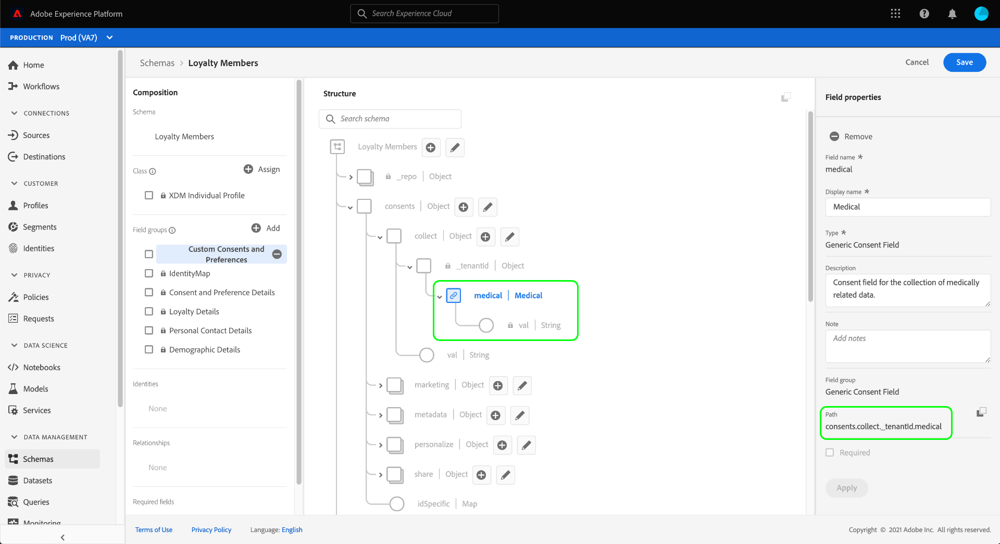

# 同意データと基本設定データを取り込むためのデータセットの設定

Adobe Experience Platformが顧客の同意/嗜好データを処理するには、そのデータを、スキーマに同意やその他の権限に関連するフィールドが含まれているデータセットに送信する必要があります。 特に、このデータセットは[!DNL XDM Individual Profile]クラスに基づいており、[!DNL Real-time Customer Profile]での使用を有効にしている必要があります。

このドキュメントでは、Experience Platformで同意データを処理するようにデータセットを設定する手順を説明します。 プラットフォームの同意/優先データ処理の完全なワークフローの概要については、[同意処理の概要](./overview.md)を参照してください。

>[!IMPORTANT]
>
>このガイドの例では、[Consents &amp; Preferences XDMデータタイプ](../../../../xdm/data-types/consents.md)の定義に従い、顧客の同意値を表すために標準化されたフィールドセットを使用します。 これらのフィールドの構造は、一般的な同意収集の使用例を多数カバーするための効率的なデータモデルの提供を目的としています。
>
>ただし、独自のデータモデルに従って同意を表す独自のフィールドグループを定義することもできます。 以下のオプションに基づき、貴社のビジネスニーズに合った同意データモデルの承認を得るには、法務チームにお問い合わせください。
>
>* 標準化された同意フィールドグループ
>* 組織で作成されたカスタム同意フィールドグループ
>* 標準化された同意フィールドグループと、カスタム同意フィールドグループによって提供される追加のフィールドの組み合わせ


## 前提条件

このチュートリアルは、Adobe Experience Platform の次のコンポーネントを実際に利用および理解しているユーザーを対象としています。

* [エクスペリエンスデータモデル（XDM）](../../../../xdm/home.md)[!DNL Experience Platform]： が顧客エクスペリエンスデータを整理する際に使用する標準化されたフレームワーク。
   * [スキーマ構成の基本](../../../../xdm/schema/composition.md)：XDM スキーマの基本的な構成要素について説明します。
* [リアルタイム顧客プロファイル](../../../../profile/home.md):異なるソースからの顧客データを完全な統合表示に統合し、すべての顧客インタラクションに関する実用的なタイムスタンプのあるアカウントを提供します。

>[!IMPORTANT]
>
>このチュートリアルでは、顧客属性情報の取得に使用するプラットフォームの[!DNL Profile]スキーマを理解していることを前提としています。 同意データの収集方法にかかわらず、このスキーマは、リアルタイム顧客プロファイル](../../../../xdm/ui/resources/schemas.md#profile)に対して[有効にする必要があります。 また、スキーマの主要IDを、電子メールアドレスなどの関心に基づく広告での使用を禁止される、直接識別可能なフィールドにすることはできません。 制限されているフィールドが不明な場合は、弁護士にお問い合わせください。

## 同意と環境設定のフィールドグループ構造{#structure}

[!UICONTROL プライバシー/パーソナライゼーション/マーケティングの環境設定（同意）]フィールドグループ（以下「同意と環境設定フィールドグループ」といいます）は、スキーマに対して標準化された同意フィールドを提供します。 現在、このフィールドグループは[!DNL XDM Individual Profile]クラスに基づくスキーマとのみ互換性があります。

フィールドグループには1つのオブジェクトタイプフィールド`consents`があり、そのサブプロパティは一連の標準化された同意フィールドを取り込みます。 次のJSONは、データ取り込み時に`consents`が期待するデータの種類の例です。

```json
{
  "consents": {
    "collect": {
      "val": "y",
    },
    "share": {
      "val": "y",
    },
    "personalize": {
      "content": {
        "val": "y"
      }
    },
    "marketing": {
      "preferred": "email",
      "any": {
        "val": "y"
      },
      "push": {
        "val": "n",
        "reason": "Too Frequent",
        "time": "2019-01-01T15:52:25+00:00"
      }
    },
    "idSpecific": {
      "email": {
        "jdoe@example.com": {
          "marketing": {
            "email": {
              "val": "n"
            }
          }
        }
      }
    }
  },
  "metadata": {
    "time": "2019-01-01T15:52:25+00:00"
  }
}
```

>[!NOTE]
>
>`consents`内のサブプロパティの構造と意味について詳しくは、[Consents &amp; Preferencesデータ型](../../../../xdm/data-types/consents.md)の概要を参照してください。

## 「追加同意と環境設定」フィールドグループから[!DNL Profile]スキーマ{#add-field-group}へ

プラットフォームUIの左側のナビゲーションで「**[!UICONTROL スキーマ]**」を選択し、「**[!UICONTROL 参照]**」タブを選択して、既存のスキーマのリストを表示します。 同意フィールドを追加する[!DNL Profile]が有効なスキーマの名前をここから選択します。 この節のスクリーンショットでは、例として[スキーマ作成チュートリアル](../../../../xdm/tutorials/create-schema-ui.md)で作成した「Loyality Members」スキーマを使用しています。


>[!TIP]
>
>Workspaceの検索およびフィルター機能を使用して、スキーマを簡単に見つけることができます。 詳しくは、[XDMリソース](../../../../xdm/ui/explore.md)のガイドを参照してください。

[!DNL Schema Editor]が表示され、キャンバスのスキーマの構造が示されます。 キャンバスの左側で、「**[!UICONTROL フィールドグループ]**」セクションの追加下の「****」を選択します。


**[!UICONTROL 追加フィールドグループ]**&#x200B;ダイアログが表示されます。 ここから、リストから「**[!UICONTROL プライバシー/パーソナライゼーション/マーケティングの環境設定（同意）]**」を選択します。 オプションで検索バーを使用して結果を絞り込み、フィールドグループを見つけやすくすることができます。 フィールドグループを選択したら、**[!UICONTROL 追加フィールドグループ]**&#x200B;を選択します。


キャンバスが再表示され、`consents`オブジェクトがスキーマ構造に追加されたことが示されます。 標準フィールドグループで取得されない、追加の同意フィールドと優先フィールドが必要な場合は、付録の「[スキーマ](#custom-consent)にカスタムの同意フィールドと優先フィールドを追加する」を参照してください。 それ以外の場合は、「**[!UICONTROL 保存]**」を選択して、スキーマの変更を終了します。


編集したスキーマが、Platform Web SDKのエッジ設定で指定した[!UICONTROL プロファイルデータセット]で使用されている場合、そのデータセットには新しい同意フィールドが含まれるようになります。 これで、[同意処理ガイド](./overview.md#merge-policies)に戻って、同意データを処理するようにExperience Platformを設定するプロセスを続行できます。

このスキーマのデータセットをまだ作成していない場合は、次の節の手順に従ってください。

## 同意スキーマ{#dataset}に基づいてデータセットを作成します

同意フィールドを持つスキーマを作成したら、最終的に顧客の同意データを取り込むデータセットを作成する必要があります。 このデータセットは[!DNL Real-time Customer Profile]で有効にする必要があります。

最初に、左のナビゲーションで「**[!UICONTROL データセット]**」を選択し、右上隅の「**[!UICONTROL データセットを作成]**」を選択します。


次のページで、「**[!UICONTROL スキーマからデータセットを作成]**」を選択します。


**[!UICONTROL スキーマ]**&#x200B;からデータセットを作成ワークフローが表示され、**[!UICONTROL スキーマを選択]**&#x200B;の手順から開始します。 提供されたリストで、前に作成した同意スキーマの1つを探します。 オプションで検索バーを使用して結果を絞り込み、スキーマを見つけやすくできます。 目的のスキーマの横にあるラジオボタンを選択し、「**[!UICONTROL 次へ]**」を選択して次に進みます。


**[!UICONTROL データセットの設定]**&#x200B;手順が表示されます。「**[!UICONTROL 完了]**」を選択する前に、データセットの一意で識別しやすい名前と説明を指定します。


新しく作成したデータセットの詳細ページが表示されます。 データセットが時系列スキーマに基づいている場合は、プロセスが完了します。 データセットがレコードスキーマに基づいている場合は、プロセスの最後の手順として、[!DNL Real-time Customer Profile]で使用するデータセットを有効にします。

右側のレールで、**[!UICONTROL プロファイル]**&#x200B;を選択します。


最後に、確認プロバーで「**[!UICONTROL 有効]**」を選択して、[!DNL Profile]のスキーマを有効にします。


データセットが保存され、[!DNL Profile]での使用が可能になります。 Platform Web SDKを使用してプロファイルに同意データを送信する場合は、[エッジ設定](../../../../edge/fundamentals/edge-configuration.md)の設定時に、このデータセットを[!UICONTROL プロファイルデータセット]として選択する必要があります。

## 次の手順

このチュートリアルに従って、[!DNL Profile]が有効なスキーマに同意フィールドを追加しました。このデータセットは、プラットフォームWeb SDKを使用して同意データを取り込むか、直接XDM取り込むのに使用されます。

これで、[同意処理の概要](./overview.md#merge-policies)に戻って、同意データを処理するExperience Platformの設定を続行できます。

## 付録

次の節では、顧客の同意や好みのデータを取り込むためのデータセットの作成について詳しく説明します。

### スキーマ&lt;a0/追加>に対するカスタム同意と優先フィールド{#custom-consent}

標準の[!DNL Consents & Preferences]フィールドグループに表示される以外の追加の同意信号を取り込む必要がある場合は、カスタムXDMコンポーネントを使用して、特定のビジネスニーズに合った同意のスキーマを高めることができます。 ここでは、Adobe Experience PlatformモバイルおよびWeb SDKが行う同意変更コマンドと互換性がある方法で同意スキーマをカスタマイズする方法の基本原則について説明します。

>[!IMPORTANT]
>
>[!DNL Consents & Preferences]フィールドグループを同意データの構造のベースラインとして使用し、必要に応じてフィールドを追加する必要があります。構造全体を一から作成する必要はありません。

標準フィールドグループの構造にユーザー設定フィールドを追加するには、まずユーザー設定フィールドグループを作成する必要があります。 [!DNL Consents & Preferences]フィールドグループをスキーマに追加した後、**[!UICONTROL フィールドグループ]**&#x200B;セクションで&#x200B;**プラス(+)**&#x200B;アイコンを選択し、**[!UICONTROL 新しいフィールドグループを作成]**&#x200B;を選択します。 フィールドグループの名前とオプションの説明を入力し、**[!UICONTROL 追加フィールドグループ]**&#x200B;を選択します。


[!DNL Schema Editor]が再表示され、左側のレールで新しいカスタムフィールドグループが選択されます。 キャンバスに、スキーマ構造にカスタムフィールドを追加できるコントロールが表示されます。 新しい同意または環境設定フィールドを追加するには、`consents`オブジェクトの横にある&#x200B;**プラス(+)**&#x200B;アイコンを選択します。


`consents`オブジェクト内に新しいフィールドが表示されます。 標準のXDMオブジェクトにカスタムフィールドを追加する場合は、テナントIDに名前が付けられたオブジェクトの下に新しいフィールドが作成されます。


**[!UICONTROL フィールドプロパティ]**&#x200B;の右側のレールで、フィールドの名前と説明を入力します。 フィールドの&#x200B;**[!UICONTROL タイプ]**&#x200B;を選択する場合は、カスタムの同意または環境設定フィールドに適切な標準データ型を使用する必要があります。

* [[!UICONTROL 汎用同意フィールド]](../../../../xdm/data-types/consent-field.md)
* [[!UICONTROL 汎用マーケティング基本設定フィールド]](../../../../xdm/data-types/marketing-field.md)
* [[!UICONTROL 購読付きの汎用マーケティング環境設定フィールド]](../../../../xdm/data-types/marketing-field-subscriptions.md)
* [[!UICONTROL 汎用パーソナライゼーション設定フィールド]](../../../../xdm/data-types/personalization-field.md)

終了したら、「**[!UICONTROL 適用]**」を選択します。


同意または優先フィールドがスキーマ構造に追加されます。 右側のレールに表示される[!UICONTROL パス]には`_tenantId`名前空間が含まれています。 この名前空間は、データ操作でこのフィールドへのパスを参照するたびに含める必要があります。



必要な同意フィールドと環境設定フィールドの追加を続行するには、上記の手順に従います。 終了したら、「**[!UICONTROL 保存]**」を選択して変更を確認します。

編集したスキーマが、Platform Web SDKのエッジ設定で指定した[!UICONTROL プロファイルデータセット]で使用されている場合、そのデータセットには新しい同意フィールドが含まれるようになります。 これで、[同意処理ガイド](./overview.md#merge-policies)に戻って、同意データを処理するようにExperience Platformを設定するプロセスを続行できます。

このスキーマのデータセットをまだ作成していない場合は、[データセット](#dataset)の作成の節に進みます。
