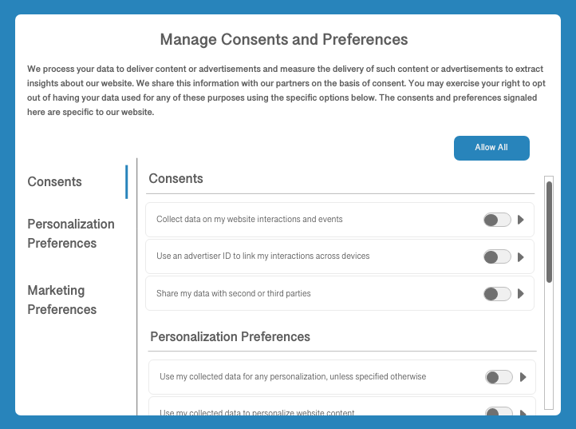

# Adobe Experience Platformでの同意処理

Adobe Experience Platformでは、顧客から収集した同意データを処理し、保存されている顧客プロファイルに統合できます。 このデータを下流プロセスで使用することで、特定の顧客に対してデータ収集が行われるのか、特定の目的のためにプロファイルが使用されるのかを判断できます。 たとえば、特定のプロファイルの同意データは、書き出されたオーディエンスセグメントに含めることができるかどうか、または電子メール、テキストメッセージ、プッシュ通知などの特定のマーケティングチャネルに参加できるかどうかを判断できます。

このドキュメントでは、同意管理プラットフォーム（CMP）によって生成された顧客の同意データを取り込み、そのデータをダウンストリームのユースケース向けに顧客プロファイルに統合するように、Experience Platform データ操作を設定する方法の概要を説明します。

>[!NOTE]
>
>このドキュメントでは、Adobe標準を使用した同意データの処理に焦点を当てています。 IAB Transparency and Consent Framework （TCF） 2.0に準拠して同意データを処理する場合は、Adobe Real-Time Customer Data Platform[での](../iab/overview.md)TCF 2.0のサポートに関するガイドを参照してください。

## 前提条件

このガイドでは、同意データの処理に関するさまざまなExperience Platform サービスについて理解する必要があります。

* [エクスペリエンスデータモデル（XDM）](/help/xdm/home.md)：Adobe Experience Platform が顧客体験データの整理に使用する標準化されたフレームワーク。
* [Adobe Experience Platform Identity Service](/help/identity-service/home.md)：デバイスやシステム間でIDを橋渡しすることで、顧客体験データの断片化がもたらす根本的な課題を解決します。
* [ リアルタイム顧客プロファイル ](/help/profile/home.md): [!DNL Identity Service]機能を使用して、データセットから詳細な顧客プロファイルをリアルタイムで作成します。 リアルタイム顧客プロファイルは、データレイクからデータを取得し、独自のデータストアに顧客プロファイルを保持します。
* [Adobe Experience Platform Web SDK](/help/collection/js/js-overview.md)：様々なExperience Platform サービスを顧客向けweb サイトに統合できるクライアントサイドのJavaScript ライブラリ。
   * [SDK同意コマンド ](/help/collection/js/commands/setconsent.md)：このガイドに示す同意関連のSDK コマンドの使用例の概要。
* [Adobe Experience Platform Segmentation Service](/help/segmentation/home.md): リアルタイム顧客プロファイルデータを、同様の特性を共有し、マーケティング戦略に同様に対応する個人のグループに分割できます。

## 同意処理フローの概要 {#summary}

次に、システムが適切に設定された後に同意データがどのように処理されるかを示します。

1. 顧客は、web サイトのダイアログで、データ収集に関する同意の設定をおこないます。
1. ページが読み込まれるたびに（またはCMPが同意設定の変更を検出した場合）、サイト上のカスタムスクリプトによって、現在の環境設定が標準のXDM オブジェクトにマッピングされます。 このオブジェクトは、次にExperience Platform Web SDK `setConsent` コマンドに渡されます。
1. `setConsent`が呼び出されると、Experience Platform Web SDKは、同意値が最後に受信した値と異なるかどうかを確認します。 値が異なる場合（または以前の値がない場合）は、構造化された同意/環境設定データがAdobe Experience Platformに送信されます。
1. 同意/環境設定データは、同意/環境設定フィールドを含むスキーマを持つ[!DNL Profile]対応データセットに取り込まれます。

CMPの同意変更フックによってトリガーされるSDK コマンドに加えて、同意データは、お客様が生成したXDM データを通じてExperience Platformに流れ込み、[!DNL Profile]対応データセットに直接アップロードすることもできます。

### 同意の適用

Experience Platformの同意処理サポートの現在のリリースでは、データ収集権限（`collect.val`）のみがExperience Platform Web SDKによって自動的に適用されます。 より詳細な同意や嗜好を収集し、顧客プロファイルに保持できますが、これらの追加のシグナルは、独自の下流プロセスで手動で適用する必要があります。

>[!NOTE]
>
>上記のXDM同意フィールドの構造について詳しくは、[[!UICONTROL Consents and Preferences] データタイプ ](/help/xdm/data-types/consents.md)に関するガイドを参照してください。

システムが設定されると、Experience Platform Web SDKは、現在のユーザーのデータ収集の同意値を解釈し、データをAdobe Experience Platform Edge Networkに送信するか、クライアントから削除するか、データ収集権限が「はい」または「いいえ」に設定されるまで保持するかを判断します。

## CMPで顧客の同意データを生成する方法を決定する {#consent-data}

CMPのシステムは企業ごとに異なるため、顧客がサービスを利用する際に、最適な方法で顧客の同意を得る必要があります。 これを実現する一般的な方法は、次の例のように、Cookieの同意ダイアログを使用することです。

このダイアログでは、顧客が、データに対して特定のマーケティングおよびパーソナライゼーションのユースケースをオプトインまたはオプトアウトできるようにする必要があります。 これらの同意と環境設定は、次の手順で[!DNL Profile]対応データセットに対して定義するデータモデルに準拠している必要があります。

## 標準化された同意フィールドを[!DNL Profile]対応データセットに追加 {#dataset}

顧客の同意データは、同意フィールドを含むスキーマを持つ[!DNL Profile]対応データセットに送信する必要があります。 これらのフィールドは、個々の顧客に関する属性情報を取得するために使用するのと同じスキーマとデータセットに含める必要があります。

このガイドを続行する前に、これらの必須フィールドを[対応データセットに追加する方法について詳しくは、](./dataset.md)同意データを取得するためのデータセットの設定[!DNL Profile]に関するチュートリアルを参照してください。

## [!DNL Profile]結合ポリシーを更新して同意データを含める {#merge-policies}

同意データを処理するための[!DNL Profile]対応データセットを作成したら、各顧客プロファイルに同意フィールドを常に含めるように結合ポリシーが設定されていることを確認する必要があります。 これには、同意データセットが競合する可能性のあるその他のデータセットよりも優先されるように、データセットの優先順位を設定することが含まれます。

>[!NOTE]
>
>競合するデータセットがない場合は、代わりに結合ポリシーのタイムスタンプの優先順位を設定する必要があります。 これにより、顧客が指定した最新の同意が、使用される同意設定であることを確認できます。

結合ポリシーの操作方法について詳しくは、[結合ポリシーの概要](../../../../profile/merge-policies/overview.md)を参照してください。 結合ポリシーを設定する際は、[!UICONTROL Consents and Preferences] データセットの準備[に関するガイドに記載されているように、](./dataset.md) スキーマフィールドグループが提供するすべての必須の同意属性をプロファイルに含める必要があります。

## Experience Platformに同意データを取り込む

顧客プロファイルに必要な同意フィールドを表すデータセットと結合ポリシーが用意できたら、次のステップは同意データ自体をExperience Platformに取り込むことです。

主に、CMPによって同意変更イベントが検出されるたびに、Adobe Experience Platform Web SDKを使用してExperience Platformに同意データを送信する必要があります。 モバイルプラットフォームで同意データを収集する場合は、Adobe Experience Platform モバイルSDKを使用する必要があります。 また、収集した同意データを同意データセットのXDM スキーマにマッピングし、バッチ収集を通じてExperience Platformに送信することで、同意データを直接取り込むこともできます。

これらの各方法の詳細については、以下のサブセクションで説明します。

### 同意データを処理するようにExperience Platform Web SDKを構成する {#web-sdk}

Web サイトで同意変更イベントをリッスンするようにCMPを設定したら、Experience Platform Web SDKを統合して、更新された同意設定を受け取り、ページの読み込み時および同意変更イベントが発生するたびにExperience Platformに送信できます。 詳しくは、[お客様の同意データを処理するためのWeb SDKの設定](../sdk.md)に関するガイドを参照してください。

### 同意データを処理するようにExperience Platform Mobile SDKを設定します {#mobile-sdk}

お客様のモバイルアプリケーションで顧客の同意の設定が必要な場合は、Experience Platform Mobile SDKを統合して同意設定を取得および更新し、同意APIが呼び出されるたびにExperience Platformに送信できます。

同意API[を使用した](https://developer.adobe.com/client-sdks/documentation/consent-for-edge-network/)同意用モバイル拡張機能の設定[および](https://developer.adobe.com/client-sdks/documentation/consent-for-edge-network/api-reference/)については、Mobile SDKのドキュメントを参照してください。 Mobile SDKを使用してプライバシーに関する懸念を処理する方法について詳しくは、「[ プライバシーとGDPR](https://developer.adobe.com/client-sdks/resources/privacy-and-gdpr/)」の節を参照してください。

### XDMに準拠した同意データを直接取り込み {#batch}

バッチ収集を使用すると、XDM準拠の同意データをCSV ファイルから取り込むことができます。 これは、以前に収集した同意データのバックログが、顧客プロファイルにまだ統合されていない場合に役立ちます。

[CSV ファイルをXDM](../../../../ingestion/tutorials/map-csv/overview.md)にマッピングする方法に関するチュートリアルに従って、データフィールドをXDMに変換し、Experience Platformに取り込む方法を説明します。 マッピングの[!UICONTROL Destination]を選択する際は、**[!UICONTROL Use existing dataset]** オプションを選択し、以前に作成した[!DNL Profile]対応の同意データセットを選択してください。

## 実装のテスト {#test-implementation}

顧客の同意データを[!DNL Profile]対応データセットに取り込んだ後、更新されたプロファイルに同意属性が含まれているかどうかを確認できます。

>[!IMPORTANT]
>
>UIで既存のプロファイルの属性を表示するには、そのプロファイルに関連付けられている少なくとも1つのID値（および対応する名前空間）を把握する必要があります。
>
>この情報にアクセスできない場合は、独自のテスト同意データを取り込み、代わりに既知のID値/名前空間に関連付けることもできます。

プロファイルの詳細を検索する方法について詳しくは、[ UI ガイドの](../../../../profile/ui/user-guide.md#browse)ID別プロファイルの参照[!DNL Profile]の節を参照してください。

新しい同意属性は、デフォルトではプロファイルのダッシュボードには表示されません。 そのため、プロファイルの詳細ページの&#x200B;**[!UICONTROL Attributes]** タブに移動して、期待どおりに取り込まれていることを確認する必要があります。 ニーズに合わせてダッシュボードをカスタマイズする方法については、[ プロファイルダッシュボード ](../../../../profile/ui/profile-dashboard.md)のガイドを参照してください。

<!-- 
(To be included once CJM is GA)
## Handling consent in Customer Journey Management

If you are using Customer Journey Management, after confirming that your profiles and segments contain consent data, you can start honoring customer [marketing preferences](../../../../xdm/data-types/consents.md#marketing) when pulling segments from Experience Platform. Specifically, profiles who have opted out of the email marketing preference should not be included in segments that are targeted for email campaigns.

Customer Journey Management can also send consent-change signals back to Experience Platform. When a customer selects an "unsubscribe" link in an email message, the updated consent preference is sent to Experience Platform and the appropriate profile attributes are updated accordingly.
-->

## 次の手順

このガイドでは、Adobe標準を使用して顧客の同意データを処理し、それらの属性を顧客プロファイルに表すようにExperience Platformの操作を設定する方法について説明しました。 顧客の同意の環境設定を、セグメントの選定やその他の下流のユースケースにおける決定要因として統合できるようになりました。

Experience Platformのプライバシー関連の機能について詳しくは、[Experience Platformのガバナンス、プライバシー、セキュリティに関する概要](../../overview.md)を参照してください。
