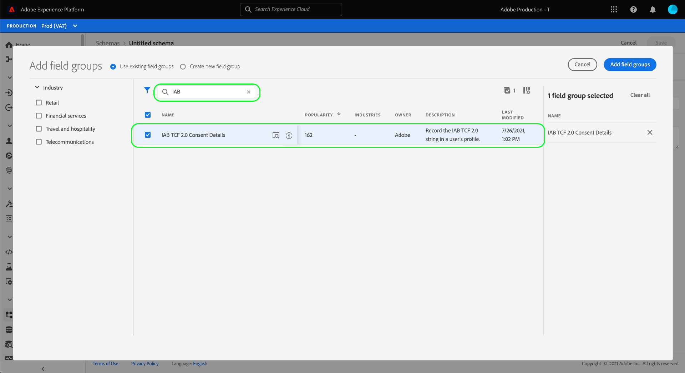

# IAB TCF 2.0 同意データを取り込むためのデータセットの作成

Adobe Experience Platformが IAB [!DNL Transparency & Consent Framework](TCF)2.0 に従って顧客の同意データを処理するには、そのデータを、スキーマに TCF 2.0 の同意フィールドが含まれるデータセットに送信する必要があります。

特に、TCF 2.0 の同意データを取り込むには、2 つのデータセットが必要です。

* [!DNL XDM Individual Profile] クラスに基づくデータセットで、[!DNL Real-time Customer Profile] での使用が有効になっています。
* [!DNL XDM ExperienceEvent] クラスに基づくデータセット。

>[!IMPORTANT]
>
>Platform は、個々のプロファイルデータセットで収集された TCF 文字列のみを強制します。 このワークフローの一部としてデータストリームを作成するには、ExperienceEvent データセットが引き続き必要ですが、データをプロファイルデータセットに取り込むだけで済みます。 ExperienceEvent データセットは、同意の変更イベントを時間の経過と共に追跡する場合にも使用できますが、セグメントのアクティブ化時にこれらの値を適用する場合、では使用されません。

このドキュメントでは、これら 2 つのデータセットを設定する手順を説明します。 TCF 2.0 用の Platform データ操作を設定するための完全なワークフローの概要については、[IAB TCF 2.0 コンプライアンスの概要 ](./overview.md) を参照してください。

## 前提条件

このチュートリアルは、Adobe Experience Platform の次のコンポーネントを実際に利用および理解しているユーザーを対象としています。

* [エクスペリエンスデータモデル（XDM）](../../../../xdm/home.md)：[!DNL Experience Platform] が顧客エクスペリエンスデータを整理する際に使用する標準化されたフレームワーク。
   * [スキーマ構成の基本](../../../../xdm/schema/composition.md)：XDM スキーマの基本的な構成要素について説明します。
* [Adobe Experience Platform Identity Service](../../../../identity-service/home.md):デバイスやシステムをまたいで、異なるデータソースから顧客 ID を結び付けることができます。
   * [ID 名前空間](../../../../identity-service/namespaces.md):顧客 ID データは、ID サービスで認識される特定の ID 名前空間で提供される必要があります。
* [リアルタイム顧客プロファイル](../../../../profile/home.md):を利用す [!DNL Identity Service] ると、データセットから詳細な顧客プロファイルをリアルタイムで作成できます。[!DNL Real-time Customer Profile] は、データレイクからデータを取り込み、顧客プロファイルを独立したデータストアに保持します。

## TCF 2.0 フィールドグループ {#field-groups}

[!UICONTROL IAB TCF 2.0 Consent Details] スキーマフィールドグループは、TCF 2.0 のサポートに必要な顧客の同意フィールドを提供します。 このフィールドグループには、次の 2 つのバージョンがあります。1 つは [!DNL XDM Individual Profile] クラスと互換性があり、もう 1 つは [!DNL XDM ExperienceEvent] クラスと互換性があります。

以下の節では、取り込み時に予想されるデータを含め、これらの各フィールドグループの構造について説明します。

### プロファイルフィールドグループ {#profile-field-group}

[!DNL XDM Individual Profile] に基づくスキーマの場合、[!UICONTROL IAB TCF 2.0 Consent Details] フィールドグループには、1 つのマップタイプフィールド `identityPrivacyInfo` が用意されています。このフィールドは、顧客 ID を TCF の同意設定にマッピングします。 このフィールドグループは、自動強制をおこなうために、リアルタイム顧客プロファイルで有効になっているレコードベースのスキーマに含める必要があります。

このフィールドグループの構造と使用例について詳しくは、[ リファレンスガイド ](../../../../xdm/field-groups/profile/iab.md) を参照してください。

### イベントフィールドグループ {#event-field-group}

経時的に同意変更イベントを追跡する場合は、[!UICONTROL IAB TCF 2.0 Consent Details] フィールドグループを [!UICONTROL XDM ExperienceEvent] スキーマに追加します。

経時的に同意の変更イベントを追跡する予定がない場合は、このフィールドグループをイベントスキーマに含める必要はありません。 TCF の同意値を自動的に適用する場合、Experience Platformは [profile フィールドグループ ](#profile-field-group) に取り込まれた最新の同意情報のみを使用します。 イベントによってキャプチャされた同意の値は、自動強制ワークフローには関与しません。

このフィールドグループの構造と使用例について詳しくは、[ リファレンスガイド ](../../../../xdm/field-groups/event/iab.md) を参照してください。

## 顧客の同意スキーマの作成 {#create-schemas}

同意データをキャプチャするデータセットを作成するには、まず XDM スキーマを作成し、これらのデータセットの基にする必要があります。

前の節で説明したように、ダウンストリームの Platform ワークフローで同意を強制するには、 [!UICONTROL XDM Individual Profile] クラスを使用するスキーマが必要です。 また、時間の経過と共に同意の変更を追跡する場合は、[!UICONTROL XDM ExperienceEvent] に基づいて別のスキーマを作成することもできます。 両方のスキーマに、`identityMap` フィールドと適切な TCF 2.0 フィールドグループが含まれている必要があります。

Platform UI で、左側のナビゲーションで「**[!UICONTROL スキーマ]**」を選択して、「[!UICONTROL  スキーマ ]」ワークスペースを開きます。 ここから、以下の節の手順に従って、必要な各スキーマを作成します。

>[!NOTE]
>
>同意データの取得に使用する既存の XDM スキーマがある場合、新しいスキーマを作成する代わりに、これらのスキーマを編集できます。 ただし、既存のスキーマがリアルタイム顧客プロファイルでの使用を有効にしている場合、そのプライマリ ID を、電子メールアドレスなど、興味に基づく広告での使用を禁止する、直接識別可能なフィールドにすることはできません。 どのフィールドが制限されているかが不明な場合は、弁護士に相談してください。
>
>また、既存のスキーマを編集する場合、付加的な（改行なしの）変更のみを加えることができます。 詳しくは、[ スキーマ進化の原則 ](../../../../xdm/schema/composition.md#evolution) の節を参照してください。

### プロファイル同意スキーマの作成 {#profile-schema}

「**[!UICONTROL スキーマを作成]**」を選択し、ドロップダウンメニューから「**[!UICONTROL XDM Individual Profile]**」を選択します。

「**[!UICONTROL フィールドグループを追加]**」ダイアログが表示され、すぐにフィールドグループをスキーマに追加できます。 ここから、リストから **[!UICONTROL IAB TCF 2.0 Consent Details]** を選択します。 オプションで、検索バーを使用して結果を絞り込み、フィールドグループを見つけやすくすることができます。

次に、リストから **[!UICONTROL IdentityMap]** フィールドグループを探し、選択します。 両方のフィールドグループが右側のレールに表示されたら、「**[!UICONTROL フィールドグループを追加]**」を選択します。

キャンバスが再び表示され、 `identityPrivacyInfo` フィールドと `identityMap` フィールドがスキーマ構造に追加されたことが示されます。

スキーマにフィールドを追加する前に、ルートフィールドを選択し、右側のレールに「**[!UICONTROL スキーマのプロパティ]**」が表示されます。このレールで、スキーマの名前と説明を指定できます。

名前と説明を入力したら、キャンバスの左側にある「**[!UICONTROL フィールドグループ]**」セクションで「**[!UICONTROL 追加]**」を選択して、スキーマにフィールドを追加できます。

既に [!DNL Real-time Customer Profile] で使用可能になっている既存のスキーマを編集する場合は、**[!UICONTROL 「保存]**」を選択して変更を確定してから、[ 同意スキーマに基づくデータセットの作成 ](#dataset) の節に進みます。 新しいスキーマを作成する場合は、次のサブセクションで説明する手順に従います。

#### [!DNL Real-time Customer Profile] でのスキーマの使用を有効にする

Platform が受け取った同意データを特定の顧客プロファイルに関連付けるには、[!DNL Real-time Customer Profile] での使用を同意スキーマで有効にする必要があります。

>[!NOTE]
>
>この節で示すスキーマの例では、`identityMap` フィールドをプライマリ ID として使用しています。 別のフィールドをプライマリ ID として設定する場合は、Cookie ID などの間接識別子を使用し、E メールアドレスなど、興味/関心に基づく広告で使用できない直接識別可能なフィールドを使用しないようにします。 どのフィールドが制限されているかが不明な場合は、弁護士に相談してください。
>
>スキーマのプライマリ ID フィールドを設定する手順については、『[[!UICONTROL  スキーマ ] UI ガイド ](../../../../xdm/ui/fields/identity.md)』を参照してください。

[!DNL Profile] のスキーマを有効にするには、左側のパネルでスキーマの名前を選択して、「**[!UICONTROL スキーマのプロパティ]**」セクションを開きます。 ここから、「**[!UICONTROL プロファイル]**」切り替えボタンを選択します。

プライマリ ID が見つからないことを示すポップオーバーが表示されます。 プライマリ ID は `identityMap` フィールドに含まれるので、代替プライマリ ID を使用するチェックボックスを選択します。

最後に、「**[!UICONTROL 保存]**」を選択して変更を確定します。

### イベント同意スキーマの作成 {#event-schema}

>[!NOTE]
>
>イベントの同意スキーマは、時間の経過と共に同意の変更イベントを追跡する目的でのみ使用され、ダウンストリームの実施ワークフローには関与しません。 時間の経過と共に同意の変更を追跡しない場合は、[ 同意データセットの作成 ](#datasets) に関する次の節に進むことができます。

「**[!UICONTROL スキーマ]**」ワークスペースで「**[!UICONTROL スキーマを作成]**」を選択し、ドロップダウンから「**[!UICONTROL XDM ExperienceEvent]**」を選択します。

**[!UICONTROL フィールドグループの追加]** ダイアログが表示されます。 ここから、リストから **[!UICONTROL IAB TCF 2.0 Consent Details]** を選択します。 オプションで、検索バーを使用して結果を絞り込み、フィールドグループを見つけやすくすることができます。

次に、リストから **[!UICONTROL IdentityMap]** フィールドグループを探し、選択します。 両方のフィールドグループが右側のレールに表示されたら、「**[!UICONTROL フィールドグループを追加]**」を選択します。

キャンバスが再び表示され、 `consentStrings` フィールドと `identityMap` フィールドがスキーマ構造に追加されたことが示されます。

スキーマにフィールドを追加する前に、ルートフィールドを選択し、右側のレールに「**[!UICONTROL スキーマのプロパティ]**」が表示されます。このレールで、スキーマの名前と説明を指定できます。

名前と説明を入力したら、キャンバスの左側にある「**[!UICONTROL フィールドグループ]**」セクションで「**[!UICONTROL 追加]**」を選択して、スキーマにフィールドを追加できます。

必要なフィールドグループを追加したら、「**[!UICONTROL 保存]**」を選択して終了します。

## 同意スキーマに基づくデータセットの作成 {#datasets}

上記で説明した各必要なスキーマに対して、顧客の同意データを最終的に取り込むデータセットを作成する必要があります。 レコードスキーマに基づくデータセットは [!DNL Real-time Customer Profile] に対して有効にする必要がありますが、時系列スキーマに基づくデータセットは **** に対して [!DNL Profile] 有効にしないでください。

まず、左のナビゲーションで「**[!UICONTROL データセット]**」を選択し、右上隅の「**[!UICONTROL データセットを作成]**」を選択します。

次のページで、「**[!UICONTROL スキーマからデータセットを作成]**」を選択します。

「**[!UICONTROL スキーマ]** を選択」の手順から、「**[!UICONTROL スキーマからデータセットを作成]**」ワークフローが表示されます。 提供されたリストで、先ほど作成した同意スキーマの 1 つを探します。 オプションで、検索バーを使用して結果を絞り込み、スキーマを見つけやすくすることができます。 目的のスキーマの横にあるラジオボタンを選択し、「**[!UICONTROL 次へ]**」を選択して続行します。

**[!UICONTROL データセットの設定]**&#x200B;手順が表示されます。「**[!UICONTROL 完了]**」を選択する前に、データセットの一意でわかりやすい名前と説明を指定します。

新しく作成したデータセットの詳細ページが表示されます。 データセットが時系列スキーマに基づいている場合、プロセスは完了です。 データセットがレコードスキーマに基づいている場合、プロセスの最後の手順は、[!DNL Real-time Customer Profile] で使用するデータセットを有効にすることです。

右側のレールで、「**[!UICONTROL プロファイル]**」切り替えを選択し、確認ポップオーバーで「**[!UICONTROL 有効]**」を選択して、[!DNL Profile] のスキーマを有効にします。

上記の手順に従って、イベントベースのデータセットのスキーマを作成した場合は、そのデータセットを作成します。

## 次の手順

このチュートリアルに従って、顧客の同意データの収集に使用できるデータセットを少なくとも 1 つ作成しました。

* リアルタイム顧客プロファイルで使用できるレコードベースのデータセット。 **(必須)**
* [!DNL Profile] に対して有効になっていない時系列ベースのデータセット。 （オプション）

これで、[IAB TCF 2.0 の概要 ](./overview.md#merge-policies) に戻り、TCF 2.0 への準拠のためのプラットフォーム設定のプロセスを続行できます。
