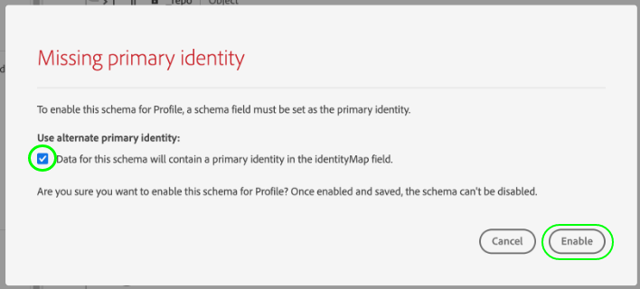

# IAB TCF 2.0 同意データを取得するためのデータセットの作成

Adobe Experience Platformが IAB に従って顧客の同意データを処理するため [!DNL Transparency & Consent Framework] (TCF)2.0 の場合、このデータは、TCF 2.0 の同意フィールドを含むスキーマのデータセットに送信する必要があります。

特に、TCF 2.0 同意データを取得するには、2 つのデータセットが必要です。

* に基づくデータセット [!DNL XDM Individual Profile] クラス、で使用可能 [!DNL Real-time Customer Profile].
* に基づくデータセット [!DNL XDM ExperienceEvent] クラス。

>[!IMPORTANT]
>
>Platform は、個々のプロファイルデータセットで収集された TCF 文字列のみを強制します。 このワークフローの一部としてデータストリームを作成するには ExperienceEvent データセットが引き続き必要ですが、データをプロファイルデータセットに取り込むだけで済みます。 ExperienceEvent データセットは、引き続き、時間の経過と共に同意の変更イベントを追跡する場合に使用できますが、セグメントのアクティベーション時にこれらの値が適用される際には使用されません。

このドキュメントでは、これら 2 つのデータセットを設定する手順を説明します。 TCF 2.0 用に Platform データ操作を設定するための完全なワークフローの概要については、 [IAB TCF 2.0 準拠の概要](./overview.md).

## 前提条件

このチュートリアルは、Adobe Experience Platform の次のコンポーネントを実際に利用および理解しているユーザーを対象としています。

* [エクスペリエンスデータモデル（XDM）](../../../../xdm/home.md)：[!DNL Experience Platform] が顧客エクスペリエンスデータを整理する際に使用する標準化されたフレームワーク。
   * [スキーマ構成の基本](../../../../xdm/schema/composition.md)：XDM スキーマの基本的な構成要素について説明します。
* [Adobe Experience Platform Identity Service](../../../../identity-service/home.md):デバイスやシステムをまたいで、異なるデータソースから顧客 ID を結び付けることができます。
   * [ID 名前空間](../../../../identity-service/namespaces.md):顧客 ID データは、ID サービスで認識される特定の ID 名前空間で提供される必要があります。
* [リアルタイム顧客プロファイル](../../../../profile/home.md):活用 [!DNL Identity Service] を使用すると、データセットから詳細な顧客プロファイルをリアルタイムで作成できます。 [!DNL Real-time Customer Profile] はデータレイクからデータを取り込み、顧客プロファイルを独自の別々のデータストアに保持します。

## TCF 2.0 フィールドグループ {#field-groups}

この [!UICONTROL IAB TCF 2.0 同意の詳細] スキーマフィールドグループは、TCF 2.0 のサポートに必要な顧客の同意フィールドを提供します。 このフィールドグループには、次の 2 つのバージョンがあります。～と相性のある人 [!DNL XDM Individual Profile] クラスで、もう 1 つは [!DNL XDM ExperienceEvent] クラス。

以下の節では、取得時に予想されるデータを含め、これらの各フィールドグループの構造について説明します。

### プロファイルフィールドグループ {#profile-field-group}

に基づくスキーマの場合 [!DNL XDM Individual Profile]、 [!UICONTROL IAB TCF 2.0 同意の詳細] フィールドグループには、単一のマップタイプフィールドが用意されています。 `identityPrivacyInfo`：顧客 ID を TCF の同意設定にマッピングします。 自動強制を実行するには、このフィールドグループを、リアルタイム顧客プロファイルで有効になるレコードベースのスキーマに含める必要があります。

詳しくは、 [リファレンスガイド](../../../../xdm/field-groups/profile/iab.md) このフィールドグループの構造と使用例について詳しくは、こちらを参照してください。

### イベントフィールドグループ {#event-field-group}

同意変更イベントを経時的に追跡する場合は、 [!UICONTROL IAB TCF 2.0 同意の詳細] フィールドグループを [!UICONTROL XDM ExperienceEvent] スキーマ。

経時的に同意の変化イベントを追跡する予定がない場合は、イベントスキーマにこのフィールドグループを含める必要はありません。 TCF の同意値を自動的に強制する場合、Experience Platformは、 [プロファイルフィールドグループ](#profile-field-group). イベントでキャプチャされた同意の値は、自動実施ワークフローには関与しません。

詳しくは、 [リファレンスガイド](../../../../xdm/field-groups/event/iab.md) を参照してください。

## 顧客の同意スキーマの作成 {#create-schemas}

同意データをキャプチャするデータセットを作成するには、まず XDM スキーマを作成して、これらのデータセットを基にする必要があります。

前の節で説明したように、 [!UICONTROL XDM 個人プロファイル] クラスは、ダウンストリームの Platform ワークフローで同意を強制するために必要です。 オプションで、 [!UICONTROL XDM ExperienceEvent] 同意の変化を時間の経過と共に追跡する場合。 両方のスキーマには、 `identityMap` フィールドおよび適切な TCF 2.0 フィールドグループにマッピングされます。

Platform UI で、「 **[!UICONTROL スキーマ]** 左側のナビゲーションで、 [!UICONTROL スキーマ] ワークスペース。 ここから、以下の節の手順に従って、必要な各スキーマを作成します。

>[!NOTE]
>
>同意データの取得に使用する既存の XDM スキーマがある場合、新しく作成する代わりにこれらのスキーマを編集できます。 ただし、既存のスキーマのリアルタイム顧客プロファイルでの使用が有効になっている場合、そのプライマリ ID を、電子メールアドレスなどの興味に基づいた広告での使用を禁止する、直接識別可能なフィールドにすることはできません。 どのフィールドが制限されているかが不明な場合は、弁護士に相談してください。
>
>また、既存のスキーマを編集する場合、改行しない追加的な変更のみを加えることができます。 詳しくは、 [スキーマ進化の原理](../../../../xdm/schema/composition.md#evolution) を参照してください。

### プロファイル同意スキーマの作成 {#profile-schema}

選択 **[!UICONTROL スキーマを作成]**&#x200B;を選択して、 **[!UICONTROL XDM 個人プロファイル]** をドロップダウンメニューから選択します。

この **[!UICONTROL フィールドグループを追加]** ダイアログが表示され、すぐにフィールドグループのスキーマへの追加を開始できます。 ここからを選択します。 **[!UICONTROL IAB TCF 2.0 同意の詳細]** を選択します。 オプションで、検索バーを使用して結果を絞り込み、フィールドグループを見つけやすくすることができます。

次に、 **[!UICONTROL IdentityMap]** フィールドグループを選択し、同様に選択します。 両方のフィールドグループが右側のパネルに表示されたら、 **[!UICONTROL フィールドグループを追加]**.

キャンバスが再び表示され、 `identityPrivacyInfo` および `identityMap` フィールドがスキーマ構造に追加されました。

スキーマにフィールドを追加する前に、ルートフィールドを選択して表示します **[!UICONTROL スキーマのプロパティ]** 右側のレールで、スキーマの名前と説明を指定できます。

名前と説明を指定した後、「 」を選択して、さらにフィールドをスキーマに追加できます。 **[!UICONTROL 追加]** の下に **[!UICONTROL フィールドグループ]** 」セクションをクリックします。

既に [!DNL Real-time Customer Profile]を選択します。 **[!UICONTROL 保存]** をクリックして変更を確定してから、 [同意スキーマに基づくデータセットの作成](#dataset). 新しいスキーマを作成する場合は、次のサブセクションで説明する手順に従います。

#### でのスキーマ使用の有効化 [!DNL Real-time Customer Profile]

Platform が受け取った同意データを特定の顧客プロファイルに関連付けるには、での使用を同意スキーマで有効にする必要があります。 [!DNL Real-time Customer Profile].

>[!NOTE]
>
>この節で示すサンプルのスキーマは、を使用しています `identityMap` フィールドをプライマリ ID として設定します。 別のフィールドをプライマリ ID として設定する場合は、Cookie ID などの間接識別子を使用し、電子メールアドレスなど、興味/関心に基づく広告で使用できない直接識別フィールドを使用していないことを確認してください。 どのフィールドが制限されているかが不明な場合は、弁護士に相談してください。
>
>スキーマのプライマリ ID フィールドを設定する手順については、 [[!UICONTROL スキーマ] UI ガイド](../../../../xdm/ui/fields/identity.md).

のスキーマを有効にするには、以下を実行します。 [!DNL Profile]をクリックし、左側のパネルでスキーマの名前を選択して、 **[!UICONTROL スキーマのプロパティ]** 」セクションに入力します。 ここから、 **[!UICONTROL プロファイル]** 切り替えボタン。

見つからないプライマリ ID を示すポップオーバーが表示されます。 プライマリ ID は `identityMap` フィールドに入力します。

最後に、 **[!UICONTROL 保存]** 変更を確定します。

### イベント同意スキーマの作成 {#event-schema}

>[!NOTE]
>
>イベント同意スキーマは、時間の経過と共に同意の変更イベントを追跡する目的でのみ使用され、ダウンストリーム実施ワークフローには参加しません。 時間の経過と共に同意の変更を追跡しない場合は、次の [同意データセットの作成](#datasets).

内 **[!UICONTROL スキーマ]** ワークスペース、選択 **[!UICONTROL スキーマを作成]**&#x200B;を選択して、 **[!UICONTROL XDM ExperienceEvent]** をドロップダウンから選択します。

この **[!UICONTROL フィールドグループを追加]** ダイアログが表示されます。 ここからを選択します。 **[!UICONTROL IAB TCF 2.0 同意の詳細]** を選択します。 オプションで、検索バーを使用して結果を絞り込み、フィールドグループを見つけやすくすることができます。

次に、 **[!UICONTROL IdentityMap]** フィールドグループを選択し、同様に選択します。 両方のフィールドグループが右側のパネルに表示されたら、 **[!UICONTROL フィールドグループを追加]**.

キャンバスが再び表示され、 `consentStrings` および `identityMap` フィールドがスキーマ構造に追加されました。

スキーマにフィールドを追加する前に、ルートフィールドを選択して表示します **[!UICONTROL スキーマのプロパティ]** 右側のレールで、スキーマの名前と説明を指定できます。

名前と説明を指定した後、「 」を選択して、さらにフィールドをスキーマに追加できます。 **[!UICONTROL 追加]** の下に **[!UICONTROL フィールドグループ]** 」セクションをクリックします。

必要なフィールドグループを追加したら、「 」を選択して完了します。 **[!UICONTROL 保存]**.

## 同意スキーマに基づくデータセットの作成 {#datasets}

上記の必要なスキーマごとに、顧客の同意データを最終的に取り込むデータセットを作成する必要があります。 レコードスキーマに基づくデータセットを有効にする必要があります [!DNL Real-time Customer Profile]（時系列スキーマに基づくデータセット） **次の値を指定しない** は [!DNL Profile]-enabled。

最初に、 **[!UICONTROL データセット]** 左側のナビゲーションで、「 **[!UICONTROL データセットを作成]** をクリックします。

次のページで、 **[!UICONTROL スキーマからデータセットを作成]**.

この **[!UICONTROL スキーマからデータセットを作成]** ワークフローが表示され、 **[!UICONTROL スキーマを選択]** 手順 提供されたリストで、以前に作成した同意スキーマの 1 つを探します。 オプションで、検索バーを使用して結果を絞り込み、スキーマを見つけやすくすることができます。 目的のスキーマの横にあるラジオボタンを選択し、「 」を選択します。 **[!UICONTROL 次へ]** をクリックして続行します。

**[!UICONTROL データセットの設定]**&#x200B;手順が表示されます。選択する前に、データセットの一意で、簡単に識別できる名前と説明を指定します **[!UICONTROL 完了]**.

新しく作成されたデータセットの詳細ページが表示されます。 データセットが時系列スキーマに基づいている場合、プロセスは完了です。 データセットがレコードスキーマに基づいている場合、プロセスの最後の手順は、で使用するデータセットを有効にすることです [!DNL Real-time Customer Profile].

右側のレールで、 **[!UICONTROL プロファイル]** 切り替えて、「 **[!UICONTROL 有効にする]** 確認ポップオーバーで、次のスキーマを有効にします。 [!DNL Profile].

上記の手順に従って、イベントベースのデータセットのスキーマを作成した場合は、そのデータセットを作成します。

## 次の手順

このチュートリアルに従って、顧客の同意データの収集に使用できるデータセットを少なくとも 1 つ作成しました。

* リアルタイム顧客プロファイルで使用できる、レコードベースのデータセットです。 **(必須)**
* に対して有効になっていない時系列ベースのデータセット [!DNL Profile]. （オプション）

これで、 [IAB TCF 2.0 の概要](./overview.md#merge-policies) をクリックして、TCF 2.0 への準拠を目的とした Platform の設定プロセスを続行します。
