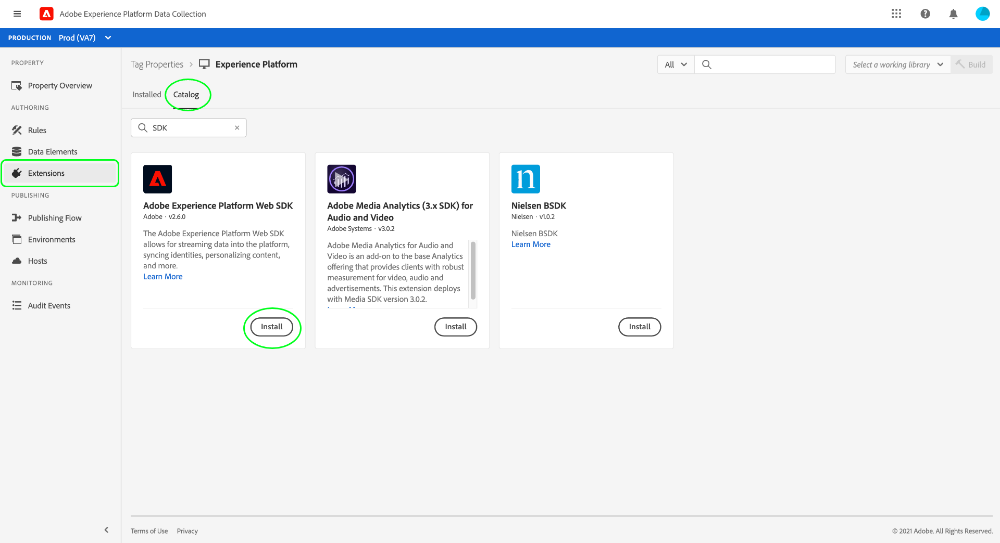

# 顧客の同意データを処理するための Platform Web SDK の統合

Adobe Experience Platform Web SDK を使用すると、同意管理プラットフォーム (CMP) によって生成された顧客の同意シグナルを取得し、同意変更イベントが発生するたびにそれらをAdobe Experience Platformに送信できます。

**SDK は、標準の** CMP とのインターフェイスを取りません。SDK を Web サイトに統合する方法を決定し、CMP で同意の変更をリッスンして、適切なコマンドを呼び出す必要があります。 このドキュメントでは、CMP を Platform Web SDK と統合する方法に関する一般的なガイダンスを提供します。

## 前提条件 {#prerequisites}

このチュートリアルは、CMP 内で同意データを生成する方法が既に決定済みであることと、Adobe標準または IAB Transparency and Consent Framework(TCF)2.0 標準に準拠する同意フィールドを含むデータセットが作成されていることを前提としています。 このデータセットをまだ作成していない場合は、このガイドに戻る前に、次のチュートリアルを参照してください。

* [データセット標準を使用したAdobeの作成](./adobe/dataset.md)
* [TCF 2.0 標準を使用したデータセットの作成](./iab/dataset.md)

このガイドでは、データ収集 UI のタグ拡張機能を使用して SDK を設定するワークフローに従います。 拡張機能を使用せず、スタンドアロンバージョンの SDK をサイトに直接埋め込む場合は、このガイドの代わりに次のドキュメントを参照してください。

* [データストリームの設定](../../../edge/fundamentals/datastreams.md)
* [SDK のインストール](../../../edge/fundamentals/installing-the-sdk.md)
* [SDK の設定 同意コマンド](../../../edge/consent/supporting-consent.md)

このガイドのインストール手順では、タグの拡張機能と、Web アプリケーションでのタグのインストール方法に関する十分な知識が必要です。 詳しくは、次のドキュメントを参照してください。

* [タグの概要](../../../tags/home.md)
* [クイックスタートガイド](../../../tags/quick-start/quick-start.md)
* [公開の概要](../../../tags/ui/publishing/overview.md)

## データストリームの設定

SDK がデータをExperience Platformに送信するには、まずデータストリームを設定する必要があります。 データ収集 UI で、左のナビゲーションで「**[!UICONTROL Datastreams]**」を選択します。

新しいデータストリームを作成するか、編集する既存のデータストリームを選択した後、**[!UICONTROL Adobe Experience Platform]** の横にある切り替えボタンを選択します。 次に、以下に示す値を使用して、フォームに入力します。


| Datastream フィールド | 値 |
| --- | --- |
| [!UICONTROL サンドボックス] | 必要なストリーミング接続と、データストリームを設定するためのデータセットを含む、プラットフォーム [ サンドボックス ](../../../sandboxes/home.md) の名前。 |
| [!UICONTROL ストリーミングインレット] | 有効なストリーミングExperience Platform。 既存のストリーミングインレットがない場合は、[ ストリーミング接続の作成 ](../../../ingestion/tutorials/create-streaming-connection-ui.md) に関するチュートリアルを参照してください。 |
| [!UICONTROL イベントデータセット] | SDK を使用してにイベントデータを送信する予定の [!DNL XDM ExperienceEvent] データセット。 Platform データストリームを作成するには、イベントデータセットを提供する必要がありますが、イベントを介して送信される同意データは、ダウンストリーム実施ワークフローでは受け入れられないことに注意してください。 |
| [!UICONTROL プロファイルデータセット] | [ 以前 ](#prerequisites) に作成した、顧客の同意フィールドを含む [!DNL Profile] が有効なデータセット。 |

終了したら、画面の下部で「**[!UICONTROL 保存]**」を選択し、追加のプロンプトに従って設定を完了します。

## Platform Web SDK のインストールと設定

前の節で説明したようにデータストリームを作成したら、最終的にサイトにデプロイする Platform Web SDK 拡張機能を設定する必要があります。 タグプロパティに SDK 拡張機能がインストールされていない場合は、左側のナビゲーションで「**[!UICONTROL 拡張機能]**」を選択し、「**[!UICONTROL カタログ]**」タブを選択します。 次に、使用可能な拡張機能のリストで、「Platform SDK 拡張機能」の下の「**[!UICONTROL インストール]**」を選択します。



SDK を設定する際に、「**[!UICONTROL Edge Configurations]**」で、前の手順で作成したデータストリームを選択します。


「**[!UICONTROL 保存]**」を選択して、拡張機能をインストールします。

### デフォルトの同意を設定するデータ要素の作成

SDK 拡張機能がインストールされている場合、ユーザーのデフォルトのデータ収集同意値 (`collect.val`) を表すデータ要素を作成できます。 これは、EU のユーザーには `pending`、北米のユーザーには `in` など、ユーザーに応じて異なるデフォルト値を使用する場合に便利です。

この使用例では、次の方法を導入して、ユーザーの地域に基づいてデフォルトの同意を設定できます。

1. Web サーバー上のユーザーの地域を特定します。
1. Web ページの `script` タグ（埋め込みコード）の前に、ユーザーの地域に基づいて `adobeDefaultConsent` 変数を設定する別の `script` タグをレンダリングします。
1. `adobeDefaultConsent` JavaScript 変数を使用するデータ要素を設定し、このデータ要素をユーザーのデフォルトの同意値として使用します。

ユーザーの領域が CMP によって決定される場合は、次の手順を使用できます。

1. ページ上の「CMP 読み込み」イベントを処理します。
1. イベントハンドラーで、ユーザーの地域に基づいて `adobeDefaultConsent` 変数を設定し、JavaScript を使用してタグライブラリスクリプトを読み込みます。
1. `adobeDefaultConsent` JavaScript 変数を使用するデータ要素を設定し、このデータ要素をユーザーのデフォルトの同意値として使用します。

データ収集 UI でデータ要素を作成するには、左のナビゲーションで「**[!UICONTROL データ要素]**」を選択し、「**[!UICONTROL データ要素を追加]**」を選択して、データ要素作成ダイアログに移動します。

ここから、`adobeDefaultConsent` に基づいて [!UICONTROL JavaScript 変数 ] データ要素を作成する必要があります。 完了したら、「**[!UICONTROL 保存]**」をクリックします。


データ要素を作成したら、 Web SDK 拡張機能の設定ページに戻ります。 「[!UICONTROL  プライバシー ]」セクションで、「**[!UICONTROL データ要素で指定]**」を選択し、指定したダイアログを使用して、前に作成したデフォルトの同意データ要素を選択します。


### Web サイトに拡張機能をデプロイする

拡張機能の設定が完了すると、Web サイトに統合できます。 更新されたライブラリビルドのデプロイ方法について詳しくは、タグドキュメントの [ パブリッシングガイド ](../../../tags/ui/publishing/overview.md) を参照してください。

## 同意変更コマンドの実行 {#commands}

SDK 拡張機能を Web サイトに統合したら、Platform Web SDK `setConsent` コマンドを使用して、Platform に同意データを送信できます。

>[!IMPORTANT]
>
>`setConsent` コマンドは、プロファイルストア内のデータのみを直接更新し、データレイクにデータを送信しません。

サイトで `setConsent` を呼び出すシナリオは 2 つあります。

1. 同意がページに読み込まれると（つまり、ページの読み込みごとに）
1. 同意設定の変更を検出する CMP フックまたはイベントリスナーの一部として

>[!NOTE]
>
>Platform SDK コマンドの一般的な構文の概要については、[ コマンドの実行 ](../../../edge/fundamentals/executing-commands.md) に関するドキュメントを参照してください。

`setConsent` コマンドは、次の 2 つの引数を受け取ります。

1. コマンドの種類を示す文字列（この場合は `"setConsent"`）
1. 単一の配列タイププロパティを含むペイロードオブジェクト：`consent`. `consent` 配列には、Adobe標準に必要な同意フィールドを提供するオブジェクトが少なくとも 1 つ含まれている必要があります。

Adobe標準に必要な同意フィールドは、次の `setConsent` 呼び出し例に示されています。

```js
alloy("setConsent", {
  consent: [{
    standard: "Adobe",
    version: "2.0",
    value: {
      collect: {
        val: "y"
      },
      share: {
        val: "y"
      },
      personalize: {
        content: {
          val: "y"
        }
      },
      metadata: {
        time: "2020-10-12T15:52:25+00:00"
      }
    }
  }]
});
```

| ペイロードプロパティ | 説明 |
| --- | --- |
| `standard` | 使用される同意基準。 Adobe標準の場合、この値は `Adobe` に設定する必要があります。 |
| `version` | `standard` で示された同意基準のバージョン番号。 Adobe標準の同意処理の場合、この値は `2.0` に設定する必要があります。 |
| `value` | プロファイル対応データセットの同意フィールドの構造に適合する XDM オブジェクトとして提供される、顧客の更新された同意情報。 |

>[!NOTE]
>
>`Adobe`（`IAB TCF` など）と組み合わせて他の同意標準を使用する場合は、各標準の `consent` 配列にオブジェクトを追加できます。 各オブジェクトには、表す同意基準に応じた適切な値 `standard`、`version` および `value` が含まれている必要があります。

次の JavaScript は、Web サイトで同意設定の変更を処理する関数の例を示しています。この関数は、イベントリスナーまたは CMP フックのコールバックとして使用できます。

```js
var setConsent = function () {

  // Retrieve the current consent data.
  var categories = getConsentData();

  // If the script is running on a consent change, generate a new timestamp.
  // If the script is running on page load, set the timestamp to when the consent values last changed.
  var now = new Date();
  var collectedAt = consentChanged ? now.toISOString() : categories.collectedAt;

  //  Map the consent values and timestamp to XDM
  var consentXDM = {
    collect: {
      val: categories.collect !== -1 ? "y" : "n"
    },
    personalize: {
      content: {
        val: categories.personalizeContent !== -1 ? "y" : "n"
      }
    },
    share: {
      val: categories.share !== -1 ? "y" : "n"
    },
    metadata: {
      time: collectedAt
    }
  };

  // Pass the XDM object to the Platform Web SDK
  alloy("setConsent", {
    consent: [{
      standard: "Adobe",
      version: "2.0",
      value: consentXDM
    }]
  });
});
```

## SDK 応答の処理

すべての [!DNL Platform SDK] コマンドは、呼び出しが成功したか失敗したかを示す promise を返します。 その後、これらの応答を、顧客への確認メッセージの表示などの追加ロジックに使用できます。 具体的な例については、SDK コマンドの実行に関するガイドの [ 成功または失敗 ](../../../edge/fundamentals/executing-commands.md#handling-success-or-failure) の処理に関する節を参照してください。

SDK で `setConsent` の呼び出しが正常に完了したら、Platform UI のプロファイルビューアを使用して、データがプロファイルストアにランディングしているかどうかを確認できます。 詳しくは、[ID によるプロファイルの参照 ](../../../profile/ui/user-guide.md#browse-identity) の節を参照してください。

## 次の手順

このガイドに従うことで、同意データを Platform Web SDK 拡張機能に送信するようにExperience Platformを設定しました。 実装のテストに関するガイダンスについては、実装する同意標準のドキュメントを参照してください。

* [Adobe 標準](./adobe/overview.md#test)
* [TCF 2.0 標準](./iab/overview.md#test)
