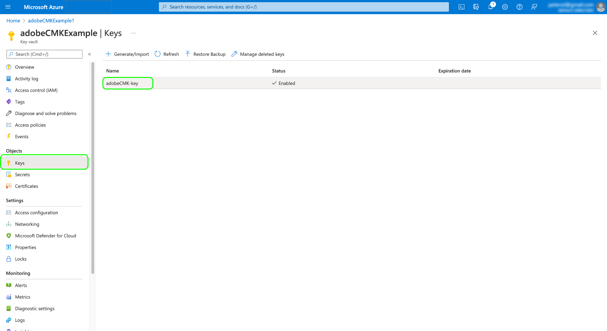

# Adobe Experience Platform の顧客管理キー

Adobe Experience Platform に保存されたデータは、システムレベルのキーを使用して保存時に暗号化されます。 Platform 上に構築されたアプリケーションを使用している場合は、代わりに独自の暗号化キーを使用するよう選択すると、データのセキュリティをより詳細に制御できます。

>[!NOTE]
>
>Adobe Experience Platformのデータレイクとプロファイルストアのデータは、CMK を使用して暗号化されます。 これらは主要なデータストアと見なされます。

このドキュメントでは、Platform で顧客管理キー（CMK）機能を有効にするプロセスについて説明します。

## 前提条件

CMK を有効にするには、 [!DNL Azure] Key Vault は、次の設定で構成する必要があります。

* [消去保護を有効にする](https://learn.microsoft.com/en-us/azure/key-vault/general/soft-delete-overview#purge-protection)
* [ソフトデリートを有効にする](https://learn.microsoft.com/en-us/azure/key-vault/general/soft-delete-overview)
* [次を使用してアクセスを設定 [!DNL Azure] ロールベースのアクセス制御](https://learn.microsoft.com/en-us/azure/role-based-access-control/)

## プロセスの概要

CMK は、アドビの Healthcare Shield サービスおよび Privacy and Security Shield サービスに含まれています。お客様の組織がこれらの製品の 1 つに対するライセンスを購入すると、1 回限りのプロセスで機能を設定できます。

>[!WARNING]
>
>CMK を設定した後は、システム管理キーに戻すことはできません。 キーを安全に管理し、[!DNL Azure] 内で Key Vault、キー、CMK アプリへのアクセスを提供して、データへのアクセスが失われないようにする責任があります。

プロセスは以下のようになります。

1. [組織のポリシーに基づく  [!DNL Azure] Key Vault](#create-key-vault) を設定してから、最終的にアドビと共有される[暗号化キーを生成](#generate-a-key)します。
1. API 呼び出しを使用して、[!DNL Azure] テナントで [CMK アプリを設定](#register-app)します。
1. API 呼び出しを使用して[暗号化キー ID をアドビに送信](#send-to-adobe)し、機能のイネーブルメントプロセスを開始します。
1. [設定のステータスの確認](#check-status)：CMK が有効になっているかどうかを確認します。

設定プロセスが完了すると、すべてのサンドボックスをまたいで Platform にオンボードされたデータがすべて、[!DNL Azure] キーの設定を使用して暗号化されます。CMK を使用するには、[公開プレビュープログラム](https://azure.microsoft.com/ja-jp/support/legal/preview-supplemental-terms/)の一部である [!DNL Microsoft Azure] 機能を活用します。

## [!DNL Azure] Key Vault の設定 {#create-key-vault}

CMK は、[!DNL Microsoft Azure] Key Vault からのキーのみをサポートします。作業を開始するには、[!DNL Azure] を使用して新しいエンタープライズアカウントを作成するか、既存のエンタープライズアカウントを使用して、以下の手順に従って Key Vault を作成する必要があります。

>[!IMPORTANT]
>
>[!DNL Azure] Key Vault の Premium と Standard のサービスレベルのみがサポートされています。[!DNL Azure Managed HSM]、[!DNL Azure Dedicated HSM] および [!DNL Azure Payments HSM] ではサポートされていません。提供されるキー管理サービスについて詳しくは、[[!DNL Azure] ドキュメント](https://learn.microsoft.com/ja-jp/azure/security/fundamentals/key-management#azure-key-management-services)を参照してください。

>[!NOTE]
>
>以下のドキュメントでは、Key Vault を作成する基本的な手順についてのみ説明します。 このガイダンス以外では、組織のポリシーに従って Key Vault を設定する必要があります。

[!DNL Azure] ポータルにログインし、検索バーを使用してサービスのリストの下にある **[!DNL Key vaults]** を見つけます。


サービスを選択すると、**[!DNL Key vaults]** ページが表示されます。 ここから **[!DNL Create]** を選択します。 


提供されたフォームを使用して、名前や割り当てられたリソースグループなど、Key Vault の基本的な詳細を入力します。

>[!WARNING]
>
>ほとんどのオプションはデフォルト値のままでかまいませんが、**必ずソフト削除および消去保護オプションを有効にしてください**。これらの機能を有効にしないと、Key Vault が削除された場合に、データへのアクセスが失われる可能性があります。
>
>

ここから、Key Vault の作成ワークフローを続け、組織のポリシーに従って様々なオプションを設定します。

**[!DNL Review + create]** 手順に達したら、検証中に Key Vault の詳細を確認できます。 検証に問題がなければ、「**[!DNL Create]**」を選択してプロセスを完了します。


### ネットワークオプションの設定

公開アクセスを特定の仮想ネットワークに制限するように Key Vault が設定されている場合、または公開アクセスを完全に無効にする場合は、Microsoft にファイアウォールの例外を許可する必要があります。

左側のナビゲーションの「**[!DNL Networking]**」を選択します。 **[!DNL Firewalls and virtual networks]** の下で、「**[!DNL Allow trusted Microsoft services to bypass this firewall]**」チェックボックスを選択し、「**[!DNL Apply]**」を選択します。


### キーの生成 {#generate-a-key}

Key Vault を作成したら、新しいキーを生成できます。 「**[!DNL Keys]**」タブに移動し、「**[!DNL Generate/Import]**」を選択します。


提供されたフォームを使用してキーの名前を指定し、キータイプに「**RSA**」を選択します。少なくとも、 **[!DNL RSA key size]** は、少なくとも **3072** 必要なビット数 [!DNL Cosmos DB]. [!DNL Azure Data Lake Storage] は、RSA 3027 とも互換性があります。

>[!NOTE]
>
>キーに指定した名前を覚えておきます。これは、後の手順で[キーをアドビに送信する](#send-to-adobe)ときに使用します。

残りのコントロールを使用して、必要に応じて生成または読み込むキーを設定します。終了したら「**[!DNL Create]**」を選択します。


設定されたキーが、Vault のキーのリストに表示されます。


## CMK アプリのセットアップ {#register-app}

Key Vault を設定したら、次の手順は、[!DNL Azure] テナントにリンクする CMK アプリケーションを登録します 。

### Destination SDK の

CMK アプリを登録するには、Platform API を呼び出す必要があります。 これらの呼び出しを行うために必要な認証ヘッダーの収集方法について詳しくは、[Platform API 認証ガイド](../../landing/api-authentication.md)を参照してください。

認証ガイドでは、必要である `x-api-key` リクエストヘッダーに独自の一意の値を生成する方法を説明していますが、このガイドのすべての API 操作では、代わりに、静的な値 `acp_provisioning` が使用されます。ただし、`{ACCESS_TOKEN}` と `{ORG_ID}` には独自の値を指定する必要があります。

このガイドに示すすべての API 呼び出しでは、 `platform.adobe.io` はルートパスとして使用され、デフォルトは VA7 地域です。 組織が異なる地域を使用している場合、 `platform` は、組織に割り当てられたダッシュと地域コードの後に付く必要があります。 `nld2` (NLD2 または `aus5` AUS5 の場合 ( 例： `platform-aus5.adobe.io`) をクリックします。 組織の地域が不明な場合は、システム管理者にお問い合わせください。

### 認証 URL の取得

登録プロセスを開始するには、アプリ登録エンドポイントに対して GET リクエストを実行し、組織に必要な認証 URL を取得します。

**リクエスト**

```shell
curl -X GET \
  https://platform.adobe.io/data/infrastructure/manager/byok/app-registration \ 
  -H 'Authorization: Bearer {ACCESS_TOKEN}' \
  -H 'x-api-key: acp_provisioning' \
  -H 'x-gw-ims-org-id: {ORG_ID}'
```

**応答**

成功した応答は、認証 URL を含む `applicationRedirectUrl` プロパティを返します。

```json
{
    "id": "byok",
    "name": "acpebae9422Caepcmkmultitenantapp",
    "applicationUri": "https://adobe.com/acpebae9422Caepcmkmultitenantapp",
    "applicationId": "e463a445-c6ac-4ca2-b36a-b5146fcf6a52",
    "applicationRedirectUrl": "https://login.microsoftonline.com/common/oauth2/authorize?response_type=code&client_id=e463a445-c6ac-4ca2-b36a-b5146fcf6a52&redirect_uri=https://adobe.com/acpebae9422Caepcmkmultitenantapp&scope=user.read"
}
```

`applicationRedirectUrl` アドレスをコピーしてブラウザーに貼り付け、認証ダイアログを開きます。**[!DNL Accept]** を選択して、CMK アプリサービスプリンシパルを [!DNL Azure] テナントに追加します。


### CMK アプリを役割に割り当てます。 {#assign-to-role}

認証プロセスが完了したら、[!DNL Azure] Key Vault に戻り、左側のナビゲーションで **[!DNL Access control]** を選択します。 ここから **[!DNL Add]** を選択し、続けて **[!DNL Add role assignment]** を選択します。


次の画面では、この割り当ての役割を選択するように求められます。**[!DNL Key Vault Crypto Service Encryption User]** を選択してから **[!DNL Next]** を選択し、続行します。


次の画面で、「**[!DNL Select members]**」 を選択して、右側のパネルでダイアログを開きます。 検索バーを使用して CMK アプリケーションのサービスプリンシパルを見つけ、リストから選択します。 終了したら「**[!DNL Save]**」を選択します。

>[!NOTE]
>
>リストにアプリケーションが見つからない場合は、サービスプリンシパルがテナントに受け入れられていません。 [!DNL Azure] 管理者または担当者と協力して、適切な権限を持っていることを確認してください。

## Experience Platform の暗号化キー設定を有効にする {#send-to-adobe}

CMK アプリを [!DNL Azure] にインストールすると、暗号化キー識別子をアドビに送信できます。 左側のナビゲーションで「**[!DNL Keys]**」を選択し、次に送信するキーの名前を選択します。



キーの最新バージョンを選択すると、その詳細ページが表示されます。ここから、オプションでキーに対して許可する操作を設定できます。少なくとも、キーには **[!DNL Wrap Key]** および **[!DNL Unwrap Key]** 権限が付与されている必要があります。

「**[!UICONTROL キー識別子]**」フィールドには、キーの URI 識別子が表示されます。次の手順で使用するために、この URI 値をコピーします。


Key Vault の URI を取得したら、POST リクエストを使用して CMK 設定エンドポイントに送信できます。

>[!NOTE]
>
>Key Vault とキーの名前のみがアドビに保存され、キーのバージョンは保存されません。

**リクエスト**

```shell
curl -X POST \
  https://platform.adobe.io/data/infrastructure/manager/customer/config \ 
  -H 'Authorization: Bearer {ACCESS_TOKEN}' \
  -H 'x-api-key: acp_provisioning' \
  -H 'x-gw-ims-org-id: {ORG_ID}' \
  -d '{
        "name": "Config1",
        "type": "BYOK_CONFIG",
        "imsOrgId": "{ORG_ID}",
        "configData": {
          "providerType": "AZURE_KEYVAULT",
          "keyVaultKeyIdentifier": "https://adobecmkexample.vault.azure.net/keys/adobeCMK-key/7c1d50lo28234cc895534c00d7eb4eb4"
        }
      }'
```

| プロパティ | 説明 |
| --- | --- |
| `name` | 設定の名前。この値は、[後の手順](#check-status)で設定のステータスを確認する際に必要なため、覚えておいてください。この値は、大文字と小文字を区別します。 |
| `type` | 設定タイプ。 `BYOK_CONFIG` に設定する必要があります。 |
| `imsOrgId` | 組織 ID。これは、`x-gw-ims-org-id` ヘッダーで指定される値と同じである必要があります。 |
| `configData` | 設定に関する次の詳細が含まれます。<ul><li>`providerType`：`AZURE_KEYVAULT` に設定する必要があります。</li><li>`keyVaultKeyIdentifier`：[以前](#send-to-adobe)にコピーした Key Vault の URI。</li></ul> |

**応答**

正常な応答は、設定ジョブの詳細を返します。

```json
{
  "id": "4df7886b-a122-4391-880b-47888d5c5b92",
  "config": {
    "configData": {
      "keyVaultUri": "https://adobecmkexample.vault.azure.net",
      "keyVaultKeyIdentifier": "https://adobecmkexample.vault.azure.net/keys/adobeCMK-key/7c1d50lo28234cc895534c00d7eb4eb4",
      "keyVersion": "7c1d50lo28234cc895534c00d7eb4eb4",
      "keyName": "Config1",
      "providerType": "AZURE_KEYVAULT"
    },
    "name": "acpcf978863Aaepcmkmultitenantapp",
    "type": "BYOK_CONFIG",
    "imsOrgId": "{IMS_ORG}",
    "status": "NEW"
  },
  "status": "CREATED"
}
```

このジョブは、数分以内に処理を完了する必要があります。

## 設定のステータスの確認 {#check-status}

設定リクエストのステータスを確認するには、GET リクエストを実行します。

**リクエスト**

確認する設定の `name` をパスに追加し（以下の例では `config1`）、`BYOK_CONFIG` に設定された `configType` クエリパラメーターを含める必要があります。

```shell
curl -X GET \
  https://platform.adobe.io/data/infrastructure/manager/customer/config/config1?configType=BYOK_CONFIG \ 
  -H 'Authorization: Bearer {ACCESS_TOKEN}' \
  -H 'x-api-key: acp_provisioning' \
  -H 'x-gw-ims-org-id: {ORG_ID}'
```

**応答**

正常な応答は、ジョブのステータスを返します。

```json
{
  "name": "acpcf978863Aaepcmkmultitenantapp",
  "type": "BYOK_CONFIG",
  "status": "COMPLETED",
  "configData": {
    "keyVaultUri": "https://adobecmkexample.vault.azure.net",
    "keyVaultKeyIdentifier": "https://adobecmkexample.vault.azure.net/keys/adobeCMK-key/7c1d50lo28234cc895534c00d7eb4eb4",
    "keyVersion": "7c1d50lo28234cc895534c00d7eb4eb4",
    "keyName": "Config1",
    "providerType": "AZURE_KEYVAULT"
  },
  "imsOrgId": "{IMS_ORG}",
  "subscriptionId": "cf978863-7325-47b1-8fd9-554b9fdb6c36",
  "id": "4df7886b-a122-4391-880b-47888d5c5b92",
  "rowType": "BYOK_KEY"
}
```

この `status` 属性には、次の意味を持つ 4 つの値のいずれかを指定できます。

1. `RUNNING`：Platform がキーと Key Vault にアクセスできることを検証します。
1. `UPDATE_EXISTING_RESOURCES`：システムは、組織内のすべてのサンドボックスのデータストアに Key Vault とキー名を追加しています。
1. `COMPLETED`：Key Vault とキー名がデータストアに追加されました。
1. `FAILED`：問題が発生しました。主にキー、Key Vault、またはマルチテナントのアプリ設定に関連しています。

## アクセスを取り消し {#revoke-access}

データへの Platform アクセスを取り消す場合は、アプリケーションに関連付けられているユーザーの役割を [!DNL Azure] 内の Key Vault から削除できます。

>[!WARNING]
>
>キー Vault、キー、または CMK アプリを無効にすると、重大な変更がおこなわれる場合があります。 Platform でキー Vault、キー、または CMK アプリが無効になり、データにアクセスできなくなると、そのデータに関連するダウンストリーム操作はできなくなります。 設定を変更する前に、Platform のアクセスを取り消すことによるダウンストリームの影響を理解しておく必要があります。

キーアクセスを削除した後、またはキーを [!DNL Azure] キー vault、この設定がプライマリデータストアに反映されるまでに、数分から 24 時間かかる場合があります。 Platform のワークフローには、パフォーマンスとコアアプリケーションの機能に必要なキャッシュおよび一時的なデータストアも含まれます。 このようなキャッシュされたストアと一時的なストアを通じて CMK 失効を伝達するには、データ処理ワークフローの判断に従って、最大 7 日間かかる場合があります。 例えば、プロファイルダッシュボードはキャッシュデータストアのデータを保持して表示し、更新サイクルの一環としてキャッシュデータストアに保持されているデータの有効期限を 7 日間に設定します。 アプリケーションへのアクセスを再度有効にすると、データが再び使用可能になるまで、同じように遅延時間が発生します。

>[!NOTE]
>
>非プライマリ（キャッシュ/一時的）データの 7 日間のデータセット有効期限には、2 つのユースケース固有の例外があります。 これらの機能について詳しくは、それぞれのドキュメントを参照してください。<ul><li>[Adobe Journey Optimizer URL 短縮サービス](https://experienceleague.adobe.com/docs/journey-optimizer/using/sms/sms-configuration.html?lang=ja#message-preset-sms)</li><li>[エッジ投影](https://experienceleague.adobe.com/docs/experience-platform/profile/home.html#edge-projections)</li></ul>

## 次の手順

上記の手順を完了すると、組織で CMK が正常に有効になります。 プライマリデータストアに取り込まれたデータは、暗号化され、 [!DNL Azure] キー Vault。

