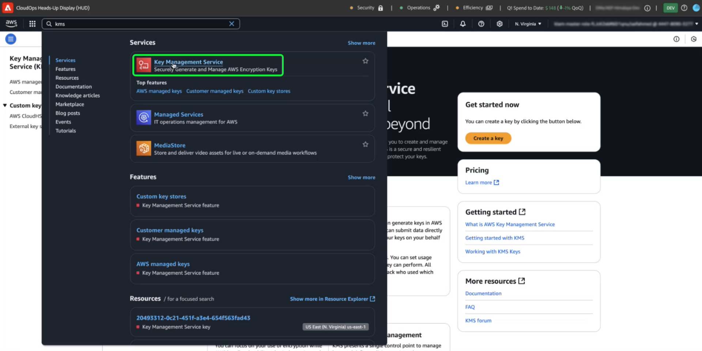
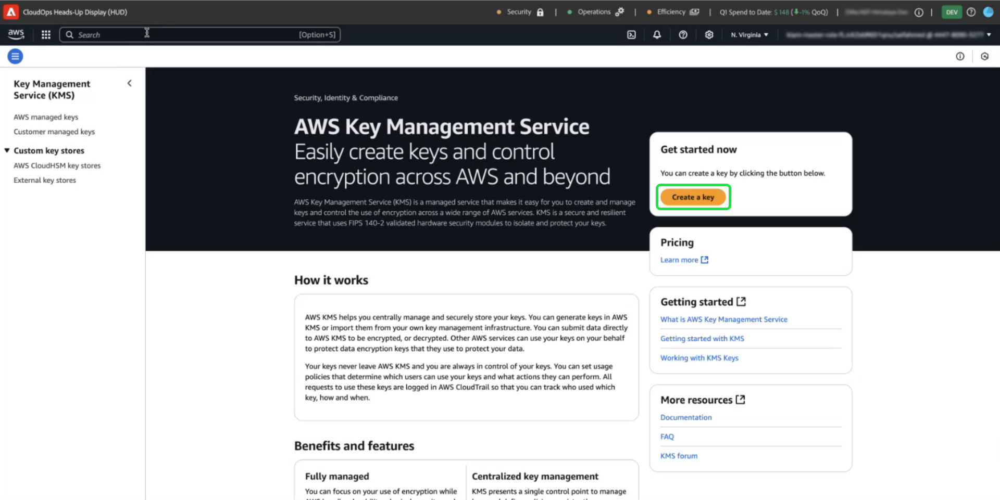
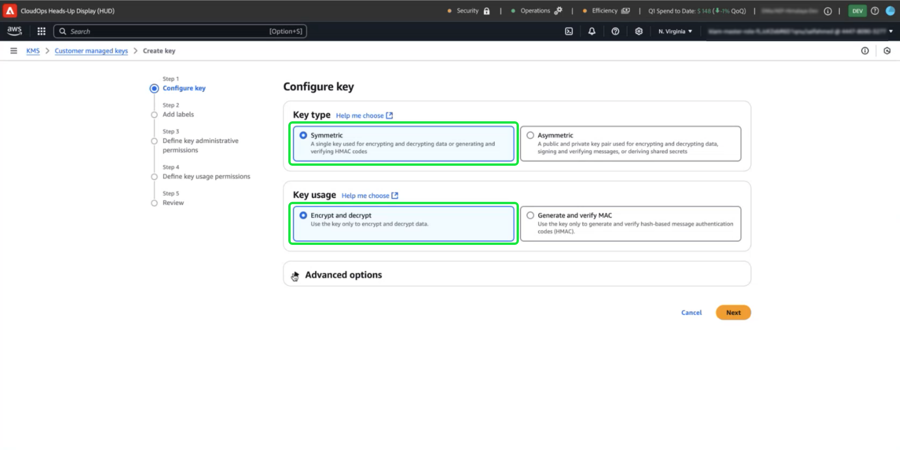
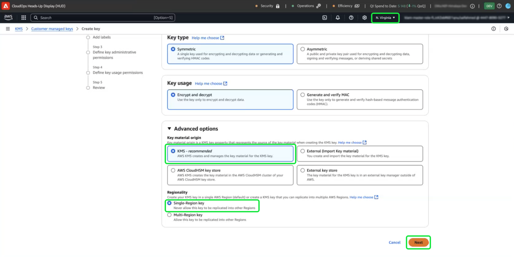
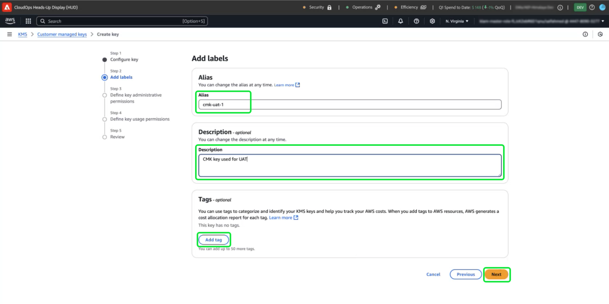
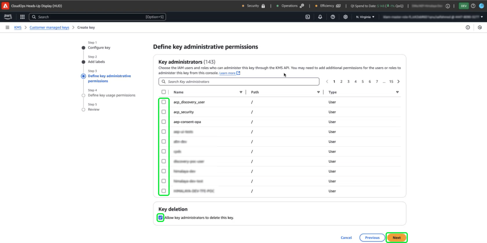
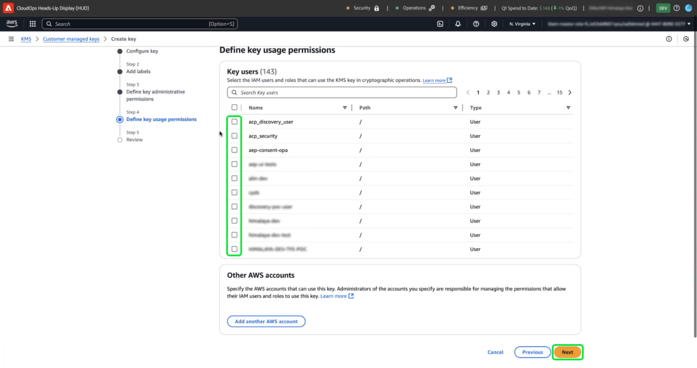
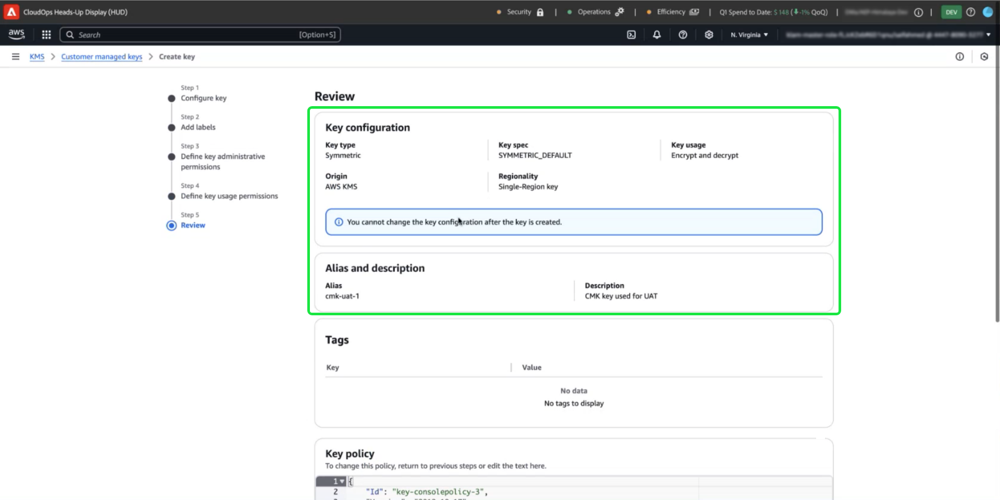

# Customer Managed Keys用のAWS KMSの設定

>[!AVAILABILITY]
>
>このドキュメントは、Amazon Web Services（AWS）で動作するExperience Platformの実装に適用されます。 AWS上で動作するExperience Platformは、現在、一部のお客様にご利用いただけます。 サポートされているExperience Platform インフラストラクチャについて詳しくは、[Experience Platform マルチクラウドの概要](https://experienceleague.adobe.com/en/docs/experience-platform/landing/multi-cloud)を参照してください。

このガイドでは、Adobe Experience Platformの暗号化キーを作成、管理、制御することで、Amazon Web Services（AWS） Key Management Service （KMS）でデータを保護する方法を説明します。 この統合により、コンプライアンスの簡素化、自動化による運用の合理化、独自の主要管理インフラストラクチャを維持する必要性がなくなります。

Customer Journey Analytics固有の手順については、[Customer Journey Analytics CMK ドキュメント &#x200B;](https://experienceleague.adobe.com/en/docs/analytics-platform/using/cja-privacy/cmk)を参照してください

>[!IMPORTANT]
>
>Adobe Experience Platformでは、システム管理キーを使用して、デフォルトで保存中のデータが暗号化されます。 顧客管理キー（CMK）を有効にすると、データセキュリティを完全に制御できます。 ただし、この変更は元に戻すことができません。CMKを有効にすると、システムで管理されているキーに戻すことはできません。 お客様は、データへの中断のないアクセスを確保し、潜在的なアクセシビリティを防ぐために、キーを安全に管理する責任があります。

AWS KMSを使用すれば、Adobe Experience Platformの暗号化キーを一元管理し、データのセキュリティを強化できます。 このガイドに従って、暗号化キーを作成および管理し、データを確実に保護します。

## 前提条件 {#prerequisites}

このドキュメントを続ける前に、次の主要な概念と機能について十分に理解しておく必要があります。

- **AWS Key Management Service （KMS）**：暗号化キーの作成、管理、回転の方法など、AWS KMSの基本を理解します。 詳しくは、[公式KMS ドキュメント &#x200B;](https://docs.aws.amazon.com/kms/)を参照してください。
- AWS **の** Identity and Access Management （IAM） ポリシー：IAMは、AWS サービスとリソースへのアクセスを安全に管理できるサービスです。 IAMを使用して以下を行います。
   - 特定のリソースにアクセスできるユーザー、グループ、役割を定義します。
   - ユーザーが実行を許可または拒否するアクションを指定します。
   - IAM ポリシーを使用して権限を割り当てることで、きめ細かいアクセス制御を実装します。
詳しくは、[AWS KMSのIAM ポリシーの公式ドキュメント &#x200B;](https://docs.aws.amazon.com/kms/latest/developerguide/iam-policies.html)を参照してください。
- **Experience Platformのデータセキュリティ**: Experience Platformがどのようにデータのセキュリティを確保し、暗号化のためにAWS KMSなどの外部サービスと統合するかを説明します。 Experience Platformは、転送時のHTTPS TLS v1.2、クラウドプロバイダーによる保管中の暗号化、隔離ストレージ、カスタマイズ可能な認証および暗号化オプションによってデータを保護します。 データのセキュリティを維持する方法について詳しくは、[&#x200B; ガバナンス、プライバシー、セキュリティの概要](../overview.md)または[Experience Platformでのデータ暗号化](../../encryption.md)のドキュメントを参照してください。
- **AWS Management Console**: 1つのweb ベース アプリケーションからすべてのAWS サービスにアクセスして管理できる中央ハブ。 検索バーを使用して、ツールの検索、通知の確認、アカウントと請求の管理、設定のカスタマイズをすばやく実行できます。 詳しくは、[公式AWS管理コンソールのドキュメント &#x200B;](https://docs.aws.amazon.com/awsconsolehelpdocs/latest/gsg/what-is.html)を参照してください。

## 基本を学ぶ {#get-started}

このガイドでは、Amazon Web Services アカウントへのアクセス権と管理コンソールへのアクセス権を既に持っている必要があります。 次の手順に従って開始してください。

### サポートされている地域を選択 {#select-supported-region}

AWS KMSは、特定の地域で利用できます。 KMSがサポートされている地域で操作していることを確認してください。 サポートされているリージョンの完全なリストは、[AWS KMS エンドポイントおよびクォータ リスト &#x200B;](https://aws.amazon.com/about-aws/global-infrastructure/regional-product-services/)で確認できます。

AWS KMS暗号化キーがAdobe Experience Platform インスタンスと同じリージョンにあることを確認して、データレジデンシー要件への準拠を維持し、パフォーマンスを最適化し、リージョン間の追加コストを回避します。 地域が調整されていない場合、データにアクセスできなくなり、統合に失敗する可能性があります。

### 権限の確認 {#verify-permissions}

KMS内で暗号化キーを作成、管理、使用するために必要なAWS Identity and Access Management （IAM）権限があることを確認します。 権限を確認するには：

1. [IAM ポリシーシミュレーター](https://policysim.aws.amazon.com/)にアクセスします。
2. ユーザーアカウントまたは役割を選択します。
3. `kms:CreateKey`や`kms:Encrypt`などのKMS アクションをシミュレートします。

シミュレーションでエラーが返された場合、または権限がわからない場合は、AWS管理者にお問い合わせください。

### AWS アカウント設定を確認する

AWS アカウントでAWS KMS サービスの使用が有効になっていることを確認します。 ほとんどのアカウントでは、デフォルトでKMS アクセスが有効になっていますが、[AWS Management Console](https://aws.amazon.com/console/)にアクセスして、アカウント設定を確認できます。 詳しくは、[AWS Key Management Service開発者ガイド &#x200B;](https://docs.aws.amazon.com/ja_jp/kms/latest/developerguide/overview.html)を参照してください。

### AWS KMSに移動して、キー設定を開始します

暗号化キーの設定と管理を開始するには、AWS アカウントにログインし、AWS Key Management Service （KMS）に移動します。 AWS Management Consoleで、サービスメニューから「**Key Management Service （KMS）**」を選択します。

## 新しいキーを作成 {#create-a-key}

>[!IMPORTANT]
>
>暗号化キーの安全な保存、アクセス、可用性を確保します。 お客様には、キーを管理し、Experience Platformの運用の中断を防ぐ責任があります。

[!DNL Key Management Service (KMS)] ワークスペースで、**[!DNL Create a key]**&#x200B;を選択します。

## キー設定の設定 {#configure-key}

[!DNL Configure Key] ワークフローが表示されます。 デフォルトでは、キーの種類は&#x200B;**[!DNL Symmetric]**&#x200B;に設定され、キーの使用状況は&#x200B;**[!DNL Encrypt and Decrypt]**&#x200B;に設定されています。 続行する前に、これらのオプションが選択されていることを確認してください。

**[!DNL Advanced options]** ドロップダウンメニューを展開します。 AWSでキーマテリアルを作成および管理できる&#x200B;**[!DNL KMS]** オプションを使用することをお勧めします。 **[!DNL KMS]** オプションはデフォルトで選択されています。

>[!NOTE]
>
>既存のキーがある場合は、外部キー素材を読み込むか、AWS [!DNL CloudHSM] キーストアを使用できます。 これらのオプションについては、このドキュメントの範囲では説明しません。

次に、キーのリージョンスコープを指定する[!DNL Regionality]設定を選択します。 「**[!DNL Single-Region key]**」、「**[!DNL Next]**」の順に選択して、手順2に進みます。

>[!IMPORTANT]
>
>AWSでは、KMS キーにリージョン制限が適用されます。 このリージョン制限は、キーがAdobe アカウントと同じリージョンにある必要があることを意味します。 Adobeは、アカウントのリージョン内にあるKMS キーにのみアクセスできます。 選択したリージョンが、Adobe シングルテナントアカウントのリージョンと一致していることを確認します。

## キーにラベルを付けてタグ付け {#add-labels-and-tags-to-key}

ワークフローの2番目の[!DNL Add labels] ステージが表示されます。 ここでは、[!DNL Alias]および[!DNL Tags] フィールドを設定して、AWS KMS コンソールから暗号化キーを管理および検索するのに役立てています。

キーの説明ラベルを&#x200B;**[!DNL Alias]**&#x200B;入力フィールドに入力します。 エイリアスは、AWS KMS コンソールの検索バーを使用してキーをすばやく見つけるための、使いやすいIDとして機能します。 混乱を避けるために、「Adobe-Experience-Platform-Key」や「Customer-Encryption-Key」など、キーの目的を反映した意味のある名前を選択します。 キーエイリアスが目的を説明するのに不十分な場合は、キーの説明を含めることもできます。

最後に、[!DNL Tags] セクションでキーと値のペアを追加して、キーにメタデータを割り当てます。 この手順はオプションですが、タグを追加してAWS リソースを分類し、フィルタリングして管理を容易にする必要があります。 例えば、複数のAdobe関連リソースを使用している場合は、「Adobe」または「Experience-Platform」でタグ付けできます。 この追加の手順により、AWS Management Consoleで関連するすべてのリソースを簡単に検索および管理できます。 **[!DNL Add tag]**&#x200B;を選択してプロセスを開始します。

<!-- I do not have an AWS account with which to document the Add tag process as yet. -->

設定に問題がなければ、**[!DNL Next]**&#x200B;を選択してワークフローを続行します。

## 主要な管理権限の定義 {#define-key-admins}

キー作成ワークフローの手順3が表示されます。 安全で管理されたアクセスを確保するために、キーを管理できるIAM ユーザーと役割を選択できます。 この段階では、[!DNL Key administrators]と[!DNL Key deletion]の2つのオプションがあります。 「**[!DNL Key administrators]**」セクションで、このキーに対して管理者の権限を付与するユーザーまたは役割の名前の横にある1つ以上のチェックボックスを選択します。

>[!NOTE]
>
>ワークフローのこのステージでは、管理者を作成できません。

「**[!DNL Key deletion]**」セクションで、チェックボックスを有効にして、キー管理者がこのキーを削除する権利を許可します。 チェックボックスをオンにしない場合、管理ユーザーはその操作を実行できません。

ワークフローを続行するには、**[!DNL Next]**&#x200B;を選択してください。

## 主要ユーザーへのアクセス権の付与 {#assign-key-users}

ワークフローの手順4では、[!DNL Define key usage permissions]できます。 **[!DNL Key users]** リストから、このキーを使用する権限を持つすべてのIAM ユーザーと役割のチェックボックスを選択します。

このビューでは、[!DNL Add another AWS account]も使用できますが、他のAWS アカウントの追加は強くお勧めしません。 別のアカウントを追加すると、暗号化や復号化の操作に対するリスクが生じ、権限管理が複雑になる可能性があります。 Adobeでは、キーを1つのAWS アカウントに関連付けることで、AWS KMSとの安全な統合を確保し、リスクを最小限に抑え、信頼できる運用を確保します。

ワークフローを続行するには、**[!DNL Next]**&#x200B;を選択してください。

## キー設定の確認 {#review}

キー設定のレビューステージが表示されます。 [!DNL Key configuration]および[!DNL Alias and description] セクションのキーの詳細を確認してください。

>[!NOTE]
>
>キーリージョンがAWS アカウントと同じであることを確認します。

**[!DNL Confirm]**&#x200B;を選択してプロセスを完了します。 使用可能なすべてのキーを一覧表示するKMS Customer Managed Keys ワークスペースに戻ります。

## 次の手順

AWS KMSを設定したら、[!UICONTROL Platform Encryption Configuration] UIまたはAdobe Experience Platform APIを使用して統合を設定します。 Customer Managed Keys機能の設定に関する1回限りのプロセスを続行するには、[UI設定ガイド &#x200B;](./ui-set-up.md)に進みます。
