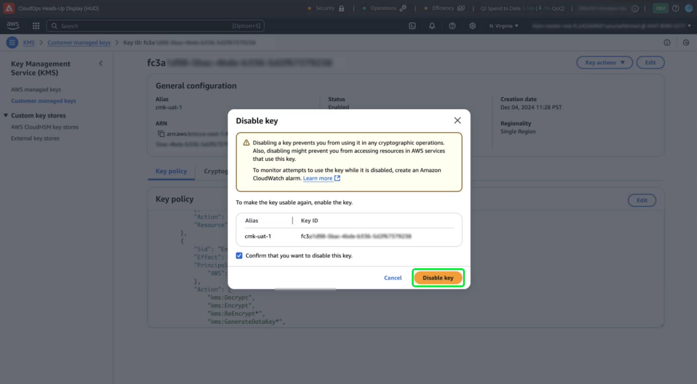

# Experience Platform UI を使用したAWSでの顧客管理キーの設定と設定

このガイドを使用すると、Experience Platform UI を介してAWSでホストされるExperience Platform インスタンスの顧客管理キー（CMK）を有効にすることができます。

>[!IMPORTANT]
>
>このガイドを進める前に、[&#x200B; の CMK 用AWS KMS の設定」のドキュメントで詳しく説明されている設定が完了しているこ &#x200B;](./configure-kms.md) を確認してください。

## AWS キーポリシーを更新して、キーをExperience Platformと統合します

AWS キーをExperience Platformと統合するには、KMS Workspace の **[!DNL Key Policy]** セクションで JSON を編集する必要があります。 デフォルトのキーポリシーは、以下の JSON のようになります。

<!-- The AWS ID below is fake. Q) Can I refer to it simply as AWS_ACCOUNT_ID ? Is that suitable? -->

```JSON
{
  "Id": "key-consolepolicy-3",
  "Version": "2012-10-17",
  "Statement": [
    {
      "Sid": "Enable IAM User Permissions",
      "Effect": "Allow",
      "Principal": {
        "AWS": "arn:aws:iam::123464903283:root" // this is a mock AWS Principal ID, your ID will differ
      },
      "Action": "kms:*",
      "Resource": "*"
    }
  ]
}
```

上記の例では、同じアカウント（`Principal.AWS`）内のすべてのリソース（`"Resource": "*"`）がキーにアクセスできます。 このポリシーを使用すると、アカウント内のサービスは、指定されたアカウントに制限された暗号化および暗号化解除の操作を実行できます。 このキーに対するExperience Platform シングルテナントアカウントのアクセス権を付与するには、デフォルトのAWS ポリシーに新しいステートメントを追加します。 Experience Platform UI から必要な JSON ポリシーを取得してAWS KMS キーに適用することにより、Adobe Experience Platformとの安全な接続を確立できます。

Experience Platform UI で、左側のナビゲーションレールの「**[!UICONTROL 管理]**」セクションに移動し、「**[!UICONTROL 暗号化]**」を選択します。 [!UICONTROL &#x200B; 暗号化設定 &#x200B;] ワークスペースで、**[!UICONTROL 顧客管理キー]** カードの [!UICONTROL &#x200B; 設定 &#x200B;] を選択します。


[!UICONTROL &#x200B; 顧客管理キー設定 &#x200B;] が表示されます。 [!UICONTROL &#x200B; 顧客管理キー &#x200B;]&#x200B;[!UICONTROL &#x200B; 暗号化設定 &#x200B;] に表示される CMK KMS ポリシーから `statement` オブジェクトをコピーします。

<!-- Select the copy icon () to copy the CMK KMS policy to your clipboard. A green pop-up notification confirms that the policy was copied.  -->

<!-- I cannot add the 'and the copy icon highlighted.' to the alt text below as i do not have access to this UI. -->


<!-- This part of the workflow was in contention at the time of the demo.  -->

次に、AWS KMS ワークスペースに戻り、以下に示すキーポリシーを更新します。


[!UICONTROL Platform 暗号化設定 &#x200B;] ワークスペースから 4 つのステートメント（`Enable IAM User Permissions`、`CJA Flow IAM User Permissions`、`CJA Integrity IAM User Permissions`、`CJA Oberon IAM User Permissions`）をデフォルトポリシーに追加します。

```json
{
    "Version": "2012-10-17",
    "Id": "key-consolepolicy",
    "Statement": [
        {
            "Sid": "Enable IAM User Permissions",
            "Effect": "Allow",
            "Principal": {
                "AWS": "arn:aws:iam::975049898882:root" // this is a mock AWS Principal ID, your ID will differ
            },
            "Action": [
                "kms:Decrypt",
                "kms:Encrypt",
                "kms:ReEncrypt*",
                "kms:GenerateDataKey*",
                "kms:DescribeKey",
                "kms:CreateGrant"
            ],
            "Resource": "*",
            "Condition": {
                "StringEquals": {
                    "aws:PrincipalAccount": "975049898882" // this is a mock AWS Principal ID, your ID will differ
                }
            }
        },
        {
            "Sid": "CJA Flow IAM User Permissions",
            "Effect": "Allow",
            "Principal": {
                "AWS": "arn:aws:iam::767397686373:root"
            },
            "Action": [
                "kms:Decrypt",
                "kms:Encrypt",
                "kms:ReEncrypt*",
                "kms:GenerateDataKey*",
                "kms:DescribeKey",
                "kms:CreateGrant"
            ],
            "Resource": "*",
            "Condition": {
                "StringEquals": {
                    "aws:PrincipalAccount": "767397686373"
                }
            }
        },
        {
            "Sid": "CJA Integrity IAM User Permissions",
            "Effect": "Allow",
            "Principal": {
                "AWS": "arn:aws:iam::730335345392:root"
            },
            "Action": [
                "kms:Decrypt",
                "kms:Encrypt",
                "kms:ReEncrypt*",
                "kms:GenerateDataKey*",
                "kms:DescribeKey",
                "kms:CreateGrant"
            ],
            "Resource": "*",
            "Condition": {
                "StringEquals": {
                    "aws:PrincipalAccount": "730335345392"
                }
            }
        },
        {
            "Sid": "CJA Oberon IAM User Permissions",
            "Effect": "Allow",
            "Principal": {
                "AWS": "arn:aws:iam::891377157113:root"
            },
            "Action": [
                "kms:Decrypt",
                "kms:Encrypt",
                "kms:ReEncrypt*",
                "kms:GenerateDataKey*",
                "kms:DescribeKey",
                "kms:CreateGrant"
            ],
            "Resource": "*",
            "Condition": {
                "StringEquals": {
                    "aws:PrincipalAccount": "891377157113"
                }
            }
        }
    ]
}
```

「**[!DNL Finish]**」を選択して、更新されたポリシーを確認し、キーを作成します。 設定には 5 つのステートメントが含まれるようになり、AWS アカウントがAdobe Experience Platformと通信できるようになります。 変更は直ちに有効になります。

AWS [!DNL Key Management Service] の更新された [!DNL Customer Managed Keys] ワークスペースが表示されます。

### AWS暗号化キーの詳細をExperience Platformに追加

次に、暗号化を有効にするには、キーのAmazon リソース名（ARN）をExperience Platform[!UICONTROL &#x200B; 顧客管理キー設定 &#x200B;] に追加します。 AWSの「[!DNL Customer Managed Keys]」セクションで、[!DNL Key Management Service] のリストから新しいキーのエイリアスを選択します。


キーの詳細が表示されます。 AWSのすべての要素には、次のようなAmazon リソース名（ARN）があります。
は、AWS サービス全体でリソースを指定するために使用される一意の id です。 標準化された形式 `arn:partition:service:region:account-id:resource` に従います。

コピーアイコンを選択して、ARN をコピーします。 確認ダイアログが表示されます。


次に、Experience Platform [!UICONTROL &#x200B; 顧客管理キー設定 &#x200B;] UI に戻ります。 「**[!UICONTROL AWS暗号化キーの詳細を追加]**」セクションで、AWS UI からコピーした **[!UICONTROL 設定名]** と **[!UICONTROL KMS キー ARN]** を追加します。


次に、「**[!UICONTROL 保存]**」を選択して設定名と KMS キー ARN を送信し、キーの検証を開始します。


「[!UICONTROL &#x200B; 暗号化設定 &#x200B;] ワークスペースに戻ります。 暗号化設定のステータスが **[!UICONTROL 顧客管理キー]** カードの下部に表示されます。


キーが検証されると、Key Vault 識別子が、すべてのサンドボックスのデータレイクおよびプロファイルデータストアに追加されます。

>[!NOTE]
>
>プロセスの期間は、データのサイズによって異なります。 通常、プロセスは 24 時間以内に完了します。 各サンドボックスは通常、2～3 分で更新されます。

## キーの失効 {#key-revocation}

>[!IMPORTANT]
>
>アクセスを取り消す前に、ダウンストリームアプリケーションでのキーの失効の影響を理解します。

鍵の失効に関する主な考慮事項を次に示します。

- キーを取り消したり無効にしたりすると、Experience Platform データにアクセスできなくなります。 このアクションは元に戻せないので、注意して実行する必要があります。
- 暗号化キーへのアクセスが取り消された場合の伝播タイムラインを考慮します。 プライマリのデータストアは、数分から 24 時間以内にアクセスできなくなります。 キャッシュされたデータストアまたは一時的なデータストアは、7 日以内にアクセスできなくなります。

キーを失効させるには、AWS KMS Workspace に移動します。 「**[!DNL Customer managed keys]**」セクションには、AWS アカウントで使用可能なすべてのキーが表示されます。 リストからキーのエイリアスを選択します。


キーの詳細が表示されます。 キーを無効にするには、「**[!DNL Key actions]**」を選択し、ドロップダウンメニューから「**[!DNL Disable]**」を選択します。


確認ダイアログが表示されます。 「**[!DNL Disable key]**」を選択して、選択内容を確定します。 キーの無効化の影響は、約 5 分以内にExperience Platform アプリケーションおよび UI に反映される必要があります。

>[!NOTE]
>
>キーを無効にしたら、必要に応じて、上記と同じ方法でキーを再度有効にできます。 このオプションは、**[!DNL Key actions]** ドロップダウンから使用できます。



または、キーが他のサービスで使用されている場合は、キーポリシーから直接Experience Platformへのアクセスを削除できます。 **[!DNL Key Policy]** のセクションで「**[!UICONTROL 編集]**」を選択します。


**[!DNL Edit key policy]** ページが表示されます。 Experience Platform UI からコピーされたポリシーステートメントをハイライト表示して削除し、顧客管理キーアプリの権限を削除します。 次に、「**[!DNL Save changes]**」を選択してプロセスを完了します。


## キーの回転 {#key-rotation}

AWSは、自動およびオンデマンドでキーローテーションを提供します。 鍵の漏洩のリスクを軽減したり、セキュリティ・コンプライアンス要件を満たしたりするために、新しい暗号化キーを必要に応じて、または定期的に自動的に生成できます。 キーの自動ローテーションをスケジュールしてキーの存続期間を制限し、キーが侵害された場合にローテーション後に使用できないようにします。 最新の暗号化アルゴリズムは非常に安全ですが、鍵の交換は重要なセキュリティコンプライアンス対策であり、セキュリティのベストプラクティスに準拠していることを示しています。

### キーの自動ローテーション {#automatic-key-rotation}

キーの自動ローテーションはデフォルトで無効になっています。 KMS ワークスペースから自動キーローテーションのスケジュールを設定するには、[**[!DNL Key rotation]**] タブを選択してから、**[!DNL Automatic key rotation section]** で **[!DNL Edit]** を選択します。


**[!DNL Edit automatic key rotation]** ワークスペースが表示されます。 ここから、自動キー回転を有効または無効にするラジオ ボタンを選択します。 次に、テキスト入力フィールドまたはドロップダウンメニューを使用して、キーローテーションの期間を選択します。 「**[!DNL Save]**」を選択して設定を確認し、キーの詳細ワークスペースに戻ります。

>[!NOTE]
>
>キーのローテーション期間の下限は 90 日、上限は 2560 日です。


### オンデマンドでの鍵のローテーション {#on-demand-key-rotation}

現在のキーが侵害された場合に、**[!DNL Rotate Now]** を選択して即座にキーのローテーションを実行します。 AWSでは、この機能を 10 回転に制限しています。 通常のメンテナンスの場合は、代わりに自動キー回転をスケジュールします。


## 次の手順

このドキュメントでは、AWS KMS for Adobe Experience Platformで暗号化キーを作成、設定および管理する方法について説明しました。 次に、組織のセキュリティおよびコンプライアンスポリシーを確認して、重要なローテーションのスケジュール設定や安全な鍵ストレージの確保などのベストプラクティスを実装します。
