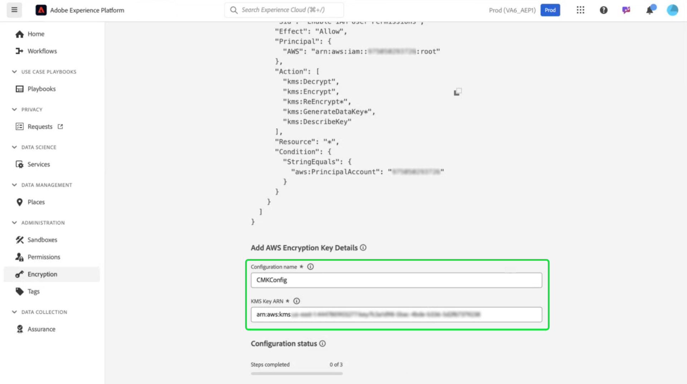

# Adobe Experience Platform データ暗号化用のAmazon Web Services Key Management サービスの使用方法

>[!AVAILABILITY]
>
>このドキュメントは、Amazon Web Services（AWS）上で実行されるExperience Platformの実装に適用されます。 AWSで実行されるExperience Platformは、現在、限られた数のお客様が利用できます。 サポートされるExperience Platformインフラストラクチャについて詳しくは、[Experience Platformマルチクラウドの概要 ](https://experienceleague.adobe.com/en/docs/experience-platform/landing/multi-cloud) を参照してください。
>
>AWSの [ 顧客管理キー ](../customer-managed-keys/overview.md) （CMK）は、Privacy and Security Shield でサポートされていますが、Healthcare Shield では使用できません。 Azure 上の CMK は、Privacy and Security Shield および Healthcare Shield の両方でサポートされています。

このガイドを使用すると、Adobe Experience Platformの暗号化キーを作成、管理、および制御して、Amazon Web Services（AWS） Key Management Service （KMS）でデータを保護できます。 この統合により、コンプライアンスの合理化、自動化によるオペレーションの合理化が実現し、独自の主要管理インフラストラクチャを維持する必要がなくなります。

Customer Journey Analytics固有の手順については、[Customer Journey Analytics CMK ドキュメントを参照してください ](https://experienceleague.adobe.com/en/docs/analytics-platform/using/cja-privacy/cmk)

>[!IMPORTANT]
>
>Adobe Experience Platformは、システム管理キーを使用して、デフォルトで保存中のデータを暗号化します。 顧客管理キー（CMK）を有効にすると、データのセキュリティを完全に制御できます。 ただし、この変更は元に戻せません。CMK が有効になると、システム管理キーに戻すことはできません。 キーを安全に管理して、データへの中断のないアクセスを確保し、アクセス不能の可能性を防ぐ責任があります。

このガイドでは、Experience Platformでデータを保護するために、AWS KMS で暗号化キーを作成および管理するプロセスについて詳しく説明します。

## 前提条件 {#prerequisites}

このドキュメントを進める前に、次の主な概念と機能を十分に理解しておく必要があります。

- **AWS Key Management Service （KMS）**：暗号化キーの作成、管理、ローテーションの方法など、AWS KMS の基本事項を説明します。 詳しくは、[ 公式の KMS ドキュメント ](https://docs.aws.amazon.com/kms/) を参照してください。
- **AWSの IAM （Identity and Access Management）ポリシー**: IAM は、AWSのサービスやリソースへのアクセスを安全に管理できるサービスです。 IAM を使用して、次の操作を行います。
   - 特定のリソースにアクセスできるユーザー、グループ、役割を定義します。
   - ユーザーが実行を許可または拒否するアクションを指定します。
   - IAM ポリシーを使用して権限を割り当てることで、きめ細かなアクセス制御を実装します。
詳しくは、[AWS KMS の IAM ポリシーの公式ドキュメント ](https://docs.aws.amazon.com/kms/latest/developerguide/iam-policies.html) を参照してください。
- **Platform におけるデータセキュリティ**:Experience Platformがデータセキュリティを確保し、AWS KMS などの外部サービスと統合して暗号化する方法について説明します。 Platform は、転送用の HTTPS TLS v1.2、保存時のクラウドプロバイダー暗号化、分離ストレージ、カスタマイズ可能な認証および暗号化オプションでデータを保護します。 データの安全性を確保する方法について詳しくは、[ ガバナンス、プライバシー、セキュリティの概要 ](../overview.md) または [Platform でのデータ暗号化 ](../encryption.md) に関するドキュメントを参照してください。
- **AWS Management Console**：すべてのAWS サービスに 1 つの web ベース アプリケーションからアクセスして管理できる中央ハブです。 検索バーを使用して、ツールの検索、通知の確認、アカウントと請求の管理、設定のカスタマイズをすばやく行います。 詳しくは、[AWS管理コンソールの公式ドキュメント ](https://docs.aws.amazon.com/awsconsolehelpdocs/latest/gsg/what-is.html) を参照してください。

## 基本を学ぶ {#get-started}

このガイドでは、既にAmazon Web Services アカウントにアクセスし、Management Console にアクセスできる必要があります。 開始するには、次の手順に従います。

1. **権限の確認**:KMS 内で暗号化キーを作成、管理、使用するために必要なAWS Identity and Access Management （IAM）権限があることを確認します。 権限を確認するには：
   1. [IAM ポリシーシミュレーター ](https://policysim.aws.amazon.com/) にアクセスします。
   1. ユーザーアカウントまたは役割を選択します。
   1. `kms:CreateKey` や `kms:Encrypt` などの KMS アクションをシミュレートします。
シミュレーションでエラーが返された場合や、権限が不明な場合は、AWS管理者に問い合わせてください。

1. **AWS アカウントの設定の確認**:AWS アカウントでAWS KMS サービスの使用が有効になっていることを確認します。 ほとんどのアカウントでは、デフォルトで KMS アクセスが有効になっていますが、[AWS Management Console](https://aws.amazon.com/console/) にアクセスして、アカウントの設定を確認できます。 詳しくは、[AWS Key Management Service デベロッパーガイド ](https://docs.aws.amazon.com/ja_jp/kms/latest/developerguide/overview.html) を参照してください。

1. **サポートされている地域を選択**:AWS KMS は特定の地域で利用できます。 KMS がサポートされている地域で操作していることを確認してください。 サポートされているリージョンの一覧は、[AWS KMS エンドポイントとクォータの一覧 ](https://aws.amazon.com/about-aws/global-infrastructure/regional-product-services/) で確認できます。

### AWS KMS に移動して、主要な設定を開始します

>[!IMPORTANT]
>
>暗号化キーの安全な保存、アクセス、可用性を確保します。 キーを管理し、Platform の操作が中断されるのを防ぐ責任があります。

暗号化キーの設定と管理を開始するには、AWS アカウントにログインし、AWS Key Management Service （KMS）に移動します。 AWS Management Console で、サービスメニューから **Key Management Service （KMS）** を選択します。


## 新しいキーの作成 {#create-a-key}

[!DNL Key Management Service (KMS)] ワークスペースが表示されます。 **[!DNL Create a key]** を選択します。


## キー設定を指定 {#configure-key}

[!DNL Configure Key] ワークフローが表示されます。 デフォルトでは、キーの種類は **[!DNL Symmetric]** に設定され、キーの使用法は **[!DNL Encrypt and Decrypt]** に設定されます。 続行する前に、これらのオプションが選択されていることを確認します。


**[!DNL Advanced options]** ドロップダウンメニューを展開します。 AWSで主要な資料を作成および管理できる **[!DNL KMS]** オプションを使用することをお勧めします。 デフォルトでは、「**[!DNL KMS]**」オプションが選択されています。

>[!NOTE]
>
>既存のキーがある場合は、外部キーマテリアルを読み込むか、AWS [!DNL CloudHSM] キーストアを使用できます。 これらのオプションについては、このドキュメントの範囲では説明しません。

次に、キーの領域範囲を指定する [!DNL Regionality] 設定を選択します。 「**[!DNL Single-Region key]**」、「**[!DNL Next]**」の順に選択して、手順 2 に進みます。

>[!IMPORTANT]
>
>AWSでは、KMS キーの地域に関する制限が適用されます。 この地域制限により、鍵はAdobeアカウントと同じ地域にある必要があります。 Adobeは、アカウントの地域内にある KMS キーにのみアクセスできます。 選択した地域が、Adobeのシングルテナントアカウントの地域と一致していることを確認してください。


## キーにラベルを付けてタグ付け {#add-labels-and-tags-to-key}

2 番目に、ワ [!DNL Add labels] クフローのステージが表示されます。 ここでは、AWS KMS コンソールで暗号化キーを管理および見つけるのに役立つ [!DNL Alias] および [!DNL Tags] フィールドを設定します。

キー入力フィールドに、キーのわかりやすいラベルを **[!DNL Alias]** 力します。 エイリアスは、AWS KMS コンソールの検索バーを使用してキーをすばやく見つけるために、ユーザーにわかりやすい識別子として機能します。 混乱を防ぐには、「Customer-Platform-Key」や「Adobe暗号化キー」など、キーの目的を反映した意味のある名前を選択します。 また、鍵のエイリアスが目的を説明するのに不十分な場合は、鍵の説明を含めることもできます。

最後に、「[!DNL Tags]」セクションでキーと値のペアを追加して、キーにメタデータを割り当てます。 この手順はオプションですが、管理を容易にするために、AWS リソースの分類およびフィルタリングにタグを追加する必要があります。 例えば、組織で複数のAdobe関連リソースを使用している場合は、「Adobe」または「Experience-Platform」を使用してタグ付けできます。 この追加の手順により、AWS Management Console で、関連するすべてのリソースを簡単に検索して管理できます。 「**[!DNL Add tag]**」を選択してプロセスを開始します。

<!-- I do not have an AWS account with which to document the Add tag process as yet. -->

設定に問題がなければ、「**[!DNL Next]**」を選択してワークフローを続行します。

 がハイライト表示されたキーワークフローの手順 2。

## 主な管理権限の定義 {#define-key-admins}

キー作成ワークフローの手順 3 が表示されます。 安全で制御されたアクセスを確保するために、鍵を管理できる IAM ユーザーとロールを選択できます。 この段階では、[!DNL Key administrators] と [!DNL Key deletion] の 2 つのオプションがあります。 **[!DNL Key administrators]** セクションで、このキーに対する管理者権限を付与するユーザーまたはロールの名前の横にある 1 つ以上のチェックボックスを選択します。

>[!NOTE]
>
>ワークフローのこの段階では管理者を作成できません。

「**[!DNL Key deletion]**」セクションで、キー管理者にこのキーを削除する権限を許可するチェックボックスを有効にします。 チェックボックスをオフにすると、管理者ユーザーはその操作を実行できません。

「**[!DNL Next]**」を選択して、ワークフローを続行します。


## 主要なユーザーへのアクセス権の付与 {#assign-key-users}

ワークフローの手順 4 で、次の操作を [!DNL Define key usage permissions] 行できます。 **[!DNL Key users]** リストから、このキーを使用するアクセス許可を与えるすべての IAM ユーザーとロールのチェックボックスを選択します。

このビューから、を [!DNL Add another AWS account] くこともできますが、他のAWS アカウントを追加することは強くお勧めしません。 別のアカウントを追加すると、リスクが生じ、暗号化および復号化操作の権限管理が複雑になる可能性があります。 Adobeは、1 つのAWS アカウントに関連付けられたキーを保持することで、AWS KMS との安全な統合を確保し、リスクを最小限に抑え、信頼性の高い操作を確保します。

「**[!DNL Next]**」を選択して、ワークフローを続行します。


## 主要な設定を確認 {#review}

主要設定のレビューステージが表示されます。 [!DNL Key configuration] の節と [!DNL Alias and description] の節で主な詳細を確認します。

>[!NOTE]
>
>キー地域がAWS アカウントと同じであることを確認します。


### キーポリシーを更新して、キーをExperience Platformに統合します

次に、「**[!DNL Key Policy]**」セクションの JSON を編集して、キーをExperience Platformに統合します。 デフォルトのキーポリシーは、以下の JSON のようになります。

<!-- The AWS ID below is fake. Q) Can I refer to it simply as AWS_ACCOUNT_ID ? Is that suitable? -->

```JSON
{
  "Id": "key-consolepolicy-3",
  "Version": "2012-10-17",
  "Statement": [
    {
      "Sid": "Enable IAM User Permissions",
      "Effect": "Allow",
      "Principal": {
        "AWS": "arn:aws:iam::123464903283:root" // this is a mock AWS Principal ID, your ID will differ
      },
      "Action": "kms:*",
      "Resource": "*"
    }
  ]
}
```

上記の例では、同じアカウント（`Principal.AWS`）のすべてのリソース（`"Resource": "*"`）がこのキーにアクセスできます。 このポリシーにより、同じアカウント内の他のサービスがキーを使用して暗号化と復号化を行うことができます。 サービスには、このアカウントに対する権限のみが付与されています。

次に、このポリシーに新しいステートメントを追加して、Platform シングルテナントアカウントにこのキーへのアクセス権を付与します。 JSON ポリシーは、Platform UI から取得し、AWS KMS キーに適用して、Platform に安全にリンクできます。

Platform UI に移動します。 左側のナビゲーションパネルの **[!UICONTROL 管理]** セクションで、「**[!UICONTROL 暗号化]**」を選択します。 [!UICONTROL  暗号化設定 ] ワークスペースが表示されます。 次に **[!UICONTROL 顧客管理キー]** カードで [!UICONTROL  設定 ] を選択します。


[!UICONTROL  顧客管理キー設定 ] が表示されます。 コピーアイコン（）、CMK KMS ポリシーをクリップボードにコピーします。 緑色のポップアップ通知は、ポリシーがコピーされたことを確認します。


<!-- This part of the workflow was in contention at the time of the demo.  -->

次に、AWS KMS ワークスペースに戻り、以下に示すキーポリシーを更新します。


[!UICONTROL Platform 暗号化設定 ] ワークスペースから 4 つのステートメント（`Enable IAM User Permissions`、`CJA Flow IAM User Permissions`、`CJA Integrity IAM User Permissions`、`CJA Oberon IAM User Permissions`）をデフォルトポリシーに追加します。

```json
{
    "Version": "2012-10-17",
    "Id": "key-consolepolicy",
    "Statement": [
        {
            "Sid": "Enable IAM User Permissions",
            "Effect": "Allow",
            "Principal": {
                "AWS": "arn:aws:iam::975049898882:root" // this is a mock AWS Principal ID, your ID will differ
            },
            "Action": [
                "kms:Decrypt",
                "kms:Encrypt",
                "kms:ReEncrypt*",
                "kms:GenerateDataKey*",
                "kms:DescribeKey",
                "kms:CreateGrant"
            ],
            "Resource": "*",
            "Condition": {
                "StringEquals": {
                    "aws:PrincipalAccount": "975049898882" // this is a mock AWS Principal ID, your ID will differ
                }
            }
        },
        {
            "Sid": "CJA Flow IAM User Permissions",
            "Effect": "Allow",
            "Principal": {
                "AWS": "arn:aws:iam::767397686373:root"
            },
            "Action": [
                "kms:Decrypt",
                "kms:Encrypt",
                "kms:ReEncrypt*",
                "kms:GenerateDataKey*",
                "kms:DescribeKey",
                "kms:CreateGrant"
            ],
            "Resource": "*",
            "Condition": {
                "StringEquals": {
                    "aws:PrincipalAccount": "767397686373"
                }
            }
        },
        {
            "Sid": "CJA Integrity IAM User Permissions",
            "Effect": "Allow",
            "Principal": {
                "AWS": "arn:aws:iam::730335345392:root"
            },
            "Action": [
                "kms:Decrypt",
                "kms:Encrypt",
                "kms:ReEncrypt*",
                "kms:GenerateDataKey*",
                "kms:DescribeKey",
                "kms:CreateGrant"
            ],
            "Resource": "*",
            "Condition": {
                "StringEquals": {
                    "aws:PrincipalAccount": "730335345392"
                }
            }
        },
        {
            "Sid": "CJA Oberon IAM User Permissions",
            "Effect": "Allow",
            "Principal": {
                "AWS": "arn:aws:iam::891377157113:root"
            },
            "Action": [
                "kms:Decrypt",
                "kms:Encrypt",
                "kms:ReEncrypt*",
                "kms:GenerateDataKey*",
                "kms:DescribeKey",
                "kms:CreateGrant"
            ],
            "Resource": "*",
            "Condition": {
                "StringEquals": {
                    "aws:PrincipalAccount": "891377157113"
                }
            }
        }
    ]
}
```


「**[!DNL Finish]**」を選択して、更新したポリシーでキーの詳細を確認し、キーを作成します。 AWS アカウントがExperience Platformアカウントと通信できるように、キーとポリシーは合計 5 つのステートメントで設定されました。 効果は即座に得られます。

AWS [!DNL Key Management Service] の更新された [!DNL Customer managed keys] ワークスペースが表示されます。

### Platform へのAWS暗号化キーの詳細の追加

次に、暗号化を有効にするには、キーのAmazon リソース名（ARN）を Platform[!UICONTROL  顧客管理キー設定 ] に追加します。 AWSの「[!DNL Customer Managed Keys]」セクションで、[!DNL Key Management Service] のリストから新しいキーのエイリアスを選択します。


キーの詳細が表示されます。 AWSのすべての要素には、次のようなAmazon リソース名（ARN）があります。
は、AWS サービス全体でリソースを指定するために使用される一意の id です。 標準化された形式 `arn:partition:service:region:account-id:resource` に従います。

コピーアイコンを選択して、ARN をコピーします。 確認ダイアログが表示されます。


次に、Platform [!UICONTROL  顧客管理キー設定 ] UI に戻ります。 「**[!UICONTROL AWS暗号化キーの詳細を追加]**」セクションで、AWS UI からコピーした **[!UICONTROL 設定名]** と **[!UICONTROL KMS キー ARN]** を追加します。



次に、「**[!UICONTROL 保存]**」を選択して設定名と KMS キー ARN を送信し、キーの検証を開始します。


「[!UICONTROL  暗号化設定 ] ワークスペースに戻ります。 暗号化設定のステータスが **[!UICONTROL 顧客管理キー]** カードの下部に表示されます。


キーが検証されると、Key Vault 識別子が、すべてのサンドボックスのデータレイクおよびプロファイルデータストアに追加されます。

>[!NOTE]
>
>プロセスの期間は、データのサイズによって異なります。 通常、プロセスは 24 時間以内に完了します。 各サンドボックスは通常、2～3 分で更新されます。

## キーの失効 {#key-revocation}

>[!IMPORTANT]
>
>アクセスを取り消す前に、ダウンストリームアプリケーションでのキーの失効の影響を理解します。

鍵の失効に関する主な考慮事項を次に示します。

- キーを取り消したり無効にしたりすると、Platform データにアクセスできなくなります。 このアクションは元に戻せないので、注意して実行する必要があります。
- 暗号化キーへのアクセスが取り消された場合の伝播タイムラインを考慮します。 プライマリのデータストアは、数分から 24 時間以内にアクセスできなくなります。 キャッシュされたデータストアまたは一時的なデータストアは、7 日以内にアクセスできなくなります。

キーを失効させるには、AWS KMS Workspace に移動します。 「**[!DNL Customer managed keys]**」セクションには、AWS アカウントで使用可能なすべてのキーが表示されます。 リストからキーのエイリアスを選択します。


キーの詳細が表示されます。 キーを無効にするには、「**[!DNL Key actions]**」を選択し、ドロップダウンメニューから「**[!DNL Disable]**」を選択します。


確認ダイアログが表示されます。 「**[!DNL Disable key]**」を選択して、選択内容を確定します。 キーの無効化の影響は、約 5 分以内に Platform アプリケーションと UI に反映される必要があります。

>[!NOTE]
>
>キーを無効にしたら、必要に応じて、上記と同じ方法でキーを再度有効にできます。 このオプションは、**[!DNL Key actions]** ドロップダウンから使用できます。


または、キーが他のサービス全体で使用されている場合は、キーポリシーから直接Experience Platformのアクセス権を削除できます。 **[!DNL Key Policy]** のセクションで「**[!UICONTROL 編集]**」を選択します。


**[!DNL Edit key policy]** ページが表示されます。 Platform UI からコピーされたポリシーステートメントをハイライト表示して削除し、顧客管理キーアプリの権限を削除します。 次に、「**[!DNL Save changes]**」を選択してプロセスを完了します。


## キーの回転 {#key-rotation}

AWSは、自動およびオンデマンドでキーローテーションを提供します。 鍵の漏洩のリスクを軽減したり、セキュリティ・コンプライアンス要件を満たしたりするために、新しい暗号化キーを必要に応じて、または定期的に自動的に生成できます。 キーの自動ローテーションをスケジュールしてキーの存続期間を制限し、キーが侵害された場合にローテーション後に使用できないようにします。 最新の暗号化アルゴリズムは非常に安全ですが、鍵の交換は重要なセキュリティコンプライアンス対策であり、セキュリティのベストプラクティスに準拠していることを示しています。

### キーの自動ローテーション {#automatic-key-rotation}

キーの自動ローテーションはデフォルトで無効になっています。 KMS ワークスペースから自動キーローテーションのスケジュールを設定するには、[**[!DNL Key rotation]**] タブを選択してから、**[!DNL Automatic key rotation section]** で **[!DNL Edit]** を選択します。


**[!DNL Edit automatic key rotation]** ワークスペースが表示されます。 ここから、自動キー回転を有効または無効にするラジオ ボタンを選択します。 次に、テキスト入力フィールドまたはドロップダウンメニューを使用して、キーローテーションの期間を選択します。 「**[!DNL Save]**」を選択して設定を確認し、キーの詳細ワークスペースに戻ります。

>[!NOTE]
>
>キーのローテーション期間の下限は 90 日、上限は 2560 日です。


### オンデマンドでの鍵のローテーション {#on-demand-key-rotation}

現在のキーが侵害を受けた場合は、**[!DNL Rotate Now]** を選択すると、すぐに回転します。 AWSでは、10 回のオンデマンド回転のみが許可されます。 セキュリティが既に侵害されていない限り、スケジュールされたキーローテーションを使用します。


## 次の手順

このドキュメントでは、Adobe Experience Platformで使用する暗号化キーをAWS KMS で作成、設定、管理する方法について説明しました。 次のステップとして、組織のセキュリティおよびコンプライアンスポリシーを確認し、スケジュールされた鍵のローテーションや安全な鍵ストレージなどの適切な鍵管理プラクティスを確保することを検討してください。
