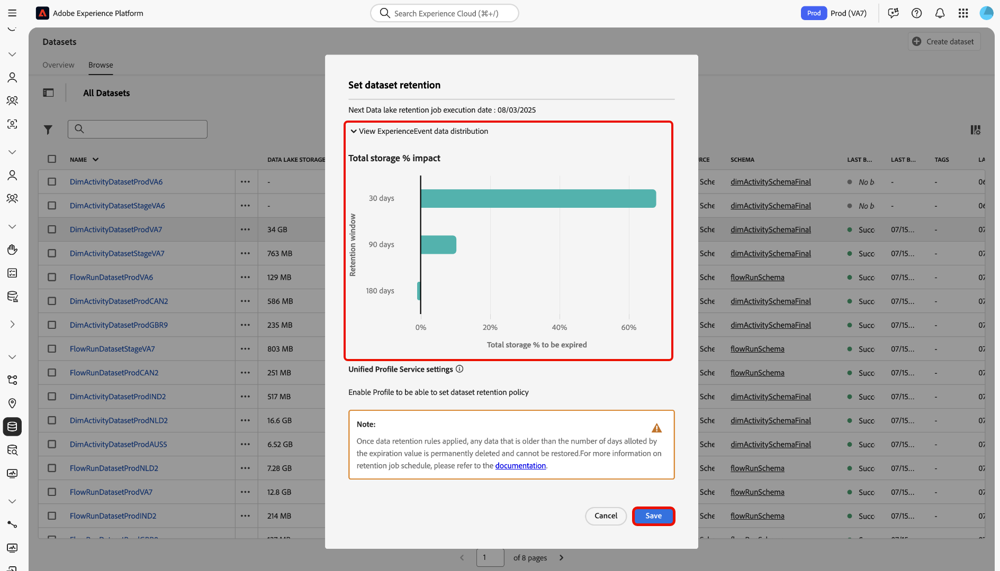

# データ管理ライセンス使用権限のベストプラクティス

Adobe Experience Platform は、お客様のデータをリアルタイムに更新される堅牢な顧客プロファイルに変換し、AI によるインサイトを利用して、あらゆるチャネルにわたって適切なエクスペリエンスを提供できるようにするオープンシステムです。様々なタイプ、量、履歴のデータをソースを使用して Experience Platform に取り込み、そのデータをセグメント化やパーソナライゼーション、分析、機械学習などのユースケースに対応させることができます。

Experience Platformは、作成できるプロファイルの数や取り込めるデータの量を設定したライセンスを提供します。 任意のデータのソース、量または履歴を取り込めるので、データ量が増加するに従って、ライセンス使用権限を超過する可能性があります。

このガイドを参照して、Experience Platformでライセンス使用権限をより適切に管理するためのベストプラクティスや使用できるツールを確認してください。

## 機能の概要 {#summary-of-features}

このドキュメントで概要を説明するベストプラクティスとツールを使用して、Experience Platform内でのライセンス使用権限をより適切に管理します。 このドキュメントは、すべてのExperience Platformのお客様に可視性と制御を提供するための追加機能がリリースされるたびに更新されます。

次の表に、ライセンス使用権限をより適切に管理するために、現在、自由に使用できる機能のリストを示します。

| 機能 | 説明 |
| --- | --- |
| [&#x200B; データセット UI - エクスペリエンスイベントデータ保持 &#x200B;](../../catalog/datasets/user-guide.md#data-retention-policy) | データレイクおよびプロファイルストアのデータに対して、固定保持期間を設定します。 設定された保持期間が終了すると、レコードが削除されます。 |
| [&#x200B; リアルタイム顧客プロファイル用のデータセットを有効/無効にする &#x200B;](../../catalog/datasets/user-guide.md) | リアルタイム顧客プロファイルへのデータセット取り込みを有効または無効にします。 |
| [&#x200B; プロファイルストアのエクスペリエンスイベントの有効期限 &#x200B;](../../profile/event-expirations.md) | プロファイル対応データセットに取り込まれるすべてのイベントに有効期限を適用できます。 この機能を有効にするには、Adobe アカウントチームまたはカスタマーケアにお問い合わせください。 |
| [Adobe Analytics データ準備フィルター](../../sources/tutorials/ui/create/adobe-applications/analytics.md#filtering-for-real-time-customer-profile) | [!DNL Kafka] フィルターを適用して、不要なデータを取り込みから除外します |
| [Adobe Audience Manager ソースコネクタフィルター](../../sources/tutorials/ui/create/adobe-applications/audience-manager.md) | Audience Manager ソース接続フィルターを適用して、不要なデータを取得から除外します |
| [イベント転送データフィルター](../../tags/ui/event-forwarding/overview.md) | サーバーサイド [!DNL Kafka] フィルターを適用して、不要なデータを取り込みから除外します詳しくは、[タグルール](../../tags/ui/managing-resources/rules.md)に関するドキュメントを参照してください。 |
| [ライセンス使用状況ダッシュボード UI](../../dashboards/guides/license-usage.md#license-usage-dashboard-data) | ライセンスされた使用権限に対するExperience Platform製品の組織での使用状況を監視します。 毎日の使用状況スナップショット、予測トレンド、詳細なサンドボックスレベルのデータにアクセスして、プロアクティブなライセンス管理をサポートします。 |
| [Dataset Overlap Report API](../../profile/tutorials/dataset-overlap-report.md) | アドレス可能なオーディエンスに最も貢献するデータセットを出力します。 |
| [Identity Overlap Report API](../../profile/api/preview-sample-status.md#generate-the-identity-namespace-overlap-report) | アドレス可能なオーディエンスに最も貢献する ID 名前空間を出力します。 |
| [&#x200B; 偽名プロファイルデータの有効期限 &#x200B;](../../profile/pseudonymous-profiles.md) | 偽名プロファイルのデータの有効期限を設定し、プロファイルストアからデータを自動的に削除します。 |

{style="table-layout:auto"}

## Experience Platformのデータストレージについて

Experience Platformは、主にデータレイクとプロファイルストアの 2 つのデータリポジトリで構成されています。

データレイクは、主に次のような目的で使用されます。

* Experience Platform へのデータのオンボーディングのためのステージング領域として機能させる。
* すべての Experience Platform データのための長期間のデータストレージとして機能させる。
* データ分析およびデータサイエンスなどのユースケースを有効にする。

**プロファイルストア** は、顧客プロファイルを作成する場所であり、主に次のような目的で使用されます。

* リアルタイムエクスペリエンスをサポートするために使用されるプロファイルのデータストレージとして機能させる。
* セグメント化、アクティベーション、パーソナライゼーションなどのユースケースを有効にする。

>[!NOTE]
>
>[!DNL data lake] へのアクセスは、購入した製品 SKU によって異なります。製品 SKU について詳しくは、アドビ担当者にお問い合わせください。

## ライセンス使用状況 {#license-usage}

Experience Platform のライセンスを取得すると、SKU によって異なるライセンス使用権限が提供されます。

**[!DNL Addressable Audience]**:Experience Platformで契約により許可される顧客プロファイルの合計数（既知のプロファイルと匿名プロファイルの両方を含む）。

**[!DNL Total Data Volume]**：リアルタイム顧客プロファイルがエンゲージメントワークフローで使用できるデータの総量です。

これらの指標の可用性と各指標の具体的な定義は、お客様の組織が購入したライセンスによって異なります。

## ライセンス使用状況ダッシュボード

Adobe Experience Platform UI には、Experience Platformに関する組織のライセンス関連データのスナップショットを表示できるダッシュボードが用意されています。 ダッシュボードのデータは、スナップショットが作成された特定の時点とまったく同じ内容を表示します。スナップショットは、データの近似値でもサンプルでもなく、ダッシュボードは、リアルタイムに更新されていません。

詳しくは、[Experience Platform UI でのライセンス使用状況ダッシュボードの使用 &#x200B;](../../dashboards/guides/license-usage.md#license-usage-dashboard-data) に関するガイドを参照してください。

## データ管理のベストプラクティス

次の節では、データをより良く管理するために従うべきベストプラクティスについて説明します。

### データの把握

Adobe Experience Platform では、すべてのデータが同じわけではありません。データには、密だが価値が低いものもあれば、疎だが価値が高いものもあります。生成されるとすぐに価値を失うデータもあれば、数年とは言わないまでも、数か月にわたって価値が高いデータもあります。

データの価値を把握する際に考慮すべき 3 つのディメンションがあります。

| ディメンション | 説明 | 例 |
| --- | --- | --- |
| ボリューム | 取り込まれたデータの量と合計を表します。 | Web クリック数 - 量は多く、忠実度は中程度です。価値が急速に低下する可能性があります。 |
| 期間 | 取り込まれたデータが価値を維持し続ける時間の長さを表します。 | オフライン購入 - 量や忠実度は中程度ですが、長期間にわたって価値が高い可能性があります。 |
| 忠実度 | データがいかに豊富な情報を持っているかを表わします。 | 顧客アカウント - 量は少ないが、忠実度は高いです。顧客の有効期間を超えて価値がある可能性があります。 |

### データ管理ツール {#data-management-tools}

データ使用量がライセンス使用権限の制限内に収まるようにするには、主に 2 つのシナリオを考慮する必要があります。

### Experience Platformに取り込むデータ

データは、Experience Platformの 1 つまたは複数のシステム（[!DNL data lake] またはプロファイルストア）に取り込むことができます。 これは、様々なユースケースに対する様々なデータが両方のシステムに存在する可能性があることを意味します。例えば、履歴データを [!DNL data lake] に保持し、プロファイルストアには保持しない可能性があります。 プロファイル取り込みのためのデータセットを有効にすることで、どのデータをプロファイルストアに送信するかを選択できます。

>[!NOTE]
>
>[!DNL data lake] へのアクセスは、購入した製品 SKU によって異なります。製品 SKU について詳しくは、アドビ担当者にお問い合わせください。

一般的な参照目的での使用に加えて、リアルタイム顧客プロファイルのルックアップデータセットを有効にするかどうかを決定する必要があります。 ライセンス制限を超えないようにするには、以下のガイダンスに従ってください。

#### ルックアップデータセットのプロファイル有効化 {#profile-enablement-lookup-datasets}

ルックアップデータセットは、Experience Platformで有効にするデータセットで、アプリケーションが実行時に参照できます。 プロファイル属性（名前、メール、ロイヤルティ層など）やエクスペリエンスイベント（ページビュー、購入など）を投稿することが主な目的のデータセットではなく、ルックアップデータセットを使用して、製品の詳細、ストアメタデータ、オファー設定などの比較的静的なキー付き情報を保存します。

[!DNL Journey Optimizer] などのExperience Platform アプリケーションや他の意思決定アプリケーションでは、これらのデータセットを使用して、キー（商品 ID やストア ID など）に基づいて追加のフィールドを取得し、パーソナライゼーション、意思決定、オーケストレーションワークフローを強化します。 リアルタイム顧客プロファイルのルックアップデータセットを有効にするとプロファイルデータ量に影響するので、次のガイダンスを使用して、ライセンス使用権限の範囲内で作業してください。

検索目的でデータセットを設定する場合は、データセットがExperience Platformで果たすことができる 2 つの役割について考えてみます。

* **ルックアップデータセット**:[!DNL Journey Optimizer] のパーソナライゼーションや意思決定などのサービス用に、アプリケーションが参照データを取得できるようにします。
* **プロファイル対応データセット**：リアルタイム顧客プロファイル内の統合顧客プロファイルに属性とイベントを投稿します。 これらのデータセットでは、フィールドをセグメント化およびアクティブ化のユースケースで使用できます。

>[!IMPORTANT]
>
>リアルタイム顧客プロファイルでそのデータセットのフィールドを使用する必要がある場合（例えば、オーディエンス定義、アクティベーション、マルチエンティティのセグメント化など）は、リアルタイム顧客プロファイルのルックアップデータセットを有効にするだけです。 リアルタイム顧客プロファイルのルックアップデータセットを有効にすると、プロファイルデータ量が増加します。 詳しくは、チュートリアルの [&#x200B; マルチエンティティのセグメント化 &#x200B;](../../segmentation/tutorials/multi-entity-segmentation.md) を参照してください。

**リアルタイム顧客プロファイルのデータセットを有効にするタイミング：**

次の場合に、リアルタイム顧客プロファイルのデータセットを有効にします。

* データセットには、顧客プロファイルに統合する必要がある顧客属性（ロイヤルティ層、環境設定、アカウント情報など）が含まれています。
* データセットには、顧客の行動分析とセグメント化に役立つエクスペリエンスイベントが含まれています。
* データセットには、マルチエンティティのセグメント化やダウンストリームアクティベーションなど、オーディエンス定義で使用する必要がある参照またはエンリッチメントの属性（製品、店舗、アカウントの属性など）が含まれています。

**リアルタイム顧客プロファイルのデータセットを有効にしない場合：**

次の場合は、リアルタイム顧客プロファイルのデータセットを有効にしないでください。

* データセットには、製品カタログ、SKU の詳細、店舗の場所、その他の非顧客データなどの参照データが含まれており、これらの属性は、マルチエンティティのセグメント化を含む、セグメント化やアクティブ化のためにリアルタイム顧客プロファイルで必要ありません。
* データセットには、実行時の検索でのみ使用され、顧客 ID やオーディエンス定義の一部として必要でないエンリッチメントデータが含まれています。

### どのデータを保持するか？

データ取り込みフィルターと有効期限ルールの両方を適用して、ユースケースに適さなくなったデータを削除できます。 通常、行動データ（Analytics データなど）は、レコードデータ（CRM データなど）よりも大幅に多くのストレージを消費します。例えば、多くのExperience Platform ユーザーは、レコードデータに比べて、行動データだけでプロファイルの最大 90% を占めています。 したがって、行動データを管理することは、ライセンス使用権限の範囲内でコンプライアンスを確保するために重要です。

ライセンス使用権限の範囲内で使用するために活用できるツールが多数あります。

* [取り込みフィルター](#ingestion-filters)
* [プロファイルストア](#profile-service)

### ID サービスとアドレス可能なオーディエンス {#identity-service}

アドレス可能なオーディエンスは顧客プロファイルの合計数を参照するので、ID グラフはアドレス可能なオーディエンスの使用権限の合計にはカウントされません。

ただし、ID グラフの制限は、ID の分割が原因で、アドレス可能なオーディエンスに影響を与える可能性があります。 例えば、最も古い ECID がグラフから削除された場合、ECID は、偽名プロファイルとしてリアルタイム顧客プロファイルに引き続き存在します。 この動作を回避するには、[&#x200B; 偽名プロファイルデータの有効期限 &#x200B;](../../profile/pseudonymous-profiles.md) を設定します。 詳しくは、[ID サービスデータのガードレール &#x200B;](../../identity-service/guardrails.md) を参照してください。

### 取り込みフィルター {#ingestion-filters}

取り込みフィルターを使用すると、ユースケースに必要なデータのみを取り込み、不要なすべてのイベントをフィルターで除外できます。

| 取り込みフィルター | 説明 |
| --- | --- |
| Adobe Audience Manager ソースフィルタリング | Adobe Audience Manager ソース接続を作成すると、Audience Manager データをすべて取り込むのではなく、どのセグメントおよび特性を [!DNL data lake] およびリアルタイム顧客プロファイルに取り込むかを選択できます。 詳しくは、[Audience Manager ソース接続の作成](../../sources/tutorials/ui/create/adobe-applications/audience-manager.md)に関するガイドを参照してください。 |
| Adobe Analytics データ準備 | Analytics ソース接続を作成する際に [!DNL Data Prep] 機能を使用すると、ユースケースに必要のないデータをフィルターで除外できます。[!DNL Data Prep] を使用して、どの属性／列をプロファイルに公開する必要があるかを定義できます。また、条件文を記述して、データをプロファイルに公開するのか、それとも [!DNL data lake] のみに公開するのかをExperience Platformに通知できます。 詳しくは、[Analytics ソース接続の作成](../../sources/tutorials/ui/create/adobe-applications/analytics.md)に関するガイドを参照してください。 |
| プロファイル用データセットの有効化／無効化のサポート | リアルタイム顧客プロファイルにデータを取り込むには、プロファイルストアで使用するデータセットを有効にする必要があります。 そうすることで、[!DNL Addressable Audience] と [!DNL Total Data Volume] の使用権限が追加されます。データセットが顧客プロファイルのユースケースで不要になったら、そのデータセットのプロファイルへの統合を無効にして、データが確実にライセンスへの準拠を維持するようにできます。詳しくは、[プロファイル用データセットの有効化および無効化](../../catalog/datasets/enable-for-profile.md)に関するガイドを参照してください。 |
| Web SDK と Mobile SDK のデータ除外 | Web および Mobile SDK によって収集されるデータには、自動的に収集されるデータと、お客様の開発者が明示的に収集するデータの 2 つのタイプがあります。ライセンスのコンプライアンスをより適切に管理するために、コンテキスト設定により、SDK の設定で自動データ収集を無効にすることができます。また、カスタムデータは、開発者が削除したり、設定しないことも可能です。 |
| サーバーサイド転送のデータ除外 | サーバーサイド転送を使用してExperience Platformにデータを送信する場合、ルールアクションのマッピングを削除してすべてのイベントにわたって除外するか、ルールに条件を追加して特定のイベントでのみデータを送信するようにすることで、送信するデータを除外できます。 詳しくは、[イベントおよび条件](/help/tags/ui/managing-resources/rules.md#events-and-conditions-if)に関するドキュメントを参照してください。 |
| ソースレベルでのデータのフィルタリング | 接続を作成してExperience Platformにデータを取り込む前に、論理演算子と比較演算子を使用してソースから行レベルのデータをフィルタリングできます。 詳しくは、[API を使用したソースの行レベルのデータのフィルタリング  [!DNL Flow Service]  に関するガイドを参照し &#x200B;](../../sources/tutorials/api/filter.md) ください。 |

{style="table-layout:auto"}

### プロファイルストア {#profile-service}

プロファイルストアは、次のコンポーネントで構成されます。

| プロファイルストアコンポーネント | 説明 |
| --- | --- |
| プロファイルフラグメント | 個々の顧客プロファイルは、その顧客に対する単一のビューを形成する複数の&#x200B;**プロファイルフラグメント**&#x200B;で構成されます。例えば、顧客が複数のチャネルをまたいで自社のブランドとやり取りを行う場合、1 人の顧客に関連する複数の&#x200B;**プロファイルフラグメント**&#x200B;が複数のデータセットに表示されます。これらのフラグメントがExperience Platformに取り込まれると、それらのフラグメントが ID グラフを使用してステッチされ、その顧客用に単一のプロファイルが作成されます。 **プロファイルフラグメント**&#x200B;は、識別子としての ID 名前空間と、関連付けられたレコードデータや時系列データで構成されます。 |
| レコードデータ（属性） | プロファイルとは、多数の&#x200B;**属性**（**レコードデータ**&#x200B;とも呼ばれる）で構成される主体、組織または個人を表したものです。例えば、製品のプロファイルには SKU と説明が含まれ、人物のプロファイルには名、姓、電子メールアドレスなどの情報が含まれる場合があります。**レコードデータ**&#x200B;は、通常、量は小／中程度ですが、長期間にわたって価値があります。 |
| 時系列データ（行動） | **時系列データ**&#x200B;は、ユーザー行動に関する情報を提供します。時系列データは、標準スキーマクラスのエクスペリエンスデータモデル（XDM）[!DNL ExperienceEvent] で表され、イベント（買い物かごへの追加、リンククリック、ビデオ視聴など）を示すことができます。行動の価値は、時間と共に減少する可能性があります。 |
| ID 名前空間（ID） | 統合された顧客データは、**ID 名前空間**&#x200B;を使用して単一のプロファイルに結合され、ユーザーに関してより多くの情報が得られるにつれて、これらの ID をステッチできます。詳しくは、[ID 名前空間の概要](../../identity-service/features/namespaces.md)を参照してください。 |

{style="table-layout:auto"}

### プロファイルストア構成レポート

プロファイルストアの構成を理解するのに役立つ、様々なレポートが用意されています。 これらのレポートは、ライセンス使用状況をより最適化するために、エクスペリエンスイベントの有効期限を設定する方法と場所について、情報に基づいた決定を支援します。

* **Dataset Overlap Report API**：アドレス可能なオーディエンスに最も貢献するデータセットを公開します。このレポートを使用して、どの [!DNL ExperienceEvent] データセットに有効期限を設定するかを特定できます。 詳しくは、[データセット重複レポートの生成](../../profile/tutorials/dataset-overlap-report.md)に関するチュートリアルを参照してください。
* **Identity Overlap Report API**：アドレス可能なオーディエンスに最も貢献する ID 名前空間を公開します。詳しくは、[ID 重複レポートの生成](../../profile/api/preview-sample-status.md#generate-the-identity-namespace-overlap-report)に関するチュートリアルを参照してください。
<!-- * **Unknown Profiles Report API**: Exposes the impact of applying pseudonymous expirations for different time thresholds. You can use this report to identify which pseudonymous expirations threshold to apply. See the tutorial on [generating the unknown profiles report](../../profile/api/preview-sample-status.md#generate-the-unknown-profiles-report) for more information.
-->

### 偽名プロファイルデータの有効期限 {#pseudonymous-profile-expirations}

偽名プロファイルデータの有効期限機能を使用して、有効でなくなったデータや、ユースケースで役に立たなくなったデータをプロファイルストアから自動的に削除します。 偽名プロファイルデータの有効期限は、イベントとプロファイルレコードの両方を削除します。 その結果、この設定はアドレス可能なオーディエンス量を減らします。 この機能について詳しくは、[&#x200B; 偽名プロファイルデータの有効期限の概要 &#x200B;](../../profile/pseudonymous-profiles.md) を参照してください。

### データセット UI - エクスペリエンスイベントデータセットの保持 {#data-retention}

データセットの有効期限と保持設定を設定して、データレイクおよびプロファイルストアのデータに固定保持期間を適用します。 保存期間が終了すると、データは削除されます。 エクスペリエンスイベントデータの有効期限は、イベントのみを削除し、プロファイルクラスデータは削除しないので、ライセンス使用指標の [&#x200B; 合計データ量 &#x200B;](total-data-volume.md) が減少します。 詳しくは、[&#x200B; データ保持ポリシーの設定 &#x200B;](../../catalog/datasets/user-guide.md#data-retention-policy) に関するガイドを参照してください。

### プロファイルエクスペリエンスイベントの有効期限 {#event-expirations}

使用期限を設定して、ユースケースにとって価値がなくなった行動データをプロファイル対応データセットから自動的に削除します。 詳しくは、[&#x200B; エクスペリエンスイベントの有効期限 &#x200B;](../../profile/event-expirations.md) の概要を参照してください。

## ライセンス使用状況のコンプライアンスに関するベストプラクティスのまとめ {#best-practices}

次に、ライセンス使用権限の順守をより確実にするために従うことのできる、推奨されるベストプラクティスのリストを示します。

* [ライセンス使用状況ダッシュボード](../../dashboards/guides/license-usage.md)を使用して、顧客の使用状況のトレンドを追跡および監視する。これにより、発生する可能性のある超過分に事前に対処できます。
* セグメント化およびパーソナライゼーションのユースケースに必要なイベントを特定して、[取り込みフィルター](#ingestion-filters)を設定する。これにより、ユースケースに必要な重要なイベントのみを送信できます。
* セグメント化およびパーソナライゼーションのユースケースに必要な[プロファイルのデータセットのみを有効](#ingestion-filters)にしていることを確認する。
* Web データのような高頻度のデータには、[&#x200B; エクスペリエンスイベントの有効期限 &#x200B;](../../catalog/datasets/user-guide.md#data-retention-policy) および [&#x200B; 偽名プロファイルデータの有効期限 &#x200B;](../../profile/pseudonymous-profiles.md) を設定します。
* データレイクでエクスペリエンスイベントデータセットの [Time-to-Live （TTL）保持ポリシー &#x200B;](../../catalog/datasets/experience-event-dataset-retention-ttl-guide.md) を設定し、古いレコードを自動的に削除し、ライセンス使用権限に従ってストレージ使用を最適化します。
* [&#x200B; プロファイル構成レポート &#x200B;](#profile-store-composition-reports) を定期的に確認し、プロファイルストアの構成を把握する。 これにより、ライセンス使用量に最も貢献しているデータソースを把握できます。

## ユースケース：ライセンス使用状況のコンプライアンス

### このユースケースを検討する理由

データレイクとプロファイルストレージの両方で **ライセンス使用規定** へのコンプライアンスを確保することで、超過を確実に防ぎ、コストを最適化し、データ保持ポリシーをビジネス要件に合わせることができます。

### 前提条件と計画

計画プロセスで次の前提条件を考慮します。

* **アクセスと権限**:
   * エクスペリエンスイベント TTL を使用するための **データセットの管理** 権限があることを確認します。
   * 偽名プロファイル TTL を使用するための **プロファイル設定を管理** があることを確認します。
* **データ保持ポリシーについて**:
   * データの保持とコンプライアンスに関する組織ポリシー
   * データ分析およびセグメント化のルックバックウィンドウに対するビジネスニーズ

### 使用する UI 機能、Experience Platform コンポーネントおよびExperience Cloud製品

このユースケースを正常に実装するには、Adobe Experience Platformの複数の領域を使用する必要があります。 これらすべての領域に必要な属性ベースのアクセス制御権限があることを確認するか、システム管理者に付与を依頼してください。

* ライセンス使用状況ダッシュボード – 現在の使用権限をサンドボックスレベルで表示します。
* データセット管理 – データセットレベルの保持ポリシーを監視および管理します。
* オーディエンス（リアルタイム顧客プロファイル） – セグメント化ルールのルックバックウィンドウがデータ保持ウィンドウに合わせられるようにします。
* 監視とアラート – 更新を追跡し、データセット保持操作に関するインサイトを受け取ります。

### ユースケースの達成方法：手順

以下の節（その他のドキュメントへのリンクを含む）を読んで、上記の概要の各手順を完了します。

**現在のライセンス使用状況を確認する**

まず、**ライセンス使用状況ダッシュボード** に移動し、サンドボックスレベルで使用権限を確認します。

>[!BEGINTABS]

>[!TAB  実稼動サンドボックス ]

[!UICONTROL Metrics] インターフェイスを使用して、ライセンス使用状況の指標を表示します。 インターフェイスには、実稼動用サンドボックスの情報がデフォルトで表示されます。

>[!TAB  開発用サンドボックス ]

「[!UICONTROL Development]」を選択すると、開発用サンドボックスに関連するライセンス使用状況指標が表示されます。

>[!ENDTABS]

詳しくは、[&#x200B; ライセンス使用状況ダッシュボードの使用 &#x200B;](../../dashboards/guides/license-usage.md) に関するドキュメントを参照してください。

**データセットレベルのストレージ使用状況の分析**

**データセット参照ビュー** を使用して、データレイクとリアルタイム顧客プロファイルの両方のデータセット使用指標を確認します。 **[!UICONTROL Data Lake Storage]** または **[!UICONTROL Profile Storage]** の列ヘッダーを選択し、ポップアップパネルから **[!UICONTROL Sort Descending]** を選択します。

>[!BEGINTABS]

>[!TAB  データレイクのストレージ ]

データレイクのデータセットは、ストレージサイズで並べ替えられます。 この機能を使用して、データレイクのストレージの最大コンシューマーを特定します。

>[!TAB  プロファイルストレージ ]

プロファイルのデータセットは、ストレージサイズで並べ替えられます。 この機能を使用して、プロファイル内のストレージの最大のコンシューマーを特定します。

>[!ENDTABS]

**保持ルールの評価と設定**

次に、Analytics とセグメント化のライセンス制限とビジネス要件に基づいて、データセットに適切な保持ポリシーがあるかどうかを判断します。 データセットの保持ポリシーを表示するには、データセットの横にある省略記号（`...`）を選択し、「**[!UICONTROL Set data retention policy]**」を選択します。

*[!UICONTROL Set dataset retention]* インターフェイスが表示されます。 このインターフェイスを使用すると、データセットの保持ポリシーを設定できます。 また、これを使用して、データレイクまたはプロファイルのいずれかでデータセットが消費しているストレージ容量を表示することもできます。

影響の予測ツールを使用して、データセットの保持の影響をさらに分析できます。 [**[!UICONTROL View ExperienceEvent data distribution]**] を選択すると、リテンション・ウィンドウと、期限切れに設定されているストレージの合計パーセンテージが表示されるグラフが表示されます。

終了したら「**[!UICONTROL Save]**」を選択します

**保存期間変更の検証**

保存ポリシーを適用したら、次のツールを使用して変更を検証できます。

* データセット参照ビューの [&#x200B; データセット使用状況の指標 &#x200B;](../../catalog/datasets/user-guide.md#enhanced-visibility-of-retention-periods-and-storage-metrics)。
* [&#x200B; 監視ダッシュボード &#x200B;](../../dataflows/ui/monitor.md) 保存管理の影響を表示および分析します。
* [&#x200B; ライセンス使用状況ダッシュボード &#x200B;](../../dashboards/guides/license-usage.md)：日別スナップショット、予測トレンドおよびサンドボックスレベルのインサイトを表示します。
