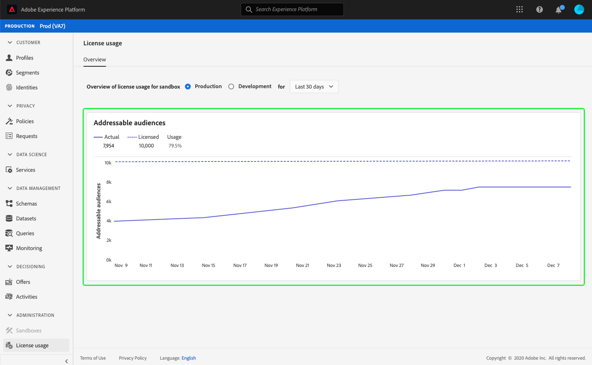

# （アルファ）[!UICONTROL ライセンスの使用]ダッシュボード{#license-usage-dashboard}

>[!IMPORTANT]
>
>このドキュメントで説明されているダッシュボード機能は、現在アルファベットで表示されており、すべてのユーザーが使用できるわけではありません。 ドキュメントと機能は変更される場合があります。

Adobe Experience Platformユーザーインターフェイス(UI)は、毎日のスナップショットでキャプチャされた、組織のライセンスの使用に関する重要な情報を表示できるダッシュボードを提供します。 このガイドでは、UIのライセンス使用ダッシュボードにアクセスして操作する方法と、ダッシュボードに表示されるビジュアライゼーションに関する詳細を説明します。

プラットフォームUIの一般的な概要については、[Experience PlatformUIガイド](ui-guide.md)を参照してください。

## ライセンス使用ダッシュボードデータ

ライセンスの使用ダッシュボードには、Experience Platformのための組織のライセンス関連データのスナップショットが表示されます。 ダッシュボード内のデータは、スナップショットが作成された特定の時点で表示されるとおりに表示されます。 つまり、スナップショットはデータの近似やサンプルではなく、ダッシュボードはリアルタイムで更新されません。

>[!NOTE]
>
>スナップショットが作成された後にデータに対して行われた変更や更新は、次のスナップショットが作成されるまでダッシュボードに反映されません。

## ライセンス使用ダッシュボードの詳細

プラットフォームUI内のライセンスの使用ダッシュボードに移動するには、左のナビゲーションバーの「**[!UICONTROL ライセンスの使用]**」を選択します。 これは、「**[!UICONTROL 概要]**」タブにダッシュボードが表示された状態で開きます。

### サンドボックスを選択

ダッシュボード内の表示に対するサンドボックスを選択するには、「[!UICONTROL 実稼働環境]」または「[!UICONTROL 開発環境]」を選択します。 選択したサンドボックスは、サンドボックス名の横のラジオボタンで示されます。

>[!NOTE]
>
>サンドボックスの消費レポートは、同じタイプのすべてのサンドボックスに対して累積的に行われます。 つまり、「[!UICONTROL 実稼働環境]」または「[!UICONTROL 開発環境]」を選択すると、それぞれ本番用サンドボックスと開発用サンドボックスに関するレポートが作成されます。

### 日付範囲の選択

サンドボックスを選択した後、日付範囲ドロップダウンを使用して、ダッシュボードに表示する期間を選択できます。 次の3つのオプションを使用できます。[!UICONTROL 過去30日間]、[!UICONTROL 過去90日間]、[!UICONTROL 過去12か月間]。 デフォルトでは、過去30日間が選択されています。

### ウィジェットと指標

ライセンスの使用ダッシュボードはウィジェットで構成され、組織のライセンスの使用に関する重要な情報を提供する読み取り専用の指標が表示されます。 これらのウィジェットの詳細については、このガイドの利用可能なウィジェットの節を参照してください。

## 利用可能なウィジェット{#available-widgets}

Experience Platformは現在、ライセンスの使用状況を視覚化するために使用できる1つのウィジェットを提供していますが、近日中にさらに多くのウィジェットがリリースされます。

### [!UICONTROL アドレス可能なオーディエンス] {#addressable-audiences}

**[!UICONTROL アドレス指定可能なオーディエンス]**&#x200B;ウィジェットは、プロファイルデータストア内のマージされたプロファイルの合計数を表示します。これは、システム生成のマージポリシーを適用し、決定論的（プライベート）グラフアルゴリズムを使用して現在のすべてのデータセットのプロファイルフラグメントを結合した後です。

フラグメントと結合されたプロファイルの詳細については、まず、[プロファイルの概要](../profile/home.md)の&#x200B;*プロファイルフラグメントと結合されたプロファイル*&#x200B;セクションを読んでください。

>[!NOTE]
>
>この指標の計算に使用されるマージ・ポリシーは、Experience Platformによって生成され、編集することも、別のマージ・ポリシーを選択することもできません。 このシステム生成のマージポリシーは、[!DNL Profile]ダッシュボードの[!UICONTROL オーディエンスサイズ]の計算に使用されるデフォルトのマージポリシーとは異なるので、[!UICONTROL ライセンスの使用]と[!DNL Profile]のダッシュボードのオーディエンス数が完全に同じになる可能性は低くなります。

## その他のダッシュボード

Platform UIには、Experience Platform内のデータのスナップショットを表示するための追加のダッシュボードが用意されています。 これらのダッシュボードには、リアルタイム顧客プロファイルとセグメントが含まれます。 これらのダッシュボードの詳細については、次のリンクから選択してください。

* [[!DNL Profile] dashboard](../profile/ui/profile-dashboard.md)
* [セグメントダッシュボード](../segmentation/ui/segment-dashboard.md)

## 次の手順

このドキュメントに従うことで、ライセンス使用ダッシュボードを見つけ、表示用のサンドボックスを選択できるようになります。 利用可能なウィジェットに表示される指標も理解する必要があります。 Experience PlatformUIについて詳しくは、[『プラットフォームUIガイド](ui-guide.md)』を参照してください。