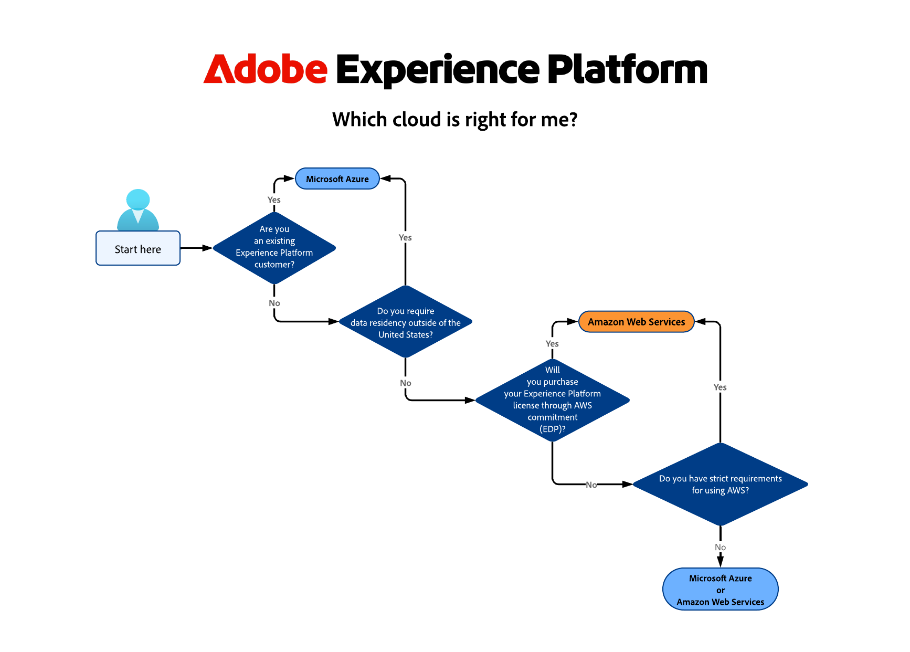
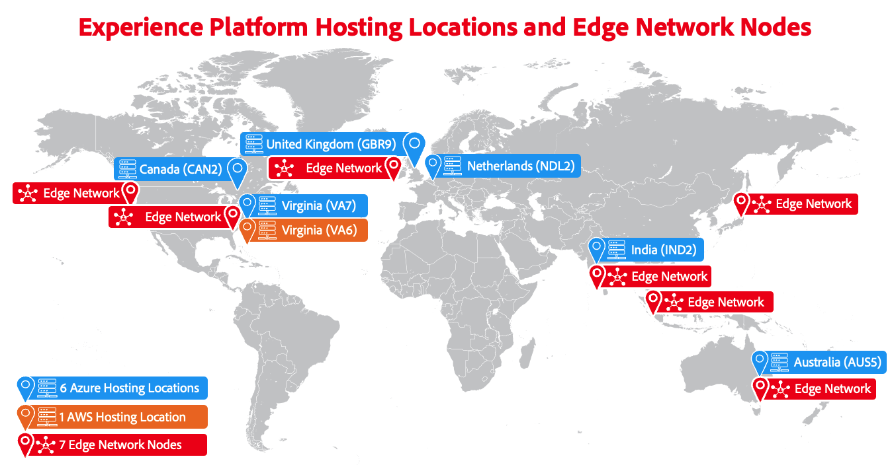

# Adobe Experience Platform マルチクラウドの概要

Adobe Experience Platformはマルチクラウド製品で、[[!DNL Microsoft Azure]](https://azure.microsoft.com/en-us)または[[!DNL Amazon Web Services (AWS)]](https://aws.amazon.com/jp/)のいずれかを実行できます。 この柔軟性により、ビジネスや技術的な要件に最適なものを選択できます。

>[!AVAILABILITY]
>
>Amazon Web Services（AWS）上で動作するAdobe Experience Platformは、現在、一部のお客様にご利用いただけます。 Adobe版Experience Platformの詳細については、AWSのアカウントチームにお問い合わせください。

このページでは、利用可能なふたつのクラウドインフラストラクチャの概要と、ビジネスに適したものを選択する方法に関するガイダンスを提供します。

## 最適なクラウド実装の条件？ {#which-cloud-is-right}

Azure上のExperience PlatformとAWSのどちらを選択するかは、ビジネスに固有のいくつかの要因によって異なります。

* **ビジネスおよび技術的なニーズ**：組織の要件と長期的なクラウド戦略を評価します。
* **既存のインフラストラクチャ**：現在のクラウドインフラストラクチャと統合のニーズを考慮します。
* **クラウドテクノロジーへの依存**：自社がMicrosoft テクノロジーに大きく依存している場合は、Azureの方が適している可能性があります。 Amazonサービスに依存している場合は、AWSの方が適しています。
* **データレジデンシーに関する考慮事項**：組織のデータレジデンシー要件を評価し、選択したクラウドプラットフォームがこれらの規制に準拠する地域を提供することを確認します。

上記の要因を考慮すると、この簡素化された意思決定ツリーは、ビジネスニーズに適したクラウド実装を決定するのに役立ちます。

{align="center" zoomable="yes"}

## ホスト場所 {#available-cloud-regions}

適切なクラウド地域を選択することは、データレジデンシー要件を満たし、最適なパフォーマンスを確保するために不可欠です。

{align="center" zoomable="yes"}

Experience Platformは、6つのMicrosoft Azure ホスティング場所、1つのAmazon Web Services（AWS）ホスティング場所で利用でき、世界中に分散している7つの[Edge Network ノード &#x200B;](../collection/home.md#edge)を通じてデータをAdobe サービスにルーティングします。

### Microsoft Azure リージョン {#azure-regions}

次の表は、Experience PlatformがホストされているMicrosoft Azure リージョンを示しています。

| 国 | 地域コード | 場所 |
|---------|-------------|----------|
| United States of America | VA7 | バージニア州 |
| 英国 | GBR9 | ロンドン |
| オランダ | NDL2 | アムステルダム |
| カナダ | CAN2 | トロント |
| インド | IND2 | マハラシュトラ州 |
| オーストラリア | AUS5 | ニューサウスウェールズ州 |

{style="table-layout:auto"}

### Amazon Web Services（AWS）リージョン {#aws-regions}

次の表は、Experience PlatformがホストされているAWS リージョンを示しています。 追加の場所が追加されているかどうかを定期的に確認してください。

| 国 | 地域コード | 場所 |
|---------|-------------|----------|
| United States of America | VA6 | バージニア州 |

{style="table-layout:auto"}

## 機能パリティ {#feature-parity}

Adobeは、次のようなExperience Platform上で動作するすべてのアプリケーションについて、クラウドプラットフォーム全体で機能のパリティを提供することに尽力しています。

* [Real-Time Customer Data Platform](../rtcdp/home.md)
* [Adobe Journey Optimizer](https://experienceleague.adobe.com/ja/docs/journey-optimizer/using/ajo-home)
* [Customer Journey Analytics](https://experienceleague.adobe.com/ja/docs/analytics-platform/using/cja-landing)

ただし、一部の機能は、AzureとAWSの実装で異なる場合があります。 これらの違いは、以下の節と、該当する場合は製品ドキュメントのその他の部分で概説されています。

### Microsoft AzureでのExperience Platformの実行とAWSの違い {#azure-aws-differences}

次の表では、Microsoft AzureでのExperience Platformの実行とAWSの主な違いを示しています。

| 機能/能力 | Microsoft Azure | Amazon Web Services |
| --- | --- | --- |
| [HIPAAへの準拠](https://www.adobe.com/trust/compliance/hipaa-ready.html) | サポートあり | サポートなし |
| [&#x200B; ソースコネクタのカタログ &#x200B;](/help/sources/home.md) | ソースカタログ内のすべてのコネクタがサポートされています | ソースコネクタの数は限られています。 AWSの実装で使用できるソースコネクタは、それぞれのドキュメントページのページ上部のメモで呼び出されます。 |

{style="table-layout:auto"}

<!-- 
To be determined if we need to add this part about the AI Assistant 

| [Experience Platform AI Assistant](/help/ai-assistant/home.md) | Supported | Not supported |

-->

## まとめ {#conclusion}

Experience Platformでは、Microsoft AzureまたはAmazon Web Servicesで実行できるオプションを提供することで、柔軟性と選択肢を提供します。 ビジネスニーズと既存のインフラストラクチャを評価し、どのクラウドプラットフォームを使用すべきかを十分な情報にもとづいて決定します。
