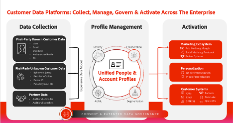

# マルチリージョン、マルチブランド企業向けのAdobe Experience Platform

## はじめに

Adobe Experience Platformは、顧客データおよびコンテンツの可能性を最大限に活用できる、変革を起こすソリューションの最前線に立っています。 Experience Platformを使用すると、様々なシステムのデータを一元化および標準化し、データサイエンスと機械学習の機能を適用できます。 その結果、消費者の共感を呼ぶパーソナライズされたエクスペリエンスの作成と配信が強化されます。

Experience Platformを使用すると、構造を表現し、ビジネスデータを管理して、拡張性と柔軟性の高い実装を行うことができます。 Platform アプリケーションの実装は、戦略的計画と慎重な考慮事項を必要とする重要なジャーニーです。特に、グローバル、地域、ブランド固有のドメイン、またはこれらすべての側面の組み合わせで作業する場合には注意が必要です。

このホワイトペーパーは、製品の視点と一連のガイドラインを提供するリファレンスとして機能します。 主な目的は、Experience Platformの複雑な構造を効果的にナビゲートするために必要なツールとインサイトを提供することです。 具体的な要件、考慮事項、実際のユースケースを評価するための構造化されたフレームワークを提供することで、Experience Platformとプラットフォームベースのアプリケーションの可能性を最大限に引き出すために必要な知識を得ることができます。 次の節を読むと、実装プロセスを合理化し、組織の機能を強化してオーディエンスに優れたエクスペリエンスを提供すると同時に、プライバシーとコンプライアンスを維持するためのガバナンスとコントロールを提供するための貴重なインサイトと推奨事項がわかります。



## マルチブランド、マルチリージョンエンタープライズについて

マルチブランド、マルチリージョンの企業を運営している場合、Experience Platformに固有のデータ管理要件がある可能性があります。 Experience Platformの実装を特定のニーズに最適にカスタマイズするには、個別の要件を理解することが重要です。

デプロイメントオプションを検討する際は、Experience Platformやプラットフォームベースのアプリケーションとやり取りするペルソナを理解し、検討する必要があります。 ユーザーの役割と関心に基づいてユーザーの経験を設計することで、実装を成功に導きます。 オプションを検討する際に考慮する必要がある 3 つの主要なペルソナを次に示します。

**マーケター、Mary:**

- 焦点：大規模な顧客獲得とエクスペリエンスのパーソナライゼーション。
- 目標：包括的なプロファイルを作成し、メディアの効率を向上させます。

**テクニカルニスト、Ted**

- 焦点：組織のデータ管理。
- 目標：コンプライアンスの確保、データサイロの管理、様々なビジネス部門へのサービス提供

**データアーキテクト、Dan**

- 焦点：データの正確性と品質。
- 目標：データのプライバシーと信頼の確保、スキーマとデータモデルの設計、データソースの管理。

### 1.限られたデータ分離で運用する企業

Experience Platformのアーキテクチャの主な原則の 1 つは、ガバナンスポリシーと要件に基づいて、顧客データが特定の実稼動サンドボックスに制限される点です。

マーケティングエクスペリエンスを大規模に運用するために 1 つのデータ環境が必要な場合は、最小限のデータ分離要件で、すべてのデータを 1 つのExperience Platform サンドボックスに統合することをお勧めします。 この設定では、データはサンドボックスに取り込まれ、関連するすべての ID は、偽名か既知の ID によって識別されるかに関わらず、単一の統合プロファイルとして表されます。 つまり、マーケターは、企業全体のExperience Platform内のすべてのプロファイル属性とエクスペリエンスイベントデータにアクセスできます。 マーケターがブランドや地域に関係なく、すべてのデータを使用することを制限する必要性を最小限に抑えながら、このデータをプラットフォームベースのアプリケーションと共に使用して、オーディエンスとジャーニーを作成できます。 このアプローチにより、Experience Platform アプリケーションでサポートされる宛先へのシームレスなセグメント化とオーディエンスのアクティベーションが容易になります。 この戦略は、地域やブランド固有の違いに関係なく、顧客基盤全体を活用して、統一された包括的なマーケティング活動を行うことを目指している場合に適しています。


#### この仕組み

まず、実装の計画とトップレベル環境の設定から始めましょう。 次に、Experience Platformとプラットフォームベースのアプリケーションを企業に最適に運用するために必要なサンドボックスの数、役割、権限を決定します。

##### 実装の一般的な設定

- サンドボックスを設定して、統合された顧客プロファイルを作成できるようにします。
- 役割とアクセス制御を設定して、サンドボックスを管理し、各ペルソナの機能にアクセスします。
- 開発用サンドボックスおよびサンドボックスツールを使用して、開発ライフサイクルを管理します。

**サンドボックス**

サンドボックスは、Experience Platform の単一インスタンス内の仮想パーティションで、デジタルエクスペリエンスアプリケーションの開発プロセスとシームレスに統合できます。サンドボックス内で実行されるすべてのコンテンツとアクションは、そのサンドボックスに限定され、データやデータへのアクセスを含む他のサンドボックスには影響しません。 Experience Platform でサポートされているサンドボックスには、次の 2 種類があります。

- **本番用サンドボックス**：実稼働用サンドボックスは、本番環境のプロファイルと共に使用するためのものです。 Experience Platformでは、運用の分離を維持しながら適切なデータ機能を提供するために、複数の実稼動サンドボックスを作成できます。

- **開発用サンドボックス**：開発用サンドボックスは、非実稼動プロファイルでの開発およびテストにのみ使用できます。

任意のタイプのサンドボックスを複数作成できます。このタイプのエンタープライズでは、1 つの実稼動用サンドボックスと 1 つの開発用サンドボックスを使用して、このタイプのエンタープライズを実行および操作する方法を説明します。


実稼動用サンドボックスでは、実稼動プロファイルとエクスペリエンスイベントデータを取り込んで、マーケティングアクティビティ用に統合されたプロファイルを作成することを想定しています。 複数の企業ソースの既知データと匿名データを組み合わせて、顧客プロファイルを作成する方法の詳細を説明します。顧客プロファイルを使用すれば、パーソナライズされた顧客エクスペリエンスをすべてのチャネルとデバイスにわたってリアルタイムに提供できます。詳しくは、[Adobe Real-Time Customer Data Platformのドキュメント &#x200B;](https://experienceleague.adobe.com/ja/docs/experience-platform/rtcdp/home) を参照してください。

**アクセス制御**

役割と権限を使用してアクセス制御を定義し、ペルソナとその必要な機能に応じて、アプリケーションリソースへのアクセスを制御できます。 さらに、プロファイルデータの特定のフィールドへのアクセスを制限するオプションもあります。 Experience Platform、プラットフォームベースのアプリケーションおよび顧客データの使用をより適切に管理するために、この手順を詳細に検討する必要があります。

Experience Platformおよびプラットフォームベースのアプリケーション機能のすべてにアクセスする必要がないデータエンジニアを考えてみましょう。 通常、データ定義（スキーマ）の作成、データを取り込むためのデータソースの設定、データセットの作成を担当します。 ただし、パーソナライズされた顧客体験のためにオーディエンスを作成し、アクティブ化するペルソナとは異なる場合があります。 このペルソナの場合は、役割を作成し、適切な権限を追加して、必要な機能にのみアクセス権を付与します。 これに対し、マーケターのペルソナは、スキーマを作成してデータを取り込むのではなく、オーディエンスを作成してアクティブ化し、パーソナライズされた顧客体験を可能にすることに重点を置きます。

必要に応じて、詳細なアクセス制御を追加して、属性ベースのアクセス制御/フィールドレベルのアクセス制御機能を備えた、統合顧客プロファイルの特定のフィールドへのアクセスを制限することを検討してください。 これらはExperience Platformのガバナンスメカニズムで、事前定義済みのラベルに基づいてデータ属性へのアクセスを制限できます。 フィールドレベルのアクセス制御を使用すると、個人を特定できるデータを管理でき、アクセスはすべてのExperience Platformおよびアプリケーションワークフローで制限されます。 アクセス制御機能について詳しくは、[&#x200B; アクセス制御ドキュメント &#x200B;](https://experienceleague.adobe.com/ja/docs/experience-platform/access-control/home) を参照してください。


**開発用サンドボックスを使用した開発ライフサイクル**

開発用サンドボックスの動作は、すべての機能面で実稼動用サンドボックスと同じです。 ライセンスの制限内に保つために、いくつかの契約上のガードレールがあるという点で異なります。 非実稼動プロファイルでの開発およびテスト専用に設計され、ライセンスを取得したプロファイルのコミットメントの最大 10% をサポートします（許可されたすべての開発用サンドボックスについて累積的に測定されます）。 その他の詳細とガードレールについては、[&#x200B; サンドボックスの概要ドキュメント &#x200B;](https://experienceleague.adobe.com/ja/docs/experience-platform/sandbox/home) 使用権限の詳細については [&#x200B; 製品説明ページ &#x200B;](https://helpx.adobe.com/jp/legal/product-descriptions.html) を参照してください。

開発およびテストのライフサイクルには複数の開発サンドボックスを含めることができます（この企業の例では、1 つの実稼動サンドボックスを使用しているので、最大 4 つ）。

**サンドボックスツールを使用したパッケージのエクスポートとインポート**

サンドボックスツール機能を使用すると、適切な権限を持つユーザーは、開発用サンドボックスから作業をパッケージ化し、リポジトリに書き出すことができます。 このリポジトリーには、これらのパッケージを専用のサンドボックスにインポートできる他のユーザーがアクセスできます。 この機能により、サンドボックス間で一貫した設定が保証され、シームレスな書き出しプロセスと読み込みプロセスが促進されます。

サンドボックスツールを使用すると、設定の精度が大幅に向上し、実装に必要な時間が短縮されます。 これにより、異なるサンドボックス間で正常に設定を効率的に移動できます。

サンドボックスツール機能を使用すると、様々なオブジェクトを選択して、それらをパッケージに書き出すことができます。 パッケージには、単一のオブジェクトまたは複数のオブジェクトを含めることができますが、すべてのオブジェクトは同じサンドボックスから生成される必要があります。

**API を使用したサンドボックスの自動化**

Experience Platform API を使用して、サンドボックスのデプロイメントと設定タスクを自動化することもできます。 API を使用すると、サンドボックス設定の書き出し、読み込み、変更などの繰り返しタスクをプログラムで制御でき、自動ワークフローを好む場合は柔軟に操作できます。

サンドボックスツールについて詳しくは、[&#x200B; サンドボックスツールのドキュメント &#x200B;](https://experienceleague.adobe.com/en/docs/experience-platform/sandbox/ui/sandbox-tooling) を参照してください。

|  |  |
| --- | --- |

### 2.地域別またはブランド別のデータ分離

完全な分離（例：地域またはブランドベース）が必要な場合は、厳格なデータアクセスポリシーまたは法的要件に基づいて、ブランドチームがそれぞれの地域やブランドに固有のデータにアクセスすることを制限できます。 地域やブランドに固有のデータに基づいてアクセスパターンを定義し、内部、規制、データガバナンスのプロトコルへのコンプライアンスを確保します。 このアプローチは、規制の厳しい業界（PII データの処理など）で業務を行う場合や、様々な地域やブランド ID に対して個別のセグメント化されたデータを維持する必要がある場合に重要です。


#### この仕組み

まず、実装の計画とトップレベル環境の設定を行い、Experience Platformとプラットフォームベースのアプリケーションを企業に最適に運用するために必要なサンドボックスの数、役割、権限を決定します。

##### マルチサンドボックス実装の一般的な設定

- 複数の実稼動用サンドボックスを設定して、各サンドボックスで統合顧客プロファイルを作成できるようにします。

- 役割とアクセス制御を設定して、サンドボックスを管理し、各ペルソナの機能にアクセスします。

- サンドボックスツールで開発ライフサイクルを管理します。

- グローバルレポートおよびアクティベーション（Customer Journey Analyticsを使用した組織間のインサイトを得るために複数のサンドボックスからのデータを集計）。

**サンドボックス**

1 つの実稼動用サンドボックスを使用したセットアップとは異なり、データとワークフローを完全に分離する必要がある場合は、より複雑なアプローチが必要になる可能性があります。 ここで複数の実稼動用サンドボックスが機能し、それぞれが特定のニーズに合わせて調整された分離単位を表します。

前述のように、各サンドボックスは、単一のプラットフォームインスタンス内の仮想パーティションです。 これらのサンドボックスを使用すると、他のサンドボックスに干渉しない制御された環境でデータ、ワークフロー、プロセスを管理できます。 開発用サンドボックスは、非実稼動プロファイルを使用したテストおよび開発活動を対象としていますが、実稼動用サンドボックスは、実際のマーケティング活動のための実際の実稼動データの取り込みをサポートするライブ操作の中核となります。

実稼動用サンドボックスでのクリーンな分離の主なメリットは次のとおりです。

1. **データガバナンスとコンプライアンス：** 厳格なデータプライバシー法がある規制対象の業界や地域で業務を行う場合、1 つの地域やブランドからのデータが確実に分離されるようにする必要があります。 複数の実稼動用サンドボックスを使用すると、適切なサンドボックス内でのみデータにアクセスできるようにすることで、ガバナンス要件や業界固有の標準に準拠できます。

2. **運用効率：** データとワークフローを分離することで、運用をより効率的に管理できます。 様々な地域やブランドを担当するチームは、誤ったデータ漏洩や不正アクセスの心配をすることなく、専用のサンドボックス内で独立して作業できます。

3. **カスタマイズされたワークフロー：** 各実稼動サンドボックスは、地域の特定のニーズや、それが表すブランドに合わせてカスタマイズできます。 これにより、そのセグメントに最適化されたカスタマイズされたワークフロー、データモデル、マーケティング戦略を実装できます。

4. **スケーラビリティ：** 規模が大きくなると、追加の実稼動用サンドボックスを簡単に作成して、新しい地域やブランドに対応できるようになります。 この拡張性により、データの整合性やパフォーマンスを損なうことなく、変化するニーズにプラットフォームを適応させることができます。

5. **制御強化：** 複数の実稼動用サンドボックスを使用すると、管理者は、アクセス権限、データ取り込みおよびワークフローの実行を詳細に制御できます。 これにより、グローバル企業全体で複雑な運用を管理するために、より安全で組織的なアプローチを実行できます。

**アクセス制御**

複数の実稼動用サンドボックスのコンテキストでは、アクセス制御は、Experience Platform内のデータとワークフローを管理するための重要なコンポーネントであることに変わりはありません。 ただし、複数の地域にまたがるマーケティングチームや、グローバルなデータ取り込みおよびデータモデリングを担当するデータエンジニアなど、役割に関連するサンドボックスにのみユーザーがアクセスできるようにする一方で、必要なユーザーに対してクロスサンドボックス操作を有効にする必要があるので、管理者が対応するのが複雑になります。

**サンドボックス間での役割と権限の定義：**

単一の実稼動サンドボックスのシナリオと同様に、様々なペルソナのニーズに合わせた役割と権限を使用して、アクセス制御ポリシーを定義できます。 ただし、マルチサンドボックス環境において、これらの役割が様々なサンドボックス間でどのように拡張されるかを考慮する必要があります。

以下に例を示します。

- **地域のマーケター：** マーケターが複数の地域で業務を行う場合、その役割は複数のサンドボックスにまたがる必要が生じる場合があります。 複数のサンドボックスをまたいでリソースにアクセスするために必要な権限を付与しながら、各サンドボックス内の適切なデータとワークフローに限定されたアクセスを確保できます。

- **データエンジニア：** データモデルの作成、スキーマの定義およびデータ取り込みの管理を担当するデータエンジニアは、すべてのサンドボックスにアクセスする必要がある場合があります。 ユーザーの役割を設計して、ユーザーのタスクに関連する機能とデータのみにアクセスを制限しながら、プラットフォーム全体で操作できるようにすることができます。 例えば、ヨーロッパと北米のデータモデルを扱うデータエンジニアは、スキーマを変更してデータを取り込む権限を持つ場合、これらの地域の実稼動サンドボックスにアクセスできます。 ただし、オーディエンスの作成やアクティブ化などのマーケティング機能にはアクセスできません。

**詳細なアクセス制御に関する考慮事項：**

マルチサンドボックス環境では、きめ細かいアクセス制御がさらに重要になります。 属性ベースのアクセス制御（フィールドレベルのアクセス制御/オブジェクトレベルのアクセス制御）を使用すると、プロファイルまたは特定のオーディエンス内の特定のデータフィールドへのアクセスをさらに制限し、機密性の高い情報または個人を特定できる情報（PII）をすべてのサンドボックスで保護できます。 以下に例を示します。

- サンドボックス内の特定のデータフィールドへのアクセスを、その地域内のユーザーのみに制限できます。 これにより、PII や機密データが、プライバシー規制や社内ガバナンスポリシーに従って、必要とするユーザーにのみ表示されるようになります。

- クロスサンドボックスアクセスを持つユーザーの場合、属性ベースのアクセス制御では、複数のサンドボックスにアクセスできる場合でも、機密データの表示は役割と必要な知識ベースによって制限されます。

役割ベースおよび属性ベースのアクセス制御の利点：

1. 役割と属性に基づいてアクセスを制御することで、不正なデータ・アクセスのリスクを大幅に軽減し、適切な権限を持つユーザーだけが機密情報を表示または操作できるようにします。

2. 明確に定義された役割と権限により、各ペルソナが必要な機能とデータに不要な混乱やリスクなしにアクセスできるので、運用が効率化されます。 この明確さは、効率的なワークフローをサポートし、摩擦を減らします。

3. 企業の成長と発展に合わせて、新しい地域、ブランド、役割に対応するようにアクセス制御を調整できます。 既存のワークフローを中断することなくアクセスを変更する柔軟性は、運用を拡大するために不可欠です。

4. 管理者は、すべてのサンドボックスを一元的に制御でき、企業全体でアクセス制御を適用する方法の一貫性を確保できると同時に、様々な地域やブランドに合わせてカスタマイズできます。

**開発用サンドボックスを使用した開発ライフサイクル**

Experience Platform内の複数のリージョンやブランドにわたる開発ライフサイクルを管理するには、一貫性、効率性、拡張性を確保する堅牢なアプローチが必要です。 開発用サンドボックスは、多数の実稼動用サンドボックスを含む複雑な環境における開発ライフサイクルをサポートします。 これらは、サンドボックスツール機能によって強化され、異なる環境間でシームレスな設定共有とデプロイメントを可能にします。

開発用サンドボックスは、開発ライフサイクルで重要な役割を果たします。 これらのサンドボックスは、開発者とデータエンジニアが、実稼動データに影響を与えることなく設定を構築、テスト、繰り返し実行できる独立した環境を提供します。 機能的には実稼動用サンドボックスと似ていますが、開発用サンドボックスの機能は異なります。実稼動以外のプロファイルを使用したテストを目的としており、許可されたすべての開発用サンドボックスでライセンス済みプロファイルの最大 10% のコミットメントをサポートするなど、契約上の制限が適用されるからです。

異なるチームや地域をサポートする複数の開発用サンドボックスを作成できます。 これにより、各チームは、地域やブランドに固有のワークフローを試して、開発中も実稼動環境が安定し、安全に保たれるようにします。 実稼動用サンドボックスが多数ある場合は、開発用サンドボックスのプールを使用して、複数の地域やブランドをサポートすることをお勧めします。

**サンドボックスツールを使用したパッケージのエクスポートとインポート**

複数のサンドボックスを管理している場合、サンドボックスツール機能は強力なツールです。 開発者、データエンジニアおよびマーケターは、スキーマ、データモデル、その他の設定を含む開発用サンドボックスに作業をパッケージ化してから、リポジトリに書き出すことができます。 そこから、他のユーザーがこれらのパッケージにアクセスして指定のサンドボックスに読み込むことができ、ビジネス全体でシームレスな共有と正常な設定のデプロイメントが容易になります。

例えば、北米地域用の開発サンドボックスで作業するデータエンジニアは、スキーマを作成して、すべての依存関係と共にパッケージ化できます。 ヨーロッパなど、別の地域の別のデータエンジニアは、このパッケージにアクセスして、地域のサンドボックスに読み込むことができます。 このプロセスにより、企業全体にわたるデータのモデリングと構成の一貫性が確保され、エラーのリスクが軽減され、運用効率が向上します。

マルチサンドボックス環境でのサンドボックスツールの利点は次のとおりです。

1. サンドボックスツールを使用すると、複数のサンドボックス間で正常な設定を簡単に共有できるので、開発のライフサイクルが合理化されます。 これにより、作業の重複が減り、すべての地域やブランドでベストプラクティスが一貫して実装されるようになります。

2. 異なるサンドボックス間でパッケージを書き出しおよび読み込む機能により、企業内の相互運用性が向上します。 様々な地域のチームはより効果的に共同作業を行い、地域やブランド固有の要件に対応しながら、設定を企業全体の目標に合わせることができます。

3. 企業が成長し、新しい地域やブランドに対応するためにサンドボックスを追加するようになると、サンドボックスツールは、これらの環境を効率的に管理するために必要なスケーラビリティを提供します。 新しいサンドボックスは、既存のパッケージを使用してすばやく設定できるので、オンボーディングプロセスを加速し、運用を開始するのに必要な時間を短縮できます。

4. 設定および依存関係を開発用サンドボックスにパッケージ化し、実稼動用サンドボックスにデプロイすることで、企業全体で設定を正確かつ一貫性のあるものにすることができます。 これにより、エラーの可能性が低くなり、プラットフォームの全体的な信頼性が向上します。

5. サンドボックスツールを使用すると、開発から実稼動への移行がスムーズに行われ、制御されます。 開発用サンドボックスで設定をテストおよび検証したら、想定どおりに実行できると確信できる状態で、設定を書き出して実稼動用サンドボックスに読み込むことができます。

**グローバルなレポートとアクティブ化**

これには、組織間のインサイトを得るために複数のサンドボックスからのデータを集計することが含まれ、多くの場合、Customer Journey Analyticsと統合するために専用のレポートサンドボックスが必要になります。

複数の実稼動用サンドボックス アプローチは、地域やブランド固有の運用に分離のメリットを明確に提供しますが、クリエイティブソリューションを必要とする課題も生み出します。 主な課題は、グローバルレポートやグローバルキャンペーンのためにサンドボックス間でデータを分析できることです。 企業は多くの場合、グローバルレベルでカスタマージャーニーを理解する必要があります。これには、複数のサンドボックスからのデータの統合と、クロスサンドボックスマーケティング活動の有効化が含まれます。 以下では、これらの課題に対処するためのアプローチを概観する。

**サンドボックス間のグローバルレポート**

企業が複数の実稼動用サンドボックスで運用する場合、それぞれが地域またはブランドを表しているので、すべてのサンドボックスにわたる顧客データの分析は複雑になります。 例えば、異なるブランドをまたいでカスタマージャーニーの統一されたビューを作成するには、これらの分離された環境からのデータを統合する必要があります。

**専用のグローバルサンドボックス**


このサンドボックスは、個々の地域またはブランド固有のサンドボックスからのデータが統合される中央リポジトリとして機能します。 一般的なソリューションは、各サンドボックス内でクエリサービスを使用して、関連する顧客データを抽出することです。 これには、様々な地域やブランドにわたって分析する必要があるプロファイルやエクスペリエンスイベントが含まれる場合があります。 各サンドボックスからデータを準備すると、分析とオーディエンス作成のためにグローバルレポートサンドボックスに取り込まれます。

Customer Journey Analyticsを使用して、グローバルサンドボックスで集計データに対してクロスマーケット分析とクロスブランド分析を行い、すべてのブランドとリージョンにわたる顧客インタラクションの包括的なビューを取得します。 これにより、複数のブランドにエンゲージする顧客の特定や、クロスブランドまたはクロス地域のオーディエンスの作成など、貴重なインサイトを生成できます。 これらのインサイトは、マーケティング戦略のアクティブ化、顧客体験のパーソナライズ、企業の成長の促進など、様々な目的に使用できます。

**オーディエンスの共有**

また、グローバルサンドボックスを使用すると、グローバルマーケティングチームは、より幅広くオーディエンスを定義および管理できます。 サンドボックスツールを使用すると、これらのグローバルオーディエンス（定義のみ、データは不可）をグローバルサンドボックスから個々のブランドまたは地域のサンドボックスに書き出すことができます。これにより、ローカルマーケティングチームは各市場で評価してアクティブ化できます。

さらに、Platform の機能であるExperience Platform Segment Match を使用して、異なる組織単位や事業体間でクロスサンドボックスのセグメント共有（選定オーディエンス）を可能にすることができます。

このセグメント共有サービスを使用すると、2 人以上のユーザーが、安全で管理された、プライバシーに配慮した方法でセグメントデータを交換できます。

Segment Match 機能について詳しくは、[Segment Match のドキュメント &#x200B;](https://experienceleague.adobe.com/en/docs/experience-platform/segmentation/ui/segment-match/overview) を参照してください。

### 3. グローバルな業務、地域、ブランド固有のアプローチのブレンド

多くのマルチブランド企業はグローバルな規模で運営されており、そのため、多くの場合、統合されたデータ管理アプローチと独立したデータ管理アプローチの両方を組み合わせることを求めています。 このシナリオでは、複数の地域や国のデータを分離しようとしています。 組織内のブランドは、地域や国の同じデータ境界内で、特定のブランドに関連付けられたデータにのみ動作することを期待できます。 このアプローチにより、ブランド固有のマーケティングとデータ操作を促進しながら、地域または国の一元的なデータ管理が可能になります。 統合データ管理の利点と、ブランドおよび地域固有の分離の必要性を組み合わせたモデルです。

これらの様々な要件を認識した上で、Experience Platformを構成することにより、適応性と柔軟性に優れたデータ管理ソリューションを提供することができます。これにより、マルチブランド、マルチリージョンの企業が、プラットフォーム内で効果的にビジネスを展開できるようになります。 Experience Platformは、お客様の総合的なデータを最大限に活用する、厳密にデータを分離する、またはそれらのバランスを取るといった目的を問わず、企業の多様なニーズに対応する機能を備えています。


#### この仕組み

最初に、実装の計画とトップレベル環境の設定を行い、この企業に最適なExperience Platformとプラットフォームベースのアプリケーションを運用するために必要なサンドボックス、ロール、権限の数を決定します。

##### このエンタープライズの一般設定

- 複数の実稼動用サンドボックスを設定して、統合された顧客プロファイルを作成できるようにします。

- 役割とアクセス制御を設定して、サンドボックスを管理し、各ペルソナの機能にアクセスします。

- 属性ベースのアクセス制御の設定：プロファイル属性とオーディエンスをきめ細かく制御するための、フィールドレベルのアクセス制御/オブジェクトレベルのアクセス制御。

- 開発用サンドボックスとサンドボックスツールを使用して、開発ライフサイクルを管理します。

- グローバルレポート。

**サンドボックス**

ブランド/地域ごとにサンドボックスを設定します。 複数の実稼動用サンドボックスの作成については、上記の節を参照してください。

**アクセス制御**

役割とユーザー権限：

- 「**マーケター – グローバル**」の役割を作成し、オーディエンスの作成、表示および管理を行う権限を付与します。 さらに、この役割は、すべての顧客データを表示する権限を取得します。

- 役割を作成し、適切なペルソナの特定の機能にのみアクセス権を付与します。 例えば、ユーザーの役割「**マーケター – ドイツ**」と「**マーケター – フランス**」は、フィールドレベルのアクセス制御、オブジェクトレベルのアクセス制御、デフォルトオーディエンスの組み合わせによって有効になる国データに対して、オーディエンスを作成、表示および管理する権限のみを取得します。

- 「**テクノロジスト – グローバル**」という役割を作成し、スキーマ、データセット、ポリシー、ソースなどを作成および管理するための適切な権限を付与します。 この役割は、必要なすべての管理と設定を担当します。

###### スキーマデザインと属性ベースのアクセス制御：フィールドレベルのアクセス制御

**エクスペリエンスデータモデル（XDM）**

Experience Platformの標準化されたデータスキーマにより、すべてのプラットフォームベースアプリケーションで一貫したデータ構造と相互運用性を確保します。

**属性ベースのアクセス制御：フィールドレベルのアクセス制御とデータモデリングオプション：**

- データモデルを作成して、国ごとに制限する必要があるテナント固有の XDM フィールド（PII）を含めます。

- 国ラベルを作成して XDM フィールドに適用します。 ラベル = ドイツ、フランス、アイルランド、オランダなど。

- 適切な役割にラベルを追加します。 例えば、「マーケター – ドイツ」の役割にラベル「Germany」を追加します。

XDM 個人プロファイルスキーマ：

```
\- PII
\- Germany
    \- name --> Label: "Germany"
    \- email --> Label: "Germany"
    \- birthdate --> Label: "Germany"

\- France
    \- name --> Label: "France"
    \- email --> Label: "France"
    \- birthdate --> Label: "France"

\- Netherland
    \- name --> Label: "Netherland", "Germany"
    \- email --> Label: "Netherland", "Germany"
    \- birthdate --> Label: "Netherland", "Germany"

\- Loyalty
    \- member
    \- registrationDate
```

###### オーディエンス：属性ベースのアクセス制御を使用：オブジェクトレベルのアクセス制御で、ブランド/国固有のオーディエンスへのアクセスを制御します

**属性ベースのアクセス制御：オーディエンスのオブジェクトレベルのアクセス制御：**

- オーディエンスを作成し、それらを表示できるユーザーを制御します。

- 国ラベルを作成し、オーディエンスに適用します。 ラベル = ドイツ、フランス、アイルランド、オランダなど。

- 適切な役割にラベルを追加します。 例えば、「マーケター – ドイツ」という役割に「Germany」というラベルを追加します。


###### ブランドや国固有のオーディエンスを作成する際に、デフォルトオーディエンスを含めます

**デフォルトオーディエンス：行レベルのアクセス制御の代替：**

- 現在、Audience Builder を使用すると、オーディエンス作成プロセスの構成要素として既存のオーディエンスを含めることができます。

- 結果はオーディエンスから得られ、続いて属性とイベントが返されます。

- コンポジション時に 1 つ以上のオーディエンスを自動追加するメカニズムはありません。


###### アクティベーションとブランド/国レベルのプロファイルフィルタリング

**カスタム同意ポリシーオプション：**

これにより、アクティベーション時にプロファイルを制御またはフィルタリングできます。

- マーケティングアクションを作成します。

- 宛先を作成し、マーケティングアクションを関連付けます。

- カスタム同意ポリシーを作成します。

>[!NOTE]
>
> 同意ポリシーを作成するには、Privacy and Security Shield SKU が必要です。


マルチブランドアクティベーションと同意ポリシーの複雑さ：

複数のブランドをまたいでオーディエンスアクティベーションを管理するには、同意ポリシーの詳細なガバナンスが必要で、各ブランドの固有の要件が満たされていることを確認します。 さらに、Adobe Privacy and Security Shield （Experience Platformのコンプライアンス機能の 1 つで、データ保護ポリシーを適用し、様々なアクティベーションチャネルにわたる規制の整合性を確保します）では、様々なアクティベーションチャネルにわたる同意ポリシーの適用方法に特定の制限が課される場合があります。 これらの考慮事項を慎重に評価し、コンプライアンスと運用効率を維持するためにガバナンスフレームワークを実装する必要があります。

また、同意ポリシーの設定やチャネル固有のアクティベーションなど、複雑な操作は慎重に行う必要があります。 各地域またはブランドに対して同意ポリシーを明示的に定義し、これらの設定を一貫して管理することは、コンプライアンスと運用効率にとって重要です。

## 一般的な考慮事項

場合によっては、多数のサンドボックスで単一の組織 ID を使用するのではなく、複数の組織 ID にわたってExperience Platformとプラットフォームベースのアプリケーションをデプロイすることを選択できることがあります。 このアプローチは、データの常駐、セキュリティ、管理の面でメリットを提供しますが、複雑さも伴います。 複数組織によるアプローチが適切なタイミングを判断する際の主な考慮事項を次に示します。

### 組織 ID とは

- 組織 ID は、AdobeのFederated IDおよび OAuth 2.0 プロトコルの実装です。

- 組織 ID は、Adobeの契約条件の下で組織が権限を持つすべてのアプリケーション、ユーザーおよび権限のコレクションです。

- ユーザーアカウントと権限は、各組織のAdmin Consoleで管理されます。

- また、組織 ID は、Adobe ソリューションの相互動作も制御します。 同じ組織内のソリューションは相互運用性を持つことができます。

- 通常、組織 ID は 1 つの地理的リージョンにデプロイされます。


**複数の組織 ID：メリットと考慮事項&#x200B;**

| メリット | 注意点 |
| -------- | -------------- |
| 複数の組織 ID を持つ利点のリストを以下に示します。 <ul><li>特定のグローバル地域にデータを柔軟に保存できる。</li><li>&#x200B;インスタンスごとに個別のユーザーログインを行う – Wholefoods は Audible にログインできません&#x200B;</li><li>各市場/BU が必要に応じて独自の環境にカスタム接続を構築できる専用の API エンドポイント&#x200B;。</li><li>各ビジネス・ユニットには、独自の顧客管理キー&#x200B;があります。</li><li>GDPR リクエストは、事業単位&#x200B;ごとに行うことができます。</li><li>ビジネスユニット間のストレージとコンピューティングを完全に分離&#x200B;。</li><li>一部の組織レベルのパフォーマンスガードレール/制限を緩和&#x200B;します。</li><li>ビジネスユニット間での SKU のプロビジョニングと混在により、柔軟性が向上します。 例えば、ある組織がAdobe Journey Optimizerの異なる SKU を持っているとします。</li></ul> | 複数の組織 ID を持つ場合は、次の点に注意してください。 <ul><li>複数の組織 ID を管理する場合と 1 つ管理する場合の違い&#x200B;</li><li>管理する複数の別個のインスタンス/環境（統合、データ読み込みなど）。</li><li>&#x200B;ECID は組織ごとに一意になるので、ビジネスユニット間でデータを照合するのが難しくなります&#x200B;。</li><li>組織ごとに Analytics と Target を移行/再実装する必要があります。グローバルなロールアップは失われます（現在使用中の場合）&#x200B;</li><li>ビジネスユニットをまたいで GDPR 要求を行うには、より多くの調整が必要&#x200B;です。</li><li>一部のExperience Platform ベースのアプリケーション統合では、組織レベルでメタデータが保存されます。 すべてがサンドボックスによって「サンドボックス」されているわけではありません&#x200B;</li><li>組織 ID は地域にピン留めされています。 Adobe AWSのホスティングサイトは現在、米国のみです。 Adobeは、あるホスティングリージョンから別のホスティングリージョンへの移行をサポートしていません&#x200B;</li><li>Edgeはサンドボックス対応ではありません（イベント転送用）。</li></ul> |

**単一組織 ID：メリットと考慮事項**


| メリット | 注意点 |
| -------- | -------------- |
| 単一の組織 ID を持つ利点のリストを次に示します。 <ul><li>個々のサンドボックスをプロビジョニングして、デプロイ済み地域内のビジネスユニット間で論理的な分離を作成します</li><li>ユーザーやプロビジョニングなどを管理する IT 部門の 1 つの組織 ID。</li><li>同じ組織 ID を使用している場合、Adobe Tags、Target、Analytics などの移行はありません。</li><li>既存の ECID に対してリセットは不要です。これにより、Adobe Analytics データの「クリッピング」を防ぐことができます。</li><li>グローバルマーケティングリソース用のシングルログイン。</li><li>ユーザーアクセス権：役割ベースのアクセス制御の適切なレベルを使用して、誰がどのサンドボックスにアクセスできるかを制御します。</li><li>グローバルな Analytics と Target のインスタンスおよびレポートスイートのデータを活用します。</li></ul> | 単一の組織 ID を持つ場合は、次の点に注意してください。 <ul><li>データは 1 つの領域に保存されます。</li><li>データを 1 つの組織 ID に統合する必要がある可能性があります。</li><li>すべてのビジネスユニットは、アプリケーション（コア Experience Platform、Real-Time CDP、Adobe Journey Optimizer、Customer Journey Analytics）をまたいで同じインフラストラクチャを共有することになります。</li><li>ガードレール：1.5k RPS のストリーミングセグメント化など、組織ごとにグローバルなものもあります。</li><li>GDPR リクエストは組織レベルで動作するので、特定のサンドボックスをターゲットにすることはできません。</li><li>顧客管理キーは組織 ID レベルで設定されます。このアプローチでは、すべてのビジネスユニットサンドボックスが同じ暗号化キーを共有します。</li><li>DX および CC 全体のエンタープライズライセンスを明確にして、アプリケーションが正しい組織 ID でプロビジョニングされるようにする必要があります。</ul></li> |

**便益と注意点**

複数の組織 ID は、サンドボックスレベルで管理する単一の組織 ID と比較して、組織レベルでユーザーのアクセス、使用権限およびデータの分離を管理します。

| シナリオ/要件 | 複数の組織 ID | 複数のサンドボックス（単一の組織 ID） |
| ----------------------------------- | --------------------------------------------------- | ----------------------------------------------- |
| データ常駐 | 完全な分離と地域固有の組織 ID | 単一地域デプロイメント |
| データガバナンスと分離 | 完全な分離/分離 | 運用分離、共有組織 ID |
| コンプライアンス管理（GDPR など） | 組織 ID ごとに別々のリクエスト | 単一のリクエストがサンドボックス間で適用されます |
| インフラストラクチャのコストとライセンス | 設定の重複が原因で高くなる可能性がある | 通常、一元管理によって低い値になる |
| グローバルレポートとアクティベーション | 孤立した環境が原因で困難 | 容易なクロス地域レポートとアクティブ化 |
| 管理の複雑さ | 複数の分離された組織 ID が原因で増加 | 下位の一元的な管理 |

## まとめ

Experience Platformは、マルチブランド、マルチリージョンのビジネスモデルをまたいで顧客データを一元化、管理およびアクティブ化するための堅牢なフレームワークを企業に提供します。 このホワイトペーパーでは、様々なデータ分離や運用のニーズを持つ組織に最適なExperience Platformを導入するための、主要な導入戦略、ガバナンスモデル、ベストプラクティスについて説明しました。

## 重要ポイント

1. **柔軟なデプロイメントモデル**

   - 企業は、運用、コンプライアンス、ガバナンスの要件に基づいて、**シングルサンドボックス、マルチサンドボックス、ハイブリッドアプローチ** のいずれかを選択できます。

   - **グローバル組織** では、運用効率を維持しながらガバナンス要件に準拠するために、複数の実稼動サンドボックスが必要になる場合があります。

2. **データガバナンスとアクセス制御**

   - **属性ベースのアクセス制御、フィールドレベルのアクセス制御、オブジェクトレベルのアクセス制御により** データアクセスの正確なガバナンスが可能になります。

   - 様々なペルソナ **マーケター、データアーキテクト、IT チームなど）に対して** 役割と権限を明確に定義）し、データが適切に使用されるようにする必要があります。

3. **サンドボックスツールと自動処理**

   - **サンドボックスツール** を使用すると、設定管理が簡素化され、チームは設定を効率的に書き出しと読み込みできます。

   - **API ベースの自動化** は、サンドボックスのデプロイメントとガバナンスを大規模に合理化したいと考えている企業にとって利用可能なオプションです。

4. **グローバルなレポート作成とアクティブ化戦略**

   - **Customer Journey Analytics** を利用している企業では、グローバルレポートを統合する際に、データの同期と商業的な影響を考慮する必要があります。

   - **セグメントの一致** は、クロスサンドボックスのオーディエンス共有のためのプライバシーに準拠したメカニズムを提供し、シームレスなマーケティングアクティベーションを確実に行います。

5. **複数組織 ID とマルチサンドボックスの比較**

   - データの常駐、コンプライアンス、運用のニーズに基づいて、**複数の組織 ID または複数のサンドボックス** をデプロイするかどうかを慎重に評価する必要があります。

   - **組織 ID** は完全な分離を提供するのに対して、マルチサンドボックス設定は&#x200B;**共有ガバナンスフレームワーク内での運用の柔軟性を提供します**。

## 最終思考

企業がデジタルエクスペリエンス機能を拡張する際、Experience Platformは、データ駆動型マーケティング、カスタマーインテリジェンスおよびクロスチャネルアクティベーションを推進する基盤プラットフォームとして機能します。 実装を成功させるには、長期的な効率と拡張性を確保するために、**サンドボックスガバナンス、コンプライアンスポリシー、運用ワークフロー** の慎重な計画が必要です。

このホワイトペーパーで概要を説明しているベストプラクティスを活用することで **Experience Platformをマルチブランドおよびマルチリージョンの業務用に最適化する** ことができ、シームレスなデータ管理、コンプライアンスおよびパーソナライズされたカスタマーエクスペリエンスを大規模に実現できます。

## 認諾

このホワイトペーパーは、様々なチームをまたいで対象分野の専門家からのインサイトとフィードバックを得て開発され、正確性、明確さ、実践的なガイダンスを確保しています。 同僚の皆さまには、貴重なご意見やご感想をお寄せいただきありがとうございました。 このドキュメントは、マルチブランドおよびマルチリージョン環境でAdobe Experience Platformを導入する企業により適したサービスを提供するために、専門知識が役立ちました。
