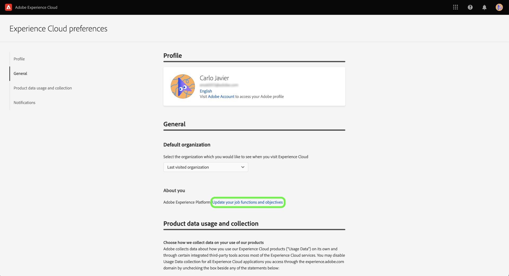

# 自己識別サーベイを使用した Experience Platform 個人プロファイルの作成

>[!NOTE]
>
>自己識別サーベイはベータ版です。その機能とドキュメントは変更される可能性があります。

自己識別サーベイは、Adobe Experience Platform UI ホームページで提供されている短いアンケートです。サーベイに記入すると、職務および一般的な目的に関する情報を提供できます。その後、製品内ガイドへの準拠を強化し、最終的に目的により適したコンテンツを配信するために、この情報が使用されます。

このドキュメントでは、Platform UI で自己識別サーベイを使用して、目標とタスクに応じて関連性の高いコンテンツを受け取る方法と、UI を使用して個人プロファイル属性を再設定する方法について説明します。

Adobe Experience Platform について詳しくは、[Experience Platform の概要](home.md)を参照してください。

## Platform UI での自己識別サーベイ

ログインすると、Platform UI ホームページの右下に、自己識別サーベイのプロンプトが表示されます。

サーベイを開始するには、「**[!UICONTROL 開始]**」を選択します。

サーベイの最初の質問では、自分の業務内容を最もよく表す職種を選択します。

使用できる選択肢は次のとおりです。

* 管理
* エンジニアリング
* プライバシーおよびガバナンス
* マーケティング
* その他

>[!NOTE]
>
>選択肢のリストから複数の職種を選択できます。「[!UICONTROL その他]」を選択すると、目的の詳細を入力するように求められます。

続行するには、現在の業務内容を最もよく表す職種を選択し、「**[!UICONTROL 次へ]**」を選択します。

次に、業務内容に最も当てはまる特定の目的を選択します。

選択可能な目的のリストを以下に示します。

* ユーザーの作成と管理
* 役割、権限および製品プロファイルの割り当て
* ライセンス使用状況、サンドボックスおよびアラートの管理
* データ取り込みに対応するシステムの設定
* 組織のデータ構造のモデル化
* データのクエリ、フィルタリングおよび最適化によるインサイトの生成
* 同意およびデータポリシーの設定
* データガバナンスとプライバシーコンプライアンス
* マーケティング戦略の策定
* オーディエンスの作成、管理およびセグメント化
* ビジネスへの影響を分析するためのダッシュボードのセットアップ
* ダウンストリームターゲティングに向けた宛先に対するデータのアクティブ化

終了したら、「**[!UICONTROL 送信]**」を選択します。

自己識別サーベイが完了したら、「**[!UICONTROL 完了]**」を選択します。

>[!NOTE]
>
>目的とレコメンデーション（存在する場合）は、選択した職種に応じて変わります。

## サーベイに対する回答の更新

Experience Cloud の環境設定メニューを使用して、職種と目的を更新します。環境設定メニューにアクセスするには、上部のナビゲーションでプロファイルアイコンを選択したあと、「**[!UICONTROL 環境設定]**」を選択します。

次に、プロファイル環境設定メニューの「[!UICONTROL 一般]」セクションで、「**[!UICONTROL 職種と目的を更新]**」を選択します。

自己識別サーベイが表示され、回答の再設定とプロファイルの更新が可能です。

## 次の手順

このドキュメントを通じて、Platform UI の使用時により関連性の高いコンテンツを受け取ることができるように、職種と目的に関する情報を送信および更新することができました。Platform UI について詳しくは、[Experience Platform の概要](home.md)を参照してください。
