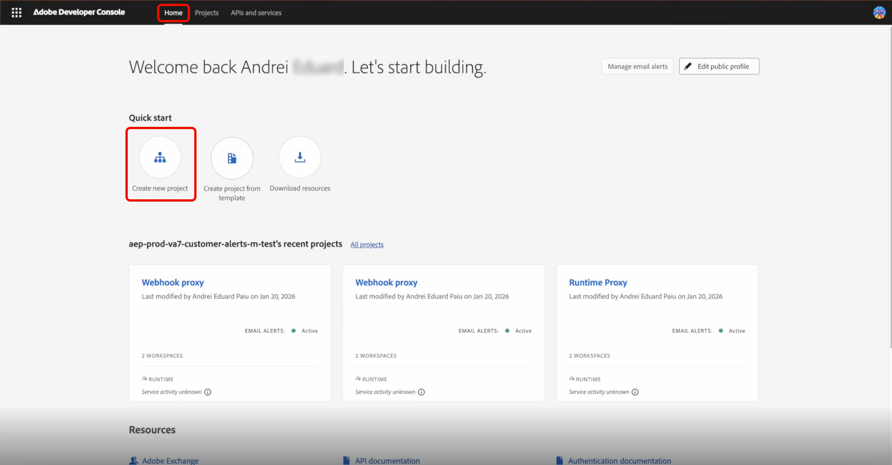
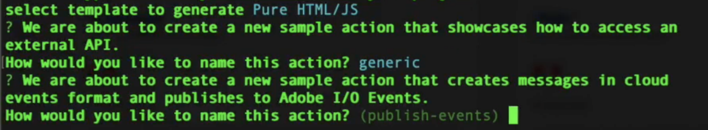
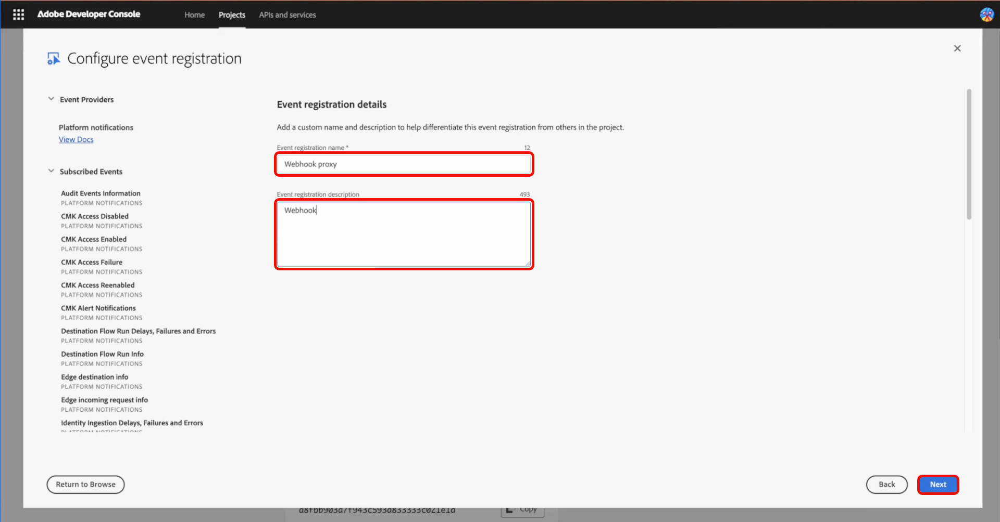

# 顧客向けアラートのSlack統合

Adobe Experience Platformでは、[Adobe App Builder](https://developer.adobe.com/app-builder/docs/get_started/app_builder_get_started/first-app) で webhook プロキシを使用して、[ で ](https://developer.adobe.com/events/docs/guides/)Adobe I/O Events[!DNL Slack] を受け取ることができます。 プロキシは、Adobeの検証ハンドシェイクを処理し、イベントペイロードを [!DNL Slack] メッセージに変換して、お客様に対するアラートをワークスペースに配信できるようにします。

## 前提条件 {#prerequisites}

開始する前に、次の点を確認してください。

* **Adobe Developer Console アクセス**: App Builderが有効になっている、組織内のシステム管理者または開発者の役割です。
* **Node.js および npm**: Node.js （LTS 推奨）。Adobe CLI およびプロジェクトの依存関係をインストールするための npm が含まれます。 詳しくは、[Node.js のダウンロード ](https://nodejs.org/) および [npm 入門ガイド ](https://docs.npmjs.com/getting-started) を参照してください。
* **Adobe I/O CLI**: ターミナルからAdobe I/O CLI をインストールします：`npm install -g @adobe/aio-cli`。
* **受信 Webhook 付きSlack アプリ**: **受信 Webhook** が有効になっているワークスペース内のSlack アプリ。 [Slack アプリの作成 ](https://api.slack.com/apps) および [Slack受信 Webhook ガイド ](https://api.slack.com/messaging/webhooks) を参照して、アプリを作成し、Webhook URL を取得します（形式：`https://hooks.slack.com/...`）。

## テンプレート化されたプロジェクトの設定 {#templated-project}

テンプレート化されたプロジェクトを設定するには、Adobe Developer Consoleにログインし、「**[!UICONTROL Create project from template]**」タブから「**[!UICONTROL Home]**」を選択します。



**[!UICONTROL App Builder]** テンプレートを選択し、**[!UICONTROL Project Title]** を入力して「**[!UICONTROL Add workspace]**」を選択します。 最後に、「**[!UICONTROL Save]**」を選択します。


プロジェクトが作成され、「**[!UICONTROL Project overview]**」タブに移動されたことを示す確認が表示されます。 ここから **[!UICONTROL Project description]** を追加できます。


## プロジェクトの初期化 {#initialize-project}

テンプレート化されたプロジェクトを設定したら、プロジェクトを初期化します。

1. ターミナルを開き、次のコマンドを入力してAdobe I/Oにログインします。

   ```bash
   aio login
   ```

1. アプリケーションを初期化し、名前を指定します。

   ```bash
   aio app init slack-webhook-proxy
   ```

1. 矢印キーを使用して `Organization` を選択し、前にDeveloper Consoleで作成した `Project` を選択します。 検索するテンプレートの `Only Templates Supported By My Org` を選択します。 次に、**Enter** キーを押してテンプレートをスキップし、スタンドアロンアプリケーションをインストールします。

   

1. このプロジェクトに対して有効にするAdobe I/O アプリ機能を指定します。 矢印キーを使用してスクロールし、選択 `Actions: Deploy Runtime actions` ます。

   

1. 矢印キーを使用してスクロールし、作成するサンプルアクションのタイプの `Adobe Experience Platform: Realtime Customer Profile` を選択します。

   

1. テンプレートに追加する UI の `Pure HTML/JS` をスクロールして選択します。 **Enter** キーを押してサンプルアクションをデフォルトのままにし、もう一度 **Enter** キーを押して名前をデフォルトのままにします。

   

   アプリの初期化が完了したことを示す確認が表示されます。

1. プロジェクトディレクトリに移動します。

   ```bash
   cd slack-webhook-proxy
   ```

1. Web アクションを追加します。

   ```bash
   aio app add action
   ```

1. 「`Only Action Templates Supported By My Org`」を選択します。テンプレートのリストが表示されます。

   

1. スペースバーを押してテンプレートを選択し、`@adobe/generator-add-publish-events` 上 **下** 矢印を使用して **に移動** ます。 最後に、**スペースバー** を押してテンプレートを選択し、**Enter** を押します。

   

   `npm package @adobe/generator-add-publish-events` がインストールされたことを示す確認メッセージが表示されます。

1. アクションに `webhook-proxy` という名前を付けます。

   

   テンプレートがインストールされたことを示す確認メッセージが表示されます。

## ファイルのアクションの作成とデプロイ {#create-file-actions}

プロキシコードを追加し、環境変数を設定してから、デプロイします。 その後、Developer Consoleで登録できるようになります。

### ランタイムプロキシの実装 {#runtime-proxy}

>[!NOTE]
>
>ランタイムアクションの登録を使用すると、署名の検証とチャレンジの処理が自動的に行われます。

プロジェクトフォルダーに移動し、ファイル `actions/webhook-proxy/index.js` を開きます。 内容を削除して、以下に置き換えます。

```
const fetch = require("node-fetch");
const { Core } = require("@adobe/aio-sdk");
 
/**
 * Adobe I/O Events to Slack Runtime Proxy
 *
 * Receives events from Adobe I/O Events and forwards them to Slack.
 * Signature verification and challenge handling are automatic when
 * using Runtime Action registration (non-web action).
 */
async function main(params) {
  const logger = Core.Logger("runtime-proxy", { level: params.LOG_LEVEL || "info" });
 
  try {
    logger.info(`Event received: ${JSON.stringify(params)}`);
 
    // Forward to Slack
    return forwardToSlack(params, params.SLACK_WEBHOOK_URL, logger);
 
  } catch (error) {
    logger.error(`Error: ${error.message}`);
    return { statusCode: 500, body: { error: "Internal server error" } };
  }
}
 
/**
 * Forwards the event payload to Slack
 */
async function forwardToSlack(payload, webhookUrl, logger) {
  if (!webhookUrl) {
    logger.error("SLACK_WEBHOOK_URL not configured");
    return { statusCode: 500, body: { error: "Server configuration error" } };
  }
 
  // Extract Adobe headers passed to runtime action
  const headers = {
    "x-adobe-event-code": payload["x-adobe-event-code"],
    "x-adobe-event-id": payload["x-adobe-event-id"],
    "x-adobe-provider": payload["x-adobe-provider"]
  };
 
  const slackMessage = buildSlackMessage(payload, headers);
 
  const response = await fetch(webhookUrl, {
    method: "POST",
    headers: { "Content-Type": "application/json" },
    body: JSON.stringify(slackMessage)
  });
 
  if (!response.ok) {
    const errorText = await response.text();
    logger.error(`Slack API error: ${response.status} - ${errorText}`);
    return { statusCode: response.status, body: { error: errorText } };
  }
 
  logger.info("Event forwarded to Slack");
  return { statusCode: 200, body: { success: true } };
}
 
/**
 * Builds a Slack Block Kit message from the event payload
 */
function buildSlackMessage(payload, headers) {
  // Adobe passes event code as x-adobe-event-code header (available in params for runtime actions)
  const eventType = headers["x-adobe-event-code"] ||
                    payload["x-adobe-event-code"] ||
                    payload.event_code ||
                    payload.type ||
                    payload.event_type ||
                    "Adobe Event";
  const eventId = headers["x-adobe-event-id"] || payload["x-adobe-event-id"] || payload.event_id || payload.id || "N/A";
  const eventData = payload.data || payload.event || payload;
 
  return {
    blocks: [
      {
        type: "header",
        text: { type: "plain_text", text: `Event: ${eventType}`, emoji: true }
      },
      {
        type: "section",
        fields: formatDataFields(eventData)
      },
      { type: "divider" },
      {
        type: "context",
        elements: [{
          type: "mrkdwn",
          text: `*Event ID:* ${eventId}  |  *Time:* ${new Date().toISOString()}`
        }]
      }
    ]
  };
}
 
/**
 * Formats event data as Slack mrkdwn fields
 */
function formatDataFields(data, maxFields = 10) {
  if (typeof data !== "object" || data === null) {
    return [{ type: "mrkdwn", text: `*Payload:*\n${String(data)}` }];
  }
 
  const entries = Object.entries(data);
  if (entries.length === 0) {
    return [{ type: "mrkdwn", text: "_No data provided_" }];
  }
 
  return entries.slice(0, maxFields).map(([key, value]) => ({
    type: "mrkdwn",
    text: `*${key}:*\n${typeof value === "object" ? `\`\`\`${JSON.stringify(value)}\`\`\`` : value}`
  }));
}
 
exports.main = main;
```

### app.config.yaml でのアクションの設定 {#app-config}

>[!IMPORTANT]
>
>`app.config.yaml` のアクション設定は重要です。 Developer Consoleにランタイムアクションとして登録できる非 web アクションを作成するには、`web: no` を使用する必要があります。

プロジェクトフォルダーに移動し、`app.config.yaml` を開きます。 内容を次のように置き換えます。

```
application:
  runtimeManifest:
    packages:
      slack-webhook-proxy:
        license: Apache-2.0
        actions:
          webhook-proxy:
            function: actions/webhook-proxy/index.js
            web: no
            runtime: nodejs:22
            inputs:
              LOG_LEVEL: info
              SLACK_WEBHOOK_URL: $SLACK_WEBHOOK_URL
            annotations:
              require-adobe-auth: false
              final: true
```

### 環境変数 {#environment-variables}

>[!IMPORTANT]
>
>アプリケーションは、適切に構成された.env ファイルがないと実行されません。

資格情報を安全に管理するには、環境変数を使用します。 プロジェクトのルートにある `.env` ファイルを変更し、次を追加します。

```
SLACK_WEBHOOK_URL=https://hooks.slack.com/services/YOUR/WEBHOOK/URL
```

### アクションのデプロイ {#deploy-action}

環境変数を設定したら、アクションをデプロイします。 ターミナルで次のコマンドを実行する場合は、プロジェクトのルート（`slack-webhook-proxy`）にいることを確認します。

```bash
aio app deploy
```

デプロイメントが成功したことを示す確認メッセージが表示されます。

>[!IMPORTANT]
>
>アクションはAdobe I/O Runtimeにデプロイされます。 このアクションは、Developer Consoleで登録できるようになります。

## アクションをAdobe I/O Eventsに登録 {#register-events}

アクションがデプロイされたら、Adobe I/O Eventsのデプロイ先として登録します。

Developer Consoleで、App Builder プロジェクトを開き、**[!UICONTROL Workspace]** を選択します。

Workspaceの概要ページで、「**[!UICONTROL Add service]**」と「**[!UICONTROL Event]**」を選択します。


イベントを追加ページで、「**[!UICONTROL Experience Platform]**」と「**[!UICONTROL Platform notifications]**」を選択し、「**[!UICONTROL Next]**」を選択します。


通知を受け取るイベントを選択し、「**[!UICONTROL Next]**」を選択します。


サーバー間認証証明書を選択し、「**[!UICONTROL Next]**」を選択します。


登録の **[!UICONTROL Event registration name]** と明確な **[!UICONTROL Event registration description]** を入力し、「**[!UICONTROL Next]**」を選択します。



配信方法と作成した **[!UICONTROL Runtime Action]** アクションとして「`slack-webhook-proxy/runtime-proxy`」を選択し、「**[!UICONTROL Save configured events]**」を選択します。


これで、Webhook プロキシが設定されました。 Webhook プロキシページに戻ります。 設定済みのイベントの横にある **[!UICONTROL Send sample event]** のアイコンを選択して、フローのエンドツーエンド全体をテストできます。


