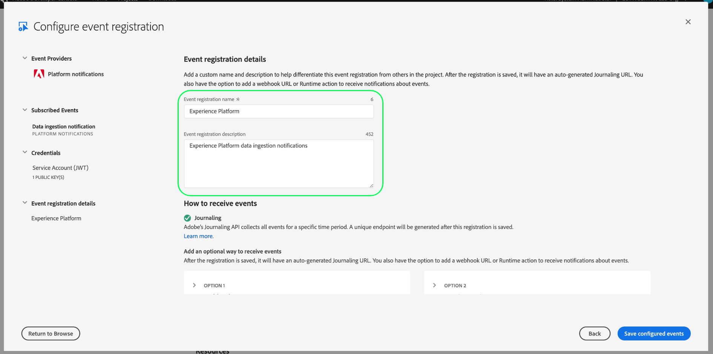

# Adobe I/Oイベント通知の購読

[!DNL Observability Insights] Adobe Experience Platformアクティビティに関するAdobe I/Oイベント通知をサブスクライブできます。これらのイベントは、アクティビティ監視の効率的な自動化を促進するために、設定済みのWebhookに送信されます。

このドキュメントでは、Adobe Experience Platformサービス用のAdobe I/Oイベント通知をサブスクライブする手順を説明します。 利用可能なイベントタイプに関する参照情報と、該当する各[!DNL Platform]サービスで返されたイベントデータを解釈する方法に関する詳細なドキュメントへのリンクも提供されています。

## はじめに

このドキュメントでは、Webフックに関する十分な知識と、アプリケーション間でWebフックを接続する方法について説明します。 Webフックの概要については、[[!DNL I/O Events] ドキュメント](https://www.adobe.io/apis/experienceplatform/events/docs.html#!adobedocs/adobeio-events/master/intro/webhook_docs_intro.md)を参照してください。

## Webhookの作成

[!DNL I/O Event]通知を受け取るには、イベント登録の詳細の一部として一意のWebhook URLを指定してWebhookを登録する必要があります。

選択したクライアントを使用して、Webhookを設定できます。 このチュートリアルの一部として使用する一時的なWebhookアドレスについては、[Webhook.site](https://webhook.site/)にアクセスし、提供された一意のURLをコピーします。

最初の検証プロセス中、[!DNL I/O Events]は、Webhookに対して、GETリクエストの`challenge`クエリパラメーターを送信します。 応答ペイロードでこのパラメーターの値を返すようにWebhookを設定する必要があります。 Webhook.siteを使用している場合は、右上隅の「**[!DNL Edit]**」を選択し、「**[!DNL Response body]**」の下に「`$request.query.challenge$`」と入力してから、「**[!DNL Save]**」を選択します。

## 開発者コンソールでの新しいAdobeの作成

[Adobe Developer Console](https://www.adobe.com/go/devs_console_ui) に移動し 、Adobe ID を使用してサインインします。次に、Adobe開発者コンソールのドキュメントの[空のプロジェクト](https://www.adobe.io/apis/experienceplatform/console/docs.html#!AdobeDocs/adobeio-console/master/projects-empty.md)の作成に関するチュートリアルで説明されている手順に従います。

## イベントの購読

新しいプロジェクトを作成したら、そのプロジェクトの概要画面に移動します。 ここから、「**[!UICONTROL イベントを追加]**」を選択します。

プロジェクトにイベントプロバイダーを追加できるダイアログが表示されます。

* Experience Platformアラートを購読する場合は、「**[!UICONTROL Platform notifications]**」を選択します。
* Adobe Experience Platformの[!DNL Privacy Service]通知を購読する場合は、「**[!UICONTROL Privacy Serviceイベント]**」を選択します。

イベントプロバイダーを選択したら、「**[!UICONTROL 次へ]**」を選択します。

次の画面に、購読するイベントタイプのリストが表示されます。 購読するイベントを選択し、「**[!UICONTROL 次へ]**」を選択します。

>[!NOTE]
>
>使用しているサービスに対してサブスクライブするイベントが不明な場合は、サービス固有の通知に関するドキュメントを参照してください。
>
>* [[!DNL Privacy Service] 通知](../../privacy-service/privacy-events.md)
* [[!DNL Data Ingestion] 通知](../../ingestion/quality/subscribe-events.md)
* [[!DNL Flow Service (sources)] 通知](../../sources/notifications.md)

次の画面で、JSON Webトークン(JWT)の作成を求めるプロンプトが表示されます。 キーペアを自動的に生成するか、ターミナルで生成された独自の公開鍵をアップロードするかを選択できます。

このチュートリアルの目的では、最初のオプションに従います。 「**[!UICONTROL キーペアを生成]**」のオプションボックスを選択し、右下隅にある「**[!UICONTROL キーペアを生成]**」ボタンを選択します。

キーペアが生成されると、ブラウザーによって自動的にダウンロードされます。 このファイルは開発者コンソールに保持されないので、自分で保存する必要があります。

次の画面では、新しく生成されたキーペアの詳細を確認できます。 「**[!UICONTROL 次へ]**」を選択して次に進みます。

次の画面で、「[!UICONTROL イベント登録の詳細]」セクションにイベント登録の名前と説明を入力します。 ベストプラクティスは、このイベント登録を同じプロジェクト内の他のユーザーと区別できるように、識別しやすい一意の名前を作成することです。

さらに、「[!UICONTROL イベントの受信方法]」セクションの下の同じ画面で、オプションでイベントの受信方法を設定できます。 **** Webhookでは、イベントを受け取るためのカスタムWebhookアドレスを指定できます。一方、 **[!UICONTROL Runtimeアクシ]** ョンでは、 [Adobe I/O Runtime](https://www.adobe.io/apis/experienceplatform/runtime/docs.html)を使用して同じ処理を実行できます。

このチュートリアルでは、**[!UICONTROL Webhook]**&#x200B;を選択し、先ほど作成したWebhookのURLを指定します。 完了したら、「**[!UICONTROL 設定済みのイベントを保存]**」を選択して、イベント登録を完了します。

新しく作成されたイベント登録の詳細ページが表示され、設定の編集、受信したイベントの確認、デバッグトレースの実行、新しいイベントプロバイダーの追加を行うことができます。

## 次の手順

このチュートリアルに従って、[!DNL Experience Platform]や[!DNL Privacy Service]の[!DNL I/O Event]通知を受け取るWebhookを登録しました。 使用可能なイベントと各サービスの通知ペイロードの解釈方法について詳しくは、次のドキュメントを参照してください。

* [[!DNL Privacy Service] 通知](../../privacy-service/privacy-events.md)
* [[!DNL Data Ingestion] 通知](../../ingestion/quality/subscribe-events.md)
* [[!DNL Flow Service] （ソース）通知](../../sources/notifications.md)

[!DNL Experience Platform]と[!DNL Privacy Service]でアクティビティを監視する方法について詳しくは、[[!DNL Observability Insights] の概要](../home.md)を参照してください。
