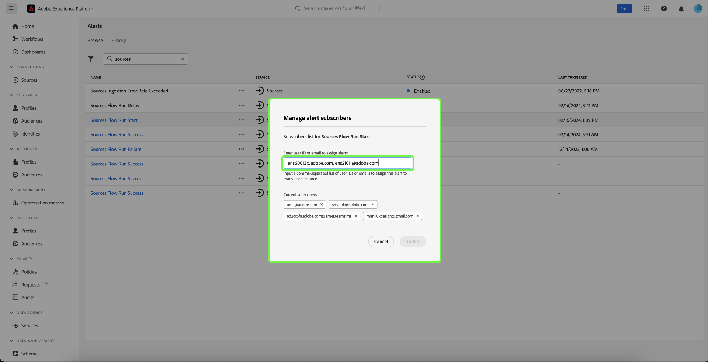

# アラート UI ガイド

Adobe Experience Platform ユーザーインターフェイスを使用すると、Adobe Experience Platform の Observability Insights で表示される指標に基づいて、受信したアラートの履歴を表示できます。 また、UI を使用すると、使用可能なアラートルールの表示、有効化、無効化、登録をおこなうこともできます。

>[!NOTE]
>
>Experience Platform のアラートの概要については、[アラートの概要](./overview.md)を参照してください。

開始するには、左側のナビゲーションで「**[!UICONTROL アラート]**」を選択します。

![&#x200B; 左側のナビゲーションのアラートページがハイライト表示された [!UICONTROL &#x200B; アラート &#x200B;]。](../images/alerts/ui/workspace.png)

## アラートルールの管理 {#manage-rules}

「**[!UICONTROL 参照]**」タブには、アラートをトリガーする可能性のある使用可能なルールが一覧表示されます。

![&#x200B; 使用可能なアラートのリストが「[!UICONTROL &#x200B; 参照 &#x200B;] タブに表示されます。](../images/alerts/ui/rules.png)

リストからルールを選択し、その説明と設定パラメーター（しきい値や重大度を含む）を右側のパネルに表示します。

ルール名の横にある省略記号（**...**）を選択すると、ドロップダウンにアラートの有効／無効（現在のステータスに応じて異なる）と、アラートのメール通知の登録／登録解除を切り替えるためのコントロールが表示されます。

## アラートサブスクライバーを管理 {#manage-subscribers}

>[!NOTE]
>
> アラートをAdobe ユーザー ID、外部メールアドレス、メールグループリストのいずれかに割り当てるには、管理者である必要があります。

「**[!UICONTROL 参照]**」タブには、アラートをトリガーする可能性のある使用可能なルールが一覧表示されます。

![&#x200B; 「参照 [!UICONTROL &#x200B; タブに表示される使用可能なアラートルール &#x200B;] リスト &#x200B;](../images/alerts/ui/rules.png)

ルール名の横にある省略記号（**...**）を選択すると、ドロップダウンにコントロールが表示されます。 「**[!UICONTROL アラート購読者を管理]**」を選択します。

![&#x200B; 省略記号を選択してドロップダウンメニューを表示します。 「[!UICONTROL &#x200B; アラート購読者を管理 &#x200B;]」オプションがハイライト表示されている様子 &#x200B;](../images/alerts/ui/manage-alert-subscribers.png)

[!UICONTROL &#x200B; アラート購読者の管理 &#x200B;] ページが表示されます。 特定のユーザーに通知を割り当てるには、ユーザーのAdobe ユーザー ID、外部メールアドレス、メールグループリストのいずれかを入力し、Enter キーを押します。

>[!NOTE]
>
>この通知を複数のユーザーに一度に送信するには、ユーザー ID またはメールアドレスのリストをコンマで区切って指定します。

これらのメールアドレスは、現在リストされている購読者のリストに表示されます。 「**[!UICONTROL 更新]**」を選択します。

![&#x200B; アラート購読者を管理ページで購読者を強調表示して [!UICONTROL &#x200B; 更新 &#x200B;] します。](../images/alerts/ui/manage-alert-subscribers-added-email.png)

アラート通知リストにユーザーが正常に追加されました。 送信されたユーザーは、このアラートに関するメール通知を受け取れるようになります（以下の画像を参照）。

## メールアラートを有効にする {#enable-email}

アラート通知は、メールに直接配信できます。

通知とお知らせを表示するには、右側の上部のリボンにあるベルアイコン（）を選択します。 表示されるドロップダウンで、歯車アイコン（）を選択して、Experience Cloudの環境設定ページにアクセスします。

**プロファイル** ページが表示されます。 左側のナビゲーションで **[!UICONTROL 通知]** を選択して、メールアラートの環境設定にアクセスします。

![&#x200B; 左側のナビゲーションでハイライト表示されたプロファイルページ [!UICONTROL &#x200B; 通知 &#x200B;]。](../images/alerts/ui/profile.png)

ページ下部の「**メール**」セクションまでスクロールし、「**[!UICONTROL インスタント通知]**」を選択します。

購読しているアラートは、Adobe ID アカウントに接続されているメールアドレスに配信されます。

## アラートしきい値のカスタマイズ {#alert-threshold}

アラートのしきい値は、次のアラートタイプに合わせてカスタマイズできます。

| アラートタイプ | カスタマイズされたパラメーター |
|---|---|
| セグメントジョブの遅延 | 遅延しきい値 |
| セグメントエクスポートの遅延 | 遅延しきい値 |
| 宛先フロー実行の遅延 | 遅延しきい値 |
| ID サービスフロー実行遅延 | 遅延しきい値 |
| プロファイルフロー実行の遅延 | 遅延しきい値 |
| プロファイルストリーミング取得失敗率を超えています | エラーしきい値 |
| プロファイルストリーミング取得のスキップ率を超えています | エラーしきい値 |
| ソースフロー実行遅延 | 遅延しきい値 |
| ソース取り込みエラー率を超過 | エラーしきい値 |
| クエリ実行遅延 | 遅延しきい値 |
| アクティベーションスキップ率を超えています | エラーしきい値 |

ルール名の横にある省略記号（**...**）を選択すると、ドロップダウンにコントロールが表示されます。 「**[!UICONTROL 編集]**」を選択します。

![&#x200B; 選択したルールの「[!UICONTROL &#x200B; 編集 &#x200B;]」オプションがハイライト表示されている様子 &#x200B;](../images/alerts/ui/threshold-edit.png)

**[!UICONTROL アラートのカスタマイズ]** ページが表示されます。 しきい値を目的の分に更新し、「**[!UICONTROL 確認]**」を選択します。

![&#x200B; アラートページをカスタマイズの [!UICONTROL &#x200B; しきい値 &#x200B;] および [!UICONTROL &#x200B; 確認 &#x200B;] オプションがハイライト表示されます。](../images/alerts/ui/threshold-update.png)

「**[!UICONTROL アラート]**」ページに戻ります。 アラートのしきい値設定を表示するには、リストからルールを選択します。 右側のパネルに、ステータスや重大度などの詳細を含む、アラートのしきい値設定が表示されます。

![&#x200B; 右側のパネルで詳細を示すハイライト表示されたアラートとハイライト表示 [!UICONTROL &#x200B; しきい値 &#x200B;]。](../images/alerts/ui/threshold-view.png)

## アラート履歴の表示 {#alert-history}

「**[!UICONTROL 履歴]**」タブには、アラートをトリガーしたルール、トリガー日、解決日（該当する場合）など、組織で受信したアラートの履歴が表示されます。

![&#x200B; 受信したアラートのリストは「[!UICONTROL &#x200B; 履歴 &#x200B;] タブに表示されます。](../images/alerts/ui/history.png)

リストに表示されたアラートを選択すると、右側のパネルに詳細（そのアラートをトリガーしたイベントの概要を含む）が表示されます。

## 次の手順

このドキュメントでは、Experience Platform UI でアラートを表示および管理する方法の概要を説明しました。 サービスの機能について詳しくは、[Observability Insights](../home.md) の概要を参照してください。
