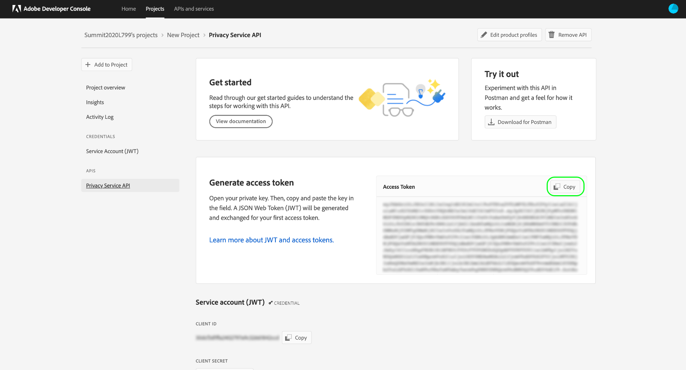

# [!DNL Privacy Service] API ガイド

Adobe Experience Platform [!DNL Privacy Service]は、Adobe Experience Cloudアプリケーション全体でデータ主体（顧客）の個人データを管理（アクセスおよび削除）するためのRESTful APIとユーザーインターフェイスを提供します。 [!DNL Privacy Service]また、 は、 アプリケーションに関連するジョブのステータスと結果にアクセスできる、中央監査とログのメカニズムも提供します。[!DNL Experience Cloud]

このガイドでは、[!DNL Privacy Service] APIの使用方法を説明します。 UI の使用方法について詳しくは、「[Privacy Service サービス UI の概要](../ui/overview.md)」を参照してください。[!DNL Privacy Service] APIで使用可能なすべてのエンドポイントの包括的なリストについては、[APIリファレンス](https://www.adobe.io/experience-platform-apis/references/privacy-service/)を参照してください。

## はじめに {#getting-started}

このガイドでは、次の[!DNL Experience Platform]機能を実際に理解している必要があります。

* [[!DNL Privacy Service]](../home.md)：Adobe Experience Cloud アプリケーション全体でデータサブジェクト（顧客）からのアクセスリクエストと削除リクエストを管理するための RESTful API とユーザーインターフェイスが用意されていまます。

以下の節では、Privacy Service API への呼び出しを正常に実行するために必要な追加情報を示しています。

### API 呼び出し例の読み取り

このチュートリアルでは、API 呼び出しの例を提供し、リクエストの形式を設定する方法を示します。この中には、パス、必須ヘッダー、適切な形式のリクエストペイロードが含まれます。また、API レスポンスで返されるサンプル JSON も示されています。ドキュメントで使用される API 呼び出し例の表記について詳しくは、 トラブルシューテングガイドの[API 呼び出し例の読み方](../../landing/troubleshooting.md)に関する節を参照してください[!DNL Experience Platform]。

## 必須ヘッダーの値の収集

[!DNL Privacy Service] APIの呼び出しをおこなうには、まず必要なヘッダーで使用するアクセス資格情報を収集する必要があります。

* `Authorization: Bearer {ACCESS_TOKEN}`
* `x-api-key: {API_KEY}`
* `x-gw-ims-org-id: {IMS_ORG}`

これには、Adobe Admin Consoleで[!DNL Experience Platform]の開発者権限を取得し、Adobe開発者コンソールで資格情報を生成します。

### [!DNL Experience Platform]への開発者アクセスを得る

[!DNL Platform]への開発者アクセスを得るには、[Experience Platform認証に関するチュートリアル](https://experienceleague.adobe.com/docs/experience-platform/landing/platform-apis/api-authentication.html?lang=ja#platform-apis)の最初の手順に従ってください。 「Adobe開発者コンソールでアクセス資格情報を生成する」の手順に進んだら、このチュートリアルに戻って[!DNL Privacy Service]に固有の資格情報を生成します。

### アクセス認証情報の生成

Adobe Developer Console を使用して、次の 3 つのアクセス認証情報を生成する必要があります。

* `{IMS_ORG}`
* `{API_KEY}`
* `{ACCESS_TOKEN}`

`{IMS_ORG}`と`{API_KEY}`は、1回だけ生成する必要があり、今後のAPI呼び出しで再利用できます。 ただし、`{ACCESS_TOKEN}`は一時的で、24時間ごとに再生成する必要があります。

これらの値を生成する手順については、以下で詳しく説明します。

#### 1 回限りのセットアップ

[Adobe Developer Console](https://www.adobe.com/go/devs_console_ui) に移動し 、Adobe ID を使用してログインします。次に、Adobe開発者コンソールのドキュメントの[空のプロジェクト](https://www.adobe.io/apis/experienceplatform/console/docs.html#!AdobeDocs/adobeio-console/master/projects-empty.md)の作成に関するチュートリアルで説明されている手順に従います。

新しいプロジェクトを作成したら、**[!UICONTROL プロジェクトの概要]**&#x200B;画面で「**[!UICONTROL API]**&#x200B;を追加」を選択します。

**[!UICONTROL API の追加]**&#x200B;画面が表示されます。 使用可能なAPIのリストから&#x200B;**[!UICONTROL Privacy ServiceAPI]**&#x200B;を選択してから、「**[!UICONTROL 次へ]**」を選択します。

**[!UICONTROL APIを設定]**&#x200B;画面が表示されます。 「**[!UICONTROL キーペアを生成]**」オプションを選択し、右下隅で「**[!UICONTROL キーペアを生成]**」を選択します。

キーペアが自動的に生成され、秘密鍵と公開証明書を含むZIPファイルがローカルマシンにダウンロードされます（後の手順で使用できます）。 「**[!UICONTROL 設定済みAPIを保存]**」を選択して設定を完了します。

APIがプロジェクトに追加されると、プロジェクトページが&#x200B;**Privacy ServiceAPIの概要**&#x200B;ページに再び表示されます。 ここから、「**[!UICONTROL サービスアカウント（JWT）]**」セクションまでスクロールします。このセクションには、 API へのすべての呼び出しで必要な次のアクセス資格情報が表示されます。[!DNL Privacy Service]

* **[!UICONTROL クライアントID]**:クライアントIDは、x-api-key `{API_KEY}` ヘッダーで指定する必要があるに必要です。
* **[!UICONTROL 組織ID]**:組織IDは、x-gw-ims-org-idヘッダーで使用する必要がある値で `{IMS_ORG}` す。

#### 各セッションの認証

収集する必要がある最後の資格情報は、Authorizationヘッダーで使用される`{ACCESS_TOKEN}`です。 `{API_KEY}`と`{IMS_ORG}`の値とは異なり、[!DNL Platform] APIを引き続き使用するには、24時間ごとに新しいトークンを生成する必要があります。

新しい`{ACCESS_TOKEN}`を生成するには、以前にダウンロードした秘密鍵を開き、「**[!UICONTROL トークン]**&#x200B;を生成」を選択する前に、「**[!UICONTROL アクセストークン]**&#x200B;を生成」の横にあるテキストボックスにその内容を貼り付けます。

新しいアクセストークンが生成され、トークンをクリップボードにコピーするためのボタンが提供されます。 この値は、必要なAuthorizationヘッダーに使用され、`Bearer {ACCESS_TOKEN}`形式で指定する必要があります。

## 次の手順

これで、使用するヘッダーを理解できたので、[!DNL Privacy Service] APIの呼び出しを開始できます。 [プライバシージョブ](privacy-jobs.md)に関するドキュメントでは、 API を使用して実行できる様々な API 呼び出しについて説明します。[!DNL Privacy Service]各呼び出し例では一般的な API 形式、必須ヘッダーを示すサンプルリクエストおよびサンプルレスポンスが示されています。
