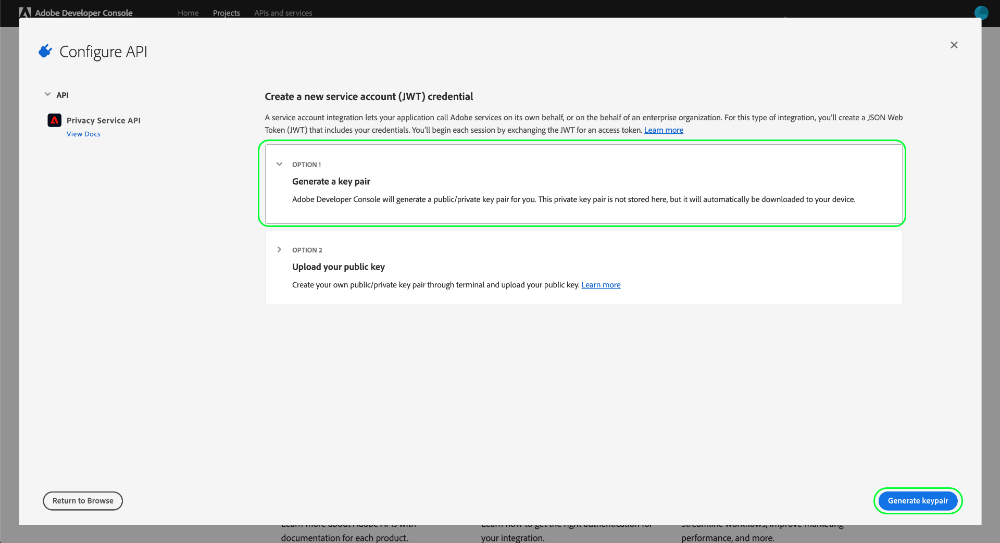

# プライバシーサービス API の概要

このガイドでは、プライバシーに関するサービスの API を呼び出すために必要な重要な概念について説明しています。

## 前提条件

このガイドは、次の の機能を実際に利用および理解しているユーザーを対象としています。

* [Adobe エクスペリエンス Platform プライバシーサービス ](../home.md) : RESTFUL API およびユーザーインターフェイスを提供します。これにより、Adobe エクスペリエンスクラウドアプリケーションを使用して、データのサブジェクト (customers) からのアクセスを管理したり削除したりすることができます。

## 必須ヘッダーの値の収集

プライバシーサービス API に電話をかけるには、最初に必要なヘッダーで使用するアクセス資格情報を収集する必要があります。

* `Authorization: Bearer {ACCESS_TOKEN}`
* `x-api-key: {API_KEY}`
* `x-gw-ims-org-id: {IMS_ORG}`

これには、アドビシステムズ社の adobe エクスペリエンスプラットフォーム用のデベロッパーアクセス許可を adobe Admin Console で入手し、Adobe Developer Console によって資格情報を生成することが含まれます。

###  Experience Platform への開発者のアクセス

開発者にアクセスするには [!DNL Platform] 、「 [ エクスペリエンスプラットフォーム認証チュートリアル」の最初の手順に従って ](https://experienceleague.adobe.com/docs/experience-platform/landing/platform-apis/api-authentication.html?lang=ja#platform-apis) ください。 「Adobe Developer Console でアクセス資格情報を生成」に到達したら、このチュートリアルに戻ってプライバシーサービス特有の資格情報を生成します。

### アクセス認証情報の生成

Adobe Developer Console を使用して、次の 3 つのアクセス認証情報を生成する必要があります。

* `{IMS_ORG}`
* `{API_KEY}`
* `{ACCESS_TOKEN}`

は `{IMS_ORG}` `{API_KEY}` 1 回のみ生成され、将来の API 呼び出しで再利用できるようになります。 ただし、 `{ACCESS_TOKEN}` は一時的なものであり、24時間ごとに再作成する必要があります。

これらの値を生成する手順については、以下で詳しく説明します。

#### 1 回限りのセットアップ

[Adobe Developer Console](https://www.adobe.com/go/devs_console_ui) に移動し 、Adobe ID を使用してログインします。次に、Adobe Developer Console のドキュメントの[空のプロジェクトの作成](https://www.adobe.io/apis/experienceplatform/console/docs.html#!AdobeDocs/adobeio-console/master/projects-empty.md)チュートリアルで概説されている手順に従います。

新しいプロジェクトを作成したら、 **** 「プロジェクト概要」画面で「API を追加」を選択し **** ます。

**[!UICONTROL API の追加]**&#x200B;画面が表示されます。 「 **** 次へ」を選択する前に、使用可能な api のリストから「プライバシーサービス API」を選択し **** ます。

「 **[!UICONTROL API の設定」]** 画面が表示されます。 キーペアを生成するためのオプションを選択し **[!UICONTROL 、右下隅の「キーペア生成」を選択し]** **** ます。

キーペアは自動的に生成され、秘密キーと公開証明書を含む ZIP ファイルがローカルコンピューターにダウンロードされます (後の手順で使用します)。 「 **[!UICONTROL 設定済み API を保存」を選択して]** 、設定を完了します。

プロジェクトに API が追加されると、「 **プライバシーサービス API 概要」ページに、プロジェクトページが再表示され** ます。 ここでは、 **[!UICONTROL サービスアカウント (JWT) セクションが表示されるまで下にスクロールし、]** プライバシーサービス API のすべての呼び出しに必要な次のアクセス資格情報を指定します。

* **[!UICONTROL 「クライアント ID」]** : クライアント id は、 `{API_KEY}` x api キーのヘッダーで指定されている必要があります。
* **[!UICONTROL 組織 ID]** : 「組織 id」には、 `{IMS_ORG}` x gw-ims-org id ヘッダーで使用する値を指定します。

#### 各セッションの認証

最終的に収集する必要な資格情報は、 `{ACCESS_TOKEN}` Authorization ヘッダーで使用されます。 And の値とは異なり、を `{API_KEY}` `{IMS_ORG}` 継続して api を使用するには、24時間ごとに新しいトークンを生成する必要があり [!DNL Platform] ます。

新規作成するには `{ACCESS_TOKEN}` 、「トークンの生成」を選択する前に、既にダウンロードされているプライベートキーを開き、「アクセストークンの作成」の横にあるテキストボックスにペーストして **** **** ください。

新しいアクセストークンが生成され、トークンをクリップボードにコピーするためのボタンが提供されます。 この値は、必要な承認ヘッダーに使用されます。また、形式で提供されている必要があり `Bearer {ACCESS_TOKEN}` ます。

## API 呼び出し例の読み取り

このチュートリアルでは、API 呼び出しの例を提供し、リクエストの形式を設定する方法を示します。この中には、パス、必須ヘッダー、適切な形式のリクエストペイロードが含まれます。また、API レスポンスで返されるサンプル JSON も示されています。サンプル API 呼び出しのドキュメントで使用される表記規則について詳しくは、 [ Platform api の入門ガイドの「api 呼び出しの例」を参照してください ](../../landing/api-guide.md#sample-api) 。

## 次の手順

使用するヘッダーを理解できたので、Privacy Service API への呼び出しを開始できます。開始にあたっては、次のいずれかのエンドポイントガイドを選択します。

* [プライバシージョブ](./privacy-jobs.md)
* [同意](./consent.md)
