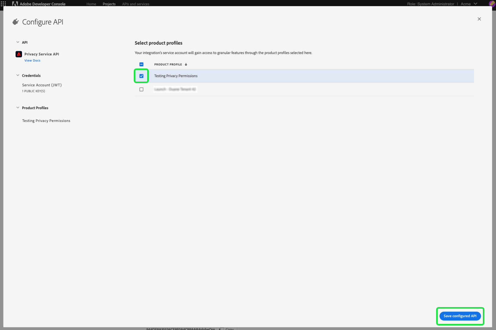

# Privacy Service の権限の管理

[Adobe Experience Platform Privacy Service](./home.md) へのアクセスは、Adobe Admin Console の詳細な役割ベースの権限によって制御されます。 ユーザーのグループに権限を割り当てる製品プロファイルを作成することにより、Privacy Service の [UI](./ui/overview.md) および [API](./api/overview.md) の機能にアクセスできるユーザーを決定できます。

>[!NOTE]
>
>Privacy Service API の統合を作成する場合、既存の製品プロファイルを選択して、その統合に権限を持つ機能やアクションを決定する必要があります。詳しくは、[Privacy Service API の基本を学ぶ](./api/getting-started.md)に関するガイドを参照してください。

このガイドでは、Privacy Service の権限を管理する方法について説明します。

## はじめに

Privacy Service のアクセス制御を設定するには、Adobe Experience Platform Privacy Service と製品が統合されている組織の管理者権限が必要です。権限を付与または取り消す最小の役割は、**製品プロファイル管理者**&#x200B;です。権限を管理できる他の管理者の役割は、**製品管理者**（製品内のすべてのプロファイルを管理）と&#x200B;**システム管理者**（制限なし）です。詳しくは、『Adobe エンタープライズ管理ガイド』の[管理者の役割](https://helpx.adobe.com/jp/enterprise/using/admin-roles.html)に関する記事を参照してください。

このガイドは、製品プロファイルなどの基本的な Admin Console の概念と、製品の権限を個々のユーザーやグループに付与する方法について理解していることを前提としています。詳しくは、[Admin Console ユーザーガイド](https://helpx.adobe.com/jp/enterprise/using/admin-console.html)を参照してください。

## 使用可能な権限

次の表に、アクセス権を付与する特定の機能の説明と共に、Privacy Service で使用可能な権限の概要を示します。

>[!NOTE]
>
>すべてのPrivacy Service権限と [!UICONTROL &#x200B; 販売のオプトアウト &#x200B;] 権限は異なり、機能的に重複することなく、相互に分離されています。 Privacy ServiceAPI がべき等と見なされるので、これが可能です。

| カテゴリ | 権限 | 説明 |
| --- | --- | --- |
| [!UICONTROL Privacy Service の権限] | [!UICONTROL プライバシー読み取り権限] | ユーザーが既存のアクセスリクエストおよび削除リクエストとその詳細を表示できるかどうかを決定します。 |
| [!UICONTROL Privacy Service の権限] | [!UICONTROL プライバシー書き込み権限] | ユーザーが新しいアクセスリクエストおよび削除リクエストを作成できるかどうかを決定します。 |
| [!UICONTROL Privacy Service の権限] | [!UICONTROL コンテンツ配信の読み取り（アクセス）権限] | アクセスリクエストが Privacy Service によって処理されると、顧客のデータを含む ZIP ファイルがその顧客に送信されます。アクセスリクエストの詳細を検索する場合、この権限によって、ユーザーがリクエストの ZIP ファイルのダウンロードリンクにアクセスできるかどうかが決まります。 |
| [!UICONTROL 販売のオプトアウト権限] | [!UICONTROL 読み取り権限 - 販売のオプトアウト] | ユーザーが既存の販売のオプトアウトリクエストとその詳細を表示できるかどうかを決定します。 |
| [!UICONTROL 販売のオプトアウト権限] | [!UICONTROL 書き込み権限 - 販売のオプトアウト] | ユーザーが新しい販売のオプトアウトリクエストを作成できるかどうかを決定します。 |

{style="table-layout:auto"}

## 権限の管理 {#manage}

Privacy Service の権限を管理するには、[Admin Console](https://adminconsole.adobe.com/) にログインし、上部ナビゲーションから「**[!UICONTROL 製品]**」を選択します。こちらから、「**[!UICONTROL Adobe Experience Platform Privacy Service]**」を選択します。

### 製品プロファイルの選択または作成

次の画面には、組織で使用可能な Privacy Service の製品プロファイルのリストが表示されます。製品プロファイルが存在しない場合は、「**[!UICONTROL 新規プロファイル]**」を選択して作成します。組織内に異なるレベルのアクセスを必要とする複数の役割またはユーザーグループがある場合は、それぞれに個別の製品プロファイルを作成する必要があります。

製品プロファイルを選択したら、「**[!UICONTROL 権限]**」タブを使用してプロファイルの[権限の編集](#edit-permissions)を開始するか、「**[!UICONTROL ユーザー]**」タブを選択してプロファイルへの[ユーザーの割り当て](#assign-users)を開始できます。

### プロファイルの権限の編集 {#edit-permissions}

「**[!UICONTROL 権限]**」タブで、表示されている権限カテゴリのいずれかを選択して、権限編集表示にアクセスします。

プロファイルの権限を編集する場合、使用可能な権限が左側の列にリストされ、プロファイルに含まれている権限が右側の列にリストされます。リストされた権限を選択して、いずれかの列間で移動します。

権限はカテゴリに分類されています。カテゴリを切り替えるには、左のナビゲーションから目的のカテゴリを選択します。

![ 権限の下の [!UICONTROL &#x200B; 販売のオプトアウト &#x200B;] の節。](./images/permissions/switch-category.png)

権限の設定が完了したら、「**[!UICONTROL 保存]**」を選択します。

追加された権限が反映された製品プロファイルビューが再表示されます。

### プロファイルへのユーザーの割り当て {#assign-users}

ユーザーを製品プロファイルに割り当て（およびプロファイルで設定された権限を付与）するには、「**[!UICONTROL ユーザー]**」タブに続いて「**[!UICONTROL ユーザーを追加]**」を選択します。

製品プロファイル用のユーザー管理について詳しくは、[Admin Console のドキュメント](https://helpx.adobe.com/jp/enterprise/using/manage-product-profiles.html)を参照してください。

### 従来の API 資格情報のプロファイルへの移行 {#migrate-tech-accounts}

>[!NOTE]
>
>この節の説明は、Privacy Service 権限が Adobe Admin Console に統合される前に作成された既存の API 資格情報にのみ適用されます。新しい資格情報の場合、代わりに、[Adobe Developer Console プロジェクト](https://developer.adobe.com/developer-console/docs/guides/projects/)を通じて製品プロファイル（およびその権限）が割り当てられます。  詳しくは、[プロジェクトへの製品プロファイルの割り当て](./api/getting-started.md#product-profiles)（Privacy Service API 入門ガイド）に関する節を参照してください。

以前は、テクニカルアカウントには、統合と権限のための製品プロファイルは必要ありませんでした。 ただし、最近のPrivacy Service権限の機能強化により、従来の API 資格情報を製品プロファイルに移行する必要が生じています。 この更新により、テクニカルアカウント所有者に詳細な権限を付与できます。 以下の手順に従って、Privacy Service用のテクニカルアカウント権限を更新します。

#### テクニカルアカウント権限の更新 {#update-tech-account-permissions}

テクニカルアカウントに権限セットを割り当てる最初の手順は、[Adobe Admin Consoleに移動し ](https://adminconsole.adobe.com/)Privacy Service用の新しい製品プロファイルを作成することです。

Admin Console UI で、ナビゲーションバーから **製品** を選択したあと、左側のサイドバーで「**[!UICONTROL Experience Cloud]**」と「**[!UICONTROL Adobe Experience Platform Privacy Service]**」を選択します。 「[!UICONTROL &#x200B; 製品プロファイル &#x200B;]」タブが表示されます。 **新規プロファイル** を選択して、Privacy Service用の新しい製品プロファイルを作成します。

[!UICONTROL &#x200B; 新しい製品プロファイルの作成 &#x200B;] ダイアログが表示されます。 製品プロファイルの作成方法に関する詳しい手順については、[ プロファイルを作成するための UI ガイド ](../access-control/ui/create-profile.md) を参照してください。

新しい製品プロファイルを保存したら、[Adobe Developer Consoleに移動し ](https://developer.adobe.com/console/home) その製品またはプロジェクトにログインします。 上部ナビゲーションから **[!UICONTROL プロジェクト]** を選択し、その後プロジェクトのカードを選択します。

>[!NOTE]
>
>キャッシュをクリアしたり、新しいプロジェクトがDeveloper Console プロジェクトのリストに表示されるまでしばらく待つ必要がある場合があります。

プロジェクトにログインしたら、左側のサイドバーから **[!UICONTROL Privacy ServiceAPI]** 統合を選択します。

Privacy ServiceAPI 統合ダッシュボードが表示されます。 このダッシュボードから、そのプロジェクトに関連付けられている製品プロファイルを編集できます。 **[!UICONTROL 製品プロファイルを編集]** を選択して、プロセスを開始します。 [!UICONTROL API を設定 &#x200B;] ダイアログが表示されます。

[!UICONTROL API を設定 &#x200B;] ダイアログには、現在サービスに存在する使用可能な製品プロファイルが表示されます。 これらは、admin console で作成された製品プロファイルに関連付けられます。 使用可能な製品プロファイルのリストから、admin console でテクニカルアカウント用に作成した新しい製品プロファイルのチェックボックスを選択します。 これにより、このテクニカルアカウントが、選択した製品プロファイルの権限に自動的に関連付けられます。 **[!UICONTROL 設定済み API を保存]** を選択して、設定を確定します。

>[!NOTE]
>
>テクニカルアカウントが既に製品プロファイルに関連付けられている場合、使用可能な製品プロファイルのリストにあるチェックボックスの 1 つが既に選択されています。

#### 設定が適用されていることを確認します {#confirm-applied-settings}

設定がアカウントに適用されたことを確認します。 [Admin Consoleに戻り ](https://adminconsole.adobe.com/) 新しく作成した製品プロファイルに移動します。 「**[!UICONTROL API 資格情報]**」タブを選択して、関連プロジェクトのリストを表示します。 製品プロファイルをテクニカルアカウントに割り当てた、Developer Consoleで使用するプロジェクトが、資格情報のリストに表示されます。 各 API 資格情報の名前は、プロジェクト名と、末尾に付加されたランダムに生成された数字で構成されます。 資格情報を選択して [!UICONTROL &#x200B; 詳細 &#x200B;] パネルを開きます。

[!UICONTROL &#x200B; 詳細 &#x200B;] パネルには、関連するテクニカル ID、API キー、作成および最終変更日、関連するAdobe商品など、API 資格情報に関する情報が含まれています。

## 次の手順

このガイドでは、Privacy Service に使用できる権限と、Admin Console を通じた管理方法について説明しました。

製品プロファイルを設定した後に新しい API 統合を作成する手順については、[Privacy Service API の入門ガイド](./api/getting-started.md)を参照してください。 その他の Adobe Experience Platform 機能に関する権限の管理について詳しくは、[アクセス制御のドキュメント](../access-control/home.md)を参照してください。
