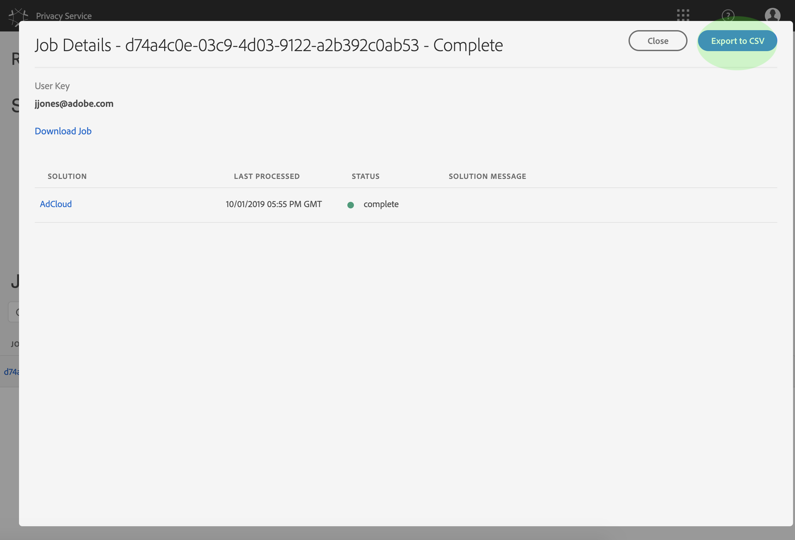
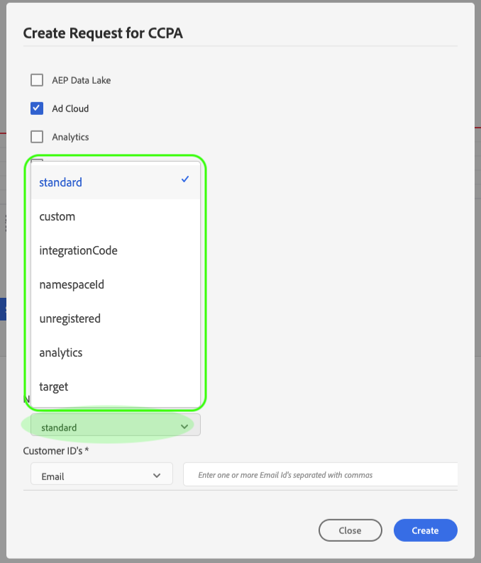

# プライバシーサービス UI でのプライバシージョブの管理

このドキュメントでは、ユーザーインターフェイスを使用してプライバシー要求を作成および管理するための手順を説明し [!DNL Privacy Service] ます。

## [!DNL Privacy Service]UI ダッシュボードの参照

UI のダッシュボードには、 [!DNL Privacy Service] プライバシージョブの状態を表示するための2つの widget が用意されています。「 [!UICONTROL  ステータスレポート ] 」と「 [!UICONTROL  ジョブ要求」が表示されます ] 。 また、ダッシュボードには、表示されたジョブに対して現在選択されている規制も表示されます。

### 規則の種類

[!DNL Privacy Service] いくつかのプライバシー規制について、ジョブ要求をサポートします。

* [!DNL California Consumer Privacy Act]( [!UICONTROL  Ccpa ] )
* 欧州連合 [!DNL General Data Protection Regulation] ( [!UICONTROL  GDPR ] )
* タイ [!DNL Personal Data Protection Act] ( [!UICONTROL  PDPA_THA ] )
* ブラジル [!DNL Lei Geral de Proteção de Dados] ( [!UICONTROL  LGPD_BRA ] )
* ニュージーランド [!DNL Privacy Act] ( [!UICONTROL  NZPA_NZL ] )

それぞれの規制タイプのジョブは、別々に追跡されます。種類を調整するには、 **[!UICONTROL 「規制タイプ」ドロップダウンメニューを選択し、]** リストから必要な規則を選択します。

規制の種類を変更すると、ダッシュボードが更新され、選択した規制に適用されるすべての操作、フィルター、ウィジェット、ジョブ作成のダイアログが表示されます。

### ステータスレポート

ステータスレポートウィジェットの左側のグラフは、エラーが発生してレポートが返された可能性のあるジョブについて、送信されたジョブを追跡します。右側のグラフは、30 日間のコンプライアンス期間の終わり近くにあるジョブを追跡します。

グラフ上の2つのトグルボタンのうちの1つを選択して、それぞれの測定基準を表示または非表示にします。

グラフ上の任意のデータポイントに関連付けられているジョブの正確な数を表示するには、該当するデータポイントの上にマウスを移動します。

特定のデータポイントについてさらに詳しい情報を表示するには、該当するデータポイントを選択して、ジョブ要求 widget に関連ジョブを表示します。 ジョブリストのすぐ上に適用されるフィルターをメモしておきます。

>[!NOTE]
>
>ジョブ要求 widget にフィルターが適用されている場合、フィルターを削除するには、「filter pill」で「X」を選択し **** ます。 そうすれば、ジョブリクエストはデフォルトの追跡リストに戻ります。

### ジョブリクエスト

ジョブリクエストウィジェットには、リクエストの種類、現在のステータス、期日、要求者の E メールアドレスなどの詳細も含め、組織内で使用可能なすべてのジョブリクエストがリスト表示されます。

>[!NOTE]
>
> 以前に作成したジョブのデータは、完了日から 30 日間のみアクセスできます。

「Job Requests」タイトルの下の検索バーにキーワードを入力することで、このリストをフィルタリングできます。リストは、入力に応じて自動的にフィルタリングをおこない、検索用語に一致する値を含んだリクエストを表示します。**[!UICONTROL Requested on]** ドロップダウンメニューを使用して、リストに表示されているジョブの時間範囲を選択することもできます。

特定のジョブ要求の詳細を表示するには、リストから要求のジョブ ID を選択して、 **[!UICONTROL ジョブ詳細ページを開き]** ます。

このダイアログには、各ソリューションに関するステータス情報と、ジョブ全体に対する現在の状態が表示され [!DNL Experience Cloud] ます。 プライバシージョブが非同期の場合は、各ソリューションの最新の通信日時（GMT）がページに表示されます。これは、リクエストの処理に他のソリューションより多くの時間が必要な場合があるからです。

ソリューションから追加のデータが提供された場合は、このダイアログで表示できます。このデータを表示するには、「製品の行」を個別に選択します。

ジョブデータ全体を CSV ファイルとしてダウンロードするには、 **** ダイアログボックスの右上にある「csv に書き出し」を選択します。

## プライバシージョブリクエストの新規作成

>[!NOTE]
>
> プライバシージョブリクエストを作成するには、アクセスまたは削除するデータの所有者である特定の顧客の ID 情報を指定する必要があります。この節を続行する前に、[プライバシーリクエストの ID データ](../identity-data.md)に関するドキュメントを確認してください。

[!DNL Privacy Service]UI を使用すると、次の2つの方法で新しいジョブ要求を作成することが可能です。

* [リクエストビルダーの使用](#request-builder)
* [JSON ファイルのアップロード](#json)

これらの各方法の使用手順について、次の節で説明します。

### リクエストビルダーの使用 {#request-builder}

リクエストビルダーを使用すると、ユーザーインターフェイスで新しいプライバシージョブリクエストを手動で作成できます。リクエストビルダーは、リクエストをユーザーごとに 1 つの ID タイプに制限するので、よりシンプルでより小さなリクエストセットに最適です。より複雑なリクエストについては、代わりに [JSON ファイルをアップロード](#json)する方がよい場合があります。

リクエストビルダーを起動するには、 **** 画面の右側にある、状態レポート widget の下にある「リクエストを作成」を選択します。

**[!UICONTROL Create Request]** ダイアログが開き、現在選択されている規制タイプのプライバシージョブリクエストを送信するために使用できるオプションが表示されます。

 

**[!UICONTROL 要求の種類として、]** 「Delete」または「Access」を選択し、リストから1つ以上の利用可能な製品を選択します。

 

「 **[!UICONTROL 名前空間タイプ」で]** 、送信されるカスタマー id に適切な名前空間タイプを選択し [!DNL Privacy Service] ます。

 

standard タイプの名前空間を使用する場合は、ドロップダウンメニューから名前空間（E メール、ECID、AAID のいずれか）を選択し、右側のテキストボックスに ID 値を入力し、ID ごとに **Enter** キーを押してリストに追加します。

 

custom タイプの名前空間を使用する場合は、名前空間を手動で入力してから、その下で ID 値を入力する必要があります。

 

完了したら、「**[!UICONTROL 作成]**」をクリックします。

 

ダイアログが閉じ、新しいジョブ（複数の場合あり）が現在の処理ステータスと共にジョブリクエストウィジェットにリスト表示されます。

### JSON ファイルのアップロード {#json}

処理するデータサブジェクトごとに複数の ID タイプを使用するリクエストなど、より複雑なリクエストを作成する場合は、JSON ファイルをアップロードしてリクエストを作成できます。

**** 画面の右側にある「状態レポート」 widget の下にある「作成要求」の横にある矢印を選択します。表示されるオプションリストから、「**[!UICONTROL Upload JSON]**」を選択します。

**[!UICONTROL Upload JSON]** ダイアログが開き、JSON ファイルをドラッグ＆ドロップできるウィンドウが表示されます。

 

アップロードする JSON ファイルが存在しない場合は、「Adobe-GDPR をダウンロード」を選択して、 **** データの主題から収集した値に従って設定できるテンプレートをダウンロードします。

 

コンピューター上で JSON ファイルを探し、ダイアログウィンドウにドラッグします。アップロードが正常に完了すると、ダイアログにファイル名が表示されます。必要に応じて、引き続き JSON ファイルをダイアログにドラッグ＆ドロップして追加できます。

完了したら、「**[!UICONTROL 作成]**」をクリックします。ダイアログが閉じ、新しいジョブ（複数の場合あり）が現在の処理ステータスと共にジョブリクエストウィジェットにリスト表示されます。

### 次の手順

このドキュメントでは、ユーザーインターフェイスを使用して、 [!DNL Privacy Service] プライバシージョブの作成、ジョブの詳細情報の表示、処理状態の監視、完了した後の結果のダウンロードを行う方法について学習しました。

このような操作をプログラムによって api を使用して実行する手順については、 [!DNL Privacy Service] 「 [ api ガイド」を参照してください ](../api/overview.md) 。
