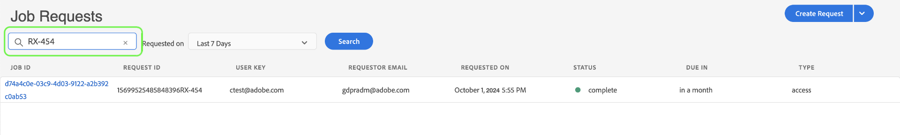

# プライバシー UI でのPrivacy Serviceジョブの管理 {#user-guide}

>[!CONTEXTUALHELP]
>id="platform_privacyConsole_requests_description"
>title="データ主体のプライバシーリクエストに従う"
>abstract="<h2>説明</h2>
Adobe Experience Platform Privacy Service では、法的プライバシー規制に従って、個人データにアクセスしたり削除したりする顧客に代わって、プライバシーリクエストを作成および管理できます。
"

このドキュメントでは、 [!DNL Privacy Service] ユーザーインターフェイス。

>[!IMPORTANT]
>
>Privacy Service は、データ主体と消費者の権利リクエストのみを目的としています。それ以外にデータのクリーンアップやメンテナンスに Privacy Service を使用することは、サポートされておらず、許可もされていません。アドビには、それらをタイムリーに履行する法的義務があります。したがって、これが実稼動専用の環境であり、有効なプライバシーリクエストの不要なバックログが作成されるので、Privacy Service の読み込みテストは許可されていません。
>
>サービスの不正使用を防ぐために、1 日あたりのアップロードに対するハードリミットが設定されるようになりました。システムの不正使用が判明したユーザーは、サービスへのアクセスが無効になります。その後、それらのユーザーのアクションに対処するための会議がユーザー本人を交えて開催され、Privacy Service の適切な使用について議論が行われます。

## 次を参照： [!DNL Privacy Service] UI ダッシュボード

のダッシュボード [!DNL Privacy Service] UI には、プライバシージョブのステータスを表示できる 2 つのウィジェットが用意されています。[!UICONTROL ステータスレポート]&quot;および&quot;[!UICONTROL ジョブリクエスト]&quot;. また、ダッシュボードには、表示されたジョブに対して現在選択されている規制も表示されます。

### 規則の種類

[!DNL Privacy Service] は、複数のプライバシー規制に対するジョブリクエストをサポートしています。 次の表に、UI に表示される、サポートされる規制と対応するラベルを示します。

| UI ラベル | 規則 |
| --- | --- |
| [!UICONTROL APA_AUS] | 「[!DNL Australia Privacy Act (Privacy Act)] |
| [!UICONTROL CPA] | 「[!DNL Colorado Privacy Act] |
| [!UICONTROL CCPA] | 「[!DNL California Consumer Privacy Act] |
| [!UICONTROL CPRA_USA] | 「[!DNL California Consumer Privacy Rights Act (CPRA)] |
| [!UICONTROL CTDPA] | 「[!DNL Connecticut Data Privacy Act] |
| [!UICONTROL GDPR] | 欧州連合&#39;s [!DNL General Data Protection Regulation] |
| [!UICONTROL HIPAA_AUS] | 「[!DNL Health Insurance Portability and Accountability Act] |
| [!UICONTROL LGPD_BRA] | ブラジル [!DNL Lei Geral de Proteção de Dados] |
| [!UICONTROL NZPA_NZL] | ニュージーランド [!DNL Privacy Act] |
| [!UICONTROL PDPA_THA] | タイ [!DNL Personal Data Protection Act] |
| [!UICONTROL UCPA] | 「[!DNL Utah Consumer Privacy Act] |
| [!UICONTROL VCDPA_USA] | 「[!DNL Virginia Consumer Data Protection Act] |

{style="table-layout:auto"}

<!--Not released yet:
| [!UICONTROL PDPA_VNM] | Vietnam's [!DNL Personal Data Protection Decree] |
 -->

>[!NOTE]
>
>概要については、 [サポートされるプライバシー規制](../regulations/overview.md) を参照してください。

それぞれの規制タイプのジョブは、別々に追跡されます。規制タイプを切り替えるには、 **[!UICONTROL 規制のタイプ]** ドロップダウンメニューを開き、リストから目的の規制を選択します。

規制の種類を変更すると、ダッシュボードが更新され、選択した規制に適用されるすべての操作、フィルター、ウィジェット、ジョブ作成のダイアログが表示されます。

### ステータスレポート

ステータスレポートウィジェットの左側のグラフは、エラーが発生してレポートが返された可能性のあるジョブについて、送信されたジョブを追跡します。右側のグラフは、30 日間のコンプライアンス期間の終わり近くにあるジョブを追跡します。

グラフの上にある 2 つの切り替えボタンの 1 つを選択して、それぞれの指標の表示/非表示を切り替えます。

グラフ上の任意のデータポイントに関連付けられているジョブの正確な数を表示するには、該当するデータポイントの上にマウスを移動します。

特定のデータポイントに関する詳細を表示するには、該当するデータポイントを選択して、関連するジョブをジョブリクエストウィジェットに表示します。 ジョブリストのすぐ上に適用されるフィルターをメモしておきます。

>[!NOTE]
>
>フィルターがジョブリクエストウィジェットに適用されている場合は、 **X** フィルターピルを使用して そうすれば、ジョブリクエストはデフォルトの追跡リストに戻ります。

### ジョブリクエスト

ジョブリクエストウィジェットには、リクエストの種類、現在のステータス、期日、要求者のメールアドレスなどの詳細も含め、組織内で使用可能なすべてのジョブリクエストがリスト表示されます。

>[!NOTE]
>
> 以前に作成したジョブのデータは、完了日から 30 日間のみアクセスできます。

「Job Requests」タイトルの下の検索バーにキーワードを入力することで、このリストをフィルタリングできます。リストは、入力に応じて自動的にフィルタリングをおこない、検索用語に一致する値を含んだリクエストを表示します。**[!UICONTROL Requested on]** ドロップダウンメニューを使用して、リストに表示されているジョブの時間範囲を選択することもできます。

特定のジョブリクエストの詳細を表示するには、リストからリクエストのジョブ ID を選択して、 **[!UICONTROL ジョブの詳細]** ページに貼り付けます。

このダイアログには、各 [!DNL Experience Cloud] ソリューションと、ジョブ全体に関する現在の状態。 プライバシージョブが非同期の場合は、各ソリューションの最新の通信日時（GMT）がページに表示されます。これは、リクエストの処理に他のソリューションより多くの時間が必要な場合があるからです。

ソリューションから追加のデータが提供された場合は、このダイアログで表示できます。このデータを表示するには、個々の製品行を選択します。

完全なジョブデータを CSV ファイルとしてダウンロードするには、「 」を選択します。 **[!UICONTROL CSV に書き出し]** をクリックします。

## プライバシージョブリクエストの新規作成 {#create-a-new-privacy-job-request}

>[!CONTEXTUALHELP]
>id="platform_privacyConsole_requests_instructions"
>title="手順"
>abstract="<ul><li>左側のナビゲーションで「<a href="https://experienceleague.adobe.com/docs/experience-platform/privacy/ui/overview.html?lang=ja#logging-in-from-experience-platform">リクエスト</a>」を選択してプライバシー Ul を開き、「<b>リクエストを作成</b>」を選択します。</li><li>ここから、リクエストビルダーを使用するか、データ主体の JSON ファイルをアップロードできます。</li><li>リクエストビルダーを使用する場合、ジョブのタイプ（アクセスまたは削除）を選択し、指定する ID のタイプ（メール、ECID、AAID）を選択するか、カスタム ID 名前空間を入力します。顧客の適切な ID 値を入力し、終了したら「<b>作成</b>」を選択します。</li><li>JSON ファイルをアップロードする場合は、「リクエストを作成」の横にある矢印を選択します。オプションのリストから、「<b>JSON をアップロード</b>」を選択し、ファイルをアップロードします。アップロードする JSON ファイルがない場合は、「<b>Adobe-GDPR-Request.json をダウンロード</b>」を選択して、入力できるテンプレートをダウンロードします。JSON をアップロードし、完了したら「<b>作成</b>」を選択します。</li><li>この機能に関する詳しいヘルプについては、Experience League の <a href="https://experienceleague.adobe.com/docs/experience-platform/privacy/ui/user-guide.html?lang=ja">Privacy Service ユーザーガイド</a>を参照してください。</li></ul>"

>[!NOTE]
>
> プライバシージョブリクエストを作成するには、アクセスまたは削除するデータの所有者である特定の顧客の ID 情報を指定する必要があります。この節を続行する前に、[プライバシーリクエストの ID データ](../identity-data.md)に関するドキュメントを確認してください。

The [!DNL Privacy Service] UI には、新しいジョブリクエストを作成する次の 2 つの方法が用意されています。

* [リクエストビルダーの使用](#request-builder)
* [JSON ファイルのアップロード](#json)

これらの各方法の使用手順について、次の節で説明します。

### リクエストビルダーの使用 {#request-builder}

リクエストビルダーを使用すると、ユーザーインターフェイスで新しいプライバシージョブリクエストを手動で作成できます。リクエストビルダーは、リクエストをユーザーごとに 1 つの ID タイプに制限するので、よりシンプルでより小さなリクエストセットに最適です。より複雑なリクエストについては、代わりに [JSON ファイルをアップロード](#json)する方がよい場合があります。

リクエストビルダーの使用を開始するには、「 **[!UICONTROL リクエストを作成]** をクリックします。

**[!UICONTROL Create Request]** ダイアログが開き、現在選択されている規制タイプのプライバシージョブリクエストを送信するために使用できるオプションが表示されます。

 

を選択します。 **[!UICONTROL ジョブタイプ]** リクエストの（「削除」または「アクセス」）と 1 つ以上の使用可能な製品のリスト。

 

の下 **[!UICONTROL 名前空間のタイプ]**、送信先の顧客 ID に適した名前空間タイプを選択します。 [!DNL Privacy Service].

 

standard タイプの名前空間を使用する場合は、ドロップダウンメニューから名前空間（メール、ECID、AAID のいずれか）を選択し、右側のテキストボックスに ID 値を入力し、ID ごとに **Enter** キーを押してリストに追加します。

 

custom タイプの名前空間を使用する場合は、名前空間を手動で入力してから、その下で ID 値を入力する必要があります。

 

完了したら、「**[!UICONTROL 作成]**」をクリックします。

 

ダイアログが閉じ、新しいジョブ（複数の場合あり）が現在の処理ステータスと共にジョブリクエストウィジェットにリスト表示されます。

### JSON ファイルのアップロード {#json}

処理するデータサブジェクトごとに複数の ID タイプを使用するリクエストなど、より複雑なリクエストを作成する場合は、JSON ファイルをアップロードしてリクエストを作成できます。

の横の矢印を選択します。 **[!UICONTROL リクエストを作成]**&#x200B;をクリックします。 表示されるオプションリストから、「**[!UICONTROL Upload JSON]**」を選択します。

**[!UICONTROL Upload JSON]** ダイアログが開き、JSON ファイルをドラッグ＆ドロップできるウィンドウが表示されます。

 

アップロードする JSON ファイルがない場合は、「 **[!UICONTROL Adobe-GDPR-Request.json をダウンロード]** をクリックして、データ主体から収集した値に応じて入力できるテンプレートをダウンロードします。

 

コンピューター上で JSON ファイルを探し、ダイアログウィンドウにドラッグします。アップロードが正常に完了すると、ダイアログにファイル名が表示されます。必要に応じて、引き続き JSON ファイルをダイアログにドラッグ＆ドロップして追加できます。

完了したら、「**[!UICONTROL 作成]**」をクリックします。ダイアログが閉じ、新しいジョブ（複数の場合あり）が現在の処理ステータスと共にジョブリクエストウィジェットにリスト表示されます。

### 次の手順

このドキュメントでは、 [!DNL Privacy Service] プライバシージョブの作成、ジョブの詳細の表示、処理ステータスの監視、完了後の結果のダウンロードをおこなうための UI。

を使用してこれらの操作をプログラムで実行する手順については、 [!DNL Privacy Service] API（を参照） [API ガイド](../api/overview.md).
