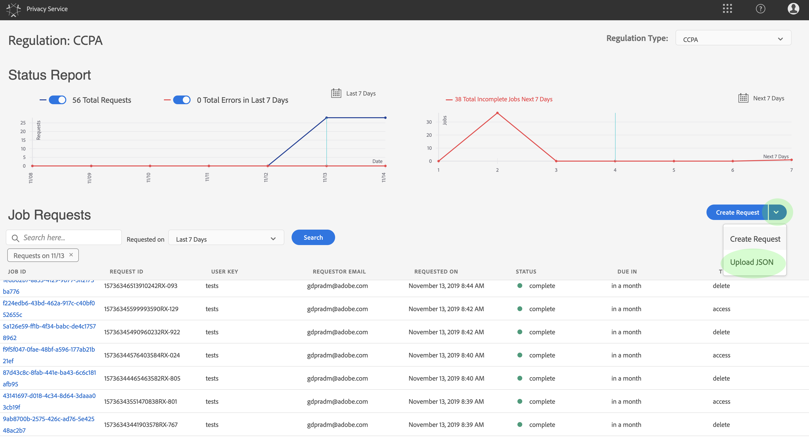

# Privacy ServiceUIでのプライバシージョブの管理

このドキュメントでは、[!DNL Privacy Service]ユーザーインターフェイスを使用してプライバシーリクエストを作成し、管理する手順を説明します。

## [!DNL Privacy Service] UIダッシュボードを参照

[!DNL Privacy Service] UIのダッシュボードは、プライバシージョブのステータスを表示できる2つのウィジェットを提供します。&quot;[!UICONTROL ステータスレポート]&quot;および&quot;[!UICONTROL ジョブ要求]&quot; また、ダッシュボードには、表示されたジョブに対して現在選択されている規制も表示されます。

### 規則の種類

[!DNL Privacy Service] では、プライバシーに関するいくつかの規則に関する求人のリクエストをサポートしています。

* [!DNL California Consumer Privacy Act] ([!UICONTROL CCPA])
* ヨーロッパ和集合[!DNL General Data Protection Regulation] ([!UICONTROL GDPR])
* タイの[!DNL Personal Data Protection Act] ([!UICONTROL PDPA_THA])
* ブラジルの[!DNL Lei Geral de Proteção de Dados] ([!UICONTROL LGPD_BRA])
* ニュージーランド[!DNL Privacy Act] ([!UICONTROL NZPA_NZL])

それぞれの規制タイプのジョブは、別々に追跡されます。規則タイプを切り替えるには、[**[!UICONTROL 規則タイプ]**]ドロップダウンメニューを選択し、リストから目的の規則を選択します。

規制の種類を変更すると、ダッシュボードが更新され、選択した規制に適用されるすべての操作、フィルター、ウィジェット、ジョブ作成のダイアログが表示されます。

### ステータスレポート

ステータスレポートウィジェットの左側のグラフは、エラーが発生してレポートが返された可能性のあるジョブについて、送信されたジョブを追跡します。右側のグラフは、30 日間のコンプライアンス期間の終わり近くにあるジョブを追跡します。

グラフの上にある2つのトグルボタンのいずれかを選択して、それぞれの指標を表示または非表示にします。

グラフ上の任意のデータポイントに関連付けられているジョブの正確な数を表示するには、該当するデータポイントの上にマウスを移動します。

特定のデータポイントに関する詳細を表示するには、該当するデータポイントを選択し、関連するジョブをジョブ要求ウィジェットに表示します。 ジョブリストのすぐ上に適用されるフィルターをメモしておきます。

>[!NOTE]
>
>フィルターがJob Requestsウィジェットに適用されている場合、フィルター薬の&#x200B;**X**&#x200B;を選択すると、フィルターを削除できます。 そうすれば、ジョブリクエストはデフォルトの追跡リストに戻ります。

### ジョブリクエスト

ジョブリクエストウィジェットには、リクエストの種類、現在のステータス、期日、要求者の E メールアドレスなどの詳細も含め、組織内で使用可能なすべてのジョブリクエストがリスト表示されます。

>[!NOTE]
>
> 以前に作成したジョブのデータは、完了日から 30 日間のみアクセスできます。

「Job Requests」タイトルの下の検索バーにキーワードを入力することで、このリストをフィルタリングできます。リストは、入力に応じて自動的にフィルタリングをおこない、検索用語に一致する値を含んだリクエストを表示します。**[!UICONTROL Requested on]** ドロップダウンメニューを使用して、リストに表示されているジョブの時間範囲を選択することもできます。

特定のジョブ要求の詳細を表示するには、リストから要求のジョブIDを選択して、**[!UICONTROL ジョブの詳細]**&#x200B;ページを開きます。

このダイアログには、各[!DNL Experience Cloud]ソリューションのステータス情報と、ジョブ全体に対する現在の状態が含まれます。 プライバシージョブが非同期の場合は、各ソリューションの最新の通信日時（GMT）がページに表示されます。これは、リクエストの処理に他のソリューションより多くの時間が必要な場合があるからです。

ソリューションから追加のデータが提供された場合は、このダイアログで表示できます。個々の製品行を選択して、このデータを表示できます。

完全なジョブデータをCSVファイルとしてダウンロードするには、ダイアログの右上にある「**[!UICONTROL CSVに書き出し]**」を選択します。

## プライバシージョブリクエストの新規作成

>[!NOTE]
>
> プライバシージョブリクエストを作成するには、アクセスまたは削除するデータの所有者である特定の顧客の ID 情報を指定する必要があります。この節を続行する前に、[プライバシーリクエストの ID データ](../identity-data.md)に関するドキュメントを確認してください。

[!DNL Privacy Service] UIには、新しいジョブ要求を作成する2つの方法が用意されています。

* [リクエストビルダーの使用](#request-builder)
* [JSON ファイルのアップロード](#json)

これらの各方法の使用手順について、次の節で説明します。

### リクエストビルダーの使用 {#request-builder}

リクエストビルダーを使用すると、ユーザーインターフェイスで新しいプライバシージョブリクエストを手動で作成できます。リクエストビルダーは、リクエストをユーザーごとに 1 つの ID タイプに制限するので、よりシンプルでより小さなリクエストセットに最適です。より複雑なリクエストについては、代わりに [JSON ファイルをアップロード](#json)する方がよい場合があります。

リクエストビルダーを使用して開始するには、画面の右側にあるステータスレポートウィジェットの下の「**[!UICONTROL リクエストを作成]**」を選択します。

**[!UICONTROL Create Request]** ダイアログが開き、現在選択されている規制タイプのプライバシージョブリクエストを送信するために使用できるオプションが表示されます。

 

リクエストの&#x200B;**[!UICONTROL ジョブタイプ]**&#x200B;と、リストから1つ以上の使用可能な製品を選択します。

 

**[!UICONTROL 名前空間タイプ]**&#x200B;の下で、[!DNL Privacy Service]に送信する顧客IDに適した名前空間タイプを選択します。

 

standard タイプの名前空間を使用する場合は、ドロップダウンメニューから名前空間（E メール、ECID、AAID のいずれか）を選択し、右側のテキストボックスに ID 値を入力し、ID ごとに **Enter** キーを押してリストに追加します。

 

custom タイプの名前空間を使用する場合は、名前空間を手動で入力してから、その下で ID 値を入力する必要があります。

 

終了したら、「**[!UICONTROL 作成]**」を選択します。

 

ダイアログが閉じ、新しいジョブ（複数の場合あり）が現在の処理ステータスと共にジョブリクエストウィジェットにリスト表示されます。

### JSON ファイルのアップロード {#json}

処理するデータサブジェクトごとに複数の ID タイプを使用するリクエストなど、より複雑なリクエストを作成する場合は、JSON ファイルをアップロードしてリクエストを作成できます。

画面の右側にあるステータスレポートウィジェットの下の「**[!UICONTROL リクエストを作成]**」の横にある矢印を選択します。 表示されるオプションリストから、「**[!UICONTROL Upload JSON]**」を選択します。

**[!UICONTROL Upload JSON]** ダイアログが開き、JSON ファイルをドラッグ＆ドロップできるウィンドウが表示されます。

 

アップロードするJSONファイルがない場合は、**[!UICONTROL Download template-GDPR-Request.json]**&#x200B;を選択して、Adobeをダウンロードし、データサブジェクトから収集した値に従って入力できるようにします。

 

コンピューター上で JSON ファイルを探し、ダイアログウィンドウにドラッグします。アップロードが正常に完了すると、ダイアログにファイル名が表示されます。必要に応じて、引き続き JSON ファイルをダイアログにドラッグ＆ドロップして追加できます。

終了したら、「**[!UICONTROL 作成]**」を選択します。 ダイアログが閉じ、新しいジョブ（複数の場合あり）が現在の処理ステータスと共にジョブリクエストウィジェットにリスト表示されます。

### 次の手順

このドキュメントを読むことで、[!DNL Privacy Service] UIを使用してプライバシージョブを作成し、ジョブの詳細を表示し、処理ステータスを監視し、完了したら結果をダウンロードする方法を学びました。

[!DNL Privacy Service] APIを使用してプログラムでこれらの操作を実行する手順については、[開発者ガイド](../api/getting-started.md)を参照してください。
