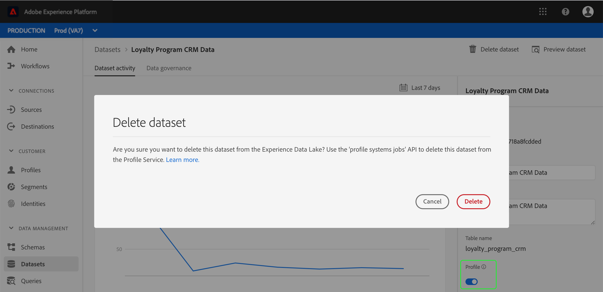

# プロファイルシステムジョブエンドポイント（削除要求）

Adobe Experience Platformを使用すると、複数のソースからデータを取り込み、個々の顧客に対して堅牢なプロファイルを構築できます。 に取り込ま [!DNL Platform] れたデータは、データストアと共 [!DNL Data Lake] に [!DNL Real-time Customer Profile] データストアに保存されます。 不要になった、または誤って追加されたデータを削除するために、プロファイルストアからデータセットまたはバッチを削除する必要が生じる場合があります。 これには、 [!DNL Real-time Customer Profile] APIを使用して [!DNL Profile][!DNL delete request]「」とも呼ばれるシステムジョブを作成する必要があります。このジョブは、必要に応じて変更、監視または削除することもできます。

>[!NOTE]
>からデータセットまたはバッチを削除する場合 [!DNL Data Lake]は、 [Catalog Serviceの概要](../../catalog/home.md) を参照してください。

## はじめに

このガイドで使用されるAPIエンドポイントは、に含まれてい [!DNL Real-time Customer Profile API](https://www.adobe.io/apis/experienceplatform/home/api-reference.html#!acpdr/swagger-specs/real-time-customer-profile.yaml)ます。 先に進む前に、 [はじめに](getting-started.md)[!DNL Experience Platform] 、関連ドキュメントへのリンク、このドキュメントのサンプルAPI呼び出しを読むためのガイド、APIの呼び出しを正常に行うために必要なヘッダーに関する重要な情報を確認してください。

## 表示の削除要求

削除リクエストは、長時間にわたる非同期プロセスです。つまり、組織で複数の削除リクエストを一度に実行している場合があります。 組織が現在実行しているすべての削除要求を表示するには、エンドポイントに対してGET要求を実行し `/system/jobs` ます。

また、オプションのクエリパラメーターを使用して、応答で返される削除要求のリストをフィルタリングすることもできます。 複数のパラメーターを使用する場合は、各パラメーターをアンパサンド(&amp;)で区切ります。

**API形式**

```http
GET /system/jobs
GET /system/jobs?{QUERY_PARAMETERS}
```

| パラメーター | 説明 |
|---|---|
| `start` | リクエストの作成時間に従って、返される結果のページをオフセットします。 例: *`start=4`* |
| `limit` | 返す結果の数を制限する。 例: *`limit=10`* |
| `page` | リクエストの作成時刻に従って、特定のページの結果を返します。 例: ***`page=2`*** |
| `sort` | 特定のフィールドによる結果の昇順(*`asc`*)または降順(**`desc`**)での並べ替え。 結果の複数ページを返す場合、並べ替えパラメーターは機能しません。 例: `sort=batchId:asc` |

**リクエスト**

```shell
curl -X POST \
  https://platform.adobe.io/data/core/ups/system/jobs \
  -H 'Authorization: Bearer {ACCESS_TOKEN}' \
  -H 'x-api-key: {API_KEY}' \
  -H 'x-gw-ims-org-id: {IMS_ORG}' \
  -H 'x-sandbox-name: {SANDBOX_NAME}' \
```

**応答**

応答には、「子」配列が含まれ、各削除リクエストに対して、そのリクエストの詳細を含むオブジェクトが1つずつ含まれます。

```json
{
  "_page": {
    "count": 100,
    "next": "K1JJRDpFaWc5QUwyZFgtMEpBQUFBQUFBQUFBPT0jUlQ6MSNUUkM6MiNGUEM6QWdFQUFBQVFBQWZBQUg0Ly9yL25PcmpmZndEZUR3QT0="
  },
  "children": [
    {
      "id": "9c2018e2-cd04-46a4-b38e-89ef7b1fcdf4",
      "imsOrgId": "{IMS_ORG}",
      "batchId": "8d075b5a178e48389126b9289dcfd0ac",
      "jobType": "DELETE",
      "status": "COMPLETED",
      "metrics": "{\"recordsProcessed\":5,\"timeTakenInSec\":1}",
      "createEpoch": 1559026134,
      "updateEpoch": 1559026137
    },
    {
      "id": "3f225e7e-ac8c-4904-b1d5-0ce79e03c2ec",
      "imsOrgId": "{IMS_ORG}",
      "dataSetId": "5c802d3cd83fc114b741c4b5",
      "jobType": "DELETE",
      "status": "PROCESSING",
      "metrics": "{\"recordsProcessed\":0,\"timeTakenInSec\":15}",
      "createEpoch": 1559025404,
      "updateEpoch": 1559025406
    }
  ]
}
```

| プロパティ | 説明 |
|---|---|
| `_page.count` | 要求の合計数。 この応答は領域のために切り捨てられました。 |
| `_page.next` | 検索結果のページが別に存在する場合は、 [参照リクエストのID値を指定した値に置き換えて](#view-a-specific-delete-request)`"next"` 、次の検索結果ページを表示します。 |
| `jobType` | 作成するジョブのタイプ。 この場合、常に戻り `"DELETE"`ます。 |
| `status` | 削除リクエストのステータス。 Possible values are `"NEW"`, `"PROCESSING"`, `"COMPLETED"`, `"ERROR"`. |
| `metrics` | 処理されたレコードの数(`"recordsProcessed"`)と、リクエストの処理が完了した秒数、またはリクエストの完了に要した時間(`"timeTakenInSec"`)を含むオブジェクト。 |

## Create a delete request {#create-a-delete-request}

新しい削除リクエストを開始するには、エンドポイントへのPOSTリクエストを使用します。このリクエストでは、削除するデータセットまたはバッチのIDがリクエストの本文に含まれています。 `/systems/jobs`

### データセットの削除

データセットを削除するには、データセットIDをPOSTリクエストの本文に含める必要があります。 この操作により、特定のデータセットのALLデータが削除されます。 [!DNL Experience Platform] レコードと時系列の両方のスキーマに基づいてデータセットを削除できます。

>[!CAUTION]
> UIを使用して [!DNL Profile][!DNL Experience Platform] 有効なデータセットを削除しようとすると、データセットの取り込みは無効になりますが、削除は、APIを使用して削除リクエストを作成するまで行われません。 詳しくは、このドキュメントの [付録](#appendix) を参照してください。

**API形式**

```http
POST /system/jobs
```

**リクエスト**

```shell
curl -X POST \
  https://platform.adobe.io/data/core/ups/system/jobs \
  -H 'Content-Type: application/json' \
  -H 'Authorization: Bearer {ACCESS_TOKEN}' \
  -H 'x-api-key: {API_KEY}' \
  -H 'x-gw-ims-org-id: {IMS_ORG}' \
  -H 'x-sandbox-name: {SANDBOX_NAME}' \
  -d '{
        "dataSetId": "5c802d3cd83fc114b741c4b5"
      }'
```

| プロパティ | 説明 |
|---|---|
| `dataSetId` | **（必須）** 削除するデータセットのID。 |

**応答**

正常に完了すると、新たに作成された削除要求の詳細が返されます。この詳細には、その要求に対して、一意の、システム生成の、読み取り専用のIDが含まれます。 これは、リクエストを検索し、そのステータスを確認するために使用できます。 作成時 **`status`** のリクエストは、処理が開始され *`"NEW"`* るまでです。 応答 **`dataSetId`** 内のは、要求で ***`dataSetId`*** 送信されたものと一致する必要があります。

```json
{
    "id": "3f225e7e-ac8c-4904-b1d5-0ce79e03c2ec",
    "imsOrgId": "{IMS_ORG}",
    "dataSetId": "5c802d3cd83fc114b741c4b5",
    "jobType": "DELETE",
    "status": "NEW",
    "createEpoch": 1559025404,
    "updateEpoch": 1559025406
}
```

| プロパティ | 説明 |
|---|---|
| `id` | 削除要求の一意の、システム生成の読み取り専用ID。 |
| `dataSetId` | POSTリクエストで指定された、データセットのID。 |

### バッチの削除

バッチを削除するには、バッチIDをPOSTリクエストの本文に含める必要があります。 レコードスキーマに基づくデータセットのバッチは削除できないことをお勧めします。 時系列スキーマに基づくデータセットのバッチのみを削除できます。

>[!NOTE]
> レコードのスキーマに基づいてデータセットのバッチを削除できないのは、レコードタイプのデータセットバッチによって以前のレコードが上書きされるので、「元に戻す」や削除を行うことができないためです。 レコードのスキーマに基づいてデータセットに誤ったバッチが及ぼす影響を取り除く唯一の方法は、誤ったレコードを上書きするために、バッチを正しいデータで再取り込みすることです。

レコードと時系列の動作について詳しくは、 [概要の「XDMデータ動作](../../xdm/home.md#data-behaviors) 」の [!DNL XDM System] 節を参照してください。

**API形式**

```http
POST /system/jobs
```

**リクエスト**

```shell
curl -X POST \
  https://platform.adobe.io/data/core/ups/system/jobs \
  -H 'Content-Type: application/json' \
  -H 'Authorization: Bearer {ACCESS_TOKEN}' \
  -H 'x-api-key: {API_KEY}' \
  -H 'x-gw-ims-org-id: {IMS_ORG}' \
  -H 'x-sandbox-name: {SANDBOX_NAME}' \
  -d '{
       "batchId": "8d075b5a178e48389126b9289dcfd0ac"
      }'
```

| プロパティ | 説明 |
|---|---|
| `batchId` | **（必須）** 削除するバッチのID。 |

**応答**

正常に完了すると、新たに作成された削除要求の詳細が返されます。この詳細には、その要求に対して、一意の、システム生成の、読み取り専用のIDが含まれます。 これは、リクエストを検索し、そのステータスを確認するために使用できます。 作成時 `"status"` のリクエストは、処理が開始され `"NEW"` るまでです。 応答 `"batchId"` 内のは、要求で `"batchId"` 送信されたものと一致する必要があります。

```json
{
    "id": "9c2018e2-cd04-46a4-b38e-89ef7b1fcdf4",
    "imsOrgId": "{IMS_ORG}",
    "batchId": "8d075b5a178e48389126b9289dcfd0ac",
    "jobType": "DELETE",
    "status": "NEW",
    "createEpoch": 1559026131,
    "updateEpoch": 1559026132
}
```

| プロパティ | 説明 |
|---|---|
| `id` | 削除要求の一意の、システム生成の読み取り専用ID。 |
| `batchId` | POSTリクエストで指定された、バッチのID。 |

Recordデータセットバッチの削除リクエストを開始しようとすると、次のような400レベルのエラーが発生します。

```json
{
    "requestId": "bc4eb29f-63a8-4653-9133-71238884bb81",
    "errors": {
        "400": [
            {
                "code": "500",
                "message": "Batch can only be specified for EE type 'a294e36d382649dab2cc6ad64a41b674'"
            }
        ]
    }
}
```

## 特定の削除リクエストの表示 {#view-a-specific-delete-request}

特定の削除リクエスト（そのステータスなどの詳細を含む）を表示するには、エンドポイントに対してルックアップ(GET)リクエストを実行し、削除リクエストのIDをパスに含めます。 `/system/jobs`

**API形式**

```http
GET /system/jobs/{DELETE_REQUEST_ID}
```

| パラメーター | 説明 |
|---|---|
| `{DELETE_REQUEST_ID}` | **（必須）** 表示する削除リクエストのID。 |

**リクエスト**

```shell
curl -X POST \
  https://platform.adobe.io/data/core/ups/system/jobs/9c2018e2-cd04-46a4-b38e-89ef7b1fcdf4 \
  -H 'Authorization: Bearer {ACCESS_TOKEN}' \
  -H 'x-api-key: {API_KEY}' \
  -H 'x-gw-ims-org-id: {IMS_ORG}' \
  -H 'x-sandbox-name: {SANDBOX_NAME}' \
```

**応答**

応答には、更新されたステータスなど、削除リクエストの詳細が表示されます。 応答内の削除要求のIDは、要求パスで送信されるIDと一致する必要があります。

```json
{
    "id": "9c2018e2-cd04-46a4-b38e-89ef7b1fcdf4",
    "imsOrgId": "{IMS_ORG}",
    "batchId": "8d075b5a178e48389126b9289dcfd0ac",
    "jobType": "DELETE",
    "status": "COMPLETED",
    "metrics": "{\"recordsProcessed\":5,\"timeTakenInSec\":1}",
    "createEpoch": 1559026134,
    "updateEpoch": 1559026137
}
```

| プロパティ | 説明 |
|---|---|
| `jobType` | 作成中のジョブのタイプ。この場合は常に返され `"DELETE"`ます。 |
| `status` | 削除リクエストのステータス。 Possible values: `"NEW"`, `"PROCESSING"`, `"COMPLETED"`, `"ERROR"`. |
| `metrics` | 処理されたレコードの数(`"recordsProcessed"`)と、リクエストの処理が完了した秒数、またはリクエストの完了に要した時間(`"timeTakenInSec"`)を含む配列。 |

削除要求のステータスが表示され `"COMPLETED"` たら、データアクセスAPIを使用して削除したデータにアクセスしようとすることで、そのデータが削除されたことを確認できます。 データアクセスAPIを使用してデータセットやバッチにアクセスする方法については、 [データアクセスに関するドキュメントを参照してください](../../data-access/home.md)。

## 削除要求の削除

[!DNL Experience Platform] 以前のリクエストを削除できます。削除ジョブが完了しなかった場合や、処理段階で停止した場合など、様々な理由で役立つ場合があります。 削除要求を削除するには、エンドポイントに対してDELETE要求を実行し、削除する削除要求のIDを要求パスに含め `/system/jobs` ます。

**API形式**

```http
DELETE /system/jobs/{DELETE_REQUEST_ID}
```

| パラメーター | 説明 |
|---|---|
| {DELETE_要求_ID} | 削除する削除リクエストのID。 |

**リクエスト**

```shell
curl -X POST \
  https://platform.adobe.io/data/core/ups/system/jobs/9c2018e2-cd04-46a4-b38e-89ef7b1fcdf4 \
  -H 'Authorization: Bearer {ACCESS_TOKEN}' \
  -H 'x-api-key: {API_KEY}' \
  -H 'x-gw-ims-org-id: {IMS_ORG}' \
  -H 'x-sandbox-name: {SANDBOX_NAME}' \
```

**応答**

削除が成功すると、HTTPステータス200(OK)と空の応答本文が返されます。 削除リクエストが削除されたことを確認するには、IDに基づいて削除リクエストを表示するGETリクエストを実行します。 削除要求が削除されたことを示すHTTPステータス404 （見つかりません）が返されます。

## 次の手順

データセットやバッチの削除手順が [!DNL Profile Store] 内からわかったので、誤って追加されたデータや組織で不要になったデータを安全に削除でき [!DNL Experience Platform]ます。 削除のリクエストは元に戻せないので、今は不要であり、将来は不要になると確信しているデータのみを削除するようにしてください。

## 付録 {#appendix}

次の情報は、からデータセットを削除する操作の補足情報で [!DNL Profile Store]す。

### UIを使用したデータセットの削除 [!DNL Experience Platform]

ユーザーインターフェイスを使用して有効になっているデータセットを削除する [!DNL Experience Platform][!DNL Profile][!DNL Experience Data Lake]と、「このデータセットを &#39;p[!DNL rofile systems jobs]&#39; APIを使用して、このデータセットをから削除 [!DNL Profile Service]します。」

UIの「 **[!UICONTROL 削除]** 」をクリックすると、データセットの取り込みが無効になりますが、バックエンドのデータセットは自動的に削除されません。 データセットを完全に削除するには、このガイドの手順に従って、削除リクエストを手動で作成し、削除リクエストを [作成する必要があります](#create-a-delete-request)。

次の図に、UIを使用して [!DNL Profile]有効なデータセットを削除しようとした場合の警告を示します。



データセットの操作の詳細については、まず [データセットの概要を読んでください](../../catalog/datasets/overview.md)。