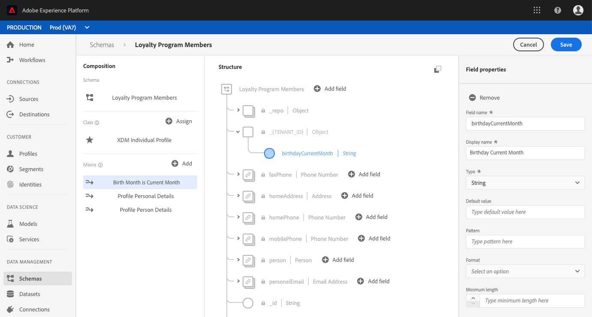

# （アルファ）UIで計算済み属性フィールドを設定する

>[!IMPORTANT]
>
>計算済み属性機能は現在アルファベットで表示されており、すべてのユーザーが使用できるわけではありません。 ドキュメントと機能は変更される場合があります。

計算済み属性を設定するには、まず、計算済み属性値を保持するフィールドを特定する必要があります。このフィールドは、スキーマフィールドグループを使用して作成し、既存のスキーマに追加するか、スキーマ内で既に定義済みのフィールドを選択することで作成できます。

>[!NOTE]
>
>計算済み属性は、Adobe定義フィールドグループ内のフィールドには追加できません。 フィールドは、`tenant` 名前空間内に存在する、つまり、定義してスキーマに追加するフィールドである必要があります。

計算済みの属性フィールドを正しく定義するには、スキーマが[!DNL Profile]に対して有効にされ、スキーマの基となるクラスの和集合スキーマの一部として表示される必要があります。 [!DNL Profile]が有効なスキーマと和集合の詳細については、[スキーマのプロファイルと和集合スキーマの表示を有効にする](../../xdm/api/getting-started.md)の[!DNL Schema Registry]開発者ガイドの節を参照してください。 また、構成の基本ドキュメントの[和集合に関する節](../../xdm/schema/composition.md)を確認することをお勧めします。

このチュートリアルのワークフローは、[!DNL Profile]が有効なスキーマを使用し、計算済み属性フィールドを含む新しいフィールドグループを定義し、正しい名前空間であることを確認する手順に従います。 プロファイル対応スキーマ内の適切な名前空間に、既にフィールドがある場合は、[計算済み属性を作成する](#create-a-computed-attribute)手順に直接進むことができます。

## スキーマの表示

以下の手順では、Adobe Experience Platformのユーザーインターフェイスを使用して、スキーマを検索し、フィールドグループを追加し、フィールドを定義します。 [!DNL Schema Registry] APIの使用を希望する場合は、[スキーマレジストリ開発者ガイド](../../xdm/api/getting-started.md)を参照して、フィールドグループの作成、スキーマへのフィールドグループの追加、[!DNL Real-time Customer Profile]で使用するスキーマの有効化の手順を確認してください。

ユーザインターフェイスで、左側のパネルの「**[!UICONTROL スキーマ]**」をクリックし、「**[!UICONTROL 参照]**」タブの検索バーを使用して、更新するスキーマをすばやく見つけます。

スキーマを見つけたら、名前をクリックして[!DNL Schema Editor]を開き、スキーマに編集を加えることができます。

## フィールドグループの作成

新しいフィールドグループを作成するには、エディターの左側の&#x200B;**[!UICONTROL コンポジション]**&#x200B;セクションで、**[!UICONTROL フィールドグループ]**&#x200B;の横にある追加&#x200B;****&#x200B;をクリックします。 これにより、**[!UICONTROL 追加フィールドグループ]**&#x200B;ダイアログが開き、既存のフィールドグループを表示できます。 新しいフィールドグループを定義するには、**[!UICONTROL 新しいフィールドグループを作成]**&#x200B;のラジオボタンをクリックします。

フィールドグループに名前と説明を入力し、完了したら「**[!UICONTROL 追加フィールドグループ]**」をクリックします。

## 追加スキーマ

新しいフィールドグループが「[!UICONTROL 組版]」の下の「[!UICONTROL フィールドグループ]」セクションに表示されます。 フィールドグループ名をクリックすると、複数の&#x200B;**[!UICONTROL 追加フィールド]**&#x200B;ボタンがエディターの&#x200B;**[!UICONTROL 構造]**&#x200B;セクションに表示されます。

上位のフィールドを追加するには、スキーマ名の隣にある「**[!UICONTROL フィールドを追加]**」を選択するか、お好きなスキーマ内の任意の場所にフィールドを追加するよう選択することもできます。

「**[!UICONTROL フィールドを追加]**」をクリックすると、テナント ID の名前を付けた新しいオブジェクトが開き、フィールドが正しい名前空間にあることが示されます。そのオブジェクト内に、「**[!UICONTROL 新規フィールド]**」が表示されます。計算済み属性を定義するフィールドの場合。

## フィールドの設定

エディターの右側にある「**[!UICONTROL フィールドプロパティ]**」セクションを使用して、新しいフィールドの名前、表示名、タイプなど、必要な情報を指定します。

>[!NOTE]
>
>フィールドのタイプは、計算済みの属性値と同じタイプである必要があります。例えば、計算済み属性の値が文字列の場合、スキーマで定義するフィールドは文字列にする必要があります。

完了したら、「**[!UICONTROL 適用]**」をクリックし、フィールドの名前とタイプがエディターの「**[!UICONTROL 構造]**」セクションに表示されます。

## [!DNL Profile]のスキーマを有効にする

続行する前に、スキーマが[!DNL Profile]に対して有効になっていることを確認してください。 エディターの「**[!UICONTROL 構造]**」セクションでスキーマ名をクリックすると、「**[!UICONTROL スキーマプロパティ]**」タブが表示されます。**[!UICONTROL プロファイル]**&#x200B;のスライダーが青の場合、[!DNL Profile]のスキーマは有効になっています。

>[!NOTE]
>
>[!DNL Profile]のスキーマを有効にすると元に戻せないので、一度有効にした後にスライダをクリックした場合に、無効にするリスクはありません。

これで、「**[!UICONTROL 保存]**」をクリックして、更新したスキーマを保存し、API を使用して残りのチュートリアルに進むことができるようになりました。

## 次の手順

計算済みの属性値が格納されるフィールドを作成したら、`/computedattributes` APIエンドポイントを使用して計算済みの属性を作成できます。 APIで計算済み属性を作成する詳細な手順については、[計算済み属性APIエンドポイントガイド](ca-api.md)に記載されている手順に従ってください。