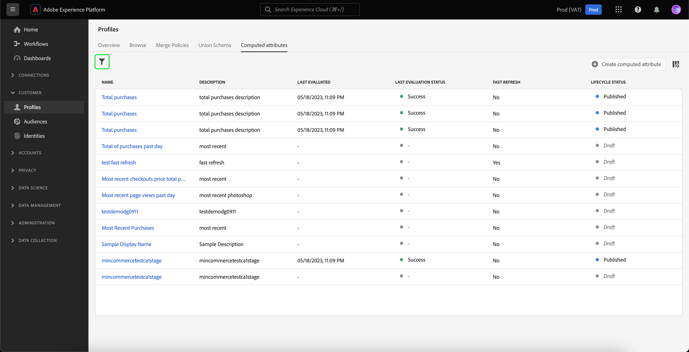
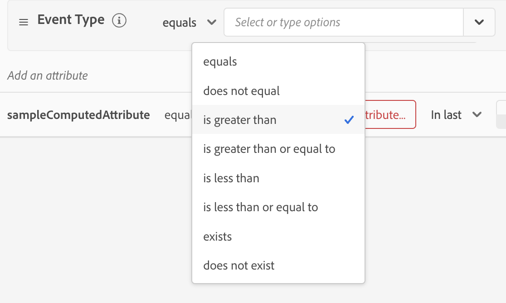
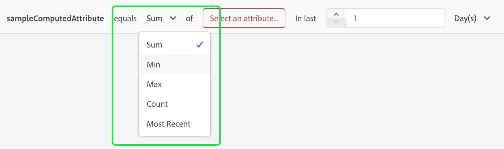
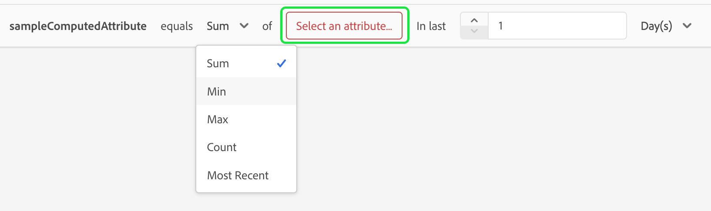
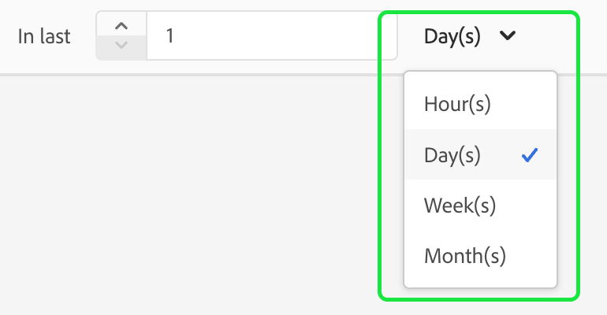
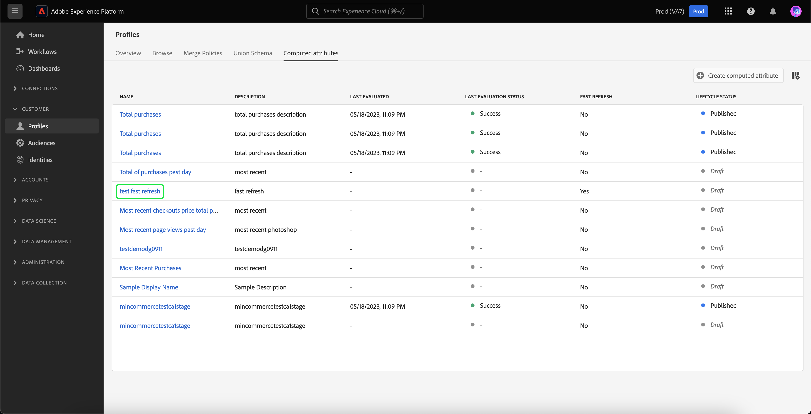
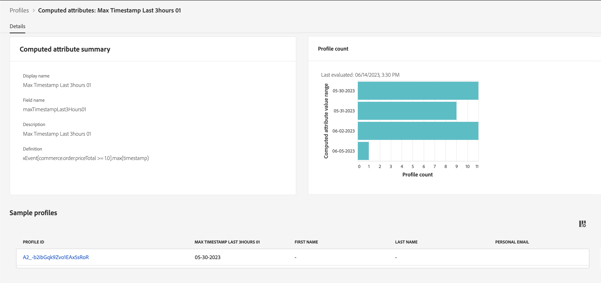
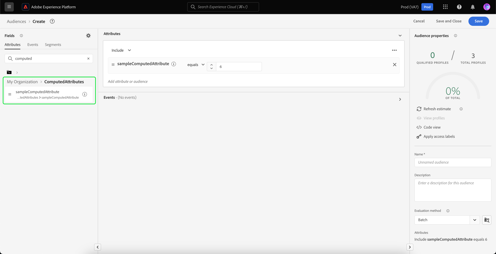

# 計算属性 UI ガイド

>[!NOTE]
>
>計算属性にアクセスするには、適切な権限（**計算属性を表示**&#x200B;および&#x200B;**計算属性を管理**）が必要です。 必要な権限について詳しくは、[ アクセス制御ドキュメント ](../../access-control/home.md)を参照してください。 これらの権限の適用方法については、[権限の管理ガイド ](../../access-control/ui/permissions.md)を参照してください。

Adobe Experience Platformでは、計算属性は、イベントレベルのデータをプロファイルレベルの属性に集約するために使用される関数です。 これらの関数は自動的に計算され、セグメンテーション、アクティベーション、パーソナライゼーションをまたいで使用できます。

このドキュメントでは、Adobe Experience Platform UIを使用して計算属性を作成および更新する方法について説明します。

## はじめに

このUI ガイドでは、[!DNL Experience Platform]の管理に関する様々な[!DNL Real-Time Customer Profiles] サービスについて理解する必要があります。 このガイドを読む前に、またはUIで作業する前に、次のサービスのドキュメントを確認してください。

- [[!DNL Real-Time Customer Profile]](../home.md)：複数のソースから集計したデータに基づいて、統合されたリアルタイム顧客プロファイルを提供します。
- [[!DNL Experience Data Model (XDM) System]](../../xdm/home.md)：[!DNL Experience Platform] が、カスタマーエクスペリエンスデータを整理する際に使用する、標準化されたフレームワーク。

## 計算属性の表示 {#view}

Experience Platform UIで、左側のナビゲーションで「**[!UICONTROL Profiles]**」を選択し、続いて「**[!UICONTROL Computed attributes]**」を選択すると、組織で使用可能な計算属性のリストが表示されます。 これには、計算属性の名前、説明、最終評価日、最終評価ステータスに関する情報が含まれます。

![[!UICONTROL Profile] セクションと[!UICONTROL Computed attributes] タブがハイライト表示され、ユーザーが計算属性の参照ページにアクセスする方法が表示されます。](./images/ui/browse.png)

表示するフィールドを選択するには、を選択して、表示するフィールドを追加または削除します。

| フィールド | 説明 |
| ----- | ----------- |
| [!UICONTROL Name] | 計算属性の表示名。 |
| [!UICONTROL Description] | 計算属性の説明。 |
| [!UICONTROL Evaluation method] | 計算属性の評価方法。 現時点では、**バッチ**&#x200B;のみがサポートされています。 |
| [!UICONTROL Last evaluated] | このタイムスタンプは、最後に成功した評価実行を表します。 このタイムスタンプが&#x200B;**before**&#x200B;に発生したイベントのみが、最後に評価が成功した場合に考慮されます。 |
| [!UICONTROL Last evaluation status] | 前回の評価実行で計算属性が正常に計算されたかどうかを示すステータス。 指定できる値は&#x200B;**[!UICONTROL Success]**&#x200B;または&#x200B;**[!UICONTROL Failed]**&#x200B;です。 |
| [!UICONTROL Refresh frequency] | 計算属性が更新される頻度を示します。 使用できる値には、時間、日、週単位、月単位などがあります。 |
| [!UICONTROL Fast refresh] | この計算属性に対して高速リフレッシュが有効かどうかを示す値。 高速リフレッシュが有効になっている場合、計算属性は、週単位、隔週単位、または月単位ではなく、日単位でリフレッシュできます。 この値は、ルックバック期間が週単位より大きい計算属性にのみ適用されます。 |
| [!UICONTROL Lifecycle status] | 計算属性の現在のステータス。 3つのステータスが考えられます。 <ul><li>**[!UICONTROL Draft]:**&#x200B;計算属性には、**not**&#x200B;がまだスキーマにフィールドを作成していません。 この状態では、計算属性を編集できます。 </li><li>**[!UICONTROL Published]:**&#x200B;計算属性には、スキーマ上に作成されたフィールドがあり、使用する準備ができています。 この状態では、計算属性&#x200B;**を編集できません**。</li><li>**[!UICONTROL Inactive]:**&#x200B;計算属性は無効です。 非アクティブ状態について詳しくは、[FAQ ページ ](./faq.md#inactive-status)を参照してください。 </li> |
| [!UICONTROL Created] | 計算属性が作成された日時を示すタイムスタンプ。 |
| [!UICONTROL Last modified] | 計算属性が最後に変更された日時を示すタイムスタンプ。 |

表示される計算属性は、ライフサイクルステータスに基づいてフィルタリングすることもできます。 「」アイコンを選択します。

計算属性をステータス （[!UICONTROL Draft]、[!UICONTROL Published]、および[!UICONTROL Inactive]）でフィルタリングできるようになりました。

![計算属性をフィルタリングできるオプションがハイライト表示されます。 これらのオプションには、[!UICONTROL Draft]、[!UICONTROL Published]および[!UICONTROL Inactive]が含まれます。](./images/ui/view-filters.png)

さらに、計算属性を選択して、その詳細情報を表示することもできます。 計算属性の詳細ページについて詳しくは、[計算属性の詳細を表示の節](#view-details)を参照してください。

## 計算属性の作成 {#create}

新しい計算属性を作成するには、**[!UICONTROL Create computed attribute]**&#x200B;を選択して、新しい計算属性ワークフローを入力します。

![ 「[!UICONTROL Create computed attributes]」ボタンが強調表示され、ユーザーが計算属性の作成ページにアクセスする方法が表示されます。](./images/ui/create.png)

**[!UICONTROL Create computed attribute]** ページが表示されます。 このページでは、作成する計算属性の基本情報を追加できます。

| フィールド | 説明 |
| ----- | ----------- |
| [!UICONTROL Display name] | 計算属性が認識される名前。 この表示名は、計算属性ごとに一意にする必要があります。 ベストプラクティスとして、この表示名には、計算属性に関連する識別子を含める必要があります。 たとえば、「過去7日間の靴の購入額」などです。 |
| [!UICONTROL Field name] | 他のダウンストリームサービスの計算属性を参照するために使用される名前。 この名前は、表示名から自動的に派生し、camelCaseで記述されます。 |
| [!UICONTROL Description] | 作成しようとしている計算属性の説明。 |

![[!UICONTROL Basic information] ページの[!UICONTROL Create computed attribute] セクションがハイライト表示されています。](./images/ui/basic-information.png)

計算属性の詳細を追加したら、ルールの定義を開始できます。

### イベントフィルタリング条件の指定

ルールを作成するには、まず&#x200B;**[!UICONTROL Events]** セクションから属性を選択して、集計するイベントを絞り込みます。 現在、サポートされているのは、配列タイプ以外のイベント属性のみです。

![[!UICONTROL Events] セクションがハイライト表示されています。](./images/ui/events.png)

計算属性定義で使用する属性を選択したら、この値と比較する値を選択できます。

### 集計関数を適用

次に、条件付き出力からフィールドに関数を適用できます。 まず、集計関数タイプを選択します。 利用できるオプションには、[!UICONTROL Sum]、[!UICONTROL Min]、[!UICONTROL Max]、[!UICONTROL Count]および[!UICONTROL Most Recent]が含まれます。 これらの関数の詳細については、計算属性の概要の[関数セクション ](./overview.md#functions)を参照してください。

関数を選択した後、集計するフィールドを選択できます。 選択する対象フィールドは、選択した関数によって異なります。

### ルックバック期間

集計関数を適用した後、計算属性のルックバック期間を定義する必要があります。 このルックバック期間は、イベントを集計する時間の長さを指定します。 このルックバック期間は、時間、日、週、または月で指定できます。

### 高速更新 {#fast-refresh}

>[!CONTEXTUALHELP]
>id="platform_profile_computedAttributes_fastRefresh"
>title="高速更新"
>abstract="高速更新を使用すると、属性を最新の状態に保つことができます。このオプションを有効にすると、ルックバック期間が長くても、計算属性を毎日更新し、ユーザーアクティビティに迅速に対応できます。この値は、ルックバック期間が週単位より大きい計算属性にのみ適用されます。"

集計関数を適用する際に、ルックバック期間が1週間を超える場合は、高速リフレッシュを有効にできます。

![ [!UICONTROL Fast Refresh] チェックボックスが強調表示されます。](./images/ui/enable-fast-refresh.png)

高速更新を使用すると、属性を最新の状態に保つことができます。このオプションを有効にすると、長いルックバック期間であっても、計算属性を毎日更新できるので、ユーザーのアクティビティに迅速に対応できます。

高速リフレッシュについて詳しくは、計算属性の概要の「[高速リフレッシュ」セクション ](./overview.md#fast-refresh)を参照してください。

これらの手順が完了したら、この計算属性をドラフトとして保存するか、すぐに公開するかを選択できます。

![[!UICONTROL Save as draft]と[!UICONTROL Publish]のボタンがハイライト表示されます。](./images/ui/draft-or-publish.png)

## 計算属性の詳細の表示 {#view-details}

計算属性の詳細を表示するには、[!UICONTROL **参照**] ページで詳細を表示する計算属性を選択します。

計算属性が&#x200B;**[!UICONTROL Published]**&#x200B;であるか&#x200B;**[!UICONTROL Draft]**&#x200B;であるかによって、ページの内容が異なります。

### 公開済みの計算属性 {#published}

公開された計算属性を選択すると、計算属性の詳細ページが表示されます。

このページには、計算属性の詳細の概要と、値分布を示すグラフ、および計算属性に適格なサンプルプロファイルが表示されます。

>[!NOTE]
>
>値の分布は、サンプリングジョブの時点でのプロファイルの属性値の分布を反映します。 サンプルプロファイルの計算属性値には、いくつかのサンプルプロファイルの最新の結合プロファイル値が反映されます。

### ドラフト計算属性 {#draft}

ドラフト計算属性を選択すると、**[!UICONTROL Edit computed attributes]** ページが表示されます。 このページは、[!UICONTROL Create computed attributes] ページと同様に、ドラフトを更新または公開する前に、計算属性の基本情報とその定義を編集できます。

![[!UICONTROL Edit computed attributes] ページが表示されます。](./images/ui/edit.png)

## 計算属性の使用 {#usage}

>[!IMPORTANT]
>
>セグメント定義で&#x200B;**最新**&#x200B;関数を使用して計算属性を使用している場合、**は**&#x200B;両方&#x200B;**を計算属性オブジェクトに含める必要があります。**
>
>例えば、「有効な電子メールアドレスを持つすべてのプロファイル」を探しているセグメント定義を作成する場合、最新の関数を持つ計算属性によって電子メールアドレス フィールドに入力されるセグメント定義を作成するには、**メールアドレスの値が存在する**&#x200B;と電子メールアドレスのタイムスタンプが存在する&#x200B;**の両方を含める必要があります。**

計算属性を作成した後、他のダウンストリームサービスで&#x200B;**公開済み**&#x200B;計算属性を使用できます。 計算属性は、プロファイル結合スキーマで作成されたプロファイル属性フィールドなので、リアルタイム顧客プロファイルの計算属性値を検索したり、オーディエンスで使用したり、宛先にアクティベートしたり、Adobe Journey Optimizerのジャーニーでパーソナライズするために使用したりできます。

>[!NOTE]
>
>計算属性&#x200B;**は、**&#x200B;をオーディエンス **構成**&#x200B;で使用できません。

## 次の手順

計算属性について詳しくは、[計算属性の概要](./overview.md)を参照してください。 APIを使用した計算属性の作成と設定について詳しくは、[計算属性の開発者ガイド ](./api.md)を参照してください。
