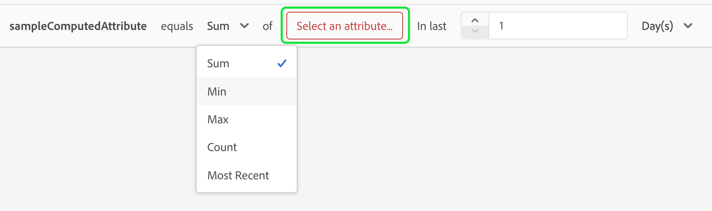

# 計算済み属性 UI ガイド

>[!IMPORTANT]
>
>計算済み属性は、現在、 **ベータ版** および **not** すべてのユーザーが利用できます。

Adobe Experience Platformでは、計算済み属性は、イベントレベルのデータをプロファイルレベルの属性に集計するために使用される関数です。 これらの関数は自動的に計算され、セグメント化、アクティブ化およびパーソナライズ機能で使用できます。

このドキュメントでは、Adobe Experience Platform UI を使用して計算済み属性を作成および更新する方法に関するガイドを提供します。

## Destination SDK の

この UI ガイドでは、 [!DNL Experience Platform] 管理に関わるサービス [!DNL Real-Time Customer Profiles]. このガイドを読む前、または UI で作業する前に、次のサービスのドキュメントを確認してください。

- [[!DNL Real-Time Customer Profile]](../home.md)：複数のソースから集計したデータに基づいて、統合されたリアルタイム顧客プロファイルを提供します。
- [[!DNL Experience Data Model (XDM) System]](../../xdm/home.md)：[!DNL Experience Platform] が、カスタマーエクスペリエンスデータを整理する際に使用する、標準化されたフレームワーク。

## 計算済み属性の表示 {#view}

Experience PlatformUI で、 **[!UICONTROL プロファイル]** 左のナビゲーションで、その後に **[!UICONTROL 計算済み属性]** を参照して、組織で使用可能な計算済み属性のリストを確認します。 これには、計算済み属性の名前、説明、最終評価日、最終評価ステータスに関する情報が含まれます。

![この [!UICONTROL プロファイル] セクションおよび [!UICONTROL 計算済み属性] タブがハイライト表示され、計算済み属性の参照ページへのアクセス方法が表示されます。](./images/ui/browse.png)

表示するフィールドを選択するには、  をクリックして、表示するフィールドを追加または削除します。

| フィールド | 説明 |
| ----- | ----------- |
| [!UICONTROL 名前] | 計算済み属性の表示名。 |
| [!UICONTROL 説明] | 計算済み属性の説明。 |
| [!UICONTROL 評価方法] | 計算済み属性の評価方法。 現時点では、 **バッチ** はサポートされています。 |
| [!UICONTROL 前回の評価] | このタイムスタンプは、最後に成功した評価の実行を表します。 発生したイベントのみ **前** このタイムスタンプは、最後の成功した評価と見なされます。 |
| [!UICONTROL 前回の評価ステータス] | 前回の評価実行で計算済み属性が正常に計算されたかどうかを示すステータス。 以下の値を指定できます。 **[!UICONTROL 成功]** または **[!UICONTROL 失敗]**. |
| [!UICONTROL 更新頻度] | 計算済み属性の更新頻度を示します。 時間別、日別、週別、月別の値を指定できます。 |
| [!UICONTROL 高速更新] | この計算属性に対して高速更新が有効かどうかを示す値。 高速更新が有効な場合、計算済み属性は、週単位、週単位、月単位ではなく、日単位で更新されます。 この値は、ルックバック期間が週単位より大きい計算済み属性にのみ適用されます。 |
| [!UICONTROL ライフサイクルステータス] | 計算済み属性の現在のステータス。 次の 3 つのステータスが考えられます。 <ul><li>**[!UICONTROL ドラフト]:** 計算済み属性は次の処理を行います。 **not** スキーマ上にフィールドがまだ作成されています。 この状態では、計算済み属性を編集できます。 </li><li>**[!UICONTROL 公開済み]:** 計算済み属性には、スキーマ上で作成されたフィールドがあり、使用する準備が整っています。 この状態では、計算済み属性 **できません** 編集できます。</li><li>**[!UICONTROL 非アクティブ]:** 計算済み属性は無効です。 非アクティブなステータスの詳細については、 [FAQ ページ](./faq.md#inactive-status). </li> |

また、計算済み属性を選択して、その詳細を確認することもできます。 計算済み属性の詳細ページの詳細については、 [計算済み属性の詳細セクションの表示](#view-details).

## 計算済み属性の作成 {#create}

新しい計算済み属性を作成するには、「 **[!UICONTROL 計算済み属性を作成]** をクリックして、新しい計算済み属性のワークフローを開始します。

![この [!UICONTROL 計算済み属性の作成] ボタンが強調表示され、「計算済み属性を作成」ページへのアクセス方法が示されます。](./images/ui/create.png)

この **[!UICONTROL 計算済み属性を作成]** ページが表示されます。 このページでは、作成する計算済み属性の基本情報を追加できます。

| フィールド | 説明 |
| ----- | ----------- |
| [!UICONTROL 表示名] | 計算済み属性の名前。 この表示名は、計算済み属性ごとに一意にする必要があります。 ベストプラクティスとして、この表示名には、計算済み属性に関連する ID を含める必要があります。 例えば、「過去 7 日間の靴の購入の合計」とします。 |
| [!UICONTROL フィールド名] | 他のダウンストリームサービスで計算済み属性を参照するために使用される名前。 この名前は、表示名から自動的に派生し、camelCase で記述されます。 |
| [!UICONTROL 説明] | 作成しようとしている計算済み属性の説明。 |

![この [!UICONTROL 基本情報] セクション [!UICONTROL 計算済み属性を作成] ページがハイライト表示されます。](./images/ui/basic-information.png)

計算済み属性の詳細を追加したら、ルールの定義を開始できます。

### イベントのフィルター条件を指定

ルールを作成するには、まず **[!UICONTROL イベント]** 「 」セクションで、集計するイベントをフィルタリングします。 現在、配列以外のタイプのイベント属性のみがサポートされています。

![この [!UICONTROL イベント] セクションがハイライト表示されます。](./images/ui/events.png)

計算済み属性定義で使用する属性を選択した後、この値と比較する対象を選択できます。

### 集計関数を適用

これで、条件付き出力からフィールドに関数を適用できます。 まず、集計関数のタイプを選択します。 次のオプションを使用できます。 [!UICONTROL 合計], [!UICONTROL 最小], [!UICONTROL 最大], [!UICONTROL カウント]、および [!UICONTROL 最新]. これらの関数について詳しくは、 [関数セクション](./overview.md#functions) 計算済み属性の概要を示します。

関数を選択した後、集計するフィールドを選択できます。 選択できるフィールドは、選択した関数によって異なります。

### ルックバック期間

集計関数を適用した後、計算済み属性のルックバック期間を定義する必要があります。 このルックバック期間は、イベントを集計する時間の長さを指定します。 このルックバック期間は、時間、日、週、月の単位で指定できます。

これらの手順が完了したら、計算済み属性をドラフトとして保存するか、直ちに公開するかを選択できます。

![この [!UICONTROL ドラフトとして保存] および [!UICONTROL 公開] ボタンがハイライト表示されます。](./images/ui/draft-or-publish.png)

## 計算済み属性の詳細の表示 {#view-details}

計算済み属性の詳細を表示するには、 [!UICONTROL **参照**] ページ。

計算済み属性が **[!UICONTROL 公開済み]** または **[!UICONTROL ドラフト]**.

### 公開済みの計算済み属性 {#published}

公開済みの計算済み属性を選択すると、計算済み属性の詳細ページが表示されます。

このページには、計算済み属性の詳細の概要と、値の配分を示すグラフおよび計算済み属性に適合するサンプルプロファイルが表示されます。

>[!NOTE]
>
>値配分は、サンプリングジョブ時のプロファイルの属性値の配分を反映します。 サンプルプロファイルの計算済み属性値には、一部のサンプルプロファイルに対する最新の結合済みプロファイル値が反映されます。

### 下書き計算済み属性 {#draft}

ドラフトの計算済み属性を選択する場合、 **[!UICONTROL 計算済み属性を編集]** ページが表示されます。 このページは、 [!UICONTROL 計算済み属性の作成] ページで、計算済み属性の基本情報と定義を編集してから、ドラフトを更新または公開できます。

![この [!UICONTROL 計算済み属性を編集] ページが表示されます。](./images/ui/edit.png)

## 計算済み属性の使用 {#usage}

計算済み属性を作成した後、 **公開済み** 他のダウンストリームサービスの計算済み属性。 計算済み属性は、プロファイル和集合スキーマで作成されるプロファイル属性フィールドなので、リアルタイム顧客プロファイルの計算済み属性値を検索し、オーディエンスで使用し、宛先に対してアクティブ化したり、Adobe Journey Optimizerのジャーニーでパーソナライズに使用したりできます。

## 次の手順

計算済み属性の詳細については、 [計算済み属性の概要](./overview.md). API を使用した計算済み属性の作成と設定について詳しくは、 [計算済み属性開発者ガイド](./api.md).
