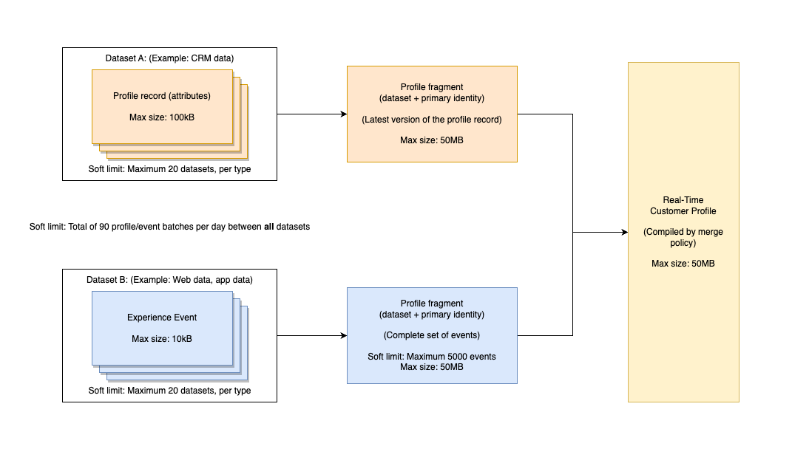

# [!DNL Real-Time Customer Profile] データとセグメント化の既定のガードレール

Adobe Experience Platformなら、リアルタイム顧客プロファイルの形式で、行動インサイトや顧客属性にもとづいて、パーソナライズされたクロスチャネル体験を提供できます。 プロファイルに対するこの新しいアプローチをサポートするために、Experience Platform では、従来のリレーショナルデータモデルとは異なる、高度に非正規化されたハイブリッドデータモデルを使用します。

>[!IMPORTANT]
>
>このガードレール ページに加えて、実際の使用制限について、セールスオーダーと対応する[製品説明](https://helpx.adobe.com/jp/legal/product-descriptions.html)のライセンス使用権限を確認してください。
>
>または、[ キャパシティサービス ](../landing/license-usage-and-guardrails/capacity.md)を使用して、ストリーミングスループットやその他の設定をExperience Platform内で監視および設定することもできます。

このドキュメントでは、最適なシステムパフォーマンスを得るためにプロファイルデータをモデル化する際に役立つ、デフォルトの使用方法とレートの制限について説明します。次のガードレールを確認する際は、データが正しくモデル化されていることが前提になっています。データのモデル化方法に関するご質問は、カスタマーサービス担当者にお問い合わせください。

>[!NOTE]
>
>ほとんどのお客様は、これらのデフォルトの上限を超えることはありません。カスタムの上限について詳しくは、カスタマーケア担当者にお問い合わせください。

## はじめに

次のExperience Platform サービスは、リアルタイム顧客プロファイルデータのモデリングに関連しています。

* [[!DNL Real-Time Customer Profile]](home.md)：複数のソースのデータを使用して、統合された消費者プロファイルを作成します。
* [ID](../identity-service/home.md):Experience Platformに取り込まれる、異なるデータソースからのBridge ID。
* [ スキーマ ](../xdm/home.md): Experience Data Model （XDM）スキーマは、Experience Platformが顧客体験データを整理する際に使用する標準化されたフレームワークです。
* [ オーディエンス ](../segmentation/home.md): Experience Platformのセグメンテーションエンジンは、顧客の行動と属性に基づいて、顧客プロファイルからオーディエンスを作成するために使用されます。

## 上限のタイプ

このドキュメントでは、次の 2 種類のデフォルトの上限について説明します。

| ガードレール型 | 説明 |
| -------------- | ----------- |
| **パフォーマンスガードレール （ソフト制限）** | パフォーマンスガードレールは、ユースケースの範囲に関連する使用制限です。 パフォーマンスのガードレールを超えると、パフォーマンスの低下や遅延が発生する場合があります。 Adobeはこのようなパフォーマンス低下の責任を負いません。 パフォーマンスのガードレールを常に超えているお客様は、パフォーマンスの低下を回避するために、追加の容量のライセンスを取得できます。 |
| **システムが適用するガードレール （ハード制限）** | システムによって適用されるガードレールは、Real-Time CDP UIまたはAPIによって適用されます。 UIとAPIによってブロックされたり、エラーが返されたりするため、これらの制限を超えることはできません。 |

{style="table-layout:auto"}

>[!NOTE]
>
>このドキュメントで概要を説明する上限は、常に改善されています。 定期的にアップデートを確認してください。カスタムの上限について知りたい場合は、カスタマーケア担当者にお問い合わせください。

## データモデルの上限

リアルタイム顧客プロファイルデータをモデル化する際には、次のガードレールが推奨されます。 プライマリエンティティとディメンションエンティティについて詳しくは、付録の[エンティティタイプ](#entity-types) に関する節を参照してください。

### プライマリエンティティのガードレール

| ガードレール | 上限 | 上限のタイプ | 説明 |
| --------- | ----- | ---------- | ----------- |
| XDM 個人プロファイルクラスのデータセット | 20 | パフォーマンスガードレール | XDM 個人プロファイルクラスを利用するデータセットは、最大 20 個を推奨します。 |
| XDM ExperienceEvent クラスデータセット | 20 | パフォーマンスガードレール | XDM ExperienceEvent クラスを利用するデータセットは、最大 20 個を推奨します。 |
| プロファイルに対して有効化された Adobe Analytics レポートスイートデータセット | 1 | パフォーマンスガードレール | プロファイルに対して有効化された Analytics レポートスイートデータセットは最大 1 つまでです。 プロファイルに対して複数の Analytics レポートスイートデータセットを有効にしようとすると、データ品質に意図しない結果が生じる可能性があります。 詳しくは、付録の [Adobe Analytics データセット](#aa-datasets)に関する節を参照してください。 |
| 複数エンティティの関係 | 5 | パフォーマンスガードレール | プライマリエンティティとディメンションエンティティの間に定義されるマルチエンティティの関係は、最大 5 個を推奨します。既存の関係が削除されるか無効になるまで、追加の関係マッピングは行わないでください。 |
| マルチエンティティ関係で使用する ID フィールドの JSON 深度 | 4 | パフォーマンスガードレール | 複数エンティティの関係で使用する ID フィールドの JSON 深度の推奨値は 4 です。 つまり、高度にネストされたスキーマでは、4 レベルを超える深度でネストされたフィールドを関係の ID フィールドとして使用しないでください。 |
| プロファイルフラグメント内の配列基数 | &lt;=500 | パフォーマンスガードレール | プロファイルフラグメントの最適な配列基数（時間に依存しないデータ）は 500 未満です。 |
| ExperienceEvent の配列基数 | &lt;=10 | パフォーマンスガードレール | ExperienceEvent（時系列データ）の最適な配列基数は 10 未満です。 |
| 個人プロファイル ID グラフの ID 数 | 50 | システム強制ガードレール | **個人プロファイル用 ID グラフの最大 ID 数は 50 です。** IDが50を超えるプロファイルは、セグメント化、書き出し、参照から除外されます。 詳しくは、[ID削除ロジックについて](../identity-service/guardrails.md#understanding-the-deletion-logic-when-an-identity-graph-at-capacity-is-updated)に関するガイドを参照してください。 |

{style="table-layout:auto"}

### ディメンションエンティティのガードレール

| ガードレール | 上限 | 上限のタイプ | 説明 |
| --------- | ----- | ---------- | ----------- |
| 非 [!DNL XDM Individual Profile] エンティティの時系列データは許可されていません | 0 | システム強制ガードレール | **時系列データは、プロファイルサービスの非 [!DNL XDM Individual Profile] エンティティには許可されていません。** 時系列データセットが [!DNL XDM Individual Profile] 以外の IDに関連付けられている場合、データセットを [!DNL Profile] に対して有効にしないでください。 |
| ネストされた関係がありません | 0 | パフォーマンスガードレール | 2 つの非 [!DNL XDM Individual Profile] スキーマ間に関係を作成しないでください。[!DNL Profile] 結合スキーマの一部ではないスキーマでは、関係を作成する機能は推奨されません。 |
| プライマリ ID フィールドの JSON 深度 | 4 | パフォーマンスガードレール | プライマリ ID フィールドに推奨される JSON 深度の上限は 4 です。 つまり、高度にネストされたスキーマでは、フィールドが 4 レベルを超える深度でネストされている場合、フィールドをプライマリ ID として選択しないでください。 4 番目のネストレベルにあるフィールドは、プライマリ ID として使用できます。 |

{style="table-layout:auto"}

## データサイズの上限

次のガードレールは、データサイズを参照し、意図したとおりに取り込み、保存し、クエリできるデータの推奨される上限を提供します。プライマリエンティティとディメンションエンティティについて詳しくは、付録の[エンティティタイプ](#entity-types)に関する節を参照してください。

>[!NOTE]
>
>データサイズは、取り込み時に JSON で非圧縮データとして測定されます。

### プライマリエンティティのガードレール

| ガードレール | 上限 | 上限のタイプ | 説明 |
| --------- | ----- | ---------- | ----------- |
| ExperienceEvent の最大サイズ | 10KB | システム強制ガードレール | **イベントの最大サイズは 10 KB です。** 取り込みは続行されますが、10 KB を超えるイベントは削除されます。 |
| 最大プロファイルレコードサイズ | 100KB | システム強制ガードレール | **プロファイルレコードの最大サイズは 100 KB です。** 取り込みは続行されますが、100 KB を超えるプロファイルレコードは削除されます。 |
| 最大プロファイルフラグメントサイズ | 50 MB | システム強制ガードレール | **単一のプロファイルフラグメントの最大サイズは 50 MB です。** セグメント化、書き出しおよびルックアップは、[プロファイルフラグメント](#profile-fragments)が 50 MB を超える場合、失敗することがあります。 |
| 最大プロファイルストレージサイズ | 50 MB | パフォーマンスガードレール | **保存されたプロファイルの最大サイズは 50 MB です。** 50 MB を超えるプロファイルに新しい[プロファイルフラグメント](#profile-fragments)を追加すると、システムのパフォーマンスに影響を与えます。例えば、プロファイルには 50 MB の単一のフラグメントを含めることも、複数のデータセットにわたる、合計サイズが 50 MB の複数のフラグメントを含めることもできます。 50 MB を超える単一のフラグメントを持つプロファイル、または合計サイズが 50 MB を超える複数のフラグメントを保存しようとすると、システムのパフォーマンスに影響を与えます。 |
| 1 日に取り込まれるプロファイルバッチまたは ExperienceEvent バッチの数 | 90 | パフォーマンスガードレール | **1 日に取り込まれるプロファイルバッチまたは ExperienceEvent バッチの最大数は 90 です。** つまり、1 日に取り込まれるプロファイルバッチと ExperienceEvent バッチを合わせた合計数は 90 を超えることはできないということです。追加のバッチを取り込むと、システムのパフォーマンスに影響します。 |
| プロファイルレコードあたりのExperienceEventsの数 | 5,000 | パフォーマンスガードレール | **プロファイルレコードあたりのExperienceEventsの最大数は5000です。5000件を超えるExperienceEventsを持つ**&#x200B;人のプロファイルは、セグメント化と共に使用する場合、**latest** 5000件のExperienceEventsのみを使用します。 |

{style="table-layout:auto"}

### ディメンションエンティティのガードレール

| ガードレール | 上限 | 上限のタイプ | 説明 |
| --------- | ----- | ---------- | ----------- |
| すべてのディメンションエンティティの合計サイズ | 5GB | パフォーマンスガードレール | すべてのディメンションエンティティの推奨合計サイズは 5 GB です。大きなディメンションエンティティの取り込みは、システムのパフォーマンスに影響を与える可能性があります。例えば、10 GB の製品カタログをディメンションエンティティとして読み込むことはお勧めしません。 |
| ディメンショナルエンティティスキーマごとのデータセット | 5 | パフォーマンスガードレール | 各ディメンショナルエンティティスキーマに関連付けるデータセットの数は、最大で 5 個にすることをお勧めします。 例えば、「products」のスキーマを作成し、関連する 5 個のデータセットを追加する場合、products スキーマに関連付けられる 6 個目のデータセットを作成しないでください。 |
| 1 日に取り込まれるディメンションエンティティバッチ | エンティティごとに 4 個 | パフォーマンスガードレール | 1 日に取り込まれるディメンションエンティティバッチの推奨最大数は、エンティティあたり 4 個です。 例えば、製品カタログのアップデートを 1 日に最大 4 回取り込むことができます。同じエンティティに対して追加のディメンションエンティティバッチを取り込むと、システムのパフォーマンスに影響を与える可能性があります。 |

{style="table-layout:auto"}

## セグメンテーションガードレール {#segmentation-guardrails}

このセクションで解説したガードレールでは、Experience Platform内で企業が構築できるオーディエンスの数と性質、およびオーディエンスと配信先のマッピングとアクティブ化について説明します。

| ガードレール | 上限 | 上限のタイプ | 説明 |
| --------- | ----- | ---------- | ----------- |
| サンドボックスあたりのオーディエンス | 4000 | パフォーマンスガードレール | 1つのサンドボックスにつき、最大4000人の&#x200B;**アクティブな** オーディエンスを設定できます。 各&#x200B;**個人** サンドボックスのオーディエンス数が4000未満である限り、組織ごとに4000を超えるオーディエンスを持つことができます。 これには、バッチオーディエンス、ストリーミングオーディエンス、エッジオーディエンスが含まれます。 追加のオーディエンスを作成しようとすると、システムのパフォーマンスに影響を与える可能性があります。 セグメントビルダーを使用した[ オーディエンスの作成](/help/segmentation/ui/segment-builder.md)の詳細をご確認ください。 |
| サンドボックスごとのEdge オーディエンス | 150 | パフォーマンスガードレール | 1つのサンドボックスにつき、最大150個の&#x200B;**アクティブ** エッジオーディエンスを設定できます。 各&#x200B;**個人** サンドボックスに150未満のエッジオーディエンスがある場合、組織ごとに150を超えるエッジオーディエンスを持つことができます。 追加のエッジオーディエンスを作成しようとすると、システムのパフォーマンスに影響を与える可能性があります。 [ エッジオーディエンス ](/help/segmentation/methods/edge-segmentation.md)の詳細をご覧ください。 |
| Edgeのスループットを向上 | 1500 RPS | パフォーマンスガードレール | Edgeのセグメンテーションでは、実稼動環境と開発環境のサンドボックス全体で、Adobe Experience Platform Edge Networkに1秒間に1500件のインバウンドイベントを入力するピーク値を組み合わせてサポートします。 Edgeのセグメント化では、インバウンドイベントがAdobe Experience Platform Edge Networkに入力された後、処理に最大350 ミリ秒かかる場合があります。 [ エッジオーディエンス ](/help/segmentation/methods/edge-segmentation.md)の詳細をご覧ください。 |
| サンドボックスごとのストリーミングオーディエンス | 500 | パフォーマンスガードレール | 1つのサンドボックスにつき、最大500人の&#x200B;**アクティブ** ストリーミングオーディエンスを設定できます。 各&#x200B;**個**&#x200B;のサンドボックス内にストリーミングオーディエンスが500未満である限り、組織ごとに500を超えるストリーミングオーディエンスを持つことができます。 これには、ストリーミングオーディエンスとエッジオーディエンスの両方が含まれます。 追加のストリーミングオーディエンスを作成しようとすると、システムのパフォーマンスに影響を与える可能性があります。 [ ストリーミングオーディエンス ](/help/segmentation/methods/streaming-segmentation.md)の詳細をご覧ください。 |
| あらゆるサンドボックスをまたいだストリーミングスループット | 1500 RPS | パフォーマンスガードレール | ストリーミングセグメンテーションでは、実稼動サンドボックスと開発サンドボックス全体で、1秒あたり1500件のインバウンドイベントを組み合わせてピーク値を設定できます。 ストリーミングセグメンテーションは、セグメントメンバーシップのプロファイルが認定されるまでに最大5分かかる場合があります。 [ ストリーミングオーディエンス ](/help/segmentation/methods/streaming-segmentation.md)の詳細をご覧ください。 |
| サンドボックスごとのバッチオーディエンス | 4000 | パフォーマンスガードレール | 1つのサンドボックスにつき、最大4000個の&#x200B;**アクティブ** バッチオーディエンスを設定できます。 各&#x200B;**個人** サンドボックスに4000未満のバッチオーディエンスがある限り、組織ごとに4000を超えるバッチオーディエンスを持つことができます。 追加のバッチオーディエンスを作成しようとすると、システムのパフォーマンスに影響を与える可能性があります。 |
| サンドボックスごとのアカウントオーディエンス | 50 | システム強制ガードレール | 1つのサンドボックスで最大50個のアカウントオーディエンスを作成できます。 サンドボックス内で50人のオーディエンスにリーチした後、新しいアカウントオーディエンスを作成しようとすると、**[!UICONTROL Create audience]** コントロールが無効になります。 [ アカウントオーディエンス ](/help/segmentation/types/account-audiences.md)の詳細をご覧ください。 |
| サンドボックスごとの公開済みコンポジション | 10 | パフォーマンスガードレール | サンドボックスには、最大10個の公開済みコンポジションを含めることができます。 [ オーディエンス構成について詳しくは、UI ガイド ](/help/segmentation/ui/audience-composition.md)を参照してください。 **注意**：連合オーディエンス構成で作成されたコンポジションは、このガードレールで&#x200B;**not** カウントされます。 |
| 最大オーディエンスサイズ | 30% | パフォーマンスガードレール | オーディエンスの推奨される最大メンバーシップは、システム内のプロファイルの合計数の30%です。 プロファイルの30%以上をメンバーとして、または複数の大規模なオーディエンスとして使用するオーディエンスを作成することは可能ですが、システムのパフォーマンスに影響します。 |
| 柔軟なオーディエンス評価の実行 | 年間50個（実稼動用サンドボックス）  年間100個（開発用サンドボックス） | システム強制ガードレール | **実稼動** サンドボックスごとに、年間で最大50回の柔軟なオーディエンス評価実行が可能です。 **開発** サンドボックスごとに、年間で最大100回の柔軟なオーディエンス評価実行が可能です。 |
| 柔軟なオーディエンス評価の実行 | 1日あたり2 | システム強制ガードレール | サンドボックスごとに1日あたり最大2回の実行が可能です。 |
| 柔軟なオーディエンス評価の実行あたりのオーディエンス数 | 20 | システム強制ガードレール | 柔軟なオーディエンス評価の実行ごとに、最大20個のオーディエンスを設定できます。 |
| B2B サンドボックスごとのセグメント定義 | 400 | パフォーマンスガード | 組織は、個々のB2B サンドボックスに400未満のセグメント定義がある限り、合計で400を超えるセグメント定義を持つことができます。 追加のセグメント定義を作成しようとすると、システムのパフォーマンスに影響を与える可能性があります。 詳しくは、[Real-Time Customer Data Platform B2B editionのデフォルトガードレール ](../rtcdp/b2b-guardrails.md)を参照してください。 |

{style="table-layout:auto"}

B2B固有のガードレールについて詳しくは、[Real-Time Customer Data Platform B2B editionのデフォルトガードレール ](../rtcdp/b2b-guardrails.md)のドキュメントを参照してください。

## 期待される可用性

次の節では、Real-Time CDPの宛先などのダウンストリームサービスにおけるオーディエンスおよび結合ポリシーの&#x200B;**expected**&#x200B;の可用性の概要を説明します。

| サンドボックスの種類 | 時間 |
| ------------ | ---- |
| 既存のサンドボックス | 1 時間 |
| 新しいサンドボックス | 2 時間 |
| サンドボックスを新たにリセット | 2 時間 |

{style="table-layout:auto"}

## 付録

このセクションでは、このドキュメントに記載の上限に関する追加の詳細を示します。

### エンティティタイプ

[!DNL Profile] ストアデータモデルは、[ プライマリエンティティ ](#primary-entity)と[ ディメンションエンティティ ](#dimension-entity)の2つのコアエンティティタイプで構成されています。

#### プライマリエンティティ

プライマリエンティティ（プロファイルエンティティ）は、データを結合して個人の「信頼できる唯一の情報源」を形成します。 この統合データは、「結合ビュー」と呼ばれるものを使用して表されます。統合ビューは、同じクラスを実装するすべてのスキーマのフィールドを、1 つの結合スキーマに集約します。[!DNL Real-Time Customer Profile] の結合スキーマは、すべてのプロファイル属性と行動イベントのコンテナとして機能する、非正規化されたハイブリッドデータモデルです。

時間に依存しない属性（「レコードデータ」とも呼ばれる）は、[!DNL XDM Individual Profile]、時系列データ（「イベントデータ」とも呼ばれる）は [!DNL XDM ExperienceEvent] を使用してモデル化されます。レコードと時系列データが Adobe Experience Platform に取り込まれると、[!DNL Real-Time Customer Profile] がトリガーされ、使用可能なデータの取り込みが開始されます。 取り込まれるインタラクションや詳細が多いほど、個人プロファイルは正確になります。

#### Dimension エンティティ

プロファイルデータを管理するプロファイルデータストアはリレーショナルストアではありませんが、Profileは、オーディエンスを簡素化して直感的な方法で作成するために、小さなディメンションエンティティとの統合を可能にします。 この統合は[ マルチエンティティ セグメンテーション ](../segmentation/tutorials/multi-entity-segmentation.md)と呼ばれます。

組織では、店舗、製品、資産など、個人以外のものを記述する XDM クラスを定義することもできます。 XDM Individual Profile クラス以外のXDM クラスを使用してモデル化されたこれらのスキーマは、「ディメンションエンティティ」（「ルックアップエンティティ」とも呼ばれます）と呼ばれ、時系列データを含みません。 ディメンション エンティティを表すスキーマは、[ スキーマ関係](../xdm/tutorials/relationship-ui.md)を使用してプロファイル エンティティにリンクされます。

ディメンションエンティティは、複数エンティティのセグメント定義を支援および簡素化するルックアップデータを提供します。また、セグメントエンジンが、処理の最適化（高速ポイントルックアップ）のためにデータセット全体をメモリに読み込めるようディメンションエンティティのサイズは小さくする必要があります。

### プロファイルフラグメント

このドキュメントでは、「プロファイルフラグメント」を参照するガードレールがいくつかあります。 Experience Platformでは、複数のプロファイルフラグメントを結合してリアルタイム顧客プロファイルを作成します。 各フラグメントは、一意のプライマリ ID と、特定のデータセット内でその ID に対応するレコードまたはイベントデータの完全なセットを表します。 プロファイルフラグメントについて詳しくは、[プロファイルの概要](home.md#profile-fragments-vs-merged-profiles)を参照してください。

### 結合ポリシー {#merge-policies}

複数のソースからデータを集約する場合、結合ポリシーは、データの優先順位付け方法と、統合ビューを作成するためにどのようなデータを組み合わせるかを決定するためにExperience Platformが使用するルールです。 例えば、顧客が複数のチャネルをまたがって自社のブランドとやり取りを行う場合、1 人の顧客に関連する複数のプロファイルフラグメントが複数のデータセットに表示されます。これらのフラグメントがExperience Platformに取り込まれると、それらのフラグメントが結合され、その顧客の単一のプロファイルが作成されます。 複数のソースのデータが競合する場合、結合ポリシーによって、個人のプロファイルに含める情報が決定されます。 `_xdm.context.profile` スキーマを使用する結合ポリシーは、サンドボックスごとに最大5つまで許可されます。 結合ポリシーについて詳しくは、[結合ポリシーの概要](merge-policies/overview.md)を参照してください。

### Experience PlatformのAdobe Analytics レポートスイートデータセット {#aa-datasets}

すべてのデータの競合が解決されている限り、プロファイルに対して複数のレポートスイートを有効にできます。 データ準備機能を使用して、eVar、リストおよび Prop 間でのデータの競合を解決できます。 データ準備機能の使用方法について詳しくは、[Adobe Analytics コネクタ UI ガイド](../sources/tutorials/ui/create/adobe-applications/analytics.md)を参照してください。

## 次の手順

その他のExperience Platform サービスのガードレール、エンドツーエンドの待ち時間に関する情報、Real-Time CDPの製品説明ドキュメントからのライセンス情報については、次のドキュメントを参照してください。

* [Real-Time CDPのガードレール](/help/rtcdp/guardrails/overview.md)
* 様々なExperience Platform サービスの[ エンドツーエンドの待ち時間ダイアグラム ](https://experienceleague.adobe.com/docs/blueprints-learn/architecture/architecture-overview/deployment/guardrails.html?lang=ja#end-to-end-latency-diagrams)。
* [Real-Time Customer Data Platform（B2C Edition - PrimeおよびUltimate パッケージ） ](https://helpx.adobe.com/jp/legal/product-descriptions/real-time-customer-data-platform-b2c-edition-prime-and-ultimate-packages.html)
* [Real-Time Customer Data Platform（B2P - PrimeおよびUltimate パッケージ） ](https://helpx.adobe.com/jp/legal/product-descriptions/real-time-customer-data-platform-b2p-edition-prime-and-ultimate-packages.html)
* [Real-Time Customer Data Platform（B2B - PrimeおよびUltimate パッケージ） ](https://helpx.adobe.com/jp/legal/product-descriptions/real-time-customer-data-platform-b2b-edition-prime-and-ultimate-packages.html)
