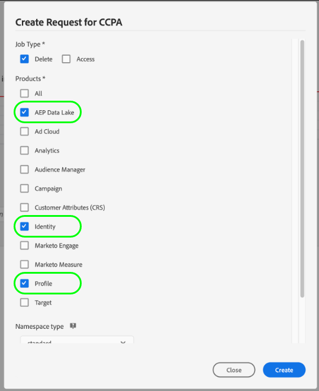
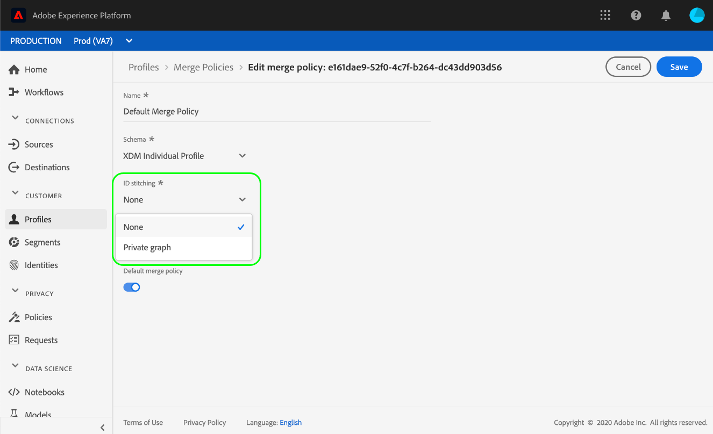

# [!DNL Real-Time Customer Profile] でのプライバシーリクエストの処理

Adobe Experience Platform [!DNL Privacy Service] は、EU 一般データ保護規則（GDPR）や [!DNL California Consumer Privacy Act]（CCPA）などのプライバシー規制に従って、個人データへのアクセス、販売のオプトアウト、または削除を求める顧客のリクエストを処理します。

このドキュメントでは、Adobe Experience Platform における [!DNL Real-Time Customer Profile] のプライバシーリクエスト処理に関する基本的な概念について説明します。

>[!NOTE]
>
>このガイドでは、Experience Platformのプロファイルデータストアに対してプライバシーリクエストを行う方法のみを説明します。 Experience Platform データレイクに対してもプライバシーリクエストを行う場合は、このチュートリアルに加えて、[&#x200B; データレイクでのプライバシーリクエスト処理](../catalog/privacy.md)に関するガイドを参照してください。
>
>他の Adobe Experience Cloud アプリケーションにプライバシーリクエストを送信する手順については、[Privacy Service のドキュメント](../privacy-service/experience-cloud-apps.md)を参照してください。

>[!IMPORTANT]
>
>このガイドのプライバシーリクエストでは、**not**&#x200B;がB2Bの個人を含まないエンティティをカバーしています。

## はじめに

このガイドでは、次の[!DNL Experience Platform] コンポーネントに関する実用的な理解が必要です。

* [[!DNL Privacy Service]](../privacy-service/home.md) ：Adobe Experience Cloud アプリケーションをまたいで、自身の個人データのアクセス、販売のオプトアウト、または削除に対する顧客リクエストを管理します。
* [[!DNL Identity Service]](../identity-service/home.md)：デバイスやシステムをまたいで ID を結び付けることで、顧客体験データの断片化によって発生する根本的な課題を解決します。
* [[!DNL Real-Time Customer Profile]](home.md)：複数のソースからの集計データに基づいて、統合されたリアルタイムの顧客プロファイルを提供します。

## ID 名前空間について {#namespaces}

Adobe Experience Platform [!DNL Identity Service] は、システムやデバイスをまたいで顧客 ID データを結び付けます。[!DNL Identity Service] は **ID 名前空間**&#x200B;を使用して、ID の値を元のシステムと関連付け、それらの値を識別するコンテキストを提供します。名前空間は、電子メールアドレス（「電子メール」）などの一般的な概念を表したり、IDをAdobe Advertising IDやAdobe Target IDなどの特定のアプリケーションに関連付けたりできます。

ID サービスは、グローバルに定義された（標準）ID およびユーザー定義の（カスタム）ID 名前空間を保持します。標準の名前空間はすべての組織（「電子メール」や「ECID」など）で使用できますが、組織は、特定のニーズに合わせてカスタム名前空間を作成することもできます。

[!DNL Experience Platform] の ID 名前空間について詳しくは、 [ID 名前空間の概要](../identity-service/features/namespaces.md)を参照してください。

## リクエストの送信 {#submit}

以下のセクションでは、[!DNL Privacy Service] の API または UI を使用して [!DNL Real-Time Customer Profile] に対しプライバシーリクエストを行う方法について概説しています。これらのセクションを読む前に、[Privacy Service API](../privacy-service/api/getting-started.md)または[Privacy Service UI](../privacy-service/ui/overview.md)のドキュメントを確認するか、確認する必要があります。 これらのドキュメントでは、リクエストペイロードで送信されたユーザーID データを適切にフォーマットする方法など、プライバシージョブの送信方法に関する完全な手順を説明します。

>[!IMPORTANT]
>
>Privacy Serviceは、ID ステッチを実行しない結合ポリシーを使用して[!DNL Profile] データのみを処理できます。 詳しくは、[結合ポリシーの制限](#merge-policy-limitations)の節を参照してください。
>
>プライバシー要求は規制要件の範囲内で非同期的に処理され、完了までにかかる時間は異なる場合があります。 リクエストの処理中に[!DNL Profile] データで変更が発生した場合、それらの受信レコードがそのリクエストでも処理されることが保証されません。 プライバシージョブが要求された時点でデータレイクまたはプロファイルストアに保持されているプロファイルのみが削除されることが保証されます。 削除ジョブ中に削除リクエストの件名に関連するプロファイルデータを取り込んだ場合、すべてのプロファイルフラグメントが削除されるとは限りません。
>削除リクエストの際に、Experience Platformまたはプロファイルサービスに入力されたデータは、レコードストアに挿入されるため、そのデータを認識する必要があります。 データの取り込みが削除された、または削除中である場合、慎重である必要があります。

### API の使用

API でジョブリクエストを作成する際は、`userIDs` 内で指定するいずれの ID に対しても固有の `namespace` および `type` を使用する必要があります。名前空間値には、ID サービスによって認識される有効な[ID名前空間](#namespaces)を指定する必要があります。 標準の名前空間には`standard`を使用し、カスタム名前空間には`custom`を使用します。

>[!NOTE]
>
>ID グラフと、Experience Platform データセットでのプロファイルフラグメントの配布方法に応じて、お客様ごとに複数のIDを指定する必要がある場合があります。 詳しくは、次の節[&#x200B; プロファイルフラグメント &#x200B;](#fragments)を参照してください。

さらに、リクエストペイロードの `include` 配列には、リクエスト対象である別のデータストアの製品値を含める必要があります。IDに関連付けられているプロファイルデータを削除するには、配列に値`ProfileService`を含める必要があります。 顧客のID グラフの関連付けを削除するには、配列に値`identity`を含める必要があります。

>[!NOTE]
>
>[配列内で](#profile-v-identity)と`ProfileService`を使用した効果について詳しくは、このドキュメントの後半の`identity` プロファイル要求とID要求`include`に関する節を参照してください。

次のリクエストは、[!DNL Profile] ストア内の1人の顧客のデータに対して新しいプライバシージョブを作成します。 2つのID値が`userIDs`配列の顧客に提供されます。1つは標準の`Email`ID名前空間を使用し、もう1つはカスタム `Customer_ID`名前空間を使用します。 また、[!DNL Profile]配列の`ProfileService` （`include`）の製品値も含まれます。

**リクエスト**

```shell
curl -X POST \
  https://platform.adobe.io/data/core/privacy/jobs \
  -H 'Authorization: Bearer {ACCESS_TOKEN}' \
  -H 'x-api-key: {API_KEY}' \
  -H 'x-gw-ims-org-id: {ORG_ID}' \
  -H 'Content-Type: application/json' \
  -d '{
    "companyContexts": [
      {
        "namespace": "imsOrgID",
        "value": "{ORG_ID}"
      }
    ],
    "users": [
      {
        "key": "user12345",
        "action": ["access","delete"],
        "userIDs": [
          {
            "namespace": "Email",
            "value": "ajones@acme.com",
            "type": "standard"
          },
          {
            "namespace": "Customer_ID",
            "value": "12345678",
            "type": "unregistered"
          }
        ]
      }
    ],
    "include": ["ProfileService","identity"],
    "expandIds": false,
    "priority": "normal",
    "regulation": "ccpa"
}'
```

>[!IMPORTANT]
>
>Experience Platformは、組織に属するすべての[&#x200B; サンドボックス &#x200B;](../sandboxes/home.md)にわたってプライバシーリクエストを処理します。 その結果、リクエストに含まれる `x-sandbox-name` ヘッダーはシステムによって無視されます。

**製品の応答**

プロファイルサービスの場合、プライバシージョブが完了すると、リクエストされたユーザーIDに関する情報を含むJSON形式で応答が返されます。

```json
{
    "privacyResponse": {
        "jobId": "7467850f-9698-11ed-8635-355435552164",
        "response": [
            {
                "sandbox": "prod",
                "mergePolicyId": "none",
                "result": {
                    "person": {
                        "gender": "female"           
                    },
                    "personalEmail": {
                        "address": "ajones@acme.com",
                    },
                    "identityMap": {
                        "crmid": [
                            {
                                "id": "5b7db37a-bc7a-46a2-a63e-2cfe7e1cc068"
                            }
                        ]
                    }
                }
            },
            {
                "sandbox": "prod",
                "mergePolicyId": "none",
                "result": {
                    "person": {
                        "gender": "male"
                    },
                    "id": 12345678,
                    "identityMap": {
                        "crmid": [
                            {
                                "id": "e9d439f2-f5e4-4790-ad67-b13dbd89d52e"
                            }
                        ]
                    }
                }
            }
        ]
    }
}
```

### UI の使用

UIでジョブリクエストを作成する場合は、データレイクまたは&#x200B;**[!UICONTROL AEP Data Lake]**&#x200B;に保存されているデータのジョブを処理するために、**[!UICONTROL Profile]**&#x200B;の下の&#x200B;**[!UICONTROL Products]**&#x200B;または[!DNL Real-Time Customer Profile]を必ず選択してください。

で「プロファイル」オプションが選択されている

## プライバシーリクエストのプロファイルフラグメント {#fragments}

[!DNL Profile] データストアでは、個人顧客の個人データは、多くの場合、ID グラフを介して個人に関連付けられた複数のプロファイルフラグメントで構成されます。 [!DNL Profile] ストアにプライバシーリクエストを行う場合、リクエストはプロファイル全体ではなく、プロファイルフラグメントレベルでのみ処理されることに注意することが重要です。

たとえば、顧客属性データを3つの別々のデータセットに保存し、そのデータを個々の顧客に関連付けるために異なる識別子を使用する場合を考えてみましょう。

| データセット名 | プライマリ ID フィールド | ストアド属性 |
| --- | --- | --- |
| データセット 1 | `customer_id` | `address` |
| データセット 2 | `email_id` | `firstName`, `lastName` |
| データセット 3 | `email_id` | `mlScore` |

データセットの1つは`customer_id`をプライマリ IDとして使用し、他の2つは`email_id`を使用します。 ユーザーID値として`email_id`のみを使用してプライバシーリクエスト（アクセスまたは削除）を送信する場合、`firstName`、`lastName`、`mlScore`属性のみが処理され、`address`は影響を受けません。

プライバシーリクエストがすべての関連する顧客属性を処理するように、これらの属性が保存される可能性のあるすべての該当データセットにプライマリ ID値を指定する必要があります（顧客ごとに最大9つのID）。 一般的にIDとしてマークされるフィールドについて詳しくは、[&#x200B; スキーマ構成の基本](../xdm/schema/composition.md#identity)のID フィールドに関する節を参照してください。

## リクエスト処理の削除 {#delete}

[!DNL Experience Platform] が [!DNL Privacy Service] から削除リクエストを受信すると、[!DNL Experience Platform] は、[!DNL Privacy Service] に対し、リクエストを受信し、影響を受けるデータが削除用にマークされている旨の確認を送信します。その後、プライバシージョブが完了すると、レコードが削除されます。

>[!IMPORTANT]
>
>プライバシー削除の要求は瞬時に行われるものではなく、関連するサービスやその他の影響を与える要因（地理的な場所など）によって異なります。 プライバシージョブの完了期間は15 ～ 45日の範囲で指定できますが、保証されていません。

プロファイル （`identity`）のプライバシーリクエストに製品としてID サービス （`aepDataLake`）とデータレイク （`ProfileService`）を含めるかどうかに応じて、プロファイルに関連する異なるデータセットがシステムから削除される可能性があります。

| 含まれている製品 | 効果 |
| --- | --- |
| `ProfileService`のみ | 削除リクエストが完了したことをPrivacy Serviceが確認すると、プロファイルはすぐに削除されたとみなされます。 ただし、プロファイルのID グラフは引き続き残り、同じIDを持つ新しいデータが取り込まれると、プロファイルを再構築できる可能性があります。 プロファイルに関連付けられた非個人データも、データレイクに残ります。 |
| `ProfileService` および `identity` | プロファイルと関連するID グラフは、Privacy Serviceが削除リクエストが完了した旨の確認を送信するとすぐに削除されます。 プロファイルに関連付けられた非個人データも、データレイクに残ります。 |
| `ProfileService` および `aepDataLake` | 削除リクエストが完了したことをPrivacy Serviceが確認すると、プロファイルはすぐに削除されます。 ただし、プロファイルのID グラフは引き続き残り、同じIDを持つ新しいデータが取り込まれると、プロファイルを再構築できる可能性があります。<br><br> データレイク製品がリクエストを受信し、現在処理中であると応答した場合、プロファイルに関連付けられたデータはソフト削除されるため、[!DNL Experience Platform] サービスからはアクセスできません。 ジョブが完了すると、データはデータレイクから完全に削除されます。 |
| `ProfileService`、`identity`、`aepDataLake` | プロファイルと関連するID グラフは、Privacy Serviceが削除リクエストが完了した旨の確認を送信するとすぐに削除されます。<br><br> データレイク製品がリクエストを受信し、現在処理中であると応答した場合、プロファイルに関連付けられたデータはソフト削除されるため、[!DNL Experience Platform] サービスからはアクセスできません。 ジョブが完了すると、データはデータレイクから完全に削除されます。 |

ジョブのステータスのトラッキングについて詳しくは、[[!DNL Privacy Service]  ドキュメント &#x200B;](../privacy-service/home.md#monitor)を参照してください。

### プロファイルリクエストとID リクエストの比較 {#profile-v-identity}

プロファイル （`ProfileService`）に対して削除リクエストが行われたが、ID サービス （`identity`）に対してではない場合、結果のジョブは、顧客（または顧客のセット）に対して収集された属性データを削除しますが、ID グラフで確立された関連付けは削除されません。

例えば、顧客の`email_id`と`customer_id`を使用する削除要求は、これらのIDに格納されているすべての属性データを削除します。 ただし、後で同じ`customer_id`に取り込まれたデータは、関連付けがまだ存在するため、適切な`email_id`に関連付けられます。

特定の顧客のプロファイルとすべてのID関連付けを削除するには、削除リクエストにProfileとIdentity Serviceの両方をターゲット製品として含めるようにします。

### 結合ポリシーの制限 {#merge-policy-limitations}

Privacy Serviceは、ID ステッチを実行しない結合ポリシーを使用して[!DNL Profile] データのみを処理できます。 UIを使用してプライバシー要求が処理されているかどうかを確認する場合は、**[!DNL None]**&#x200B;を[!UICONTROL ID stitching]型として含むポリシーを使用していることを確認してください。 つまり、[!UICONTROL ID stitching]が[!UICONTROL Private graph]に設定されている結合ポリシーを使用することはできません。

>に設定されています

## 次の手順

このドキュメントでは、[!DNL Experience Platform] におけるプライバシーリクエストの処理に関する重要な概念について説明します。ID データの管理方法とプライバシージョブの作成方法について理解を深めるには、このガイドに記載されているドキュメントを引き続きお読みください。

[!DNL Experience Platform]が使用していない[!DNL Profile]件のリソースに対するプライバシーリクエストの処理について詳しくは、[&#x200B; データレイクでのプライバシーリクエスト処理](../catalog/privacy.md)に関するドキュメントを参照してください。
