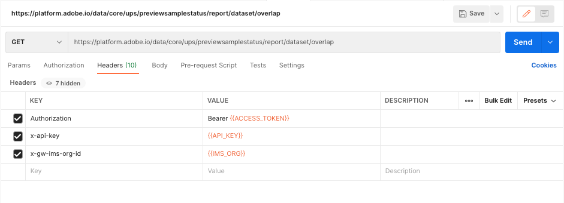

# データセットの重複レポートの生成

データセットの重複レポートは、組織の [!DNL Profile] を保存する必要があります。

このレポートは、データに関するインサイトを提供するだけでなく、特定のデータの有効期間を設定するなど、ライセンスの使用状況を最適化するアクションを実行するのに役立ちます。

このチュートリアルでは、 [!DNL Real-time Customer Profile] API を使用し、組織の結果を解釈します。

## はじめに

Adobe Experience Platform API を使用するには、まず [認証チュートリアル](https://experienceleague.adobe.com/docs/experience-platform/landing/platform-apis/api-authentication.html?lang=ja) を使用して、必要なヘッダーに必要な値を収集します。 Experience PlatformAPI について詳しくは、 [Platform API の概要ドキュメント](../../landing/api-guide.md).

このチュートリアルのすべての API 呼び出しに必要なヘッダーは次のとおりです。

* `Authorization: Bearer {ACCESS_TOKEN}`:この `Authorization` ヘッダーには、の前にが付いたアクセストークンが必要です `Bearer`. 新しいアクセストークンの値は、24 時間ごとに生成する必要があります。
* `x-api-key: {API_KEY}`:この `API Key` は、 `Client ID` とは、1 回だけ生成する必要がある値です。
* `x-gw-ims-org-id: {ORG_ID}`:この `IMS Org` は、 `Organization ID` 生成する必要があるのは 1 回のみです。

認証に関するチュートリアルを完了し、必要なヘッダーの値を収集したら、リアルタイム顧客 API への呼び出しを開始する準備が整いました。

## コマンドラインを使用してデータセットの重複レポートを生成する

コマンドラインの使用に慣れている場合は、次の cURL リクエストを使用して、 `/previewsamplestatus/report/dataset/overlap`.

**リクエスト**

次のリクエストでは、 `date` 指定した日付の最新のレポートを返すためのパラメーター。

```shell
curl -X GET \
  https://platform.adobe.io/data/core/ups/previewsamplestatus/report/dataset/overlap?date=2021-04-19 \
  -H 'Authorization: Bearer {ACCESS_TOKEN}' \
  -H 'x-api-key: {API_KEY}' \
  -H 'x-gw-ims-org-id: {ORG_ID}' \
```

| パラメーター | 説明 |
|---|---|
| `date` | 返されるレポートの日付を指定します。 その日に複数のレポートが実行された場合は、その日の最新のレポートが返されます。 指定した日付のレポートが存在しない場合は、HTTP ステータス 404（見つかりません）エラーが返されます。 日付が指定されていない場合は、最新のレポートが返されます。 形式：YYYY-MM-DD です。 例：`date=2024-12-31` |

**応答**

リクエストが成功すると、HTTP ステータス 200(OK) とデータセット重複レポートが返されます。 レポートには、 `data` オブジェクト。データセットのコンマ区切りリストとそれぞれのプロファイル数が含まれます。 レポートの読み取り方法について詳しくは、 [データセットの重複レポートデータの解釈](#interpret-the-report) このチュートリアルの後半で説明します。

```json
{
    "data": {
        "5d92921872831c163452edc8,5da7292579975918a851db57,5eb2cdc6fa3f9a18a7592a98": 123,
        "5d92921872831c163452edc8,5eb2cdc6fa3f9a18a7592a98": 454412,
        "5eeda0032af7bb19162172a7": 107
    },
    "reportTimestamp": "2021-04-19T19:55:31.147"
}
```

### Postmanを使用してデータセットの重複レポートを生成

Postmanは、API 開発の共同プラットフォームで、API 呼び出しの視覚化に役立ちます。 無料でからダウンロードできます。 [Postman Web サイト](https://www.postman.com) とは、API 呼び出しを実行するための使いやすい UI を提供します。 以下のスクリーンショットでは、Postmanインターフェイスを使用しています。

**リクエスト**

Postmanを使用してデータセット重複レポートをリクエストするには、次の手順を実行します。

* ドロップダウンを使用し、リクエストタイプとしてGETを選択します。
* 必要なヘッダーを `KEY` 列：
   * `Authorization`
   * `x-api-key`
   * `x-gw-ims-org-id`
* 認証時に生成した値を `VALUE` 列、中括弧 (`{{ }}`) と、中括弧内のコンテンツ。
* オプションを指定しても指定しないでリクエストパスを入力 `date` パラメーター：
   `https://platform.adobe.io/data/core/ups/previewsamplestatus/report/dataset/overlap`\
   or
   `https://platform.adobe.io/data/core/ups/previewsamplestatus/report/dataset/overlap?date=YYYY-MM-DD`

| パラメーター | 説明 |
|---|---|
| `date` | 返されるレポートの日付を指定します。 その日に複数のレポートが実行された場合は、その日の最新のレポートが返されます。 指定した日付のレポートが存在しない場合は、HTTP ステータス 404（見つかりません）エラーが返されます。 日付が指定されていない場合は、最新のレポートが返されます。 <br/>形式：YYYY-MM-DD です。 例：`date=2024-12-31` |

リクエストのタイプ、ヘッダー、値およびパスが完了したら、 **送信** をクリックして API リクエストを送信し、レポートを生成します。



**応答**

リクエストが成功すると、HTTP ステータス 200(OK) とデータセット重複レポートが返されます。 レポートには、 `data` オブジェクト。データセットのコンマ区切りリストとそれぞれのプロファイル数が含まれます。 レポートの読み取り方法について詳しくは、 [データセットの重複レポートデータの解釈](#interpret-the-report).


## データセットの重複レポートデータの解釈 {#interpret-the-report}

生成されたデータセット重複レポートには、レポートの日時を示すタイムスタンプと、データセット ID の一意の組み合わせをコンマ区切りリストとして含むデータオブジェクトが表示されます。 次の節では、レポートのコンポーネントに関する追加情報を示します。

### レポートのタイムスタンプ

この `reportTimestamp` は、API リクエストで指定された日付と一致します。日付が指定されていない場合は、最新のレポートのタイムスタンプに一致します。

### データセット ID のリスト

この `data` オブジェクトには、データセット ID の一意の組み合わせがコンマ区切りリストとして含まれ、その組み合わせに対する各プロファイル数が表示されます。

>[!NOTE]
>
>データセットの重複レポートの各行に関連付けられたすべてのプロファイル数の合計は、組織内のプロファイルの合計数と等しくする必要があります。

レポートの結果を解釈するには、次の例を考えてみましょう。

```json
  "5d92921872831c163452edc8,5da7292579975918a851db57,5eb2cdc6fa3f9a18a7592a98": 123,
  "5d92921872831c163452edc8,5eb2cdc6fa3f9a18a7592a98": 454412,
  "5eeda0032af7bb19162172a7": 107
```

このレポートには、次の情報が表示されます。

* 次のデータセットからのデータで構成される 123 個のプロファイルがあります。 `5d92921872831c163452edc8`, `5da7292579975918a851db57`, `5eb2cdc6fa3f9a18a7592a98`.
* 次の 2 つのデータセットからのデータで構成される 454,412 個のプロファイルがあります。 `5d92921872831c163452edc8` および `5eb2cdc6fa3f9a18a7592a98`.
* データセットのデータのみから構成される 107 個のプロファイルがあります `5eeda0032af7bb19162172a7`.
* 組織には、合計 454,642 個のプロファイルがあります。

## 次の手順

このチュートリアルを完了すると、リアルタイム顧客プロファイル API を使用してデータセットの重複レポートを生成できるようになります。 API とExperience PlatformUI の両方でのプロファイルデータの操作について詳しくは、まず [プロファイルの概要ドキュメント](../home.md).
