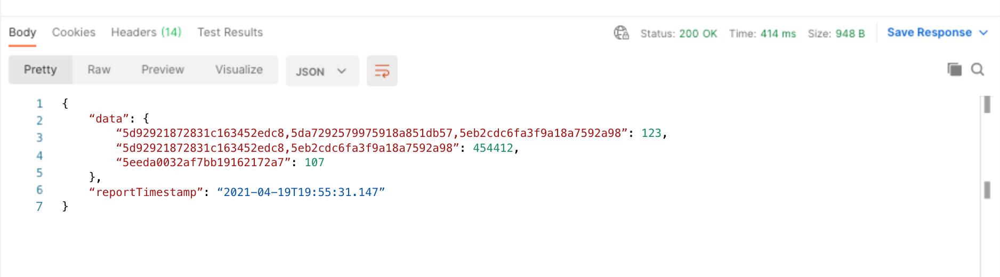

# データセットの重複レポートの生成

データセット重複レポートは、アドレス可能なオーディエンス（プロファイル）に最も寄与するデータセットを公開することで、組織の [!DNL Profile] ータストアの構成を可視化します。

このレポートは、データへのインサイトを提供するだけでなく、特定のデータの有効期限を設定するなど、ライセンスの使用を最適化するアクションを実行するのに役立ちます。

このチュートリアルでは、[!DNL Real-Time Customer Profile] API を使用してデータセット重複レポートを生成し、組織に合わせて結果を解釈するために必要な手順の概要を説明します。

## はじめに

Adobe Experience Platform API を使用するには、まず [ 認証チュートリアル ](https://experienceleague.adobe.com/docs/experience-platform/landing/platform-apis/api-authentication.html?lang=ja) を完了して、必要なヘッダーに必要な値を収集する必要があります。 Platform API について詳しくは、[Experience Platform API の概要ドキュメント ](../../landing/api-guide.md) を参照してください。

このチュートリアルのすべての API 呼び出しに必要なヘッダーは、次のとおりです。

* `Authorization: Bearer {ACCESS_TOKEN}`: `Authorization` ヘッダーには、先頭に `Bearer` という単語が付いたアクセストークンが必要です。 新しいアクセストークン値は、24 時間ごとに生成する必要があります。
* `x-api-key: {API_KEY}`:`API Key` は `Client ID` とも呼ばれ、1 回だけ生成する必要のある値です。
* `x-gw-ims-org-id: {ORG_ID}`：組織 ID は 1 回だけ生成する必要があります。

認証チュートリアルを完了し、必要なヘッダーの値を収集したら、リアルタイム顧客 API への呼び出しを開始する準備が整います。

## コマンドラインを使用したデータセット重複レポートの生成

コマンドラインの使用に精通している場合は、次の cURL リクエストを使用して、`/previewsamplestatus/report/dataset/overlap` にデータセットリクエストを実行することで、GETセット重複レポートを生成できます。

**リクエスト**

次のリクエストは、`date` パラメーターを使用して、指定された日付の最新のレポートを返します。

```shell
curl -X GET \
  https://platform.adobe.io/data/core/ups/previewsamplestatus/report/dataset/overlap?date=2021-04-19 \
  -H 'Authorization: Bearer {ACCESS_TOKEN}' \
  -H 'x-api-key: {API_KEY}' \
  -H 'x-gw-ims-org-id: {ORG_ID}' \
```

| パラメーター | 説明 |
|---|---|
| `date` | 返されるレポートの日付を指定します。 その日付に複数のレポートが実行された場合、その日付の最新のレポートが返されます。 指定した日付のレポートが存在しない場合は、HTTP ステータス 404 （見つかりません）エラーが返されます。 日付を指定しない場合は、最新のレポートが返されます。 形式：YYYY-MM-DD 例：`date=2024-12-31` |

**応答**

リクエストが成功すると、HTTP ステータス 200 （OK）とデータセット重複レポートが返されます。 レポートには、データセットとそれぞれのプロファイル数のコンマ区切りリストを含む `data` オブジェクトが含まれています。 レポートの読み方について詳しくは、このチュートリアルの後半の [ データセット重複レポートデータの解釈 ](#interpret-the-report) に関する節を参照してください。

```json
{
    "data": {
        "5d92921872831c163452edc8,5da7292579975918a851db57,5eb2cdc6fa3f9a18a7592a98": 123,
        "5d92921872831c163452edc8,5eb2cdc6fa3f9a18a7592a98": 454412,
        "5eeda0032af7bb19162172a7": 107
    },
    "reportTimestamp": "2021-04-19T19:55:31.147"
}
```

### Postmanを使用したデータセット重複レポートの生成

Postmanは、API 開発用の共同プラットフォームで、API 呼び出しを視覚化するのに役立ちます。 これは、[Postmanの web サイトから無料でダウンロードでき ](https://www.postman.com)API 呼び出しを実行するための使いやすい UI を提供します。 以下のスクリーンショットでは、Postman インターフェイスを使用しています。

**リクエスト**

Postmanを使用してデータセット重複レポートをリクエストするには、次の手順を実行します。

* ドロップダウンを使用して、リクエストタイプとして「GET」を選択します。
* `KEY` の列に必要なヘッダーを入力します。
   * `Authorization`
   * `x-api-key`
   * `x-gw-ims-org-id`
* 認証時に生成した値を `VALUE` 列に入力し、中括弧（`{{ }}`）と中括弧内のコンテンツを置き換えます。
* リクエストパスを入力します（オプションで `date` パラメーターを指定する場合と指定しない場合）。
  `https://platform.adobe.io/data/core/ups/previewsamplestatus/report/dataset/overlap`\
  または
  `https://platform.adobe.io/data/core/ups/previewsamplestatus/report/dataset/overlap?date=YYYY-MM-DD`

| パラメーター | 説明 |
|---|---|
| `date` | 返されるレポートの日付を指定します。 その日付に複数のレポートが実行された場合、その日付の最新のレポートが返されます。 指定した日付のレポートが存在しない場合は、HTTP ステータス 404 （見つかりません）エラーが返されます。 日付を指定しない場合は、最新のレポートが返されます。 <br/> 形式：YYYY-MM-DD 例：`date=2024-12-31` |

リクエストタイプ、ヘッダー、値、パスが完了したら、「**送信**」を選択して API リクエストを送信し、レポートを生成します。


**応答**

リクエストが成功すると、HTTP ステータス 200 （OK）とデータセット重複レポートが返されます。 レポートには、データセットとそれぞれのプロファイル数のコンマ区切りリストを含む `data` オブジェクトが含まれています。 レポートの読み方について詳しくは、[ データセット重複レポートデータの解釈 ](#interpret-the-report) の節を参照してください。



## データセット重複レポートデータの解釈 {#interpret-the-report}

生成されたデータセット重複レポートは、レポートの日時を示すタイムスタンプと、データセット ID の一意の組み合わせをコンマ区切りリストとして含むデータオブジェクトを提供します。 次のセクションでは、レポートのコンポーネントに関する追加情報を示します。

### レポートのタイムスタンプ

`reportTimestamp` は、API リクエストで指定された日付と一致します。日付が指定されていない場合は、最新のレポートのタイムスタンプと一致します。

### データセット ID のリスト

`data` オブジェクトには、データセット ID の一意の組み合わせが、そのデータセットの組み合わせに対する各プロファイル数とコンマ区切りリストとして含まれます。

>[!NOTE]
>
>データセット重複レポートの各行に関連付けられているプロファイル数の合計は、組織内のプロファイルの合計数と同じである必要があります。

レポートの結果を解釈するには、次の例を考えてみます。

```json
  "5d92921872831c163452edc8,5da7292579975918a851db57,5eb2cdc6fa3f9a18a7592a98": 123,
  "5d92921872831c163452edc8,5eb2cdc6fa3f9a18a7592a98": 454412,
  "5eeda0032af7bb19162172a7": 107
```

このレポートには、次の情報が表示されます。

* `5d92921872831c163452edc8`、`5da7292579975918a851db57`、`5eb2cdc6fa3f9a18a7592a98` のデータセットからのデータで構成される 123 のプロファイルがあります。
* `5d92921872831c163452edc8` と `5eb2cdc6fa3f9a18a7592a98` の 2 つのデータセットから得られるデータで構成されるプロファイルは 454,412 あります。
* データセット `5eeda0032af7bb19162172a7` のデータのみで構成されるプロファイルは 107 個あります。
* 組織内には合計 454,642 のプロファイルがあります。

## 次の手順

このチュートリアルを完了すると、リアルタイム顧客プロファイル API を使用してデータセット重複レポートを生成できるようになります。 API とExperience PlatformUI の両方でのプロファイルデータの操作について詳しくは、まず [ プロファイルの概要に関するドキュメント ](../home.md) をお読みください。
