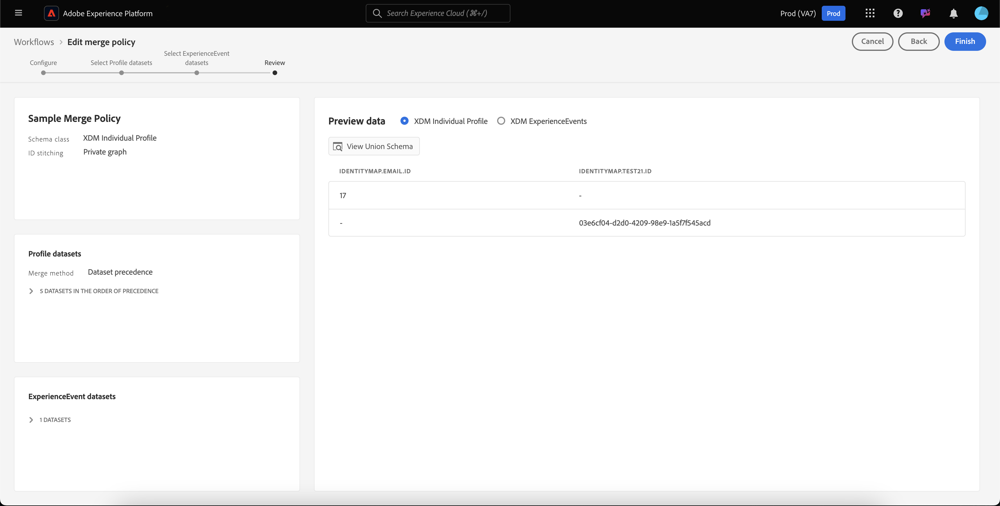

# Merge policies UIガイド

Adobe Experience Platformでは、複数のソースからデータフラグメントをまとめ、それらを組み合わせて、個々の顧客の完全な表示を確認できます。 このデータを統合する際、結合ポリシーは、[!DNL Platform]がデータの優先順位付け方法と統合データを決定する際に使用するルールです。統合表示を作成する際には、どのデータを結合するかを決定します。

例えば、顧客が複数のチャネルをまたがって自社のブランドとやり取りを行う場合、1人の顧客に関連する複数のプロファイルフラグメントが複数のデータセットに表示されます。 これらのフラグメントがPlatformに取り込まれると、それらのフラグメントが結合され、そのお客様用の単一のプロファイルが作成されます。 複数のソースからのデータが競合する場合(例えば、1つのフラグメントリストが顧客を「独身」、他のリストが「既婚」)、結合ポリシーによって個人のプロファイルに含める情報が決定されます。

RESTful API またはユーザーインターフェイスを介すると、新しい結合ポリシーの作成、既存のポリシーの管理、組織のデフォルトの結合ポリシーの設定をおこなえます。このガイドでは、Adobe Experience Platformユーザーインターフェイス(UI)を使用して結合ポリシーを操作する手順を順を追って説明します。

[!DNL Real-time Customer Profile] APIを使用して結合ポリシーを使用する場合は、[merge policies APIガイド](../api/merge-policies.md)に記載されている手順に従ってください。

## はじめに

このガイドでは、[!DNL Experience Platform]の重要な機能のいくつかについて、十分に理解しておく必要があります。 このガイドに従う前、またはプロファイルAPIを使用する前に、次のサービスのドキュメントを確認してください。

* [リアルタイム顧客プロファイル](../home.md)：複数のソースから集約されたデータに基づいて、統合されたリアルタイムのコンシューマープロファイルを提供します。
* [Adobe Experience Platform・アイデンティティ・サービス](../../identity-service/home.md):取り込まれる個別のデータソースからIDをブリッジし、リアルタイムの顧客プロファイルを有効に [!DNL Platform]します。
* [エクスペリエンスデータモデル（XDM）](../../xdm/home.md)[!DNL Platform]： が顧客エクスペリエンスデータを整理する際に使用する標準化されたフレームワーク。

## Mergeメソッド{#merge-methods}

各プロファイルフラグメントには、個々のIDが存在する可能性がある合計数の中で、1つのIDに関する情報が含まれます。 そのデータを結合して顧客プロファイルを形成する場合、その情報が競合し、優先順位を指定する必要があります。 結合方法を選択すると、データセット間で結合の競合が発生した場合に優先順位を付けるデータセット属性を指定できます。

マージポリシーには、2つのマージメソッドを使用できます。 各方法の詳細については、以下の節で説明します。

* **[!UICONTROL 順番に並べられたタイムスタンプ]：競合** がイベントした場合、最も新しく更新されたプロファイルフラグメントが優先されます。
   * **カスタムタイムスタンプ：** [!UICONTROL Timestamp ] Orderedも、同じデータセット（複数のID）内または複数のデータセット間でデータを結合する場合に、システムのタイムスタンプよりも優先されるカスタムタイムスタンプをサポートします。詳しくは、[カスタムタイムスタンプの使用](#custom-timestamps)の節を参照してください。
* **[!UICONTROL データセットの優先順位]：競合** をイベントする際に、プロファイルフラグメントの送信元のデータセットに基づいて、フラグメントを優先します。このオプションを選択する場合は、関連するデータセットと優先順位を選択する必要があります。

### {#timestamp-ordered}に並べられたタイムスタンプ

プロファイルレコードをExperience Platformに取り込むと、取り込み時にシステムタイムスタンプを取得し、記録に追加する。 マージポリシーのマージ方法として&#x200B;**[!UICONTROL 順序付けられたタイムスタンプ]**&#x200B;が選択されている場合、プロファイルはシステムのタイムスタンプに基づいてマージされます。 つまり、記録がプラットフォームに取り込まれた時のタイムスタンプに基づいて結合が行われます。

#### カスタムタイムスタンプの使用{#custom-timestamps}

場合によっては、カスタムタイムスタンプを指定し、マージポリシーでシステムタイムスタンプではなくカスタムタイムスタンプが適用される必要がある場合があります。 例えば、データのバックフィルや、レコードが不適切に取り込まれた場合のイベントの正しい順序の確保などがあります。

カスタムタイムスタンプを使用するには、**[!UICONTROL External Source System Audit Details]スキーマフィールドグループ**&#x200B;をプロファイルスキーマに追加する必要があります。 追加したカスタムタイムスタンプは、`lastUpdatedDate`フィールドを使用して入力できます。 `lastUpdatedDate`フィールドにデータを入力してレコードを取り込むと、Experience Platformはそのフィールドを使用して、データセット間のレコードの結合を行います。 `lastUpdatedDate`が存在しない場合、または入力されていない場合、プラットフォームは引き続きシステムタイムスタンプを使用します。

>[!NOTE]
>
>同じレコードに更新を取り込む場合は、`lastUpdatedDate`タイムスタンプが設定されていることを確認する必要があります。

次のスクリーンショットは、[!UICONTROL External Source System Audit Details]フィールドグループのフィールドを示しています。 プラットフォームUIを使用したスキーマの操作手順(スキーマにフィールドグループを追加する方法など)については、[UI](../../xdm/tutorials/create-schema-ui.md)を使用したスキーマ作成のチュートリアルを参照してください。

APIを使用してカスタムのタイムスタンプを操作するには、[merge policies endpoint guideのカスタムタイムスタンプ](../api/merge-policies.md#custom-timestamps)の使用に関するセクションを参照してください。

### データセットの優先順位 {#dataset-precedence}

結合ポリシーの結合方法として&#x200B;**[!UICONTROL データセットの優先順位]**&#x200B;が選択されている場合、プロファイルフラグメントの優先順位は、そのフラグメントの送信元のデータセットに基づいて決定できます。 例えば、あるデータセットに情報が存在し、他のデータセットのデータよりも優先度や信頼度が高い場合などに使用できます。

**[!UICONTROL データセットの優先順位]**&#x200B;を使用して結合ポリシーを作成するには、含めるプロファイルとExperienceEventデータセットを選択し、プロファイルデータセットを優先順位付けする必要があります。 データセットが選択されて順番が決まると、最上位のデータセット、2番目のデータセットは2番目に高い順に優先されます。

## [!UICONTROL IDの切り替え] {#id-stitching}

IDの切り替え（[!UICONTROL IDの切り替え]）は、データフラグメントを識別し、それらを組み合わせて完全なプロファイルレコードを形成するプロセスです。 ステッチの違いを理解するために、2つの異なる電子メールアドレスを使用してブランドとやり取りする1人の顧客を検討します。

* **[!UICONTROL なし]:** このオプションを選択すると、IDは関連付けられません。セグメント化が発生した場合、同じ人物に属するIDは関連付けられず、セグメント化では、顧客がセグメントのメンバーシップに適格かどうかを判断する際に、各個々のIDに付属する属性のみが考慮されます。 これにより、1人の顧客が複数のプロファイルを持ち、各プロファイルが異なるセグメントに振り分けられ、その結果、同じ顧客に複数のマーケティングメッセージが送信される可能性があります。
* **[!UICONTROL プライベートグラフ]：プライベートグラフを選択** すると、同じ個人に関連する複数のIDがまとめられます。これにより、お客様は単一のプロファイルを持つことになり、セグメントの資格を決定する際に、セグメントで複数の関連IDからの複数の属性を考慮できます。 このシナリオでは、顧客は単一のプロファイルを持ち、ID間の属性の組み合わせに基づいて1つのセグメントに適格となり、1つのマーケティングメッセージのみを受け取ることになります。

プロファイルとセグメントを生成する際のIDとその役割についての詳細は、[IDサービスの概要](../../identity-service/home.md)を読んでください。

## 既定の結合ポリシー{#default-merge-policy}

組織は、プロファイルフラグメントのマージ時に組織が使用するデフォルトのマージポリシーを作成できます。 これにより、Experience Platformでのアクション(顧客プロファイルの表示やセグメントの作成など)を実行する際に、デフォルトのポリシーを簡単に選択できます。 ほとんどの場合、別のマージポリシーを指定しない限り、デフォルトのマージポリシーが使用されます。

各組織は、1つのXDMスキーマクラスに関連する複数のマージポリシーを作成できますが、各クラスに対して宣言できるデフォルトのマージポリシーは1つだけです。 例えば、[!DNL XDM Individual Profile]クラスに関連するデフォルトのマージポリシーと、カスタムビルドの製品在庫クラスに別のデフォルトのマージポリシーを持つ組織があるとします。

新しい結合ポリシーを作成し、それをデフォルトに設定すると、以前の既定の結合ポリシーは自動的に更新され、既定の結合ポリシーから削除されます。

>[!WARNING]
>
>プロファイル数と、既存のデフォルトの結合ポリシーが関連付けられているセグメントが影響を受ける場合があります。 デフォルトの結合ポリシーが適用されているセグメントは、すべて新しいデフォルトの結合ポリシーに更新されます。

## 結合ポリシーの表示 {#view-merge-policies}

[!DNL Experience Platform] UI内で、左側のナビゲーションで「**[!UICONTROL プロファイル]**」を選択し、「**[!UICONTROL ポリシー]**&#x200B;を結合」タブを選択することで、結合ポリシーの操作を開始できます。 このタブには、組織の既存のすべてのマージポリシーのリストと、ポリシー名、マージポリシーがデフォルトのマージポリシーかどうか、およびマージポリシーが関連するスキーマクラスを含む各マージポリシーの詳細が含まれます。

表示する詳細を選択する場合、または表示する列を追加する場合は、**[!UICONTROL 列を設定]**&#x200B;を選択し、列名をクリックして表示に追加または削除します。

## 結合ポリシーの作成 {#create-a-merge-policy}

新しい結合ポリシーを作成するには、結合ポリシータブで&#x200B;**[!UICONTROL 結合ポリシー]**&#x200B;を作成を選択します。

**[!UICONTROL 新しい結合ポリシー]**&#x200B;ワークフロー画面で、一連のガイド付き手順を使用して、新しい結合ポリシーに関する重要な情報を指定できます。

### [!UICONTROL 設定] {#configure}

ワークフローの最初の手順では、基本情報を指定してマージポリシーを設定できます。 この情報には、次のものが含まれます。

* **[!UICONTROL 名前]**：結合ポリシーの名前は、説明的かつ簡潔にする必要があります。
* **[!UICONTROL スキーマクラス]**:マージポリシーに関連付けられているXDMスキーマクラスです。これは、このマージポリシーを作成するスキーマクラスを指定します。 組織は、スキーマクラスごとに複数のマージポリシーを作成できます。 現在、UIでは、[!UICONTROL XDM個別プロファイル]クラスのみが使用できます。 **[!UICONTROL 表示和集合スキーマ]**&#x200B;を選択して、スキーマクラスの和集合スキーマをプレビューできます。 詳しくは、[次の和集合スキーマ](#view-union-schema)の表示の節を参照してください。
* **[!UICONTROL ID ステッチ]**：このフィールドでは、顧客の関連 ID を特定する方法を定義します。詳しくは、このガイドの[IDの切り替え](#id-stitching)の節を参照してください。 次の 2 つの値を使用できます。
   * **[!UICONTROL なし]**：ID ステッチを実行しない。
   * **[!UICONTROL 非公開グラフ]**：非公開の ID グラフに基づいて ID ステッチを実行します。
* **[!UICONTROL 既定の結合ポリシー]**：組織のデフォルトとしてこの結合ポリシーを使用するかどうかを選択するトグルボタン。セレクターがオンに切り替えられると、組織の既定の結合ポリシーを変更するかどうかを確認する警告が表示されます。 詳しくは、このガイドの[デフォルトの結合ポリシー](#default-merge-policy)の節を参照してください。
   

必須フィールドの入力が完了したら、「**[!UICONTROL 次へ]**」を選択してワークフローを続行できます。

#### [!UICONTROL 表示和集合スキーマ] {#view-union-schema}

マージポリシーを作成または編集する場合、**[!UICONTROL 表示和集合スキーマ]**&#x200B;を選択して、選択したスキーマクラスの和集合スキーマを表示できます。

[!UICONTROL 表示和集合スキーマ]ダイアログが開き、和集合スキーマに関連付けられているすべての貢献スキーマ、ID、関係が表示されます。 このダイアログを使用して、和集合UIの[!UICONTROL 和集合]セクションのスキーマタブにある[!UICONTROL プロファイル]タブにアクセスするのと同じ方法でスキーマを調べることができます。

和集合スキーマに関する詳細は、[!UICONTROL 和集合スキーマ]タブや結合ポリシーの[!UICONTROL 表示和集合スキーマ]ダイアログでの対話方法など、和集合スキーマに関する情報を[UIガイド](union-schema.md)にご覧ください。

### [!UICONTROL プロファイルデータセットの選択] {#select-profile-datasets}

**[!UICONTROL プロファイルデータセットを選択]**&#x200B;画面で、マージポリシーに使用する&#x200B;**[!UICONTROL Mergeメソッド]**&#x200B;を選択する必要があります。 また、画面には、組織内で前の画面で選択したプロファイルクラスに関連付けられた[!UICONTROL スキーマデータセット]の合計数も表示されます。

選択した結合方法に応じて、すべてのプロファイルデータセットが最後に更新された順（タイムスタンプが並ぶ）に結合されます。または、結合ポリシーに含めるプロファイルデータセットと結合する順序（データセットの優先順位）を選択する必要があります。 マージメソッドの詳細については、このドキュメントで前述した[マージメソッド](#merge-methods)の節を参照してください。

#### {#timestamp-ordered-profile}に並べられたタイムスタンプ

**[!UICONTROL Timestamp ordered]**&#x200B;を結合方法として選択すると、最も新しく更新されたデータセットの属性が優先されます。 これは、すべてのプロファイルデータセットに適用されます。

#### データセットの優先順位 {#dataset-precedence-profile}

結合方法として&#x200B;**[!UICONTROL 「データセットの優先順位]**」を選択するには、プロファイルデータセットを選択し、手動で優先順位を設定する必要があります。 一覧に表示される各データセットには、最後に取り込まれたバッチのステータスも含まれます。また、そのデータセットにバッチが取り込まれていないことを示す通知も表示されます。

データセットリストから最大50個のデータセットを選択し、マージポリシーに含めることができます。 データセットを選択すると、データセットが&#x200B;**[!UICONTROL データセットを選択]**&#x200B;セクションに追加され、データセットをドラッグ&amp;ドロップして、希望の優先順位に従って並べ替えることができます。 データセットがリスト内で調整されると、データセットの横の序数（1、2、3など）が更新され、優先度が表示されます（1が最も高い優先度、2が順に表示されます）。

データセットを選択すると、**[!UICONTROL 和集合スキーマ]**&#x200B;セクションも更新され、各データセットがデータに寄与する和集合スキーマのフィールドが表示されます。 UIのビジュアライゼーションの操作方法など、和集合スキーマについて詳しくは、[和集合スキーマUIガイド](union-schema.md)を参照してください

### [!UICONTROL ExperienceEventデータセットの選択] {#select-experienceevent-datasets}

ワークフローの次の手順では、ExperienceEventデータセットを選択する必要があります。 この画面は、[[!UICONTROL プロファイルデータセットを選択]](#select-profile-datasets)画面で選択した結合方法の影響を受けます。

また、この画面には、マージポリシー設定画面で選択したスキーマクラスに関連付けられた組織が作成した&#x200B;**[!UICONTROL ExperienceEvent datasets]**&#x200B;の合計数も表示されます。

#### {#timestamp-ordered-experienceevent}に並べられたタイムスタンプ

プロファイルデータセットの結合方法として&#x200B;**[!UICONTROL 順序付きタイムスタンプ]**&#x200B;を選択した場合、最も新しく更新されたExperienceEventデータセットの属性もここで優先されます。

#### データセットの優先順位 {#dataset-precedence-experienceevent}

プロファイルデータセットの結合方法として&#x200B;**[!UICONTROL データセットの優先順位]**&#x200B;を選択した場合は、含めるExperienceEventデータセットを選択する必要があります。 データセットリストから最大50個のExperienceEventデータセットを選択できます。 データセットが選択されると、[!UICONTROL データセットを選択]セクションに表示されます。

ExperienceEventデータセットは、手動で並べ替えることはできません。同じプロファイルフラグメントに属する場合は、ExperienceEventデータセット内の属性がプロファイルデータセットに追加されます。

プロファイルデータセットの選択と同様に、ExperienceEventデータセットを選択すると、**[!UICONTROL 和集合スキーマ]**&#x200B;セクションも更新され、各データセットがデータを使用する和集合スキーマのフィールドが表示されます。 UIのビジュアライゼーションの操作方法など、和集合スキーマについて詳しくは、[和集合スキーマUIガイド](union-schema.md)を参照してください

### [!UICONTROL レビュー] {#review}

ワークフローの最後の手順は、マージポリシーを確認することです。 **[!UICONTROL レビュー]**&#x200B;画面には、新しいマージポリシーの名前、その名前が基になるスキーマクラス、選択した[!UICONTROL IDステッチ]オプション、マージポリシーに含まれるマージメソッドおよびデータセットが表示されます。 含まれるすべてのプロファイルデータセットまたはExperienceEventデータセットを表示するには、データセットの数を選択してドロップダウンリストを展開します。

マージポリシーを慎重に確認してから、「**[!UICONTROL 完了]**」を選択して作成ワークフローを完了してください。

#### {#timestamp-ordered-review}に並べられたタイムスタンプ

マージポリシーのマージ方法として&#x200B;**[!UICONTROL 順序付きタイムスタンプ]**&#x200B;を選択した場合、プロファイルデータセットのリストには、スキーマクラスに関連する組織が作成したすべてのデータセットがタイムスタンプの順に含まれます。 ExperienceEventデータセットのリストには、選択したスキーマクラス用に組織が作成したすべてのデータセットが含まれ、プロファイルデータセットに追加されます。

#### データセットの優先順位 {#dataset-precedence-review}

結合ポリシーの結合方法として&#x200B;**[!UICONTROL データセットの優先順位]**&#x200B;を選択した場合、プロファイルデータセットとExperienceEventデータセットのリストには、作成ワークフローで選択したプロファイルとExperienceEventデータセットのみが含まれます。 プロファイルデータセットの順序は、作成時に指定した優先順位と一致する必要があります。 表示されない場合は、「[!UICONTROL 戻る]」ボタンを使用して前のワークフローステップに戻り、優先度を調整します。

### 結合ポリシーのリスト{#updated-list}を更新しました

新しい結合ポリシーを作成するワークフローが完了すると、「**[!UICONTROL 結合ポリシー]**」タブに戻ります。 組織の結合ポリシーのリストには、作成した結合ポリシーが含まれる必要があります。

## 結合ポリシーの編集

「[!UICONTROL ポリシー]のマージ」タブから、編集するマージポリシーの&#x200B;**[!UICONTROL ポリシー名]**&#x200B;を選択して、[!DNL XDM Individual Profile]クラス用に作成した既存のマージポリシーを変更できます。

**[!UICONTROL 結合ポリシー]**&#x200B;を編集画面が表示されたら、名前と[!UICONTROL IDの切り替え]に変更を加えたり、このポリシーが組織のデフォルトの結合ポリシーかどうかを変更したりできます。

結合ポリシーのワークフローを続行するには、**[!UICONTROL 次へ]**&#x200B;を選択します。結合メソッドと結合ポリシーに含まれるデータセットが更新されます。

必要な変更を行ったら、マージポリシーを確認し、「**[!UICONTROL 完了]**」を選択して「**[!UICONTROL マージポリシー]**」タブに戻ります。

>[!WARNING]
>
>マージポリシーを変更すると、データの競合を解決する方法が変わるので、セグメント化とプロファイルの結果に影響を与える可能性があります。

## データガバナンスポリシー違反

結合ポリシーを作成または更新すると、結合ポリシーが組織で定義されたデータ使用ポリシーに違反しているかどうかを確認するチェックが実行されます。データ使用ポリシーはAdobe Experience Platform[!DNL Data Governance]の一部であり、特定の[!DNL Platform]データに対して実行を許可（制限）されるマーケティングアクションの種類を記述するルールです。 例えば、マージポリシーを使用してサードパーティの宛先に対してアクティブ化されたセグメントを作成し、組織でデータ使用ポリシーが設定されている場合、特定のデータをサードパーティにエクスポートできないと、マージポリシーを保存しようとすると&#x200B;**[!UICONTROL データ管理ポリシー違反が検出されます。]**

この通知には、違反したデータ使用ポリシーのリストが含まれ、リストから選択すると、違反の詳細を表示できます。違反ポリシーを選択すると、「**[!UICONTROL データ系列]**」タブに違反の理由と影響を受けるアクティベーションが表示され、それぞれのタブにデータ使用ポリシーの違反の詳細が示されます。

Adobe Experience Platform 内でのデータガバナンスの実行方法について詳しくは、まず[データガバナンスの概要](../../data-governance/home.md)を読んでください。

## 次の手順

組織の結合ポリシーを作成し、設定したら、それらを使用してプロファイル内の顧客プロファイルの表示を調整したり、プラットフォームデータからオーディエンスセグメントを作成したりできます。 [!DNL Experience Platform] UIとAPIを使用したセグメントの作成方法と使用方法について詳しくは、[セグメントの概要](../../segmentation/home.md)を参照してください。
