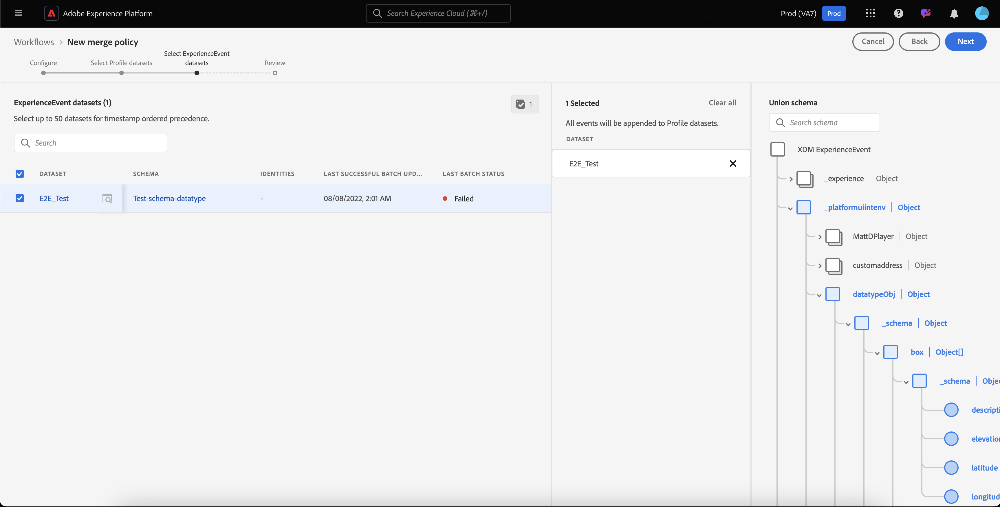

# Merge policies UIガイド

Adobe Experience Platformでは、複数のソースからデータフラグメントをまとめ、それらを組み合わせて、個々の顧客の完全な表示を確認できます。 When bringing this data together, merge policies are the rules that [!DNL Platform] uses to determine how data will be prioritized and what data will be combined to create that unified view.

例えば、顧客が複数のチャネルをまたがって自社のブランドとやり取りを行う場合、1人の顧客に関連する複数のプロファイルフラグメントが複数のデータセットに表示されます。 これらのフラグメントがPlatformに取り込まれると、それらのフラグメントが結合され、そのお客様用の単一のプロファイルが作成されます。 複数のソースからのデータが競合する場合(例えば、1つのフラグメントリストが顧客を「独身」、他のリストが「既婚」)、結合ポリシーによって個人のプロファイルに含める情報が決定されます。

RESTful API またはユーザーインターフェイスを介すると、新しい結合ポリシーの作成、既存のポリシーの管理、組織のデフォルトの結合ポリシーの設定をおこなえます。このガイドでは、Adobe Experience Platformユーザーインターフェイス(UI)を使用して結合ポリシーを操作する手順を順を追って説明します。

If you would prefer to work with merge policies using the [!DNL Real-time Customer Profile] API, please follow the instructions outlined in the [merge policies API guide](../api/merge-policies.md).

## はじめに

このガイドでは、いくつかの重要な [!DNL Experience Platform] 機能について、十分に理解している必要があります。 このガイドに従う前、またはプロファイルAPIを使用する前に、次のサービスのドキュメントを確認してください。

* [[!DNL Real-time Customer Profile]](../home.md):複数のソースからの集計データに基づいて、統合されたリアルタイムの消費者プロファイルを提供します。
* [Adobe Experience Platform・アイデンティティ・サービス](../../identity-service/home.md):取り込まれる個別のデータソースからIDをブリッジし、リアルタイムの顧客プロファイルを有効に [!DNL Platform]します。
* [[!DNL Experience Data Model] (XDM)](../../xdm/home.md):顧客体験データを [!DNL Platform] 整理する際に使用される標準化されたフレームワーク。

## Mergeメソッド {#merge-methods}

各プロファイルフラグメントには、個々のIDが存在する可能性がある合計数の中で、1つのIDに関する情報が含まれます。 そのデータを結合して顧客プロファイルを形成する場合、その情報が競合し、優先順位を指定する必要があります。 結合方法を選択すると、データセット間で結合の競合が発生した場合に優先順位を付けるデータセット属性を指定できます。

マージポリシーには、2つのマージメソッドを使用できます。 各方法の詳細については、以下の節で説明します。

* **[!UICONTROL 順番に並べられたタイムスタンプ]:** 競合がイベントすると、最近更新されたプロファイルフラグメントが優先されます。
   * **カスタムタイムスタンプ：**[!UICONTROL また、同じデータセット(複数のID] )内のデータを結合する場合やデータセットをまたがる場合に、システムのタイムスタンプよりも優先されるカスタムタイムスタンプもサポートされます。 詳しくは、カスタムタイムスタンプの [使用に関する節を参照してください](#custom-timestamps)。
* **[!UICONTROL データセットの優先順位]:** 競合をイベントする際、プロファイルフラグメントの到着元のデータセットに基づいて、そのフラグメントを優先します。 このオプションを選択する場合は、関連するデータセットと優先順位を選択する必要があります。

### 順序付きタイムスタンプ {#timestamp-ordered}

プロファイルレコードをExperience Platformに取り込むと、取り込み時にシステムタイムスタンプを取得し、記録に追加する。 マージポリシーのマージ方法として **[!UICONTROL 「順序付きタイムスタンプ]** 」を選択すると、プロファイルはシステムのタイムスタンプに基づいてマージされます。 つまり、記録がプラットフォームに取り込まれた時のタイムスタンプに基づいて結合が行われます。

#### カスタムタイムスタンプの使用 {#custom-timestamps}

場合によっては、カスタムタイムスタンプを指定し、マージポリシーでシステムタイムスタンプではなくカスタムタイムスタンプが適用される必要がある場合があります。 例えば、データのバックフィルや、レコードが不適切に取り込まれた場合のイベントの正しい順序の確保などがあります。

カスタムタイムスタンプを使用するには、 **[!UICONTROL External Source System Audit Details Mixinをプロファイルスキーマに追加する必要があります]** 。 追加したカスタムタイムスタンプは、この `lastUpdatedDate` フィールドを使用して入力できます。 フィールドに値が入力された状態でレコードを取り込むと、Experience Platformはその `lastUpdatedDate` フィールドを使用してデータセット間のレコードを結合します。 が存在しな `lastUpdatedDate` い場合、または入力されない場合、プラットフォームはシステムタイムスタンプを引き続き使用します。

>[!NOTE]
>
>同じレコードに更新を取り込む場合は、 `lastUpdatedDate` タイムスタンプを必ず入力してください。

次のスクリーンショットは、「 [!UICONTROL 外部ソースシステム監査詳細」ミックスインのフィールドを示しています]。 プラットフォームUIを使用してスキーマを操作する手順(スキーマにミックスインを追加する方法など)については、UIを使用したスキーマ作成の [チュートリアルを参照してください](../../xdm/tutorials/create-schema-ui.md)。

APIを使用してカスタムのタイムスタンプを操作するには、カスタムのタイムスタンプの使用に関する、 [マージポリシーエンドポイントのガイドセクションを参照してください](../api/merge-policies.md#custom-timestamps)。

### データセットの優先順位 {#dataset-precedence}

結合ポリシーの結合方法として **[!UICONTROL データセットの優先順位]** を選択すると、プロファイルフラグメントの優先順位を、そのフラグメントの送信元のデータセットに基づいて設定できます。 例えば、あるデータセットに情報が存在し、他のデータセットのデータよりも優先度や信頼度が高い場合などに使用できます。

データセットの優先順位を使用して結合ポリシーを作成するには、含める ****&#x200B;プロファイルとExperienceEventデータセットを選択し、プロファイルデータセットを優先順位に手動で並べ替える必要があります。 データセットが選択されて順番が決まると、最上位のデータセット、2番目のデータセットは2番目に高い順に優先されます。

## [!UICONTROL IDの切り替え] {#id-stitching}

IDの切り替え([!UICONTROL IDの切り替え])は、データフラグメントを識別し、それらを組み合わせて完全なプロファイルレコードを形成するプロセスです。 ステッチの違いを理解するために、2つの異なる電子メールアドレスを使用してブランドとやり取りする1人の顧客を検討します。

* **[!UICONTROL なし]:** このオプションを選択すると、IDは繋ぎ合わされません。 セグメント化が発生した場合、同じ人物に属するIDは関連付けられず、セグメント化では、顧客がセグメントのメンバーシップに適格かどうかを判断する際に、各個々のIDに付属する属性のみが考慮されます。 これにより、1人の顧客が複数のプロファイルを持ち、各プロファイルが異なるセグメントに振り分けられ、その結果、同じ顧客に複数のマーケティングメッセージが送信される可能性があります。
* **[!UICONTROL プライベートグラフ]:** プライベートグラフを選択すると、同じ個人に関連する複数のアイデンティティが繋ぎ合わされる。 これにより、お客様は単一のプロファイルを持つことになり、セグメントの資格を決定する際に、セグメントで複数の関連IDからの複数の属性を考慮できます。 このシナリオでは、顧客は単一のプロファイルを持ち、ID間の属性の組み合わせに基づいて1つのセグメントに適格となり、1つのマーケティングメッセージのみを受け取ることになります。

プロファイルとセグメントを生成する際のIDとその役割について詳しくは、 [IDサービスの概要を参照してください](../../identity-service/home.md)。

## 既定の結合ポリシー {#default-merge-policy}

組織は、プロファイルフラグメントのマージ時に組織が使用するデフォルトのマージポリシーを作成できます。 これにより、Experience Platformでのアクション(顧客プロファイルの表示やセグメントの作成など)を実行する際に、デフォルトのポリシーを簡単に選択できます。 ほとんどの場合、別のマージポリシーを指定しない限り、デフォルトのマージポリシーが使用されます。

各組織は、1つのXDMスキーマクラスに関連する複数のマージポリシーを作成できますが、各クラスに対して宣言できるデフォルトのマージポリシーは1つだけです。 例えば、組織で、クラスに関連するデフォルトのマージポリシーと、カスタムビルドの製品在庫クラスに関する別のデフォルトのマージポリシーを持つことがで [!DNL XDM Individual Profile] きます。

新しい結合ポリシーを作成し、それをデフォルトに設定すると、以前の既定の結合ポリシーは自動的に更新され、既定の結合ポリシーから削除されます。

>[!WARNING]
>
>プロファイル数と、既存のデフォルトの結合ポリシーが関連付けられているセグメントが影響を受ける場合があります。 デフォルトの結合ポリシーが適用されているセグメントは、すべて新しいデフォルトの結合ポリシーに更新されます。

## 結合ポリシーの表示 {#view-merge-policies}

UI内で、左側のナビゲーションで [!DNL Experience Platform] プロファイルを選択し **[!UICONTROL 、「]** Merge Policies **** 」タブを選択して、マージポリシーの操作を開始できます。 このタブには、組織の既存のすべてのマージポリシーのリストと、ポリシー名、マージポリシーがデフォルトのマージポリシーかどうか、およびマージポリシーが関連するスキーマクラスを含む各マージポリシーの詳細が含まれます。

To select which details are visible, or to add additional columns to the display, select **[!UICONTROL Configure columns]** and click on a column name to add or remove it from view.

## 結合ポリシーの作成 {#create-a-merge-policy}

新しい結合ポリシーを作成するには、「結合ポリシー」タブで **** 「結合ポリシーを作成」を選択します。

新しい結合ポリシーの **[!UICONTROL ワークフロー画面で]** 、一連のガイド付き手順を使用して、新しい結合ポリシーに関する重要な情報を指定できます。

### [!UICONTROL 設定] {#configure}

ワークフローの最初の手順では、基本情報を指定してマージポリシーを設定できます。 この情報には、次のものが含まれます。

* **[!UICONTROL 名前]**：結合ポリシーの名前は、説明的かつ簡潔にする必要があります。
* **[!UICONTROL スキーマクラス]**:マージポリシーに関連付けられているXDMスキーマクラスです。 これは、このマージポリシーを作成するスキーマクラスを指定します。 組織は、スキーマクラスごとに複数のマージポリシーを作成できます。 現在、UIでは [!UICONTROL XDM Individualプロファイル] ・クラスのみを使用できます。
* **[!UICONTROL ID ステッチ]**：このフィールドでは、顧客の関連 ID を特定する方法を定義します。詳しくは、このガイドの [IDの切り替え](#id-stitching) （英語）の節を参照してください。 次の 2 つの値を使用できます。
   * **[!UICONTROL なし]**：ID ステッチを実行しない。
   * **[!UICONTROL 非公開グラフ]**：非公開の ID グラフに基づいて ID ステッチを実行します。
* **[!UICONTROL 既定の結合ポリシー]**：組織のデフォルトとしてこの結合ポリシーを使用するかどうかを選択するトグルボタン。セレクターがオンに切り替えられると、組織の既定の結合ポリシーを変更するかどうかを確認する警告が表示されます。 詳しくは、このガイドで前述した [デフォルトの結合ポリシーの節を参照してください](#default-merge-policy) 。
   

必須フィールドに入力が完了したら、「 **[!UICONTROL 次へ]** 」を選択してワークフローを続行できます。

### [!UICONTROL プロファイルデータセットの選択] {#select-profile-datasets}

[ **[!UICONTROL プロファイルデータセットの]** 選択 **画面で、マージポリシーに使用する]** Mergeメソッドを選択する必要があります。 また、画面には、前の画面で選択した [!UICONTROL プロファイルクラスに関連付けられた、組織内の] スキーマデータセットの合計数も表示されます。

選択した結合方法に応じて、すべてのプロファイルデータセットが最後に更新された順（タイムスタンプが並ぶ）に結合されます。または、結合ポリシーに含めるプロファイルデータセットと結合する順序（データセットの優先順位）を選択する必要があります。 マージメソッドの詳細については、このドキュメントで前述した [マージメソッド](#merge-methods) の節を参照してください。

#### 順序付きタイムスタンプ {#timestamp-ordered-profile}

マージ方法として「 **[!UICONTROL タイムスタンプが並べ替えられた」を選択すると]** 、最も新しく更新されたデータセットの属性が優先されます。 これは、すべてのプロファイルデータセットに適用されます。

#### データセットの優先順位 {#dataset-precedence-profile}

結合方式で **[!UICONTROL 「]** データセットの優先順位」を選択する場合は、プロファイルデータセットを選択し、手動で優先順位を付ける必要があります。 データセットリストから最大50個のデータセットを選択できます。 データセットを選択すると、データセットが画面の右側に表示され、データセットをドラッグ&amp;ドロップして並べ替えることができます。 データセットがリスト内で調整されると、データセットの横の序数（1、2、3など）が更新され、優先度が表示されます（1が最も高い優先度、2が順に表示されます）。

### [!UICONTROL ExperienceEventデータセットの選択] {#select-experienceevent-datasets}

ワークフローの次の手順では、ExperienceEventデータセットを選択する必要があります。 この画面は、[プロファイルデータセットの [[!UICONTROL 選択]](#select-profile-datasets) ]画面で選択したマージ方法の影響を受けます。

また、この画面には、マージポリシー設定画面で選択した **[!UICONTROL スキーマクラスに関連して組織が作成したExperienceEventデータセット]** の合計数も表示されます。

#### 順序付きタイムスタンプ {#timestamp-ordered-experienceevent}

プロファイルデータセットの結合方法として **[!UICONTROL 「Timestamp ordered]** 」を選択した場合は、最も新しく更新されたExperienceEventデータセットの属性もここで優先されます。

#### データセットの優先順位 {#dataset-precedence-experienceevent}

プロファイルデータセットの結合方法として **[!UICONTROL 「データセットの優先順位]** 」を選択した場合は、含めるExperienceEventデータセットを選択する必要があります。 データセットリストから最大50個のExperienceEventデータセットを選択できます。 データセットを選択すると、データセットは画面の右側に表示されます。 ExperienceEventデータセットは、手動で並べ替えることはできません。同じプロファイルフラグメントに属する場合は、ExperienceEventデータセット内の属性がプロファイルデータセットに追加されます。

### [!UICONTROL レビュー] {#review}

ワークフローの最後の手順は、マージポリシーを確認することです。 [ **[!UICONTROL レビュー]** ]画面には、新しいマージポリシーの名前、その名前が基になるスキーマクラス、選択した [!UICONTROL IDステッチ] (ID Stitching)オプション、マージポリシーに含まれるマージメソッド、データセットが表示されます。 含まれるすべてのプロファイルデータセットまたはExperienceEventデータセットを表示するには、データセットの数を選択してドロップダウンリストを展開します。

[ **[!UICONTROL 完了]** ]を選択して作成ワークフローを完了する前に、マージポリシーを十分に確認してください。

#### 順序付きタイムスタンプ {#timestamp-ordered-review}

マージポリシーのマージ方法として **[!UICONTROL 「Timestamp ordered]** 」を選択した場合、プロファイルデータセットのリストには、スキーマクラスに関連する組織が作成したデータセットがすべてタイムスタンプの順に含まれます。 ExperienceEventデータセットのリストには、選択したスキーマクラス用に組織が作成したすべてのデータセットが含まれ、プロファイルデータセットに追加されます。

#### データセットの優先順位 {#dataset-precedence-review}

結合ポリシーの結合方法として **[!UICONTROL データセットの優先順位]** (Dataset precedence)を選択した場合、プロファイルデータセットとExperienceEventデータセットには、作成ワークフローで選択したプロファイルとExperienceEventデータセットのみが含まれます。 プロファイルデータセットの順序は、作成時に指定した優先順位と一致する必要があります。 表示されない場合は、 [!UICONTROL 戻る] ボタンを使用して前のワークフローの手順に戻り、優先度を調整します。

### 結合ポリシーのリストの更新 {#updated-list}

新しい結合ポリシーを作成するワークフローが完了すると、「 **[!UICONTROL 結合ポリシー]** 」タブに戻ります。 組織の結合ポリシーのリストには、作成した結合ポリシーが含まれる必要があります。

## 結合ポリシーの編集

「 [!UICONTROL Merge Policies] 」タブから、編集するマージポリシーの [!DNL XDM Individual Profile] Policy名 **** を選択して、クラスに対して作成された既存のマージポリシーを変更できます。

When the **[!UICONTROL Edit merge policy]** screen appears, you can make changes to the name and [!UICONTROL ID stitching], as well as change whether or not this policy is the default merge policy for your organization.

[ **[!UICONTROL 次へ]** ]を選択すると、マージポリシーのワークフローに進み、マージメソッドとマージポリシーに含まれるデータセットを更新します。

必要な変更を行ったら、マージポリシーを確認し、 **[!UICONTROL 「完了]** 」を選択して「 **[!UICONTROL マージポリシー]** 」タブに戻ります。

>[!WARNING]
>
>マージポリシーを変更すると、データの競合を解決する方法が変わるので、セグメント化とプロファイルの結果に影響を与える可能性があります。

## データガバナンスポリシー違反

結合ポリシーを作成または更新すると、結合ポリシーが組織で定義されたデータ使用ポリシーに違反しているかどうかを確認するチェックが実行されます。Data usage policies are part of Adobe Experience Platform [!DNL Data Governance] and are rules that describe the kinds of marketing actions that you are allowed to, or restricted from, performing on specific [!DNL Platform] data. For example, if a merge policy was used to create a segment that activated to a third-party destination, and your organization had a data usage policy preventing the export of specific data to third parties, you would receive a **[!UICONTROL Data governance policy violation detected]** notification when attempting to save your merge policy.

この通知には、違反したデータ使用ポリシーのリストが含まれ、リストから選択すると、違反の詳細を表示できます。Upon selecting a violated policy, the **[!UICONTROL Data lineage]** tab provides the reason for the violation and the affected activations, each providing more detail into how the data usage policy has been violated.

Adobe Experience Platform 内でのデータガバナンスの実行方法について詳しくは、まず[データガバナンスの概要](../../data-governance/home.md)を読んでください。

## 次の手順

組織の結合ポリシーを作成し、設定したら、それらを使用してプロファイル内の顧客プロファイルの表示を調整したり、プラットフォームデータからオーディエンスセグメントを作成したりできます。 See the [Segmentation overview](../../segmentation/home.md) for more information on how to create and work with segments using the [!DNL Experience Platform] UI and APIs.