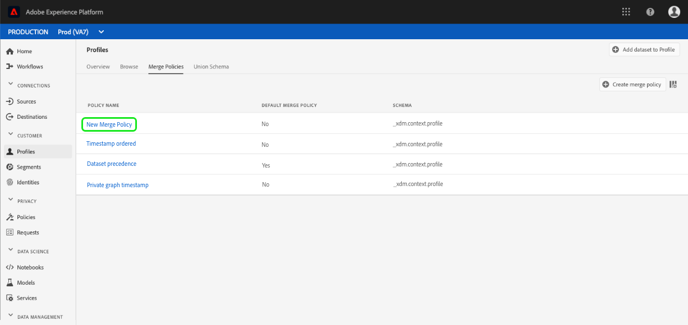

# Merge policiesユーザーガイド

Adobe Experience Platformを使用すると、複数のソースからデータを統合し、それを組み合わせて、個々の顧客の完全な表示を確認できます。 このデータを統合する場合、統合ポリシーは、データの優先順位付け方法と、統合されたビューを作成するためにどのデータを組み合わせるかを決定するためにプラットフォームで使用されるルールです。

RESTful APIまたはユーザーインターフェイスを使用して、新しい結合ポリシーを作成し、既存のポリシーを管理し、組織のデフォルトの結合ポリシーを設定できます。 このガイドでは、Adobe Experience Platformユーザーインターフェイスを使用して結合ポリシーを操作する手順を順を追って説明します。

リアルタイム顧客プロファイルAPIを使用してマージポリシーを使用する場合は、 [マージポリシーAPIチュートリアルで説明されている手順に従ってください](../api/merge-policies.md)。

## はじめに

このガイドでは、結合ポリシーに関連する様々なExperience Platformサービスについて、十分に理解している必要があります。 このチュートリアルを開始する前に、次のサービスのドキュメントを確認してください。

* [リアルタイム顧客プロファイル](../home.md): 複数のソースからの集計データに基づいて、統合されたリアルタイムの消費者プロファイルを提供します。
* [IDサービス](../../identity-service/home.md): プラットフォームに取り込まれる個別のデータソースからIDをブリッジすることで、リアルタイムの顧客プロファイルを有効にします。
* [Experience Data Model(XDM)](../../xdm/home.md): プラットフォームが顧客体験データを編成する際に使用する標準化されたフレームワーク。

## 表示結合ポリシー

Experience Platformユーザーインターフェイス内で、結合ポリシーの操作を開始し、左側のパネルの **プロファイルをクリックし、「** 結合ポリシー **** 」タブを選択して、組織の既存の結合ポリシーのリストを確認できます。

組織で使用できる各マージポリシーの詳細は、「 *ポリシー名*」、「 *デフォルトのマージポリシー*」、「 **&#x200B;スキーマ」など、ランディングページに表示されます。

表示する詳細を選択する場合、または表示する列を追加する場合は、右側の列選択アイコンを選択し、列名をクリックして表示に追加または削除します。

## マージポリシーの作成

新しい結合ポリシーを作成するには、「 **結合ポリシー** 」タブの右上近くにある **** 「結合ポリシーを作成」をクリックします。

[ **マージポリシーの** 作成]画面が表示され、新しいマージポリシーに関する重要な情報を指定できます。

* **名前**: マージポリシーの名前は、説明的で簡潔な名前にする必要があります。
* **スキーマ**: マージポリシーに関連付けられているスキーマです。 これは、このマージポリシーを作成するXDMスキーマを指定します。 組織は、スキーマごとに複数の結合ポリシーを作成できます。
* **IDの切り替え**: このフィールドでは、顧客の関連IDを決定する方法を定義します。 次の2つの値を指定できます。
   * **なし**: IDの切り替えを実行しません。
   * **プライベートグラフ**: プライベートIDグラフに基づいてIDの切り替えを実行します。
* **属性の結合**: プロファイルフラグメントとは、個々の顧客に存在するIDのリストのうち、1つのIDに対するプロファイル情報のことです。 使用するIDグラフのタイプが複数のIDになる場合、プロファイルのプロパティ値と優先度が競合する可能性があります。 「 *属性の結合* 」を使用すると、結合の競合が発生した場合に優先順位を付けるデータセットプロファイルの値を指定できます。 次の2つの値を指定できます。
   * **順番に並べられたタイムスタンプ**: 競合が発生した場合は、最近更新されたプロファイルを優先します。
   * **データセットの優先順位** : プロファイルフラグメントの送信元のデータセットに基づいて、そのフラグメントを優先します。 このオプションを選択する場合は、関連するデータセットと優先順位を選択する必要があります。 詳しくは、以下に示す [データセットの優先順位の詳細を参照してください](#dataset-precedence) 。
* **既定の結合ポリシー**: 組織でこのマージポリシーをデフォルトにするかどうかを選択するトグルボタン。 セレクターをオンにして新しいポリシーを保存すると、以前のデフォルトポリシーが自動的に更新され、デフォルトのポリシーが無効になります。

### データセットの優先順位 {#dataset-precedence}

「 *属性の結合* 」の値を選択する場合は、「 *データセットの優先順位* 」を選択できます。この優先順位を使用すると、プロファイルフラグメントの送信元のデータセットに基づいて、データセットフラグメントを優先できます。

使用例としては、あるデータセットに情報が存在し、他のデータセットのデータよりも望ましい情報や信頼されている情報が組織にある場合が考えられます。

「 *データセットの優先順位*」を選択すると、別のパネルが開き、含めるデータセットを「 *使用可能なデータセット* 」から選択する（またはチェックボックスを使用してすべて選択する）必要があります。 次に、これらのデータセットを *Selected Datasets* パネルにドラッグ&amp;ドロップし、優先順位の正しい順序にドラッグします。 最上位のデータセットには最も高い優先順位が付けられ、次に2番目のデータセットには2番目に高い順に並びます。

結合ポリシーの作成が完了したら、 **「保存** 」をクリックして *「* 結合ポリシー」タブに戻り、新しい結合ポリシーがポリシーのリストに表示されます。

## マージポリシーの編集

既存のマージポリシーを変更するには、編集するマージポリシーの「ポリシー名 ** 」をクリックして、「 *マージポリシー* 」タブを使用します。

[ *Edit merge policy* ]画面が表示されたら、 *名前*, ID *スキーマ*, ID ****** ID stiting type merge属性，ステッチングタイプ，ステッチングタイプ，このポリシーを組織のデフォルトの統合ポリシーにするかどうかを選択できます。

>[!N注意]
>編集画面の上部に表示されるマージポリシーIDは編集できません。 これは、変更できない読み取り専用の、システム生成IDです。

必要な変更を行った後、 **「保存** 」をクリックして「 *マージポリシー* 」タブに戻ります。このタブに戻り、更新されたマージポリシー情報が表示されます。

## データ管理ポリシーの違反

結合ポリシーを作成または更新するときに、結合ポリシーが組織で定義されたデータ使用ポリシーに違反しているかどうかを確認するチェックが実行されます。 データ使用ポリシーは、Adobe Experience Platform Data Governanceの一部で、特定のプラットフォームデータに対して実行を許可または制限されるマーケティングアクションの種類を記述するルールです。 例えば、マージポリシーを使用して、サードパーティの宛先に対してアクティブ化されたセグメントを作成し、組織でデータ使用ポリシーが設定されている場合、特定のデータをサードパーティにエクスポートできないと、マージポリシーを保存しようとすると、「データ管理ポリシー違反が検出されます。

この通知には、リストされたデータ使用ポリシーのリストが含まれ、違反の詳細を表示するには、違反の詳細を違反から選択します。 違反ポリシーを選択すると、「 *Data lineage* ( *データ系列* )」タブに「違反の *理由」と「*&#x200B;影響を受けるアクティベーション」が表示され、それぞれのデータ使用ポリシーの違反の詳細が示されます。

Adobe Experience Platformでのデータガバナンスの実施方法について詳しくは、 [Data Governanceの概要を読んでください](../../data-governance/home.md)。

## 次の手順

これで、IMS組織のマージポリシーを作成し、設定したので、それらを使用してプロファイルデータからオーディエンスセグメントを作成できます。 エクスペリエンスプラットフォームを使用したセグメントの作成方法と使用方法について詳しくは、 [セグメントの概要](../../segmentation/home.md) （英語）を参照してください。