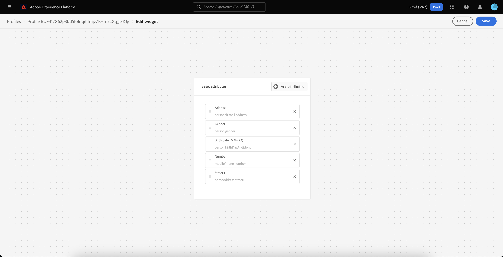
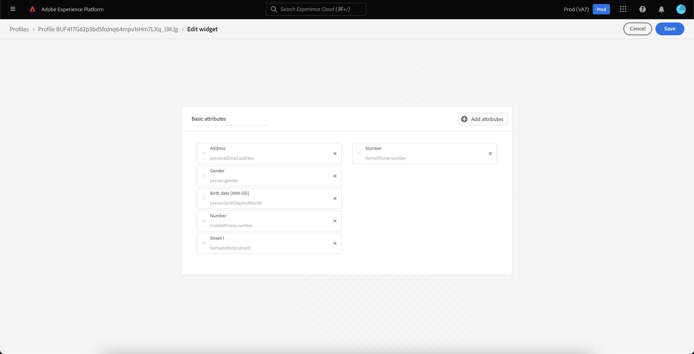
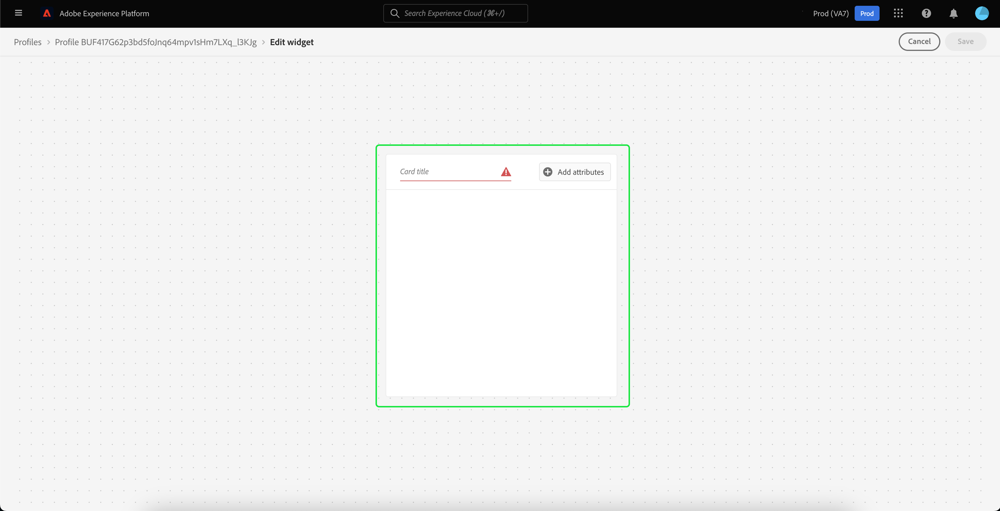

# [!DNL Real-Time Customer Profile] 詳細なカスタマイズ {#profile-detail-customization}

Adobe Experience Platformユーザーインターフェイス内で、を表示し、操作できます [!DNL Real-Time Customer Profile] 顧客プロファイルの形式のデータ。 UI に表示されるプロファイル情報は、複数のプロファイルフラグメントから結合され、各顧客の単一のビューを形成しています。 これには、基本属性、リンクされた ID、チャネル環境設定などの詳細が含まれます。 プロファイルに表示されるデフォルトのフィールドは、組織レベルで変更して、優先するフィールドを表示することもできます [!DNL Profile] 属性。 このガイドでは、 [!DNL Profile] データは、Platform UI 内に表示されます。

プロファイル UI の完全なガイドについては、 [プロファイル UI ガイド](user-guide.md).

## カードの並べ替えとサイズ変更 {#reorder-and-resize-cards}

次の **[!UICONTROL 詳細]** 」タブで、 **[!UICONTROL プロファイルの詳細のカスタマイズ]** 既存のカードのサイズ変更と並べ替えを行う場合。

ダッシュボードの変更を選択した後、カードのタイトルを選択し、カードを目的の順序にドラッグ&amp;ドロップすることで、カードを並べ替えることができます。 カードの右下隅にある角度記号 (`⌟`) をクリックし、目的のサイズにカードをドラッグします。 この例では、 **[!UICONTROL 基本属性]** カードのサイズを変更中です。

![[ 基本属性 ] カード内で、[ サイズ変更 ] ボタンがハイライト表示されます。](../images/profile-customization/resize.png)

選択したカードは、目的のサイズに調整され、周囲のカードは動的に再配置されます。 これにより、一部のカードが追加の行に移動し、すべてのカードを表示するには下にスクロールする必要が生じる場合があります。 例えば、[!UICONTROL 基本属性]&quot;カードのサイズが変更されました&quot;[!UICONTROL リンクされた ID]「カードは上の行に表示されなくなり、プロファイル内の新しい 2 行目に表示されます（未表示）。 を返します。[!UICONTROL リンクされた ID]」カードを一番上の行にドラッグ&amp;ドロップし、[!UICONTROL チャネル環境設定]&quot;カード。

## カードの編集と削除

カードのサイズ変更や並べ替えに加えて、特定のカードのコンテンツを編集し、ダッシュボードから一部のカードを完全に削除することができます。 省略記号 (`...`) をクリックして、カードを編集または削除します。 選択したカードのプロパティに応じて、カードを編集または削除するオプションを含むドロップダウンが開きます。

>[!NOTE]
>
>一部のカードを編集または削除できるわけではありません。 これは、一部のカードには読み取り専用または必須の情報が含まれているためです。 カードの右上隅に省略記号がない場合、カードには読み取り専用と必要な情報が含まれ、編集も削除もできません。 カードの隅に省略記号が表示され、そのカードを選択した場合、そのカード情報は読み取り専用になり、編集できません。

選択 **[!UICONTROL 編集]** ドロップダウンで、 **[!UICONTROL ウィジェットを編集]** ワークスペースでは、カードのタイトルの更新、表示属性の並べ替えや削除、または **[!UICONTROL 属性を追加]** 」ボタンをクリックします。

## 属性を追加 {#add-attributes}

次の **[!UICONTROL ウィジェットを編集]** 画面、選択 **[!UICONTROL 属性を追加]** をクリックして、そのカードへの属性の追加を開始します。

次の場合に **[!UICONTROL 和集合スキーマフィールドを選択]** ダイアログが開き、ダイアログの左側に完全な [!UICONTROL XDM 個人プロファイル] 和集合スキーマ。フィールドはの下にネストされます。 和集合スキーマについて詳しくは、 [和集合スキーマセクション [!DNL Profile] ユーザーガイド](user-guide.md#union-schema).

この **[!UICONTROL 選択した属性]** ダイアログの右側のセクションには、編集中のカードに現在含まれている属性が表示されます。 ここでも属性の削除と並べ替えを行うことができます。 選択した属性の総数と、1 つのカードに追加できる属性の最大数 (20) が表示されます。

使用可能な任意の和集合スキーマフィールドを選択して、編集中のカードの属性をカスタマイズできます。 選択したフィールドの横にチェックマークが付き、選択した属性のリストに自動的に追加されます。 カードに表示するすべての属性を追加したら、「 」を選択します。 **[!UICONTROL 選択]** に戻る **[!UICONTROL ウィジェットを編集]** 画面

次の場合、 **[!UICONTROL ウィジェットを編集]** 画面に表示される属性のリストが更新され、選択内容が反映されるようになりました。 必要に応じて、カード属性を削除または並べ替えたり、カードタイトルを編集したりできます。 編集が完了したら、「 」を選択します。 **[!UICONTROL 保存]** 変更を保存します。

保存後、 **[!UICONTROL 詳細]** タブに表示されます。

## 新しいカードを追加 {#add-a-new-card}

Experience Platform内のプロファイルの外観をさらにカスタマイズするには、新しいカードをダッシュボードに追加し、それらのカードに表示する属性を選択します。 最初に、 **[!UICONTROL ダッシュボードを変更]** の **[!UICONTROL 詳細]** タブをクリックします。

次に、 **[!UICONTROL ウィジェットを追加]** をクリックします。

新しいカードの追加を選択すると、 **[!UICONTROL ウィジェットを編集]** 画面で、新しいカードのタイトルを入力し、カードに表示する属性を選択できます。 カードへの属性の追加を開始するには、「 **[!UICONTROL 属性を追加]**.

次の場合に **[!UICONTROL 和集合スキーマフィールドを選択]** ダイアログが開き、ダイアログの左側に完全な [!UICONTROL XDM 個人プロファイル] 和集合スキーマと **[!UICONTROL 選択した属性]** ダイアログの右側のセクションに、カード用に選択した属性が表示されます。 属性の追加について詳しくは、 [属性の追加に関する節](#add-attributes) はこのドキュメントの前の方に表示されます。

選択した属性の総数と、1 つのカードに追加できる属性の最大数 (20) が表示されます。 また、選択した属性をこの画面から削除して並べ替えることもできます。 カードに表示するすべての属性を追加したら、「 」を選択します。 **[!UICONTROL 選択]** に戻る **[!UICONTROL ウィジェットを編集]** 画面

次の場合、 **[!UICONTROL ウィジェットを編集]** 画面を表示する場合、カード上の属性のリストに、前の画面での選択内容が反映されている必要があります。 必要に応じて、カード属性の並べ替えや削除をおこなうこともできます。

新しいカードを保存するには、まず **[!UICONTROL カードのタイトル]**&#x200B;を選択すると、 **[!UICONTROL 保存]** カード作成プロセスを完了します。

保存後、 **[!UICONTROL 詳細]** タブをクリックし、新しいカードと属性を表示します。

## デフォルトのカードを復元

いつでも、それ以降に削除されたデフォルトのカードを復元したいと思う場合は、すばやく簡単に復元できます。 まず、「 」を選択します。 **[!UICONTROL ダッシュボードを変更]**&#x200B;を選択し、「 **[!UICONTROL デフォルトのカードを復元]**. デフォルトのカードが表示されたら、 **[!UICONTROL 保存]** 変更を保存するか、「 **[!UICONTROL キャンセル]** デフォルトのカードを復元しない場合。

## 次の手順

このドキュメントに従うと、カードの追加と削除、カードの詳細と属性の編集、カードの並べ替えとサイズ変更など、組織のプロファイルビューを更新できます。 の使用に関する詳細を学ぶには [!DNL Profile] Experience PlatformUI のデータについては、 [[!DNL Profile] ユーザーガイド](user-guide.md).
