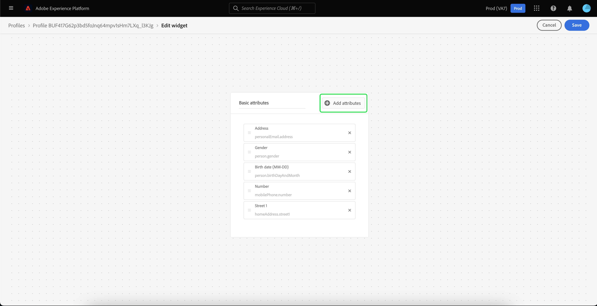

# [!DNL Real-Time Customer Profile] 詳細なカスタマイズ {#profile-detail-customization}

Adobe Experience Platformのユーザーインターフェイスでは、顧客プロファイルの形式でデータ [!DNL Real-Time Customer Profile] 表示し、操作できます。 UI に表示されるプロファイル情報は、複数のプロファイルフラグメントを結合し、個々の顧客の単一のビューを形成したものです。 これには、基本属性、リンクされた ID、チャネル環境設定などの詳細が含まれます。 プロファイルに表示されるデフォルトのフィールドは、組織レベルで変更して、優先する [!DNL Profile] 属性を表示することもできます。 このガイドでは、Experience Platform UI 内での [!DNL Profile] データの表示方法をカスタマイズする手順を説明します。

プロファイル UI の完全なガイドについては、[ プロファイル UI ガイド ](user-guide.md) を参照してください。

## カードの並べ替えとサイズ変更 {#reorder-and-resize-cards}

顧客プロファイルの **[!UICONTROL 詳細]** タブから、**[!UICONTROL プロファイルの詳細をカスタマイズ]** を選択して、既存のカードのサイズを変更し、並べ替えることができます。

ダッシュボードの変更を選択した後、カードのタイトルを選択して目的の順序にカードをドラッグ&amp;ドロップすると、カードを並べ替えることができます。 カードの右下隅にある直角記号（`⌟`）を選択して目的のサイズにカードをドラッグすると、カードのサイズを変更できます。 この例では、**[!UICONTROL 基本属性]** カードのサイズを変更しています。

選択したカードが目的のサイズに調整され、周囲のカードが動的に再配置されます。 これにより、一部のカードが追加の行に移動し、すべてのカードを表示するには下にスクロールする必要が生じる場合があります。 例えば、「[!UICONTROL &#x200B; 基本属性 &#x200B;]」カードのサイズを変更すると、「[!UICONTROL &#x200B; リンクされた ID]」カードが一番上の行に表示されなくなり、プロファイル内の新しい 2 行目に表示されます（非表示）。 「[!UICONTROL &#x200B; リンクされた ID]」カードを一番上の行に戻すには、カードを「[!UICONTROL &#x200B; チャネル環境設定 &#x200B;]」カードの現在の位置にドラッグ&amp;ドロップします。

## カードの編集と削除

カードのサイズ変更と並べ替えに加えて、特定のカードの内容を編集し、一部のカードをダッシュボードから完全に削除できます。 カードの右上隅にある省略記号（`...`）を選択して、カードを編集または削除します。 これにより、選択したカードのプロパティに応じて、カードを編集または削除するオプションを含むドロップダウンが開きます。

>[!NOTE]
>
>すべてのカードが編集または削除できるわけではありません。 これは、一部のカードに読み取り専用または必要な情報が含まれているためです。 カードの右上隅に省略記号がない場合は、読み取り専用および必要な情報が含まれており、編集や削除はできません。 カードの隅に省略記号が表示され、選択すると、カードを削除するオプションのみが表示される場合、カード情報は読み取り専用であり、編集できません。

ドロップダウンで「**[!UICONTROL 編集]**」を選択して **[!UICONTROL 編集ウィジェット]** ワークスペースを開きます。このワークスペースでは、カードタイトルの更新、表示可能な属性の並べ替えと削除、**[!UICONTROL 属性を追加]** ボタンの使用による属性の追加ができます。

。

## 属性を追加 {#add-attributes}

**[!UICONTROL ウィジェットを編集]** 画面から、カードの右上隅にある **[!UICONTROL 属性を追加]** を選択して、そのカードへの属性の追加を開始します。

**[!UICONTROL 和集合スキーマフィールドを選択]** ダイアログが開くと、ダイアログの左側に完全な [!UICONTROL XDM 個人プロファイル &#x200B;] 和集合スキーマが表示され、その下にフィールドがネストされます。 和集合スキーマについて詳しくは、[ ユーザーガイドの和集合スキーマ  [!DNL Profile]  の節 ](user-guide.md#union-schema) を参照してください。

ダイアログの右側にある **[!UICONTROL 選択した属性]** セクションには、編集中のカードに現在含まれている属性が表示されます。 ここでも、属性を削除して並べ替えることができます。 選択された属性の合計数と、1 つのカードに追加できる属性の最大数（20）が表示されます。

使用可能な結合スキーマフィールドを選択して、編集中のカードの属性をカスタマイズできます。 フィールドを選択する際に、ファイルパス名または表示名を表示するように選択できます。 これら 2 つの表示を切り替えるには、「**[!UICONTROL 表示名を表示]**」切替スイッチを選択します。

![ プロファイルの詳細ページ内で「[!UICONTROL &#x200B; 表示名を表示 &#x200B;]」切替スイッチがハイライト表示されています。](../images/profile-customization/show-display-names.png)

選択したフィールドの横にはチェックマークが表示され、選択した属性のリストに自動的に追加されます。 カードに表示する属性をすべて追加したら、「**[!UICONTROL 選択]**」を選択して **[!UICONTROL ウィジェットを編集]** 画面に戻ります。

**[!UICONTROL ウィジェットを編集]** 画面に戻ると、カードの属性のリストが更新され、選択が反映されるようになりました。 必要に応じて、カード属性を削除または並べ替えたり、カードタイトルを編集したりできます。 編集が完了したら、「**[!UICONTROL 保存]**」を選択して変更を保存します。

保存すると、「**[!UICONTROL 詳細]**」タブに戻り、更新されたカードと属性が表示されます。

## 新しいカードを追加 {#add-a-new-card}

Experience Platform内のプロファイルの外観をさらにカスタマイズするには、ダッシュボードに新しいカードを追加し、それらのカードに表示する属性を選択します。 開始するには、「**[!UICONTROL 詳細]**」タブの「**[!UICONTROL ダッシュボードを変更]**」を選択します。

次に、ダッシュボードの左上隅にある「**[!UICONTROL ウィジェットを追加]**」を選択します。

新しいカードを追加することを選択すると、**[!UICONTROL ウィジェットを編集]** 画面が開き、新しいカードのタイトルを指定し、カードに表示する属性を選択できます。 カードへの属性の追加を開始するには、「**[!UICONTROL 属性を追加]**」を選択します。

**[!UICONTROL 和集合スキーマフィールドを選択]** ダイアログが開くと、ダイアログの左側に [!UICONTROL XDM 個人プロファイル &#x200B;] 和集合スキーマ全体が表示され、ダイアログの右側の **[!UICONTROL 選択された属性]** セクションにカード用に選択した属性が表示されます。 属性の追加の詳細については、このドキュメントの前の部分で説明した [ 属性の追加に関するセクション ](#add-attributes) を参照してください。

選択された属性の合計数と、1 つのカードに追加できる属性の最大数（20）が表示されます。 この画面から選択した属性を削除して並べ替えることもできます。 カードに表示するすべての属性を追加したら、「**[!UICONTROL 選択]**」を選択して **[!UICONTROL ウィジェットを編集]** 画面に戻ります。

**[!UICONTROL ウィジェットを編集]** 画面に戻ると、カードの属性のリストに前の画面の選択内容が反映されます。 必要に応じて、カード属性の並べ替えと削除を行うこともできます。

新しいカードを保存するには、まず **[!UICONTROL カードタイトル]** を入力する必要があります。その後、**[!UICONTROL 保存]** を選択して、カード作成プロセスを完了できます。

保存後、「**[!UICONTROL 詳細]** タブに戻ると、新しいカードと属性が表示されます。

## デフォルトのカードを復元

どの時点でも、それ以降に削除されたデフォルトのカードを復元することにした場合は、すばやく簡単に復元できます。 最初に「**[!UICONTROL ダッシュボードを変更]**」を選択し、次に「**[!UICONTROL デフォルトカードを復元]**」を選択します。 デフォルトのカードが表示されたら、「**[!UICONTROL 保存]**」を選択して変更を保存するか、デフォルトのカードを復元しない場合は「**[!UICONTROL キャンセル]**」を選択できます。

## 次の手順

このドキュメントを通して、カードの追加と削除、カードの詳細と属性の編集、カードの並べ替えとサイズ変更など、組織のプロファイルビューを更新できるようになりました。 Experience Platform UI でデータの操作について詳 [!DNL Profile] くは、[[!DNL Profile]  ユーザーガイド ](user-guide.md) を参照してください。
