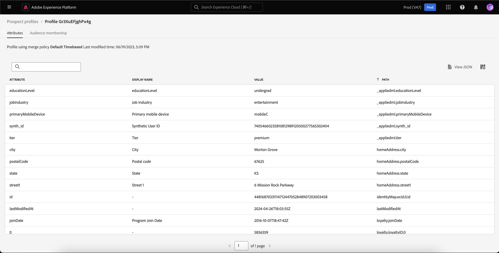

# 見込み客プロファイル

Adobe Experience Platform を使用すると、顧客がいつどこからブランドとやり取りしても、顧客に合わせて調整された、一貫性と関連性のある体験を提供できます。

見込み客のプロファイルは、まだ会社に関与していないが、連絡先を知りたい人を表すために使用されます。 見込み客プロファイルを使用すると、信頼できるサードパーティパートナーの属性で顧客プロファイルを補完できます。

## 参照 {#browse}

見込み客プロファイルにアクセスするには、「 **[!UICONTROL プロファイル]** （内） **[!UICONTROL 見込み客]** 」セクションに入力します。

The **[!UICONTROL 参照]** ページが表示されます。 組織のすべての見込み客プロファイルのリストが表示されます。

![The [!UICONTROL プロファイル] ボタンがハイライト表示され、 [!UICONTROL 参照] 見込み客プロファイルのページ。](../images/prospect-profile/browse-profiles.png)

>[!IMPORTANT]
>
>顧客プロファイルと見込み客プロファイルの間の閲覧機能のほとんどは同じですが、 **できません** 結合ポリシーで見込み客プロファイルを参照します。 これは、見込み客プロファイルが、システムが設計した時間ベースの結合ポリシーによって自動的に管理されるためです。 結合ポリシーの詳細については、 [結合ポリシーの概要](../merge-policies/overview.md).

プロファイルの参照の詳細については、 [プロファイルユーザーガイドの「参照」セクション](./user-guide.md#browse-identity).

## 見込み客プロファイルの詳細 {#profile-details}

>[!IMPORTANT]
>
>見込み客プロファイルは、Adobe Experience Platformに 25 日間滞在した後、自動的に期限が切れます。

特定の見込み客プロファイルに関する詳細を表示するには、 [!UICONTROL 参照] ページに貼り付けます。

プロファイルとオーディエンスのメンバーシップに関連付けられている属性を含め、見込み客プロファイルに関する情報が表示されます。

これらのタブの詳細については、 [プロファイルユーザーガイドの「プロファイルの詳細」セクションの表示](./user-guide.md#profile-detail).

また、「 」を選択すると、すべての属性を JSON 形式で表示できます。 **[!UICONTROL JSON を表示]**.

![The [!UICONTROL JSON を表示] 見込み客プロファイルの詳細ページでボタンが強調表示されます。](../images/prospect-profile/profile-select-view-json.png)

The [!UICONTROL JSON を表示] ダイアログが表示されます。 見込み客プロファイルの属性が JSON 形式で表示されます。

## 推奨されるユースケース {#use-cases}

Experience Platformの見込み客プロファイル機能を他の Platform 機能と組み合わせて使用する方法については、次の使用例のドキュメントを参照してください。

- [見込み客機能を使用した新規顧客のエンゲージメントと獲得](../../rtcdp/partner-data/prospecting.md)

## 次の手順

このガイドを読むと、Adobe Experience Platformで見込み客プロファイルを使用する方法を理解できます。 これらの見込み客プロファイルをオーディエンスで使用する方法については、 [見込み客オーディエンスガイド](../../segmentation/ui/prospect-audience.md).
