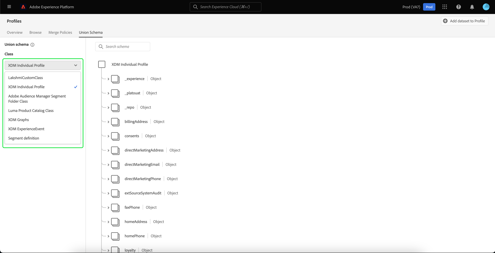
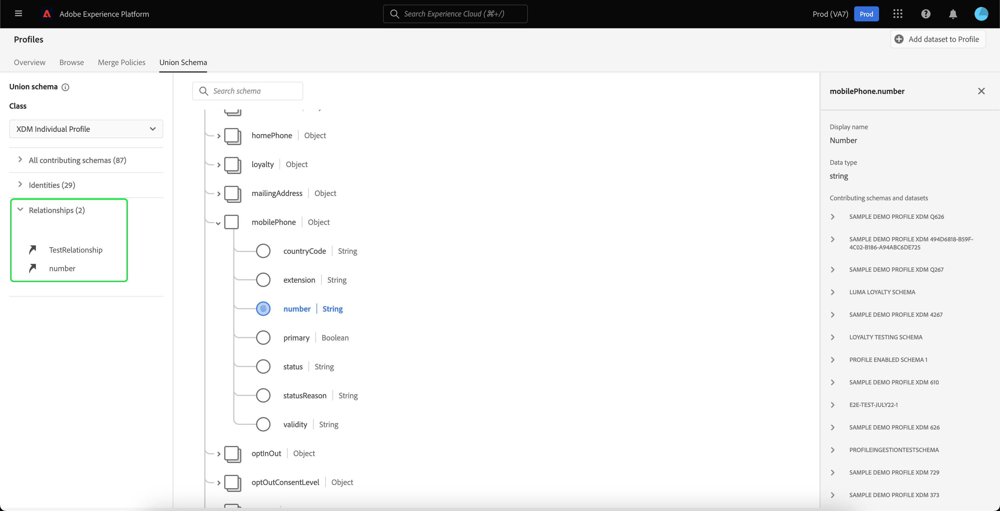

# [!UICONTROL 結合スキーマ UI ガイド]

Adobe Experience Platformユーザーインターフェイス (UI) では、組織内の任意の和集合スキーマを簡単に表示し、特定のクラスのフィールド、ID、関係、貢献するスキーマをプレビューできます。 このガイドでは、Platform UI を使用して和集合スキーマを表示および調査する方法に関する詳細情報を提供します。

## はじめに

この UI ガイドでは、 [!DNL Experience Platform] リアルタイム顧客プロファイルデータの管理に関連するサービス。 このガイドを読む前、または UI で作業する前に、次のサービスのドキュメントを確認してください。

* [[!DNL Real-time Customer Profile]](../home.md)：複数のソースからの集計データに基づいて、統合されたリアルタイムの顧客プロファイルを提供します。
* [[!DNL Identity Service]](../../identity-service/home.md):有効 [!DNL Real-time Customer Profile] に取り込む際に異なるデータソースの ID を結合することで [!DNL Platform].
* [[!DNL Experience Data Model (XDM)]](../../xdm/home.md)：[!DNL Platform] が、カスタマーエクスペリエンスデータを整理する際に使用する、標準化されたフレームワーク。

## 和集合スキーマについて

リアルタイム顧客プロファイルを使用すると、Adobe Experience Platformと統合されたシステム間の各顧客インタラクションに顧客属性とタイムスタンプ付きのイベントを含む、堅牢で一元化されたプロファイルを作成できます。 このデータの形式と構造は Experience Data Model(XDM) スキーマによって提供され、各スキーマは XDM クラスに基づいており、そのクラスと互換性のあるフィールドを含んでいます。

スキーマは、同じクラスを参照し、使用に固有のフィールドを含む、複数のユースケースに対して作成できます。 プロファイルでスキーマが有効になると、和集合スキーマの一部になります。 つまり、和集合スキーマは、同じクラスを共有し、プロファイルに対して有効になっている複数のスキーマで構成されます。 結合スキーマを使用すると、同じクラスを共有するスキーマ内に含まれるすべてのフィールドの融合を確認できます。リアルタイム顧客プロファイルは、結合スキーマを使用して、各顧客の全体像を作成します。

和集合スキーマを使用する場合は、XDM スキーマに関する深い理解が必要です。 詳細については、まず [スキーマ構成の基本](../../xdm/schema/composition.md).

## 和集合スキーマを表示

Platform UI 内で和集合スキーマに移動するには、「 **[!UICONTROL プロファイル]** 左のナビゲーションから、 **[!UICONTROL 和集合スキーマ]** タブをクリックします。 この [!UICONTROL 和集合スキーマ] 「 」タブが開き、現在選択しているクラスの和集合スキーマが表示されます。

## クラスを選択

特定の XDM クラスの和集合スキーマを表示するには、 **[!UICONTROL クラス]** ドロップダウン。 すべてのクラスに和集合スキーマがあるわけではないので、和集合スキーマを持つクラス（つまり、プロファイルに対して有効にされたスキーマを持つクラス）のみドロップダウンで使用できます。

クラスを選択すると、表示されるスキーマが更新され、選択したクラスの和集合スキーマが反映されます。 例えば、 **[!UICONTROL XDM 個人プロファイル]** をクリックして、そのクラスの和集合スキーマを表示します。

## 和集合スキーマを調べる

上下にスクロールして完全なスキーマ構造を表示し、右山括弧 (`>`) をクリックして、ネストされたフィールドを展開します。

表示名、データタイプ、説明、パス、作成日、最終変更日など、詳細を表示するフィールドを選択します。 また、選択したフィールドを含む、貢献するスキーマのリストを表示することもできます。

貢献するスキーマの名前を選択すると、そのスキーマに関連するデータセットの名前が表示され、選択したフィールドにデータを取り込みます。 各データセット名はリンクとして表示されます。 データセット名を選択すると、そのデータセットの「アクティビティ」タブが新しいウィンドウに開きます。

データセットのアクティビティの表示や UI でのデータセットデータのプレビューなど、データセットの詳細については、 [datasets UI ガイド](../../catalog/datasets/user-guide.md).

## 貢献するスキーマの表示

また、「 」を選択することで、和集合スキーマに影響を与えている特定のスキーマを表示できます **[!UICONTROL 貢献するすべてのスキーマ]** スキーマのリストを展開します。 選択したクラスと、組織が Platform 内で作成したスキーマの数に応じて、これは、1 つのスキーマを含む短いリストか、多くのスキーマを含む長いリストになります。

特定のスキーマの名前を選択すると、選択したスキーマの一部である和集合スキーマ内のフィールドが強調表示されます。 スキーマを選択すると、和集合スキーマが灰色表示になり、貢献するスキーマの一部であるフィールドを示す黒いバーが表示されます。

## ID を表示

UI を使用し、「 」を選択して、和集合スキーマに含まれる ID のリストを表示できます **[!UICONTROL ID]** をクリックしてリストを展開します。

リストから個々の ID を選択すると、表示されたスキーマが、必要に応じて ID フィールドを表示するために自動的に更新されます。 ID フィールドがネストされている場合は、複数のフィールドの展開も含まれます。

和集合スキーマ内で ID フィールドがハイライトされ、ID の詳細が画面の右側に表示されます。 詳細には、ID フィールドを含む貢献するスキーマのリストが含まれ、ドリルダウンして、選択した ID フィールドにデータを取り込む、そのスキーマに関連するデータセットへのリンクを検索できます。

## 関係を表示

また、和集合スキーマ UI を使用すると、選択したスキーマクラスに基づいてスキーマに対して定義された関係を確認できます。 関係の定義は、顧客データに対するより複雑なインサイトを得るために、異なるクラスに属する 2 つのスキーマを接続する方法です。

選択したクラスに関係が確立されている場合は、「 」を選択します。 **[!UICONTROL 関係]** 関係を作成するために使用されるフィールドのリストを表示します。 すべてのスキーマが使用しているわけではなく、関係を定義する必要があるわけでもないので、関係セクションにフィールドを含めないのが一般的です。

UI を使用してスキーマの関係を定義する方法など、スキーマの関係について詳しくは、 [スキーマの関係に関するこのドキュメント](../../xdm/tutorials/relationship-ui.md).

リストから関係フィールドを選択すると、必要に応じて、表示されたスキーマが更新され、ハイライト表示された関係フィールドが表示されます。 関係フィールドがネストされている場合は、複数のフィールドの展開も含まれます。

## 次の手順

このガイドでは、 [!DNL Experience Platform] UI Platform 全体でのスキーマの使用方法など、スキーマの詳細については、まず [XDM システムの概要](../../xdm/home.md).
